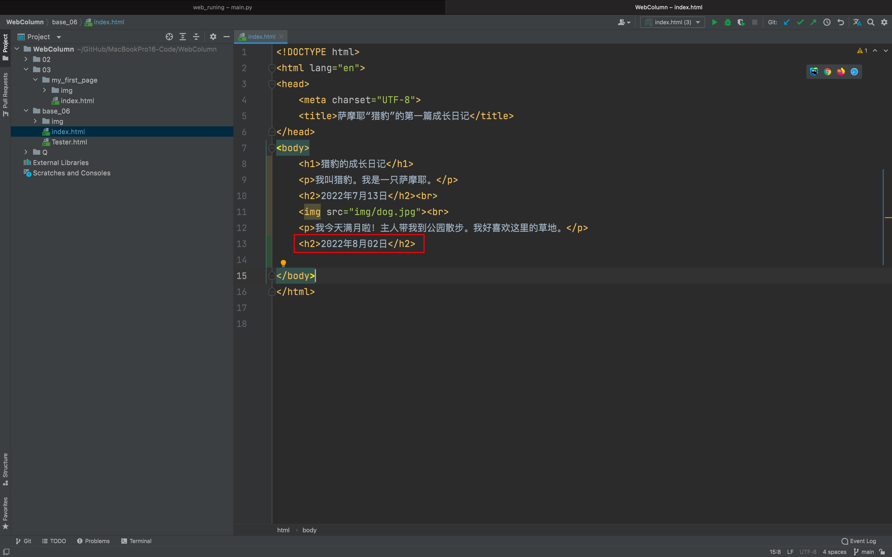

## “猎豹”的第二篇成长日记

嗨，你还记得我吗？我是萨摩耶“猎豹”。今天我的主人 Lisa 亲手做了一份晚餐给我吃。

味道好极了！你能帮我写一篇日记记录这美好的一天吗？

## 第1步 找到文件

请你在编译器中找到在做第一章实战练习时，保存下来的index.html文件并打开它。

找到 body 中的最后一个 `
` 元素的结束标签 `
` ,把光标移动到它后面，然后点击回车，将光标移到新的一行。

## 第 2 步 标题

我们要再为猎豹写一篇日记。就得接在第一篇日记后面写。

日记结构依然由标题、图片、段落 3 个元素组成。

这次，请尝试自己写代码和文本：

写日记首先从写日期开始。我们将日期作为第二篇日记的 **标题** ，采用 `<h2></h2>` 包围文本“ **2019年7月31日** ”。

为什么不使用 `<h1>` 元素包围文本呢？

对于 `index.html` 这个文件来说，我们已有了一级标题—— `<h1>` 猎豹的成长日记 `</h1>` 。

为了使猎豹的网页版成长日记看起来结构清晰，我们将日记中的日期都用 `<h2></h2>` 包围起来。

你也可以理解为文本 **2022年7月13日** 与 **2022年8月02日** 是 **平级关系** 。字号统一。

::: details 公众号：AI悦创【二维码】

:::

::: info AI悦创·编程一对一

AI悦创·推出辅导班啦，包括「Python 语言辅导班、C++ 辅导班、java 辅导班、算法/数据结构辅导班、少儿编程、pygame 游戏开发」，全部都是一对一教学：一对一辅导 + 一对一答疑 + 布置作业 + 项目实践等。当然，还有线下线上摄影课程、Photoshop、Premiere 一对一教学、QQ、微信在线，随时响应！微信：Jiabcdefh

C++ 信息奥赛题解，长期更新！长期招收一对一中小学信息奥赛集训，莆田、厦门地区有机会线下上门，其他地区线上。微信：Jiabcdefh

方法一：[QQ](http://wpa.qq.com/msgrd?v=3&uin=1432803776&site=qq&menu=yes)

方法二：微信：Jiabcdefh

:::

