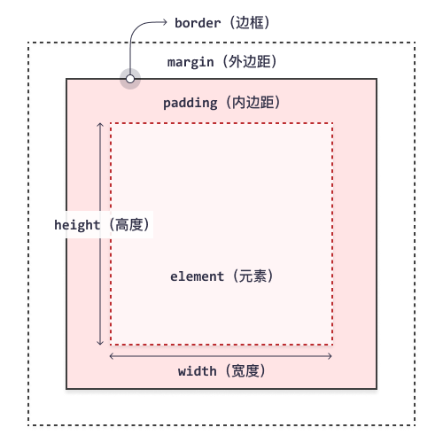

## CSS 盒模型的应用

CSS 布局主要就是基于盒模型。每个占据页面空间的块都能有这样的属性：

- **padding: 内边距。** 它围绕着内容的空间。「清除内容周围的区域，内边距是透明的。」
- **border: 边框。** 它紧接着内边距的线。
- **margin: 外边距。** 它围绕元素外部的空间。




---

不同部分的说明：

- **Margin(外边距)** - 清除边框外的区域，外边距是透明的。
- **Border(边框)** - 围绕在内边距和内容外的边框。
- **Padding(内边距)** - 清除内容周围的区域，内边距是透明的。
- **Content(内容)** - 盒子的内容，显示文本和图像。

为了正确设置元素在所有浏览器中的宽度和高度，你需要知道的盒模型是如何工作的。


## 元素的宽度和高度

**重要:** 当您指定一个 CSS 元素的宽度和高度属性时，你只是设置内容区域的宽度和高度。要知道，完整大小的元素，你还必须添加内边距，边框和外边距。

下面的例子中的元素的总宽度为 450px：

```css
div {
    width: 300px;
    border: 25px solid green;
    padding: 25px;
    margin: 25px;
}
```

<button name="button" style="color: black"><a href="https://bornforthis.cn/web_runing/web_base/base_08/base_08-1.html" target="_blank">在线试一试</a></button>

让我们自己算算：
300px (宽)
\+ 50px (左 + 右填充)
\+ 50px (左 + 右边框)
\+ 50px (左 + 右边距)
= 450px

试想一下，你只有 250 像素的空间。让我们设置总宽度为 250 像素的元素:

```css
div {
    width: 220px;
    padding: 10px;
    border: 5px solid gray;
    margin: 0; 
}
```

最终元素的总宽度计算公式是这样的：

总元素的宽度=宽度+左填充+右填充+左边框+右边框+左边距+右边距

元素的总高度最终计算公式是这样的：

总元素的高度=高度+顶部填充+底部填充+上边框+下边框+上边距+下边距

<button name="button" style="color: black"><a href="https://bornforthis.cn/web_runing/web_base/base_08/base_08-3.html" target="_blank">在线试一试</a></button>

## 浏览器的兼容性问题

一旦为页面设置了恰当的 DTD，大多数浏览器都会按照上面的图示来呈现内容。然而 IE 5 和 6 的呈现却是不正确的。根据 W3C 的规范，元素内容占据的空间是由 width 属性设置的，而内容周围的 padding 和 border 值是另外计算的。不幸的是，IE5.X 和 6 在怪异模式中使用自己的非标准模型。这些浏览器的 width 属性不是内容的宽度，而是内容、内边距和边框的宽度的总和。

虽然有方法解决这个问题。但是目前最好的解决方案是回避这个问题。也就是，不要给元素添加具有指定宽度的内边距，而是尝试将内边距或外边距添加到元素的父元素和子元素。

IE8 及更早IE版本不支持设置填充的宽度和边框的宽度属性。

解决 IE8 及更早版本不兼容问题可以在 HTML 页面声明 `<!DOCTYPE html>` 即可。

---

```css
<!DOCTYPE html>
<html lang="en">
<head>
	<meta charset="UTF-8">
	<title>Document</title>
	<style type="text/css">
		div {
			width: 200px;
			height: 200px;
			border-top: 1px dotted green;
			border-right: 1px solid red;
			border-bottom: 1px dashed orange;
			border-left: 1px double blue;
		}
 
	</style>
</head>
<body>
	<div></div>
</body>
</html>
```

<button name="button" style="color: black"><a href="https://bornforthis.cn/web_runing/web_base/base_08/base_08-2.html" target="_blank">在线试一试</a></button>


## 更改背景颜色

以下这条 CSS 规则可以帮助你将整个界面的颜色设置为任意的颜色。

```css
html {
    background-color: #00539F;
}
```

案例中的 `#00539F` 是什么呢？效果如下：


它是颜色的十六进制编码。它能够把你想要展示的颜色准确的告诉浏览器。

**怎么获取这些颜色编码呢？**

打开百度，输入关键字“在线取色器”。有许多网站可查询颜色编码。获取颜色编码的过程大同小异，如图所示：


## 文档格式设置

以下代码可以控制 `<body>` 元素的格式样式：

```css
body {
    width: 600px;
	margin: 0 auto;
	background-color: #FF9500;
    border: 5px solid black;
}
```

以上每个属性的含义是：

- `width: 600px;`  —— body 元素的宽度保持 600 像素。
- `margin: 0 auto;`  —— 为 margin 或 padding 等属性设置两个值，第一个值代表元素的上、下方向（本例设置为 0）；第二个值代表左、右两边（本例中的 auto 是特殊值，含义是水平方向左右对称）。
- `background-color: #FF9500; `—— 它指定元素的背景颜色。
- `padding: 0 20px 20px 20px;` —— 内边距设置的四个值。用于给网页内容的四周制造一些空白空间。这些空间为上方、右边、下方，左边的内边距，像素为 20。它们的值按照上、右、下、左的顺序排列。
- `border: 5px solid black;`  —— 直接为 body 设置 5 像素的黑色实线边框。

效果是：


## 定位主标题&添加样式

未给元素设置 CSS 样式之前，浏览器已为元素设置了一些默认样式。

但不同的浏览器设置的默认样式有差异。为了使页面在多种浏览器下具有相同的展示效果，开发者通常会重新设置这些默认样式。

如下面代码块的属性 `margin: 0` 。它能够去掉浏览器为 h1 设置的围绕在四周的空白缝隙。

```css
h1 {
    margin: 0;
    padding: 20px 0; 
    color: #00539F;
    text-shadow: 3px 3px 1px black;
}
```

属性 padding，使标题的上下内边距像素为 20 。

属性 color，控制了标题的颜色。颜色采用十六进制颜色代码 `#00539f`  表示。

**属性 text-shadow**，它为文本提供 **阴影**。其 4 个值的含义分别是：

- 第一个 3px：水平偏移值 ，它是阴影右移的像素数。
- 第二个 3px：垂直偏移值 ，它是即阴影下移的像素数。
- 1px： 阴影的模糊半径 , 它的值越大产生的阴影就越模糊。
- black: 阴影的颜色。

## 图像居中

使用以下代码能使图片居中，使网页变得更加美观：

```css
img {
    display: block;
    margin: 0 auto;
}
```

注意：**`<body>` 是块级元素**，意味着它能占据页面空间并能采用外边距和其他改变间距的值。而 **`` 是内联元素**，不具备块级元素的功能。为了使图像也能拥有外边距，我们**必须使用display：block赋予其块级元素的行为。**


::: details 公众号：AI悦创【二维码】


:::

::: info AI悦创·编程一对一

AI悦创·推出辅导班啦，包括「Python 语言辅导班、C++ 辅导班、java 辅导班、算法/数据结构辅导班、少儿编程、pygame 游戏开发」，全部都是一对一教学：一对一辅导 + 一对一答疑 + 布置作业 + 项目实践等。当然，还有线下线上摄影课程、Photoshop、Premiere 一对一教学、QQ、微信在线，随时响应！微信：Jiabcdefh

C++ 信息奥赛题解，长期更新！长期招收一对一中小学信息奥赛集训，莆田、厦门地区有机会线下上门，其他地区线上。微信：Jiabcdefh

方法一：[QQ](http://wpa.qq.com/msgrd?v=3&uin=1432803776&site=qq&menu=yes)

方法二：微信：Jiabcdefh

:::


