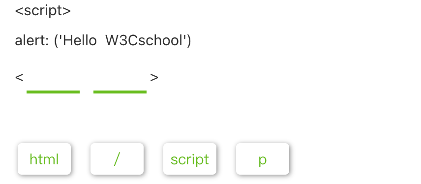
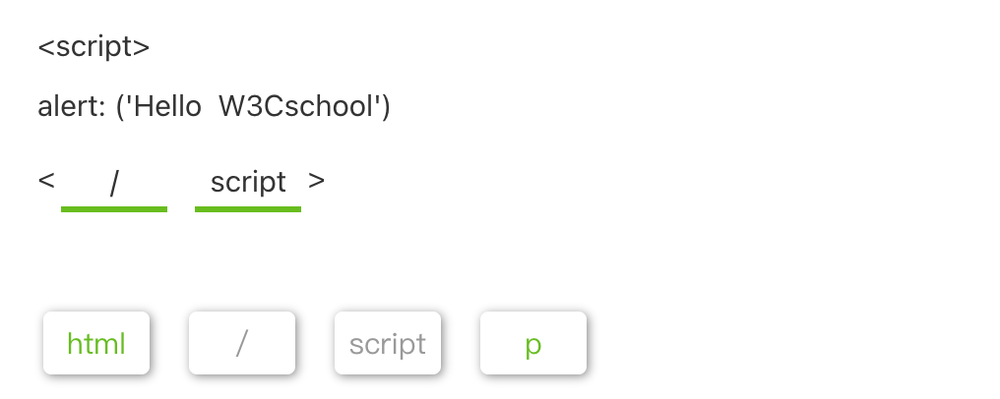

## JavaScript 是谁？它做什么工作？

**JavaScript** (以下采用缩写 JS ) **是一门动态编程语言。**

当它应用于 HTML 文档时，可增加网页的**动态交互特性。**

比如：

- 验证输入表单的正确性；
- 改变网页上的文字；
- 在网页上设置实时时钟等。

JS 基于浏览器运行，可以快速的响应用户动态行为。

JS 脚本可与 HTML 混用，也可 **单独存为 JS 文件然后在 HTML 中引用。** 我们推荐后者。


## 学习 JavaScript 的重点

JS 是一门 **易上手难精通** 的编程语言。

**易学**体现在你能够轻易的获取并使用它。它不需要经过服务器，可被任意人下载并使用；

**难精**则体现在它是一门复杂的编程语言。JS 的交互功能多且其语法复杂，它还关联到 HTML 的 Dom 结构。又由于各厂商（如微软，它出品的浏览器是 edge; 厂商如 Alphabet ,它出品的浏览器是 google）的浏览器对 JS 有差异化的处理，使 JS 难以调试。

因此，相比精通 HTML 和 CSS，想要精通 JS，你得投入更多的时间。

【多选题】以下关于 JavaScript 说法正确的是？

- [ ] JavaScript 与 HTML 和 CSS 一样，不是真正意义上的编程语言。
- [ ] JavaScript 是 Java 的最新版本。
- [ ] JavaScript 是客户端脚本语言，可通过 API 访问、操作 HTML 元素节点
- [ ] JavaScript 能够增加网页的交互性。

> JavaScript 和 Java 仅在字面意义上有关联，但它们之间是区别多于共性的两门不同的编程语言。JavaScript 与 HTML 和 CSS 不同，JavaScript 是真正意义上的编程语言。

【选词填空】在空格内填入适当的答案。




::: details 答案



:::

## JavaScript 的变量

**JS 的变量（变量）是存储值的容器。**

点击“尝试一下”，看看下面的例子：

```javascript
let x = 7
let y = 13
let z = x + y
```

<button name="button" style="color: black"><a href="https://bornforthis.cn/web_runing/web_base/base_10/base_10-1.html" target="_blank">尝试一下</a></button>


::: details 公众号：AI悦创【二维码】


:::

::: info AI悦创·编程一对一

AI悦创·推出辅导班啦，包括「Python 语言辅导班、C++ 辅导班、java 辅导班、算法/数据结构辅导班、少儿编程、pygame 游戏开发」，全部都是一对一教学：一对一辅导 + 一对一答疑 + 布置作业 + 项目实践等。当然，还有线下线上摄影课程、Photoshop、Premiere 一对一教学、QQ、微信在线，随时响应！微信：Jiabcdefh

C++ 信息奥赛题解，长期更新！长期招收一对一中小学信息奥赛集训，莆田、厦门地区有机会线下上门，其他地区线上。微信：Jiabcdefh

方法一：[QQ](http://wpa.qq.com/msgrd?v=3&uin=1432803776&site=qq&menu=yes)

方法二：微信：Jiabcdefh

:::


