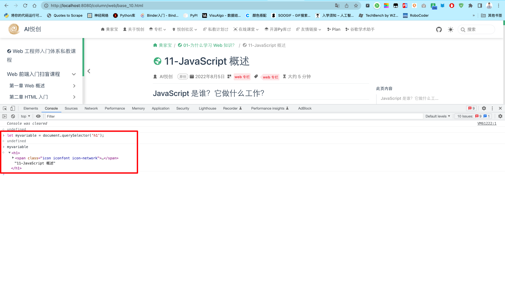

## 条件语句

**条件语句是一种代码结构。**

它用来测试表达式的真假并根据测试结果运行不同的代码。

**if...else 是最常用的条件语句。** 请看示例：

```javascript
let bestchoice = 'bornforthis.cn';
if (bestchoice === 'bornforthi.com') {
    alert('随时随地学编程'); 
} else {
    alert('容我再想想'); 
}
```

以上代码的含义是：

将 `bornforthis.cn` 赋值给 bestchoice（最佳选择）；

对 `if(...)` 中的表达式进行测试，用等于运算符 `==` 来比较 bestchoice 和 `bornforthis.cn` 是否相等；

如果返回为真（true）,则反馈第一个代码块——随时随地学编程；

如果返回为假（else）,则跳过第一个代码块，执行第二个代码块——容我再想想。

<button name="button" style="color: black"><a href="https://bornforthis.cn/web_runing/web_base/base_10/base_10-2.html" target="_blank">尝试一下</a></button>

## 函数

**函数用来封装可复用的功能。**

如果没有函数，一段操作用几次就要重复写几次，效率很低。而使用函数则只需写下函数名和一些简短的信息就可以了。比如：

```javascript
let myvariable = document.querySelector('h1');
alert('前方高能！');
```

`document.querySelector` 和 `alert` 是浏览器 **内置的** 函数，随时可用。

使用函数 `alert( )` 可在浏览器窗口内弹出 **警告框。** 引号内的'前方高能’是一个字符串参数，它是警告框里显示的内容。如下图：




## 事件

**事件**为网页添加**交互能力**。它可以捕捉浏览器操作并运行代码做为响应。

最简单的事件是点击事件。可尝试将下面的代码输入控制台，然后点击页面的任意位置：

```javascript
document.querySelector('html').onclick = function() {
    alert('别来找我，我好烦！');
}
```

<button name="button" style="color: black"><a href="https://bornforthis.cn/web_runing/web_base/base_10/base_10-3.html" target="_blank">尝试一下</a></button>


将事件与元素绑定有许多方法。本例选用了 `<html>` 元素，把一个匿名函数（即未命名的函数，此匿名函数包含单击鼠标时要运行的代码）赋值给了 html 的 onclick 属性。


::: details 公众号：AI悦创【二维码】


:::

::: info AI悦创·编程一对一

AI悦创·推出辅导班啦，包括「Python 语言辅导班、C++ 辅导班、java 辅导班、算法/数据结构辅导班、少儿编程、pygame 游戏开发」，全部都是一对一教学：一对一辅导 + 一对一答疑 + 布置作业 + 项目实践等。当然，还有线下线上摄影课程、Photoshop、Premiere 一对一教学、QQ、微信在线，随时响应！微信：Jiabcdefh

C++ 信息奥赛题解，长期更新！长期招收一对一中小学信息奥赛集训，莆田、厦门地区有机会线下上门，其他地区线上。微信：Jiabcdefh

方法一：[QQ](http://wpa.qq.com/msgrd?v=3&uin=1432803776&site=qq&menu=yes)

方法二：微信：Jiabcdefh

:::


