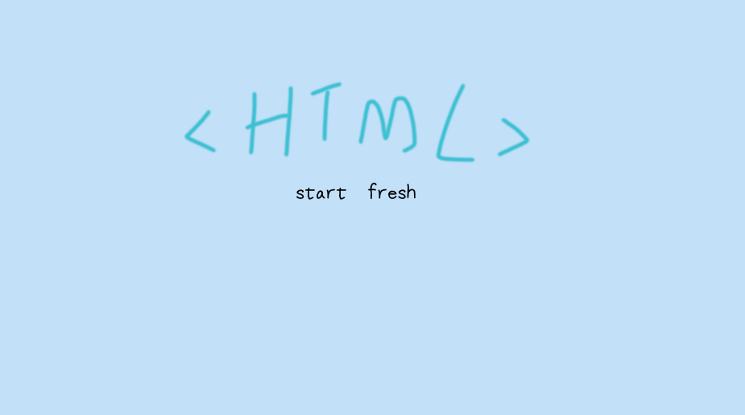

## HTML 介绍

各位 AI悦创的小伙伴们，大家好，从今天开始，我们一起来学习 HTML。如果我们要编写网页，那么我们肯定离不开 [HTML教程](./html-01.md)。HTML 组成了每个网页的基本结构，不管是我们的企业门户网站，还是例如淘宝，京东这种复杂的电商网站，要完成网页的搭建，第一步都是 HTML ，那么 HTML 到底是什么呢？让我们一起探索吧。

## 1. 什么是 HTML

HTML 称为**超文本**标记语言，是一种**标识性**的语言。它包括一系列标签。通过这些标签可以将网络上的文档格式统一，使分散的 Internet 资源连接为一个逻辑整体。

超文本是一种组织信息的方式，它通过超级链接方法将文本中的文字、图表与其他信息媒体相关联。这些相互关联的信息媒体可能在同一文本中，也可能是其他文件，或是地理位置相距遥远的某台计算机上的文件。这种组织信息方式将分布在不同位置的信息资源用随机方式进行连接，为人们查找，检索信息提供方便。

## 2. HTML 的由来

HTML 的英文全称是 Hyper Text Marked Language，即`超文本标记语言`。

> HTML 是由 Web 的发明者 Tim Berners-Lee 和同事 Daniel W. Connolly 于 1990 年创立的一种标记语言，它是标准通用化标记语言 SGML 的应用。

用 HTML 编写的超文本文档称为 HTML 文档，**它能独立于各种操作系统平台**（如 UNIX， Windows 等）。使用 HTML 语言，将所需要表达的信息按某种规则写成 HTML 文件，通过专用的浏览器来识别，并将这些 HTML 文件“翻译”成可以识别的信息，即现在所见到的网页。

## 3. 与普通文本的区别

普通文本文件，例如后缀名为 `.txt` 的文件，只能插入文字，段落等，而 HTML 文件，后缀名为 `.html` 的文件，既可以插入文字，段落，也可以插入表格，图片，链接，音频，视频等众多资源。

HTML 文件中，我们可以通过 HTML 标签，来实现不同的结构排列。而大部分 HTML 标签都有特定的样式和意义，所以，我们可以用这些标签自由组合，来完成网页的基本结构。

## 4. HTML 的标准

超级文本标记语言是标准通用标记语言下的一个应用，也是一种规范，一种标准，它通过标记符号来标记要显示的网页中的各个部分。

网页文件本身是一种文本文件，通过在文本文件中添加标记符，可以告诉浏览器如何显示其中的内容（如：文字如何处理，画面如何安排，图片如何显示等）。

浏览器按顺序阅读网页文件，然后根据标记符解释和显示其标记的内容，对书写出错的标记将不指出其错误，且不停止其解释执行过程，编制者只能通过显示效果来分析出错原因和出错部位。

> 提示：但需要注意的是，对于不同的浏览器，对同一标记符可能会有不完全相同的解释，因而可能会有不同的显示效果。

HTML 现在最新标准为第五代标准，又简称为 **HTML5** 。HTML 在 Web 迅猛发展的过程中起着重要作用，有着重要的地位。但随着网络应用的深入，特别是电子商务的应用，HTML 过于简单的缺陷很快凸现出来。HTML 不允许应用程序开发者为具体的应用环境定义自定义的标记。HTML 只能用于信息显示。 HTML 可以设置文本和图片显示方式，但没有语义结构，即 HTML 显示数据是按照布局而非语义的。

随着网络应用的发展，各行业对信息有着不同的需求，这些不同类型的信息未必都是以网页的形式显示出来。例如，当通过搜索引擎进行数据搜索时，按照语义而非按照布局来显示数据会具有更多的优点。

## 5. HTML 的特点

1. **简易性：** 超级文本标记语言版本升级采用超集方式，从而更加灵活方便；
2. **可扩展性：** 超级文本标记语言的广泛应用带来了加强功能，增加标识符等要求，它采取子类元素的方式，为系统扩展带来保证；
3. **平台无关性：** 虽然个人计算机大行其道，但使用 MAC 等其他机器的大有人在，超级文本标记语言可以使用在广泛的平台上，这也是万维网（WWW）盛行的另一个原因；
4. **通用性：** 另外，HTML 是网络的通用语言，一种简单、通用的全置标记语言。它允许网页制作人建立文本与图片相结合的复杂页面，无论使用的是什么类型的电脑或浏览器，这些页面可以被网上任何其他人浏览到。

## 6. HTML 的应用

如果我们需要编写网页，那么 HTML 为我们提供的标签，就成为了网页的结构。总结起来就是，HTML 为网页提供了基本结构。所以我们要编写网页，HTML 就成为了我们的第一课。

## 7. 课程设计

由于咱们这门课程是面向基础人群，从零开始进入到 HTML 的学习中。所以我们在课程设计上：

1. 首先我们会介绍一下 HTML，去了解 HTML 的一些基本概念、结构格式以及基本语法等内容；
2. 其次我们将会从结构上认识各个关键的标签，对他们进行讲解；
3. 最后我们将对 HTML 中主要标签的介绍和使用做一一讲解；

为了保证大家能够尽快的了解各个标签，我们将在每一个小节中的 “真实案例分享”环节把该标签的 **真实场景** 列举出来，方便大家参照。

## 8. 学习基础

本课程适用于对于前端没有基础，想要了解学习前端 HTML 知识内容的同学们。

