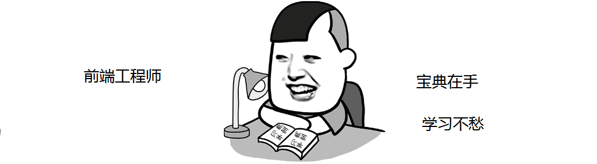

嗨~亲爱的小伙伴们，很开心你们选择了前端工程师这门课程（有眼光）！），在这里AI悦创跟大家传授一下学习法宝。

---

## 一、课程模式

在本套课程中，除了 **视频** 之外，还有**图文节**、 **选择题**、**在线编程题**、**自由编程题**、**项目作业**、**阶段测试**、**电子教程** 、 **问答区**、 **互动社区**等。多样化学习方式，为你的学习保驾护航。

## 二、不同类型内容作用说明

1、课程中的**视频**和**图文节**都是**必备的学习环节，是获取知识的重要途径**。

2、**选择题**、**在线编程题**、**自由编程题**是巩固基础知识最好的方法，学完即练，夯实基础。

3、**项目作业**是为了帮助大家积攒更多的实践经验，且有老师1v1批复，给出详细的修改方案。

4、**阶段测试**用于帮助大家及时反馈学习结果，及时找到自己的不足，及时复习巩固。

5、**电子教程**是帮助大家**拓展知识的重要途径之一**，希望大家在学习完视频和图文节之后，能够有探索之心、去学习一下电子教程，会有很多的意外收获。

6、**社区**是希望为大家提供一个交流平台，希望大家互相陪伴、互相帮助、互相成就。相信大家在后续的学习中，一定会遇到**标注了讨论题和任务题的小节**。**千万**不要小看这些题，它们不是普通的习题，是需要大家充分发散思维，发掘自己的学霸体质，**在社区里面积极与其他小伙伴们进行交流、探讨**的哦，相信你会收获到不一样的开发思路和经验。

## 三、周知识清单

再悄悄告诉你个秘密，为了方便大家复习巩固知识，老师非常贴心的为大家准备了每 **周知识清单**，可以在每周最后一个课程的最后一节找到。画重点，是在每周最后一个课程的最后一节哦~

## 四、各类资源入口及位置说明

### 群&知识星球

目前答疑问仅为付费学员解答，免费学习的可以添加我的微信：Jiabcdefh，记得备注：web 工程师。拉你进学习群。

付费的请直接加入知识星球：

“思路无疆，编程无限”，这里聚集了很多有想法、聪明且好学的小伙伴儿，期待与你进行交流和探讨，不要让他们等太久哟~你主动一点，你的收获就有了……

> 说明：社区是一个多栖社区入口，里面包含了需要大家互相交流学习的讨论题和学习任务题，以及需要老师一对一批复的随堂作业，如大家在参与讨论题和学习任务题时，不知道哪里需要修改或者优化，可以回复给其他小伙伴儿，其他小伙儿会与你进行交流、探讨，帮你指出问题和建议哦~

### 电子教程

| ①HTML入门教程   | ②Html5入门教程                      |
| --------------- | ----------------------------------- |
| ③CSS3入门教程   | ④JavaScript入门教程                 |
| ⑤ES6-10入门教程 | ⑥Ajax入门教程                       |
| ⑦移动端布局教程 | ⑧Sass入门教程                       |
| ⑨Vue入门教程    | [入口戳这里](../../book/html-01.md) |

::: details 公众号：AI悦创【二维码】

:::

::: info AI悦创·编程一对一

AI悦创·推出辅导班啦，包括「Python 语言辅导班、C++ 辅导班、java 辅导班、算法/数据结构辅导班、少儿编程、pygame 游戏开发」，全部都是一对一教学：一对一辅导 + 一对一答疑 + 布置作业 + 项目实践等。当然，还有线下线上摄影课程、Photoshop、Premiere 一对一教学、QQ、微信在线，随时响应！微信：Jiabcdefh

C++ 信息奥赛题解，长期更新！长期招收一对一中小学信息奥赛集训，莆田、厦门地区有机会线下上门，其他地区线上。微信：Jiabcdefh

方法一：[QQ](http://wpa.qq.com/msgrd?v=3&uin=1432803776&site=qq&menu=yes)

方法二：微信：Jiabcdefh

:::

