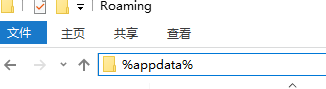
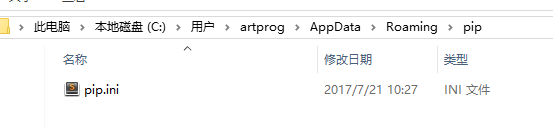
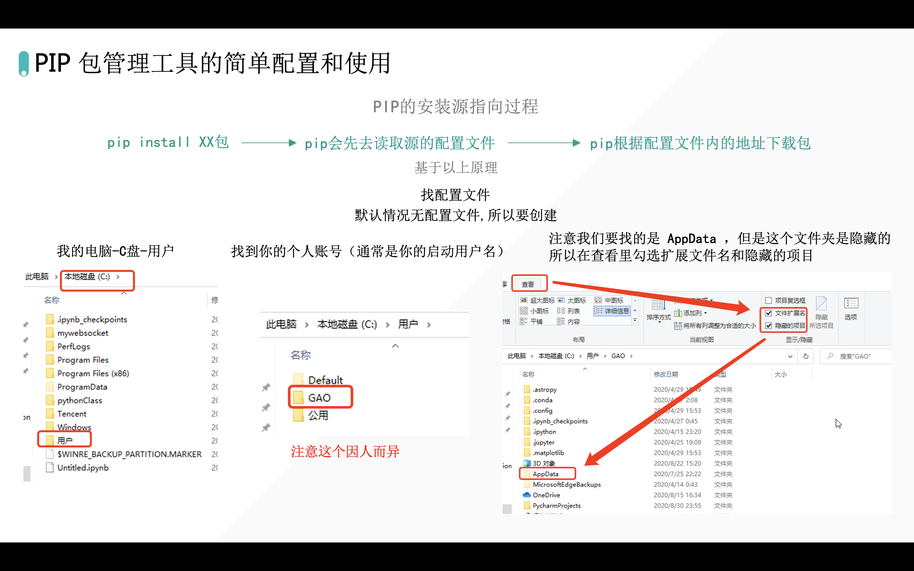

你好，我是悦创。 我接下来，把所有 Python pip 换源的方法，都整理下来。

## 第一种方法

1.  打开 appdata 文件夹，在资源管理器的地址栏输入 `%appdata%` 后回车：

 

2. 新建一个 pip 文件夹，在 pip 文件夹里面新建一个配置文件 `pip.ini`： 

 

3. 在配置文件中输入如下内容后保存即可：

```cmd
[global]
timeout = 6000
index-url = https://pypi.tuna.tsinghua.edu.cn/simple
trusted-host = pypi.tuna.tsinghua.edu.cn
```

再次使用 pip，即会使用新源。 **一些常用的国内源：**

*   清华大学：https://pypi.tuna.tsinghua.edu.cn/simple
    
*   阿里云：https://mirrors.aliyun.com/pypi/simple
    
*   中国科学技术大学 https://pypi.mirrors.ustc.edu.cn/simple
    
*   豆瓣：http://pypi.douban.com/simple
    

## 第二种方法



## 第三种方法

从 `pip10.0.0` 开始，有个 config 子命令可用来改配置，无需关心不同操作系统下配置文件路径。 详见讨论：[https://link.zhihu.com/?target=https%3A//github.com/pypa/pip/issues/1736](https://link.zhihu.com/?target=https%3A//github.com/pypa/pip/issues/1736) 实际使用例子：

```cmd
# 阿里源
pip config set global.index-url http://mirrors.aliyun.com/pypi/simple/

# 豆瓣源
pip config set global.index-url https://pypi.douban.com/simple

# 阿里云 http://mirrors.aliyun.com/pypi/simple/
# 科技大学 https://pypi.mirrors.ustc.edu.cn/simple/
# 豆瓣(douban) http://pypi.douban.com/simple/
# 清华大学 https://pypi.tuna.tsinghua.edu.cn/simple/
# 中国科学技术大学 http://pypi.mirrors.ustc.edu.cn/simple/
```

## 换回官方源

```pip
pip config set global.index-url https://pypi.org/simple
```


欢迎关注我公众号：AI悦创，有更多更好玩的等你发现！

::: details 公众号：AI悦创【二维码】


:::

::: info AI悦创·编程一对一

AI悦创·推出辅导班啦，包括「Python 语言辅导班、C++ 辅导班、java 辅导班、算法/数据结构辅导班、少儿编程、pygame 游戏开发」，全部都是一对一教学：一对一辅导 + 一对一答疑 + 布置作业 + 项目实践等。当然，还有线下线上摄影课程、Photoshop、Premiere 一对一教学、QQ、微信在线，随时响应！微信：Jiabcdefh

C++ 信息奥赛题解，长期更新！长期招收一对一中小学信息奥赛集训，莆田、厦门地区有机会线下上门，其他地区线上。微信：Jiabcdefh

方法一：[QQ](http://wpa.qq.com/msgrd?v=3&uin=1432803776&site=qq&menu=yes)

方法二：微信：Jiabcdefh

:::


