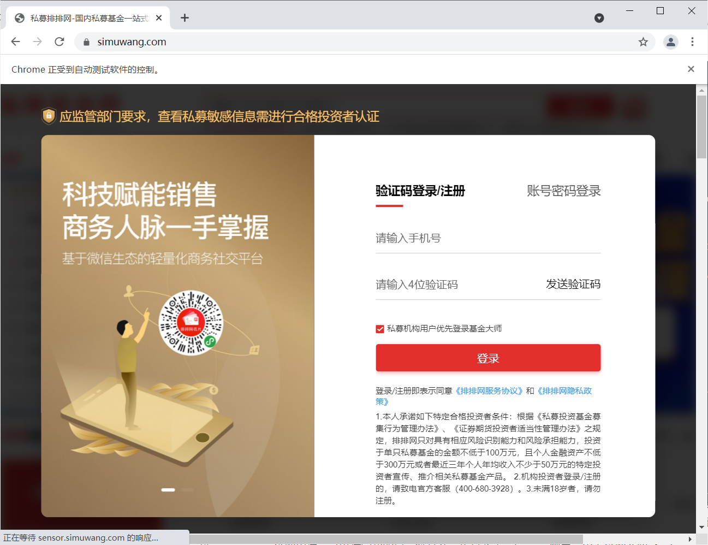
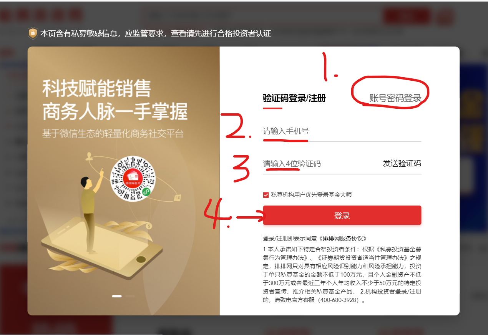
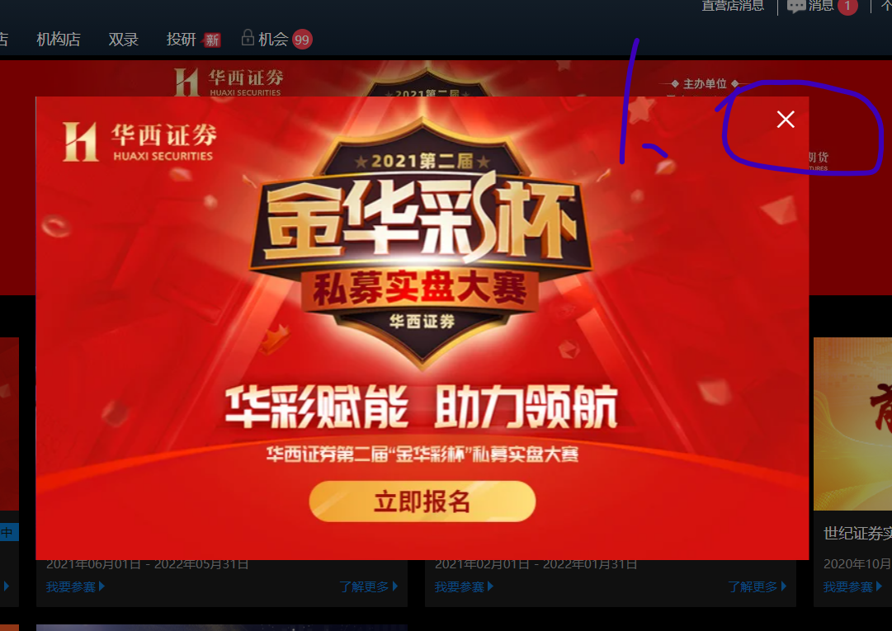
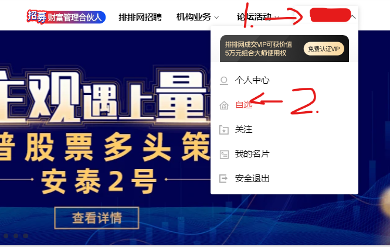
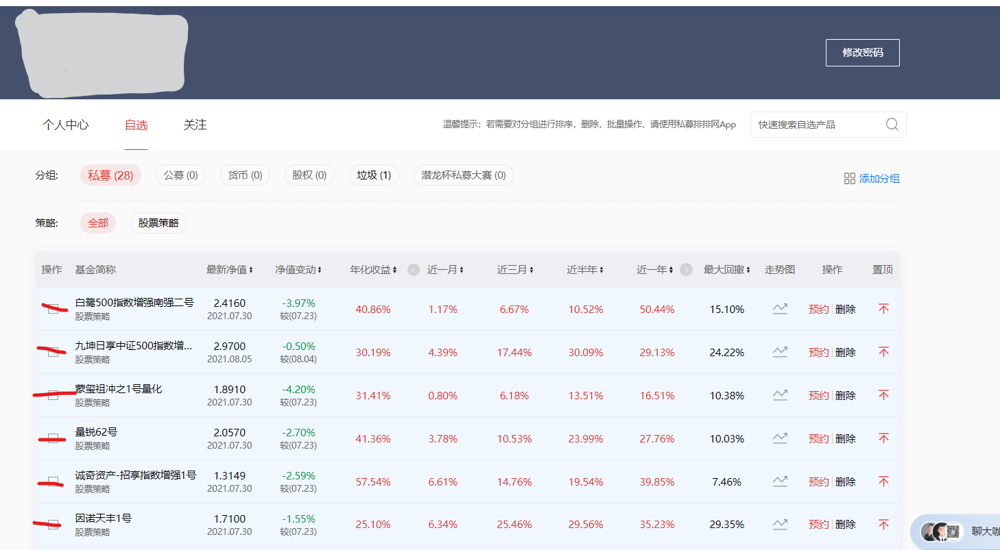
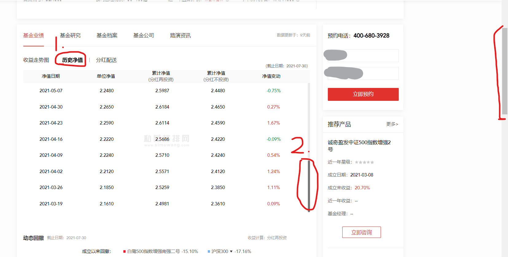
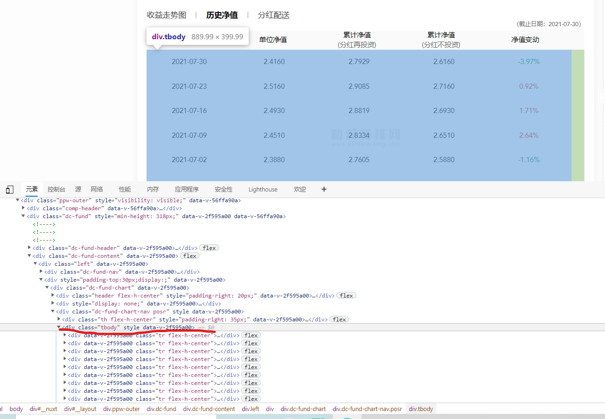
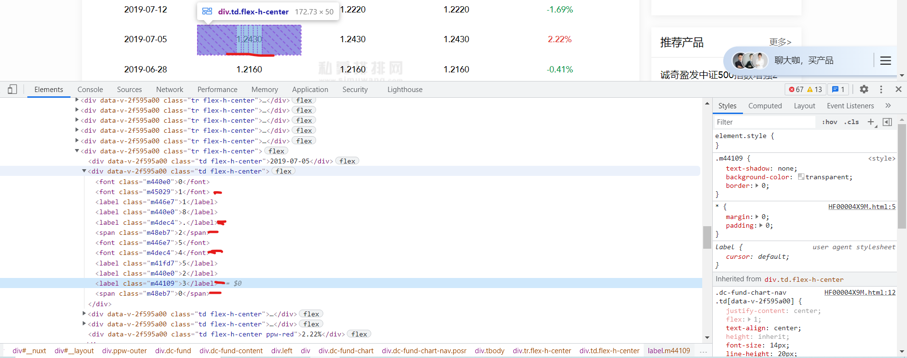
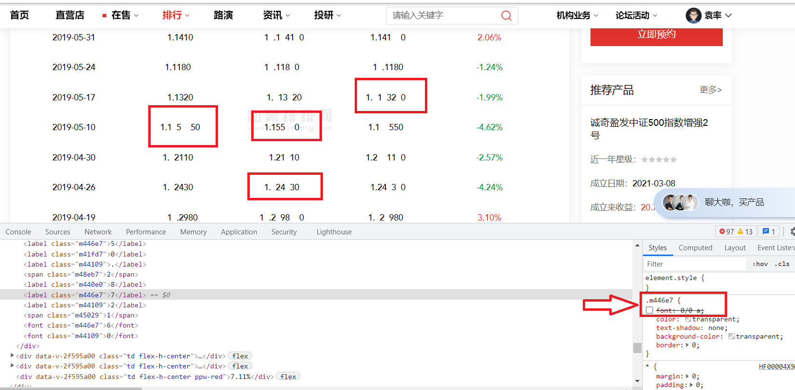
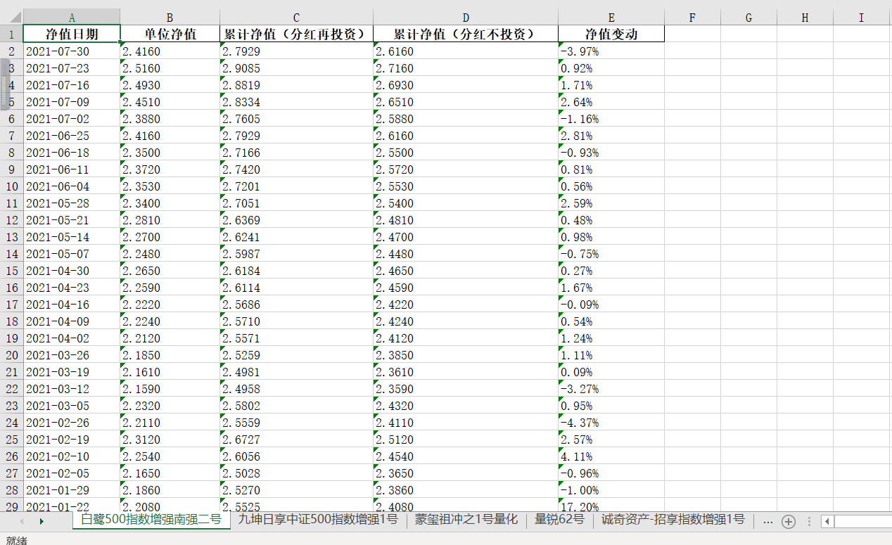

你好，我是悦创。最近，手里有个单子，但是奈何自己实习公司事情太多。所以就把我一对一学员的项目，介绍给 Panda4u 。最后他遇到加密就头疼了。本文将会对这个系列的爬虫进行分析和抓取。仅供学习交流使用！ 近期爬取了私募排排网上的历史净值，写一下爬取过程中的一些心得体会。 

 

原本，思考的时候觉得，selenium 是“万能的”，应该可以一力破万法，结果果然栽跟头了。 上面有很多的难点，例如直接利用 selenium 会被检测出反爬、爬取的数值被加密（页面上看到的和 html 中不一样，多了一些隐藏值)等等。爬取的方法主要就是 selenium、正则、beautifulsoup、xpath。这里先把这里使用的库导入。

```python
from selenium import webdriver
from bs4 import BeautifulSoup
from selenium.webdriver.common.by import By
import pandas
import time
import re
from lxml import html
from selenium.webdriver.common.action_chains import ActionChains        # 导入鼠标事件库
```

**总体流程**：打开网页，然后登录，到达需要解析的页面，得到源码，然后破解加密，最后输出数据保存在 excel 中。

## 一、开启网页

有的网站直接使用 selenium 就可以开启，例如

```python
from selenium import webdriver
driver = webdriver.Chrome()         # 启动驱动器
driver.get('https://www.simuwang.com/user/option')       # 加载网站
```

但是在这里就会出现以下情况，那是因为如果直接开启网页，就会被发现是爬虫。

 

解决这个问题要使用以下代码

```python
driver = webdriver.Chrome()         # 启动驱动器

# 谷歌浏览器 79和79版本后防止被检测
driver.execute_cdp_cmd("Page.addScriptToEvaluateOnNewDocument", {
    "source": """
    Object.defineProperty(navigator, 'webdriver', {
      get: () => undefined
    })
  """
})
driver.get('https://www.simuwang.com/user/option')       # 加载网站
```

最后就能完美的开启网页了。

  

**注意：** 这里设置开发者模式也是不可行的！

## 二、selenium 定位元素解析网页

在进入网页之后，就开始元素定位。selenium 定位一共有八个 **name** ， **id** ，**link\_text** ，**partial\_link\_text** ，**class\_name** ，**xpath**，**css**，**tag\_name** 。其中最少也要掌握 **xpath** 或者 **css** 一种方法（使用这两种方法基本上能解决所有的定位）。后面，我会考虑出一个 Xpath 的提取视频教程，看大家的对于这篇文章的阅读量，如果过三百我就马上录。 详细用法，可以关注后续的文章，这里就不多赘述了。在这里就讲讲 selenium 这里的用法，我使用的方法是 xpath。

### 1\. 输入账号和输入密码点击登录



```python
driver.find_element(By.XPATH,'//button[@class="comp-login-method comp-login-b2"]').click()      #点击账号密码登录
driver.find_element(By.XPATH,'//input[@name="username"]').send_keys('xxxxxxxxxxxx')      # 输入账号
driver.find_element(By.XPATH,'//input[@type="password"]').send_keys('xxxxxxxxxxxx')        # 输入密码
driver.find_element(By.XPATH,'//button[@style="margin-top: 65px;"]').click()            # 点击登录
```

**补充**：

1.  以后使用定位最好都用 By（也就是以上的方法），而 `driver.find_element_by_xpath()`，因为后面的这种不利于封装。
    
2.  元素定位是做什么的？我们为什么要定位元素？有什么用呢？
    
    1.  元素定位就是在 html 中找到我们在网页中看到内容对应的元素。
    2.  找到之后可以使用鼠标事事件和键盘事件，对网页进行人工模拟操作。
    3.  在这里就是简单的键盘事件 `send_keys` 和鼠标事件 `click`。

### 2\. 叉掉广告，网页后退



```python
time.sleep(15)              # 等待登录时间
driver.find_element(By.XPATH,'//span[@class="el-icon-close close-icon"]').click()       # 叉掉广告
driver.back()               # 网页后退
```

**补充：**

1.  注意这里必须要 sleep 几秒。那是因为登录过程需要时间加载，不然会报错。
    
2.  `driver.back()` 是将当前页面返回上一级。那么 `driver.forward()` 前进到上一级。
    

### 3\. 鼠标悬停点击自选

 

鼠标悬停在用户上，然后点击自选进入网页。

```python
time.sleep(5)       # 加载网页需要等待时间
mouse = driver.find_element(By.XPATH,'//div[@class="comp-header-nav-item fz14"]/div/span[@class="ellipsis"]')
ActionChains(driver).move_to_element(mouse).perform()       # 悬停鼠标在名片
driver.find_element(By.XPATH,'//a[@class="comp-header-user-item icon-trade"]').click()      # 点击自选
```

这里的悬停操作就是定位用户然后使用 ActionChains 进行悬停，在悬停中找到自选并点击。

### 4\. 解析网页

经历以上的步骤就来到了我们需要爬取数据的页面了。我们需要的数据在每一个基金里面的历史净值。所以我们先要得到每一个基金的网址，然后进入网站里面进行处理。

 

```python
# 解析网页
page = driver.page_source
soup = BeautifulSoup(page,'html.parser')

list_url = []   # 用于保存目标网站
list_name = []  # 用于保存目标名称
url_a = soup.select('div:nth-child(2) > div.shortName > a')    # 找到所爬取的网页
names = soup.select('div> div > div:nth-child(2) > div.shortName > a')  # 找到名称
for u in url_a:
    url = u['href']     # 得到网站
    list_url.append(url)
for name in names:
    list_name.append(name.get_text())
```

这里使用了 BeautifulSoup 对 page 进行解析，然后使用 select 定位找到每个基金的网址和基金名称。

## 二、对每个基金处理

经过上一步解析网页之后，得到每个基金的网站。现在循环处理这些网址，爬取数据。

### 1\. 解析每个基金网页

解析每个基金网页还是运用 `driver.get` 加载网页，利用 `page_source` 解析网页。

```python
driver.execute_cdp_cmd("Page.addScriptToEvaluateOnNewDocument", {
    "source": """
    Object.defineProperty(navigator, 'webdriver', {
      get: () => undefined
    })
  """
})
for ind in range(len(list_name)):
    driver.get(list_url[ind])       # 加载网站
```

不过在 `page_source` 解析网页之前，有一个东西必须要注意！ 那就是如果直接解析网页得到的历史净值只有一小部分，是因为历史净值是一个动态的，我们在解析之前需要利用 selenium 将历史净值这个内嵌框下滑到底，而且这个内嵌框是一个异步加载的（滑动完后，又会出来一段），使用需要多个滑动才能满足条件。 

 

解决问题要点：首先得将历史净值点击，然后定位历史净值框。

  

如图已经定位到了内嵌框，下面就开滑动

```python
driver.find_element(By.XPATH,'//div/div[2]/div[2]/div[1]/div[2]/div[1]/div[1]/a[2]').click()        # 点击历史净值

for i in range(50):
    js = 'document.getElementsByClassName("tbody")[0].scrollTop=100000'  # 在历史净值中滑动，这里滑动50应该是都够了的，如果不够加大就行
    driver.execute_script(js)
    time.sleep(0.1)  # 防止滑动太快，没有读取到结果

page_url = driver.page_source  # 解析当前网页
```

注意 `getElementsByClassName("tbody")[0]` 这里是查找属性class的属性值为 tbody ，中的第一个元素（一定要带上后面这个 0，因为返回的是一个集合。如果滑动的是 4 个元素就是后面就是 3） 下面就是定位 docment 对象的方法，和 css 定位一样。 

 

感兴趣可以看看 JavaScript 学习链接 http://www.runoob.com/jsref/dom-obj-document.html

### 2\. 解密历史净值中的隐藏值

#### （1）隐藏值原理

经过上一步就得到了每个基金的网页，接下来就来开始解密。 在解密前我们先来看看它是怎么加密的吧！ 

 

可以看到在 html 中存在着网页中没有的内容，这个就是加密。 说实话，在这里花费了不少的时间。我先来说说我的思路吧。

1.  找规律 在开始尝试找规律，最开始规律就是每个值中的span一定是有用的，但是后来发现有的没有span，然后，然后就没有然后了，直接放弃这种想法了。
2.  css 偏移 然后就是 css 偏移就是利用 css 样式将网页中正常的值乱序。但是发现我们这里的值顺序是正常的，只是多了部分值，所以页排除这种想法。
3.  存在隐藏值，最后发现了规律，存在的值（网页上显示的值）

 

不存在的值（网页上不显示的值）

 

 会发现网页上面不存在的值多了 **font: 0/0 a** 这个值。 

 

当把 **font: 0/0 a** 这个边框不勾选了，就会发现网页中会有很多的值中间是有空格的，那么可以得出结论**html中多出来的值并不是多余的，它也是存在网页中的，但是它被隐藏了。** 然后我们就抓住在这个特点继续找下去。 ​ 当我们发现 **ENCODE\_STYLE** 对应的内容就是和找到的规律一样。 


```python
.m440e0{font: 0/0 a;color: transparent;text-shadow: none;background-color: transparent;border: 0;}.m446e7{font: 0/0 a;color: transparent;text-shadow: none;background-color: transparent;border: 0;}.m48eb7{text-shadow: none;background-color: transparent;border: 0;}.m45029{text-shadow: none;background-color: transparent;border: 0;}.m41fd7{font: 0/0 a;color: transparent;text-shadow: none;background-color: transparent;border: 0;}.m4dec4{text-shadow: none;background-color: transparent;border: 0;}.m44109{text-shadow: none;background-color: transparent;border: 0;}
```


可以去验证，以 **m440e0** 为属性值去找元素，可以发现全是隐藏值。同理，**m48eb7** 为属性值去找元素全是真实值。 **结论：html中多出来的值并不是多余的，它也是存在网页中的，但是它被隐藏了。这些隐藏值以及真实值在ENCODE\_STYLE属性中。所以只需要在ENCODE\_STYLE中找存在font: 0/0 a的属性值，即为隐藏值。**

#### （2）代码实现

```python
# 找到隐藏的属性值
def getHideIds(htmlEtree):
    encode_styles = "".join(htmlEtree.xpath('//div[@id="ENCODE_STYLE"]/style/text()')).replace("\n", "")
    # 清洗数据，去除连续的空格
    new_encode_styles = re.sub("  +", "", encode_styles)
    # 获取全部被隐藏的id
    hideIds1 = re.findall("\.(\w+) {font: 0/0 a;", new_encode_styles)  # 格式化后的html
    hideIds2 = re.findall("\.(\w+){font: 0/0 a;", new_encode_styles)  # 未格式化的html
    result = set(hideIds1 + hideIds2)
    return result
```

定义一个函数，调用 xpath 解析的 page\_source，返回值为隐藏值的属性值。即类似于 m440e0，m41fd7 的值。 然后只需要将隐藏值对应的元素找出来就行了。

```python
htmlEtree = etree.HTML(text=htmlData)

# 获取被隐藏的id
hideIds = getHideIds(htmlEtree)

# 处理数据
divList = htmlEtree.xpath('//div[@class="tr flex-h-center"]')
# print(divList)
tdDivs = []
for div in divList:
    nextDivs = div.xpath('./div[@class="td flex-h-center"]')
    for nextDiv in nextDivs:
        if nextDivs.index(nextDiv) == 0:
            continue
        tdDivs.append(nextDiv)

resultList = []
for tdDiv in tdDivs:

    labels = tdDiv.xpath("./*")
    nowResultList = []
    for label in labels:
        classStr = label.xpath("./@class")[0]
        if classStr not in hideIds:
            nowResultList.append(label.xpath("./text()")[0])
    resultList.append("".join(nowResultList))

# print(resultList)
# for reslut in resultList:
#     print(reslut)
```

### 三、将所有数据写入excel

最后再将净值日期和净值变动找到（这两个没有掺杂隐藏值，很简单就能找到），然后利用pandas写入excel中。

```python
write = pandas.ExcelWriter(r"C:\Users\86178\Desktop\私募排排网历史净值爬取.xlsx")   # 新建xlsx文件。
list_info.append([list_date[index], resultList[i], resultList[i + 1], resultList[i + 2], list_net[index]]) # 分别对应净值日期，单位净值，累计净值，累计净值，净值变动

pd = pandas.DataFrame(list_info, columns=['净值日期', '单位净值', '累计净值（分红再投资）', '累计净值（分红不投资）', '净值变动'])
        # print(pd)
pd.to_excel(write, sheet_name=list_name[ind], index=False)

write.save()  # 这里一定要保存
```

最后得到结果 



### 四、总结

本文主要是讲的selenium的一些基本操作，例如鼠标事件、键盘事件和鼠标悬停。然后就是解密隐藏值。 我在这里遇见了很多的坑，思考了一个下午才把思路想到。我很庆幸在我最艰难的时候，没有说放弃，其实这次更大的收获是让自己对爬虫有更加深刻的见解。

欢迎关注我公众号：AI悦创，有更多更好玩的等你发现！

::: details 公众号：AI悦创【二维码】


:::

::: info AI悦创·编程一对一

AI悦创·推出辅导班啦，包括「Python 语言辅导班、C++ 辅导班、java 辅导班、算法/数据结构辅导班、少儿编程、pygame 游戏开发」，全部都是一对一教学：一对一辅导 + 一对一答疑 + 布置作业 + 项目实践等。当然，还有线下线上摄影课程、Photoshop、Premiere 一对一教学、QQ、微信在线，随时响应！微信：Jiabcdefh

C++ 信息奥赛题解，长期更新！长期招收一对一中小学信息奥赛集训，莆田、厦门地区有机会线下上门，其他地区线上。微信：Jiabcdefh

方法一：[QQ](http://wpa.qq.com/msgrd?v=3&uin=1432803776&site=qq&menu=yes)

方法二：微信：Jiabcdefh

:::


