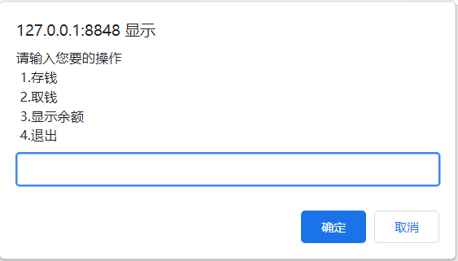
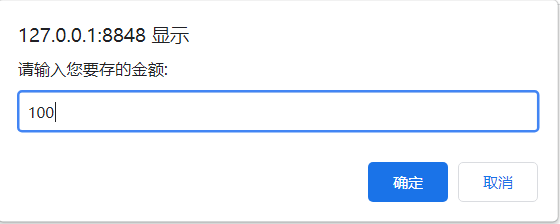
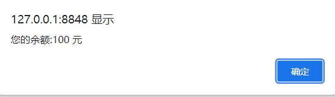
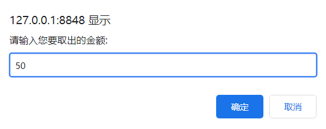
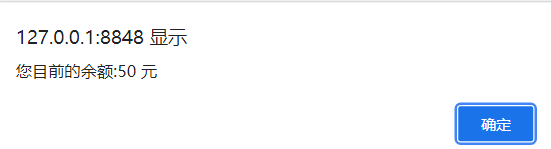
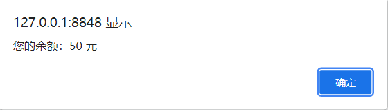
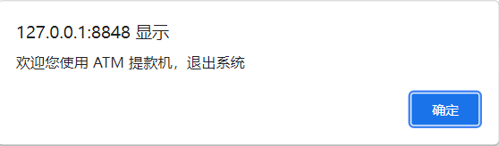

## 简易ATM
1. 如果存钱，就用输入钱数加上先存的钱数之后弹出显示余额的提示框
2. 如果取钱，就减去取的钱数之后弹出显示余额的提示框
3. 如果显示余额，就输出余额
4. 如果退出，弹出退出信息提示框

运行效果图👇
















有些地方本人做了一些改动，JavaScript 代码如下👇

```javascript
<script>
    var op = prompt("请输入您要的操作\n 1.存钱 \n 2.取钱 \n 3.显示余额 \n 4.退出")
    var money = 0
    while(op)
    {
        if(op == 4) 
        {
            alert("欢迎您使用 ATM 提款机，退出系统")
            break;
        }
        else if(op == 1)
        {
            var savemoney = prompt("请输入您要存的金额:")
            money += parseFloat(savemoney)
            alert("您的余额:" + (parseFloat(money)) + " 元")
        }
        else if(op == 2)
        {
            var getmoney = prompt("请输入您要取出的金额:")
            if(money == 0)
                alert("您目前的余额:" + parseFloat(money) + " 元\n" +
	        "您的账户没有余额，无法提款，返回上一步操作")
            else
            {
                while(money < parseFloat(getmoney))
	{
	    alert("您的余额不足，请重新输入取款金额:")
	    getmoney = prompt("请输入您要取出的金额:")
	}
	money -= parseFloat(getmoney);
	alert("您目前的余额:" + parseFloat(money) + " 元")
            }
        }
        else if(op == 3)
        {
	alert("您的余额：" + (parseFloat(money)) + " 元")
	console.log("您的余额:" + parseFloat(money) + " 元")
        }
        if(op != 1 || op != 2 || op != 3 || op != 4)
            alert("操作不合法，请重新输入您的操作:")
        op = prompt("请输入您要的操作\n 1.存钱 \n 2.取钱 \n 3.显示余额 \n 4.退出")
    }
</script>
```


```java
欢迎关注我公众号：AI悦创，有更多更好玩的等你发现！

::: details 公众号：AI悦创【二维码】

:::

::: info AI悦创·编程一对一

AI悦创·推出辅导班啦，包括「Python 语言辅导班、C++ 辅导班、java 辅导班、算法/数据结构辅导班、少儿编程、pygame 游戏开发」，全部都是一对一教学：一对一辅导 + 一对一答疑 + 布置作业 + 项目实践等。当然，还有线下线上摄影课程、Photoshop、Premiere 一对一教学、QQ、微信在线，随时响应！微信：Jiabcdefh

C++ 信息奥赛题解，长期更新！长期招收一对一中小学信息奥赛集训，莆田、厦门地区有机会线下上门，其他地区线上。微信：Jiabcdefh

方法一：[QQ](http://wpa.qq.com/msgrd?v=3&uin=1432803776&site=qq&menu=yes)

方法二：微信：Jiabcdefh

:::
```

欢迎关注我公众号：AI悦创，有更多更好玩的等你发现！

::: details 公众号：AI悦创【二维码】


:::

::: info AI悦创·编程一对一

AI悦创·推出辅导班啦，包括「Python 语言辅导班、C++ 辅导班、java 辅导班、算法/数据结构辅导班、少儿编程、pygame 游戏开发」，全部都是一对一教学：一对一辅导 + 一对一答疑 + 布置作业 + 项目实践等。当然，还有线下线上摄影课程、Photoshop、Premiere 一对一教学、QQ、微信在线，随时响应！微信：Jiabcdefh

C++ 信息奥赛题解，长期更新！长期招收一对一中小学信息奥赛集训，莆田、厦门地区有机会线下上门，其他地区线上。微信：Jiabcdefh

方法一：[QQ](http://wpa.qq.com/msgrd?v=3&uin=1432803776&site=qq&menu=yes)

方法二：微信：Jiabcdefh

:::


