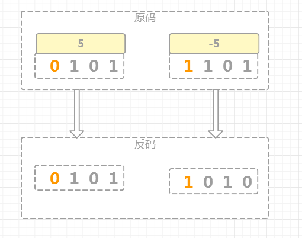

你好，我是悦创。

在计算机中，所有的数字都是以二进制的形式表示的，即均为 0 和 1 组成的各种编码，数字的表示形式可以划分成原码，反码和补码

## 如何表示 原码、反码、补码

如果没有特殊说明，下面的介绍都是以 4 位二进制为例的。

###  原码

为了区分正数和负数，计算机中将二进制的最高位( bit ) 规定为符号位，**它等于 0 时表示正数，等于 1 时表示负数，剩下的所有低位( bit )用来表示数值** 。

下面的图片从左到右分别表示 `+5`和 `-5`的原码。

### 反码

正数的反码和其原码相同，负数的反码在原码基础上，符号位不变，数值位取反。

下面的图片从左到右分别表示 `+5`和 `-5`的反码。

### 补码

正数的补码和其原码相同，负数的补码在反码基础上加 1。

下面的图片从左到右分别表示 `+5`和 `-5`的补码。

## 为什么用补码

在计算机中，数字是以补码的形式进行存储和参与运算的。

这看起来比较奇怪，为什么要采用补码这么麻烦的方式表示数字( 特别是对于负数 )，直观一点儿不好吗？

为了讲明白这个问题，下面我们分别以原码，反码和补码的形式来模拟二进制的加法和减法运算，以 4 位二进制为例来说明：

### 原码

下图列出了 4 位二进制所有正数和负数的二进制表示。

对于 4 位二进制来说，最高位是符号位，也就是图中黄色二进制的 0 和 1 的位置。

用原码模拟 `3 + 2` 、`6 + (-2)`  、`(-1) + (-3)`  运算，具体的运算过程如下：

上图中，圆圈中的二进制位是做加法运算的时候向前进位的结果，由于有效二进制位数是 4 位，所以圆圈中的二进制位因溢出而自动丢弃（在计算过程中仍然用到了溢出的二进制位，结果会丢弃溢出的二进制）

由计算过程可知，3 + 2 = 5是正确的，但是 6 + (-2) = 0以及 (-1) + (-3) = 4结果都是错误的

所以，原码虽然直观易懂，也易于转换，但是在运算上，正数之间的加法是没问题，负数之间以及正数和负数之间都存在问题，因此计算机中不能用原码表示数字

欢迎关注我公众号：AI悦创，有更多更好玩的等你发现！

::: details 公众号：AI悦创【二维码】

:::

::: info AI悦创·编程一对一

AI悦创·推出辅导班啦，包括「Python 语言辅导班、C++ 辅导班、java 辅导班、算法/数据结构辅导班、少儿编程、pygame 游戏开发」，全部都是一对一教学：一对一辅导 + 一对一答疑 + 布置作业 + 项目实践等。当然，还有线下线上摄影课程、Photoshop、Premiere 一对一教学、QQ、微信在线，随时响应！微信：Jiabcdefh

C++ 信息奥赛题解，长期更新！长期招收一对一中小学信息奥赛集训，莆田、厦门地区有机会线下上门，其他地区线上。微信：Jiabcdefh

方法一：[QQ](http://wpa.qq.com/msgrd?v=3&uin=1432803776&site=qq&menu=yes)

方法二：微信：Jiabcdefh

:::

[https://medium.com/@alexbebereche/how-to-hide-you-api-key-with-python-5cc63d2a6c45](https://medium.com/@alexbebereche/how-to-hide-you-api-key-with-python-5cc63d2a6c45)

