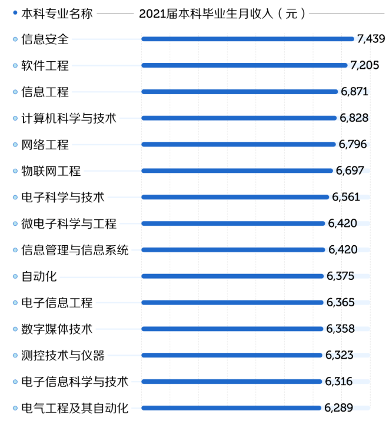
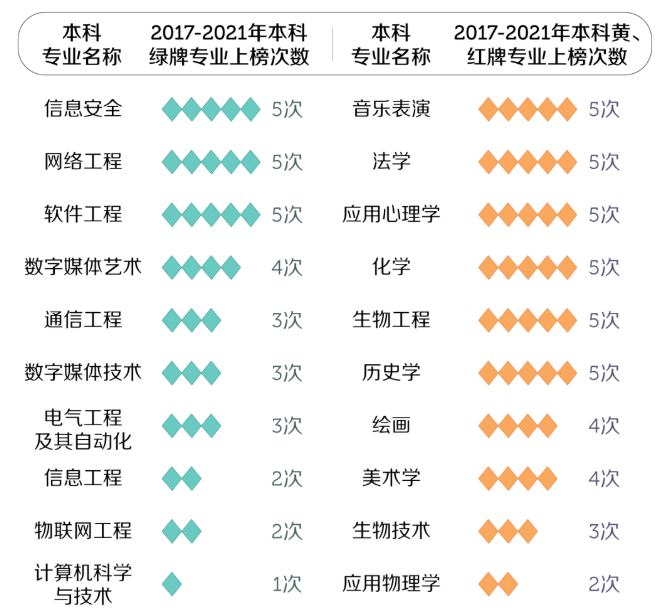
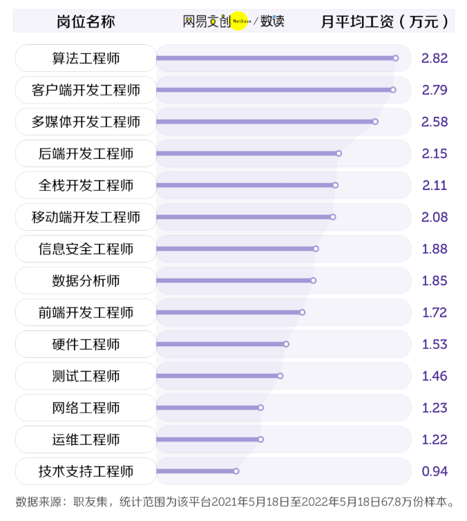

你好，我是悦创。

2022年的高考已经结束了，但却并不代表高考落幕了，因为后面的报考学校和专业更是一轮重头戏，几年的寒窗苦读自然是要考上一个好学校好专业，才算真正给自己生涯划上句号。

**今天给大家分享的计算机相关专业的实际情况，包括计算机相关专业的职业和薪资等等，不管是准大学生还是在读的大学生都能用得上，想要报考计算机的小伙子们可以更加了解计算机，在读的大学生也能对自己毕业后的路会更加清楚。**

文章内我将用近年来的大数据来讲述，再结合我将近6年的代码生涯经验，尽量给大家分析透彻些。

## 1.什么专业最收入最高？

“什么专业最好”可能很难去回答，但如果光论毕业后什么专业的平均薪资比较高，那么这个还是有迹可循的，毕竟大部分人读大学都是为了学一技之长后找一份收入比较高的工作。

根据《麦可思2021年大学毕业生培养质量跟踪评价》的数据显示，大家先看一下总体的大数据情况：

> 图片来自于网易数读，如有侵权，敬请告知

可以看得出来，排名在前面的计算机相关专业是信息安全、软件工程、信息工程、计算机科学与技术、网络工程、物联网工程、数字媒体技术。

那么选什么专业好一些呢？光从上面的数据来看还是不够的，不仅仅要考虑平均薪资的问题，还要考虑职业薪资和市场需求量等因素，那么我们接下来继续看。

## 2.什么专业比较好就业？

我们先来看一下麦可思《2017-2021本科生就业报告》：

> 图片来自于网易数读，如有侵权，敬请告知

这里得说一下“绿牌”的判定指标，结合了就业率、薪资情况和失业率这3个指标，最后得出来综合评分都不错的专业则会判定为绿牌。

可以看得出来，计算机相关专业的就业情况比其他专业是要好很多的，所以选计算机还是没有错的。但是计算机的这些专业之中，相对来说，信息安全、网络工程和软件工程是首先，其次是数字媒体技术。

让我比较以外的是计科（“计算机科学与技术”简称）在本科阶段却只有1次绿牌，不过并不代表说计科不行，我个人的感觉，计科与软件工程学得是差不多的，基本是属于计算机相关专业里面的上上之选。

不过专业这个事情，并不是绝对，你学计科同样可以去做大数据和物联网，你学物联网同样可以去搞软件工程或者网络工程，在大学里面靠的更多是自己的自学，去研究自己喜欢的方向。

## 3.职业薪资情况

不管你是计算机的哪个专业，基本上你都可以从事任何一个计算机相关的职业，那么接下来我们看下岗位薪资情况：

> 图片来自于网易数读，如有侵权，敬请告知

从上面我们能很明显看出，**算法工程师的平均薪资是最高的**，这个是毋庸置疑的。

不过悦创觉得上面缺了一个职业，那就是能够与算法工程师匹敌的架构师，薪资也是相当不错，有句话说得好“大多数程序员都有一个架构梦”，不过架构师也不是那么容易当的，需要多年的技术和经验积累才可能走上架构师之路，不过可以作为一个长远的目标。

值得一提的是全栈工程师虽然看似前后端都做，但薪资却未必比后端高，这也是目前国内的现状，前后端分离。

如果说感觉自己对计算机技术这块造诣不是那么高的话，比如说写点代码还可以但想到算法就头疼，那么可以考虑前端和测试岗位，需要的技术难度相对没有那么高，薪资待遇也还不错。

## 结语

悦创个人觉得软件工程和计科（计算机科学与技术）可以优先考虑，其次是信息安全、网络工程、信息工程，最后是物联网工程、数字媒体技术等其他的。

软工和计科非要二选一的话，想考研建议选计科，想学完出来就工作的话，软工的优势稍微会大一些。

大学的专业并不能完全决定你以后的路，就算你所选的专业在某个领域上是弱势，但只要你肯下功夫去自学和研究，你一样能够有所建树。

说得再直白些，非计算机专业的人自学编程转行做程序员的都不在少数，那么我们科班生更不用说了，加油！

欢迎关注我公众号：AI悦创，有更多更好玩的等你发现！

::: details 公众号：AI悦创【二维码】

:::

::: info AI悦创·编程一对一

AI悦创·推出辅导班啦，包括「Python 语言辅导班、C++ 辅导班、java 辅导班、算法/数据结构辅导班、少儿编程、pygame 游戏开发」，全部都是一对一教学：一对一辅导 + 一对一答疑 + 布置作业 + 项目实践等。当然，还有线下线上摄影课程、Photoshop、Premiere 一对一教学、QQ、微信在线，随时响应！微信：Jiabcdefh

C++ 信息奥赛题解，长期更新！长期招收一对一中小学信息奥赛集训，莆田、厦门地区有机会线下上门，其他地区线上。微信：Jiabcdefh

方法一：[QQ](http://wpa.qq.com/msgrd?v=3&uin=1432803776&site=qq&menu=yes)

方法二：微信：Jiabcdefh

:::

[https://medium.com/@alexbebereche/how-to-hide-you-api-key-with-python-5cc63d2a6c45](https://medium.com/@alexbebereche/how-to-hide-you-api-key-with-python-5cc63d2a6c45)

