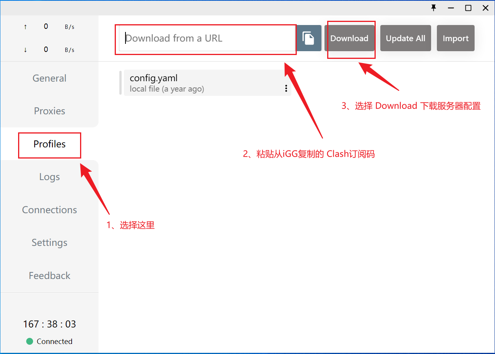
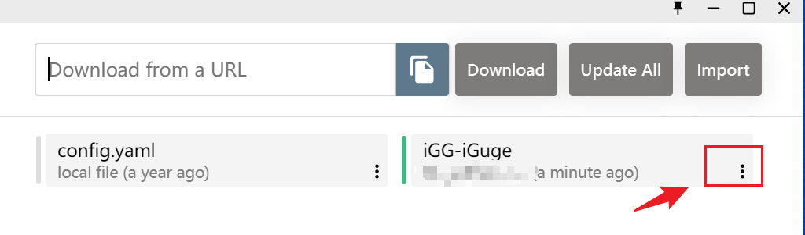
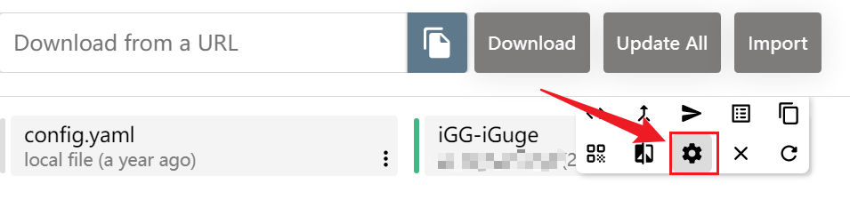
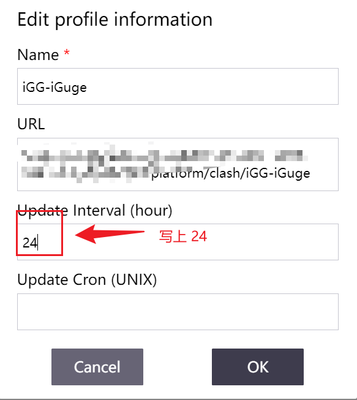
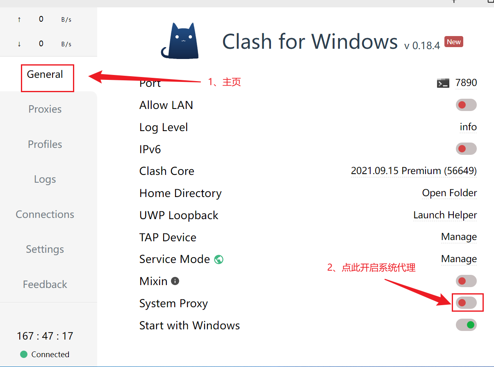
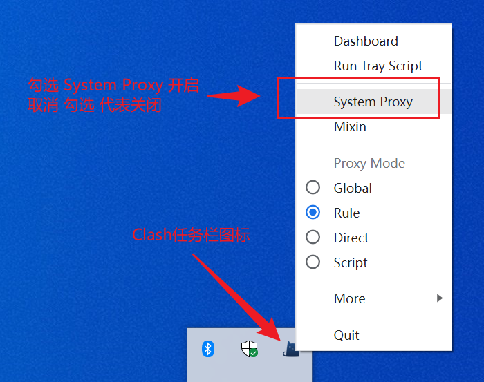

你好，我是悦创。

Clash 是一款优秀的 `V2ray/SSR` 客户端，支持自动测速，自动选线,强大的自定义策略分流。支持网卡 `Tun/Tap` 全局模式的客户端软件。

同时支持 `Windows/Mac/Linux` 等系统，但是 Windows 支持最优秀。

**跟我购买的，我会发配置或者配置二维码。** 购买链接：[https://bornforthis.cn/vpn.html](https://bornforthis.cn/vpn.html)

下载地址：

[https://github.com/Fndroid/clash_for_windows_pkg/releases/download/0.19.20/Clash.for.Windows.Setup.0.19.20.exe](https://github.com/Fndroid/clash_for_windows_pkg/releases/download/0.19.20/Clash.for.Windows.Setup.0.19.20.exe)

快速复制：

```link
https://github.com/Fndroid/clash_for_windows_pkg/releases/download/0.19.20/Clash.for.Windows.Setup.0.19.20.exe
```

下载安装完成后，自主安装即可。

打开 Clash 主界面，选择 Profiles, 粘贴从 AI悦创发给你的订阅链接，点击 Download 按钮，下载配置文件。 clash 默认的 `config.yaml` 文件千万不要删除，删除了可能会导致 clash 无法正常运行!



设置订阅文件 24 小时自动更新一次。








点击 General , 返回主页。 将 System Proxy 开启 即可打开代理。



Clash 每次开机启动后都在任务栏里边，我们也可以通过任务栏图标开启，关闭 Clash 代理。



欢迎关注我公众号：AI悦创，有更多更好玩的等你发现！

Clash 默认监听端口为 7890, 其他程序想要自定义设置代理，只需手工设置代理地址为: 127.0.0.1 端口:7890 即可。一个端口同时支持 HTTP/SOCKS5 协议。

::: details 公众号：AI悦创【二维码】


:::

::: info AI悦创·编程一对一

AI悦创·推出辅导班啦，包括「Python 语言辅导班、C++ 辅导班、java 辅导班、算法/数据结构辅导班、少儿编程、pygame 游戏开发」，全部都是一对一教学：一对一辅导 + 一对一答疑 + 布置作业 + 项目实践等。当然，还有线下线上摄影课程、Photoshop、Premiere 一对一教学、QQ、微信在线，随时响应！微信：Jiabcdefh

C++ 信息奥赛题解，长期更新！长期招收一对一中小学信息奥赛集训，莆田、厦门地区有机会线下上门，其他地区线上。微信：Jiabcdefh

方法一：[QQ](http://wpa.qq.com/msgrd?v=3&uin=1432803776&site=qq&menu=yes)

方法二：微信：Jiabcdefh

:::


