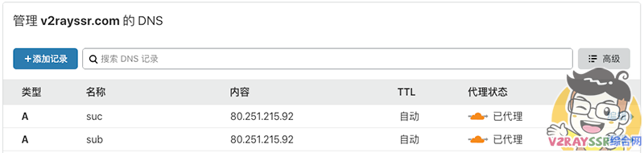
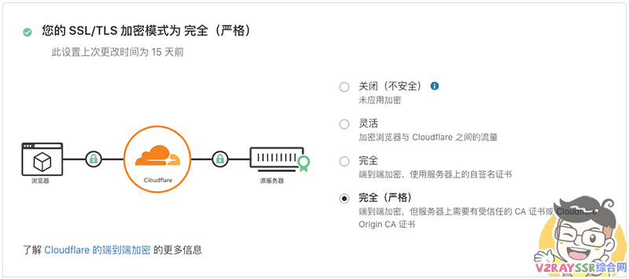
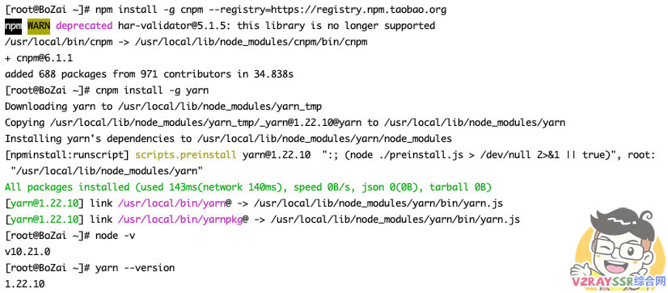
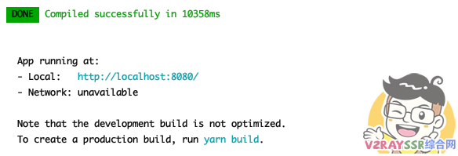
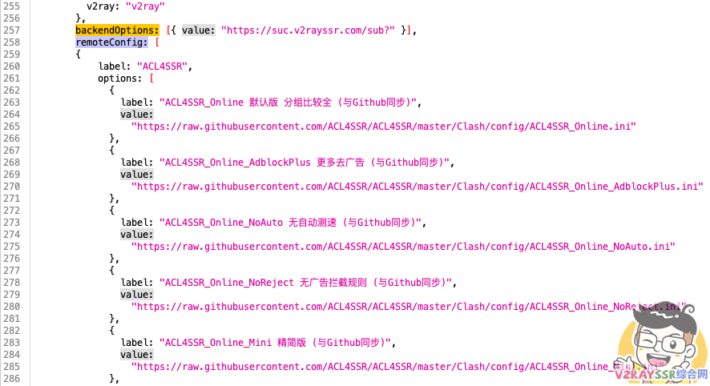
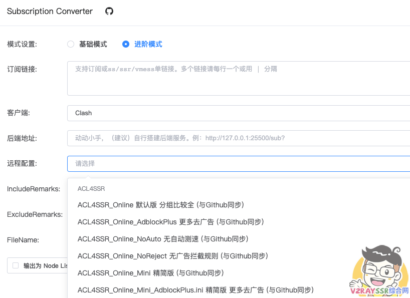
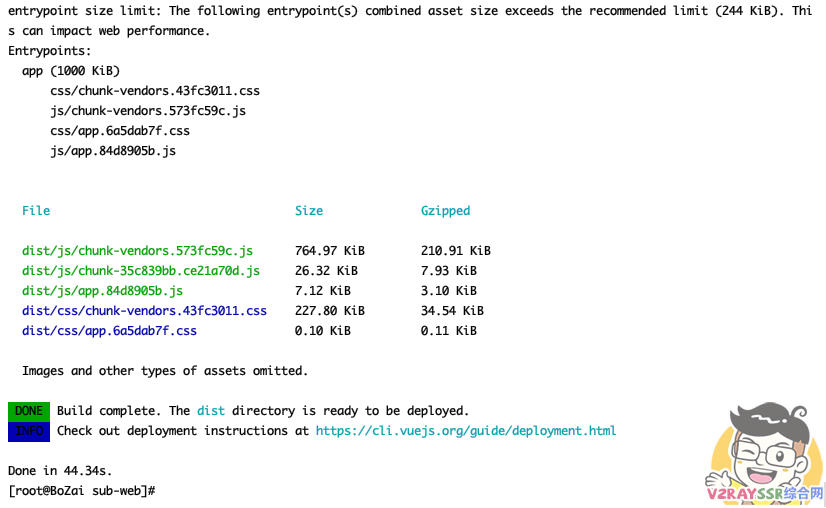
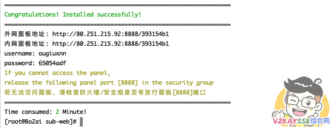
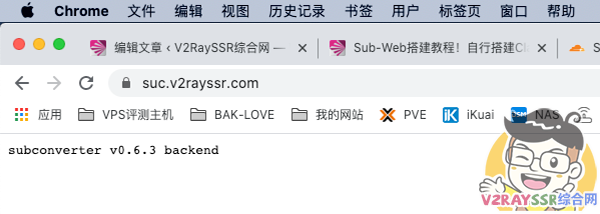
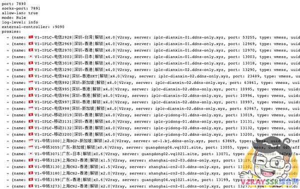

## 准备工作

### 在线平台的准备

你好，我是悦创。

准备：

- VPS 一台并装好主流的系统（作者演示用 CentOS）
- 域名托管到 Cloudflare （[不会点击这里](https://www.v2rayssr.com/yumingreg.html)）
- 解析两个域名（一个用于前端，一个用于后端，不会[看视频](https://www.v2rayssr.com/go?url=https://youtu.be/4JVIfkRgfw4)）

### 本地平台的准备

- PVE（Esxi）下创建的虚拟机VPS

### 前端项目地址

[https://github.com/CareyWang/sub-web](https://github.com/CareyWang/sub-web)

### 后端项目地址

[https://github.com/tindy2013/subconverter](https://github.com/tindy2013/subconverter)

## 在 Cloudflare 解析两个域名

**前端** 我们使用 sub.v2rayssr.com 进行解析

**后端** 我们使用 suc.v2rayssr.com 进行解析

（PS：若是为了你的服务器安全，建议一定开启小云朵，也就是开启CDN）



设置 Cloudflare 的 SSL/TLS 为以下配置



## 搭建 Sub-Web 前端 

### 更新系统并安装 Node 与 Yarn

依次运行下面四行代码，若是 Debian/Ubuntu 系统，请自行替换下面前两行命令中的 `yum` 为 `apt`

```linux
yum update -y
yum install -y curl wget sudo nodejs git
npm install -g cnpm --registry=https://registry.npm.taobao.org
cnpm install -g yarn
```

命令执行完毕以后，请运行下面的代码查询 Node 与 Yarn 是否安装成功，若是成功会返回版本号，如下图。

```linux
node -v
yarn --version
```




### 下载并安装 Sub-Web

拉取 sub-web 程序，并进入 sub-web 文件夹

```linux
git clone https://github.com/CareyWang/sub-web.git
cd sub-web
```

在项目目录中安装构建依赖项，构建的过程稍微有点长

```linux
yarn install
```

使用 webpack 运行 Web 客户端以进行本地开发。

```linux
yarn serve
```

到目前为止，浏览器访问 http://服务器ip:8080/ 应该可以进行前端 sub-web 的预览了。




### 修改默认后端地址

找到 `VPS /root/sub-web/src/views/Subconverter.vue` 文件

找到 257行 `backendOptions:`（写博客的时候是这行），替换后面的 `http://127.0.0.1:25500/sub?` 为 `https://suc.v2rayssr.com/sub?`

**（注意两个地方：域名为你刚才准备的后端域名，是 https 而非 http）**



### 更换远程规则

因为这个版本更新以后，规则方面很少，经常用到的一些经典的 ACL4SSR 的规则并没有集成，大家可以看看，若是有，就不需要这样操作。

VPS找到 `/root/sub-web/src/views/Subconverter.vue` 文件，找到 258行 `remoteConfig: [`（写博客的时候是这行），敲下回车，插入下面内容。若是不清楚，请看 本期讲解的视频：

```cmd
{
            label: "ACL4SSR",
            options: [
              {
                label: "ACL4SSR_Online 默认版 分组比较全 (与Github同步)",
                value:
                  "https://raw.githubusercontent.com/ACL4SSR/ACL4SSR/master/Clash/config/ACL4SSR_Online.ini"
              },
              {
                label: "ACL4SSR_Online_AdblockPlus 更多去广告 (与Github同步)",
                value:
                  "https://raw.githubusercontent.com/ACL4SSR/ACL4SSR/master/Clash/config/ACL4SSR_Online_AdblockPlus.ini"
              },
              {
                label: "ACL4SSR_Online_NoAuto 无自动测速 (与Github同步)",
                value:
                  "https://raw.githubusercontent.com/ACL4SSR/ACL4SSR/master/Clash/config/ACL4SSR_Online_NoAuto.ini"
              },
              {
                label: "ACL4SSR_Online_NoReject 无广告拦截规则 (与Github同步)",
                value:
                  "https://raw.githubusercontent.com/ACL4SSR/ACL4SSR/master/Clash/config/ACL4SSR_Online_NoReject.ini"
              },
              {
                label: "ACL4SSR_Online_Mini 精简版 (与Github同步)",
                value:
                  "https://raw.githubusercontent.com/ACL4SSR/ACL4SSR/master/Clash/config/ACL4SSR_Online_Mini.ini"
              },
              {
                label: "ACL4SSR_Online_Mini_AdblockPlus.ini 精简版 更多去广告 (与Github同步)",
                value:
                  "https://raw.githubusercontent.com/ACL4SSR/ACL4SSR/master/Clash/config/ACL4SSR_Online_Mini_AdblockPlus.ini"
              },
              {
                label: "ACL4SSR_Online_Mini_NoAuto.ini 精简版 不带自动测速 (与Github同步)",
                value:
                  "https://raw.githubusercontent.com/ACL4SSR/ACL4SSR/master/Clash/config/ACL4SSR_Online_Mini_NoAuto.ini"
              },
              {
                label: "ACL4SSR_Online_Mini_Fallback.ini 精简版 带故障转移 (与Github同步)",
                value:
                  "https://raw.githubusercontent.com/ACL4SSR/ACL4SSR/master/Clash/config/ACL4SSR_Online_Mini_Fallback.ini"
              },
              {
                label: "ACL4SSR_Online_Mini_MultiMode.ini 精简版 自动测速、故障转移、负载均衡 (与Github同步)",
                value:
                  "https://raw.githubusercontent.com/ACL4SSR/ACL4SSR/master/Clash/config/ACL4SSR_Online_Mini_MultiMode.ini"
              },
              {
                label: "ACL4SSR_Online_Full 全分组 重度用户使用 (与Github同步)",
                value:
                  "https://raw.githubusercontent.com/ACL4SSR/ACL4SSR/master/Clash/config/ACL4SSR_Online_Full.ini"
              },
              {
                label: "ACL4SSR_Online_Full_NoAuto.ini 全分组 无自动测速 重度用户使用 (与Github同步)",
                value:
                  "https://raw.githubusercontent.com/ACL4SSR/ACL4SSR/master/Clash/config/ACL4SSR_Online_Full_NoAuto.ini"
              },
              {
                label: "ACL4SSR_Online_Full_AdblockPlus 全分组 重度用户使用 更多去广告 (与Github同步)",
                value:
                  "https://raw.githubusercontent.com/ACL4SSR/ACL4SSR/master/Clash/config/ACL4SSR_Online_Full_AdblockPlus.ini"
              },
              {
                label: "ACL4SSR_Online_Full_Netflix 全分组 重度用户使用 奈飞全量 (与Github同步)",
                value:
                  "https://raw.githubusercontent.com/ACL4SSR/ACL4SSR/master/Clash/config/ACL4SSR_Online_Full_Netflix.ini"
              },
              {
                label: "ACL4SSR 本地 默认版 分组比较全",
                value: "config/ACL4SSR.ini"
              },
              {
                label: "ACL4SSR_Mini 本地 精简版",
                value: "config/ACL4SSR_Mini.ini"
              },
              {
                label: "ACL4SSR_Mini_NoAuto.ini 本地 精简版+无自动测速",
                value: "config/ACL4SSR_Mini_NoAuto.ini"
              },
              {
                label: "ACL4SSR_Mini_Fallback.ini 本地 精简版+fallback",
                value: "config/ACL4SSR_Mini_Fallback.ini"
              },
              {
                label: "ACL4SSR_BackCN 本地 回国",
                value: "config/ACL4SSR_BackCN.ini"
              },
              {
                label: "ACL4SSR_NoApple 本地 无苹果分流",
                value: "config/ACL4SSR_NoApple.ini"
              },
              {
                label: "ACL4SSR_NoAuto 本地 无自动测速 ",
                value: "config/ACL4SSR_NoAuto.ini"
              },
              {
                label: "ACL4SSR_NoAuto_NoApple 本地 无自动测速&无苹果分流",
                value: "config/ACL4SSR_NoAuto_NoApple.ini"
              },
              {
                label: "ACL4SSR_NoMicrosoft 本地 无微软分流",
                value: "config/ACL4SSR_NoMicrosoft.ini"
              },
              {
                label: "ACL4SSR_WithGFW 本地 GFW列表",
                value: "config/ACL4SSR_WithGFW.ini"
              }
            ]
          },
```

### 配置完毕刷新前端网页

配置完毕以后，程序会自动更新，再次刷新前端网页，会出现刚才添加的相关规则，如图所示：




至此，我们的前端搭建完毕，我们现在需要打包，生成一个发布目录

首先停止调试程序，CTRL+C ，退出当前调试，然后执行下面的命令进行打包：

> 若是不会停止，请断开VPS，重新连接VPS以后，输入 `cd sub-web` 在执行下面的命令

```cmd
yarn build
```

执行以下打包命令，在 `/root/sub-web` 下面会生成一个 `dist` 目录，这个目录即为网页的发布目录。




## 安装BT面板并设置网站

CentOS 系统运行下面的命令安装宝塔面板

```cmd
yum install -y wget && wget -O install.sh http://download.bt.cn/install/install_6.0.sh && sh install.sh
```

Debian/Ubuntu 系统运行下面的命令安装宝塔面板，或是直接访问官网查询安装代码 ：[点击访问](https://www.bt.cn)

Ubuntu安装命令

```cmd
wget -O install.sh http://download.bt.cn/install/install-ubuntu_6.0.sh && sudo bash install.sh
```

Debian安装命令

```cmd
wget -O install.sh http://download.bt.cn/install/install-ubuntu_6.0.sh && bash install.sh
```




关于宝塔环境的安装以及相关的站点设置和反向代理，请[查看视频](https://www.v2rayssr.com/go?url=https://www.youtube.com/watch?v=4JVIfkRgfw4&t=633s)，这边步骤比较多，所以博文选择跳过。

## SubConverter后台搭建

### 下载并解压后端程序

```cmd
cd /root
wget https://github.com/tindy2013/subconverter/releases/download/v0.6.3/subconverter_linux64.tar.gz
tar -zxvf subconverter_linux64.tar.gz
```

完成以后，在 `/root` 文件夹下会多出一个 `subconverter` 的文件夹，这个就是我们的后端程序

### 修改配置文件参数

现在我们需要修改后端配置文件中的一些参数

找到VPS文件 `/root/subconverter/pref.ini` ，找到如下参数进行修改

```cmd
api_access_token=123123dfsdsdfsdfsdf            #随意设置自己知道就行
managed_config_prefix=https://suc.v2rayssr.com  #设置成我们刚刚解析的后端域名
listen=127.0.0.1                                #这里改成 127.0.0.1 进行反代
```

### 创建服务进程并启动

接下来我们需要创建一个服务，让VPS每次重启或是开机自动运行后端程序

找到VPS目录 `/etc/systemd/system`，创建一个名为 `sub.service` 的文件

打开文件，贴入以下内容，保存。

```cmd
[Unit]
Description=A API For Subscription Convert
After=network.target
 
[Service]
Type=simple
ExecStart=/root/subconverter/subconverter
WorkingDirectory=/root/subconverter
Restart=always
RestartSec=10
 
[Install]
WantedBy=multi-user.target
```

检查运行状态以及设置开机自启

```
systemctl daemon-reload
systemctl start sub
systemctl enable sub
systemctl status sub
```

到这里，后端也就搭建完毕了，我们现在可以在浏览器里面访问我们的后端了 https://suc.v2rayssr.com （正常的话，会返回下面的图例）



## 后记

到这里，我们也就搭建完毕了，大家可以在前端订阅自己的SSR/V2RAY/TROJAN机场链接或是自建的的节点链接进行转换了。

转换成功以后，复制订阅地址，输入到浏览器，打开，会得到如下的画面（若是教程帮助了你，不妨转发订阅点赞。）



欢迎关注我公众号：AI悦创，有更多更好玩的等你发现！

::: details 公众号：AI悦创【二维码】


:::

::: info AI悦创·编程一对一

AI悦创·推出辅导班啦，包括「Python 语言辅导班、C++ 辅导班、java 辅导班、算法/数据结构辅导班、少儿编程、pygame 游戏开发」，全部都是一对一教学：一对一辅导 + 一对一答疑 + 布置作业 + 项目实践等。当然，还有线下线上摄影课程、Photoshop、Premiere 一对一教学、QQ、微信在线，随时响应！微信：Jiabcdefh

C++ 信息奥赛题解，长期更新！长期招收一对一中小学信息奥赛集训，莆田、厦门地区有机会线下上门，其他地区线上。微信：Jiabcdefh

方法一：[QQ](http://wpa.qq.com/msgrd?v=3&uin=1432803776&site=qq&menu=yes)

方法二：微信：Jiabcdefh

:::


