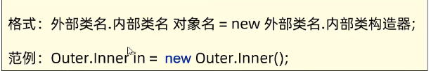
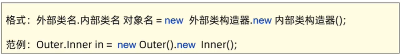
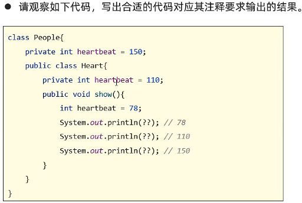

## 个人简介

大家好，我是翰慧腾。一名正在努力学JAVA的大一小白，本文章为初学的笔记，希望各位多多指教。💙

欢迎点赞+收藏+留言💜

生活不止眼前的苟且，还有诗和远方🧡

## 一、内部类

内部类顾名思义就是在一个类内部声明另一个类，包含内部类的称为外部类。内部类一般用来实现一些没有通用意义的功能逻辑,可以访问外部类的成员，包括私有的成员。（TIP：外部类只可以用 public 默认修饰，但是内部类可以用 private protected 修饰，增强了其封装性。）

创建的内部类都会产生 class 文件。

## 内部类分类：

1. 静态内部类（了解即可）

静态内部类首先肯定要有static修饰，可以访问外部类的非静态变量、静态变量，不能访问外部类的非静态变量（需要实例化）。该类同之前学的类相同，只是在内部罢了，代码可以证明一切。如下：

```java
package CSDN1;
 
public class Outter {
	//外部类的两个成员变量
    String name;
	int age;
    //内部类如下
	public static class inner{
		//同外部类一样，可以定义成员变量
        String name;
		private int age;//为了其封装性，任然可以私密修饰
		public inner() {
			
		}//同外部类一样的无参构造方法
		public inner(String name,int age) {
			this.name=name;
			this.age=age;
		}//同外部类一样的带参构造方法
		public int getAge() {
			return age;
		}
		public void setAge(int age) {
			this.age = age;
		}
        public void show() {
			System.out.println(name+","+age);
		}
 
		
	}
}
```

静态内部类创建对象格式：



接上述代码：

```java
package CSDN1;
 
public class Outter_Demo {
	public static void main(String[] args) {
		Outter.inner s=new Outter.inner("小明",19);//创建内部类对象，调用带参构造方法
		s.show();//调用内部类的对象
}
}
```

2. 成员内部类： 无 static 修饰，属于外部类的对象（jdk16 之后开始支持内部类中定义静态成员变量、方法。在 jdk 之前是不支持的），相当于是外部类的对象，通过创建对象来调用。内部类中的实例方法可以直接访问外部类的实例成员、静态成员。创建对象格式：



```java
package CSDN1;
 
public class Outter {
	String name;
	int age;
	public class inner{
		String name;
		private int age;
		public inner() {
			
		}
		public inner(String name,int age) {
			this.name=name;
			this.age=age;
		}
		public int getAge() {
			return age;
		}
		public void setAge(int age) {
			this.age = age;
		}
		public void show() {
			System.out.println(name+","+age);
		}
		
	}
}
```

```java
package CSDN1;
 
public class Outter_Demo {
	public static void main(String[] args) {
		Outter.inner s=new Outter().new inner("小明",19);//创建内部类对象，调用带参构造方法
		s.show();//调用内部类的对象
}
}
```

此处附赠一道很有意思的面试题：



 答案：

```java
package Stickto;
 
public class PeopleDemo {
 
	public static void main(String[] args) {
		// TODO 自动生成的方法存根
		people.heart s=new people().new heart();//创建内部类对象
		s.show();//调用内部类show方法
	}
 
}
class people{
	private int heartbeat=150;
	public class heart{
		private int heartbeat=110;
		public void show() {
			int heartbeat=78;
			System.out.println(heartbeat);//78
			System.out.println(this.heartbeat);//110
			System.out.println(people.this.heartbeat);//150
            //要牢记访问外部类成员对象的方法
		}
	}
}
```

3. 局部内部类（了解即可）：很多人都会认为局部内部类就是函数内部定义的类。其实并不一定在方法内，只要在局部（非外部类的成员部分）都叫做是局部内部类。

## 二、匿名内部类（重点，开发中常用）

匿名内部类本质上就是没有类名、没有 class 修饰的局部内部类，定义在方法中、代码块中等。方便创建子类对象，简化代码的编写。
抽象类不能直接创建对象，需要重写抽样方法后才可以直接创建。

废话不多说，直接上代码

```java
package Stickto;
 
public class AnimalDemo {
	public static void main(String[] args) {
		Animal s=new Animal() {
 
			@Override
			public void eat() {
				// TODO 自动生成的方法存根
				System.out.println("猫吃老鼠");
			}
 
			@Override
			public void sleep() {
				// TODO 自动生成的方法存根
				System.out.println("猫睡着了");
			}
		};//这就是一个匿名内部类，本身抽象类由于有抽象方法不能创建对象，匿名内部类就是重写抽象类内部抽象方法的，以便于直接创建抽象类对象，简化了之前创建子类的程序。特别提醒：匿名内部类后面是有分号的	
		s.eat();
		s.sleep();
		}
}
//创建一个抽象动物类
abstract class Animal{
	String name;
	int age;
	public Animal() {
		
	}
	public Animal(String name,int age) {
		this.name=name;
		this.age=age;
	}
	public abstract void eat() ;
	public abstract void sleep();
}
```

总而言之，匿名内部类就是针对之前不能对抽象类、接口创建对象的情况。当然，有了匿名内部类之后也不能创建接口、抽象类的对象，而是通过创建匿名内部类对象达到了不用写子类的效果。匿名内部类就是对其抽象方法进行了重写。


欢迎关注我公众号：AI悦创，有更多更好玩的等你发现！

::: details 公众号：AI悦创【二维码】


:::

::: info AI悦创·编程一对一

AI悦创·推出辅导班啦，包括「Python 语言辅导班、C++ 辅导班、java 辅导班、算法/数据结构辅导班、少儿编程、pygame 游戏开发」，全部都是一对一教学：一对一辅导 + 一对一答疑 + 布置作业 + 项目实践等。当然，还有线下线上摄影课程、Photoshop、Premiere 一对一教学、QQ、微信在线，随时响应！微信：Jiabcdefh

C++ 信息奥赛题解，长期更新！长期招收一对一中小学信息奥赛集训，莆田、厦门地区有机会线下上门，其他地区线上。微信：Jiabcdefh

方法一：[QQ](http://wpa.qq.com/msgrd?v=3&uin=1432803776&site=qq&menu=yes)

方法二：微信：Jiabcdefh

:::


