## Introduction

你好，我是悦创。接下来将不定期分享优质且实用的 GitHub，并翻译实用在博客平台、公众号平台发布。

大家有没有一种感觉，很多网站其实做得非常优秀，但是它们就是没有开发 PC （电脑）版的客户端，比如知乎、GitHub、微信公众号、小红书发布视频。

如果我们大多数时间都是使用 PC 开发或者办公的，每次开始时我们都需要打开浏览器输入它们的网址，进入对应的页面。另外一个浏览器中我们可能会开各种各样的选项卡，少则两三个，多则一二十个，这就导致某些我们常用的甚至重度依赖的网站在切换的时候就会不怎么方便。

比如挤在一堆浏览器里面的 Bornforthis，选项卡已经被挤得看不全了：


这时候，如果我们能有一个客户端，即 Window 上的 exe 程序或 Mac 上的 app 应用程序，它们的名字就叫做 Bornforthis、微信公众平台、小红书等等，打开之后只单独负责呈现 bornforthis.cn、微信公众号的内容，我们就可以免去在浏览器中来回寻找站点和切换站点的麻烦。

甚至说，在 Windows 上我们可以直接把这个应用放在桌面或把它 Pin 到任务栏上， Mac 上我们可以直接将它固定到 Dock 栏上，这样一键就打开了，省时省力。如果使用了快捷启动软件，比如 Wox （Windows）或 Alfred（Mac），直接输入 GitHub 或者微信公众平台，那就更方便唤出了，简直不要太方便。

而且，我个人感觉，用客户端软件比用网页更有一种「踏实感」，不知道大家会不会也有这种感觉。

所以，如果能将这些常用的或者重度依赖的网站转成客户端软件，那就再方便不过了。

比如我用的是 Mac，把 Bornforthis  转成客户端软件之后，我习惯性用 Alfred 呼出：

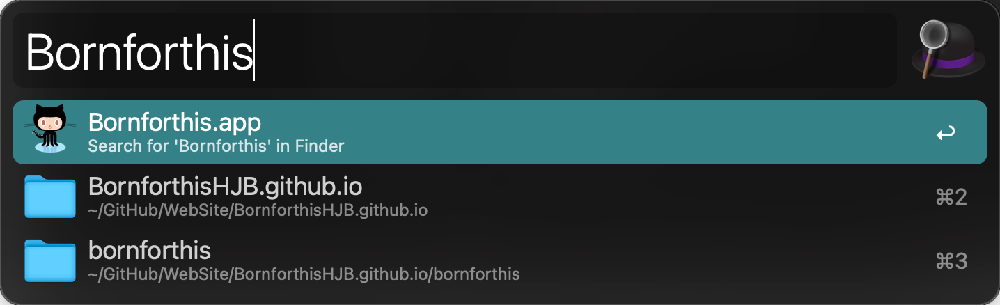

然后就打开了一个 Bornforthis.app：


然后把它固定到 Dock 栏上：

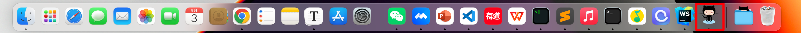

就仿佛拥有了一个 Bornforthis 的客户端，功能与网页一模一样，再也不用在浏览器里面切来切去。而且也不用担心版本更新的问题，因为它就是开了一个独立的网页，网页改版或者更新，内容就随着更新。

是不是很方便呢？

如果你觉得是，那就随着我来了解一下怎样实现吧。

## nativefier

这里需要用到的一个工具，名字叫做 nativefier，是基于 electron 开发的，它的功能就是把任意的网页转成一个电脑客户端，即 Desktop Application。


有了这个软件，把网页转成电脑客户端只需要这么一条简单的命令：

```cmd
nativefier <website>
```

比如把 Whatsapp 的网站打包成一个客户端就只需要执行这样的命令：

```cmd
nativefier web.whatsapp.com
```

示意如下：

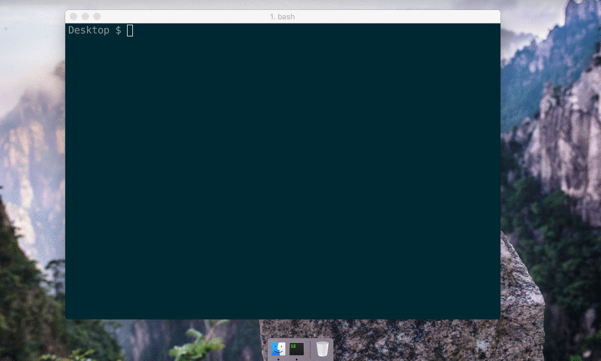

怎样，不论是什么网页，就可以使用它来转换成一个客户端软件。

另外它支持三大操作系统，Windows、Linux、Mac，即用它可以将网页转成 `.exe`、`.app` 等格式。

## Installation 安装

- macOS 10.10+ / Windows / Linux
- [Node.js](https://nodejs.org/) ≥ 12.9 and npm ≥ 6.9

**解析：**

那么这软件究竟具体怎么来使用呢，第一步当然就是安装了。

由于 nativefier 是基于 electron 开发的，而后者又是基于 Node.js 的，所以要使用它必须要安装 Node.js，建议安装 6.0 以上版本。

另外在 Linux 和 Mac 平台可能需要安装其他的依赖。

- 在 Linux 上需要安装 Wine 并配置好环境变量。[https://www.winehq.org/](https://www.winehq.org/)
    - [Wine](https://www.winehq.org/) 从非 Windows 平台构建 Windows 应用程序。确保 `wine` 在您的 `$PATH`。
- 在 Mac 上需要安装 iconutil、imagemagick，这两个依赖是为了帮助程序处理 App 的 icon 的。

具体的安装说明可以参见：[https://github.com/nativefier/nativefier#installation](https://github.com/nativefier/nativefier#installation)。

以上步骤完成之后，使用 npm 安装 nativefier 即可：

```cmd
npm install -g nativefier
```

安装完毕之后便可以使用 nativefier 命令了。

---

下面给部分国外学员，无法看懂中文：

To create an app for medium.com, simply `nativefier 'medium.com'`

Nativefier will try to determine the app name, and well as other options that you can override. For example, to override the name, `nativefier --name 'My Medium App' 'medium.com'`

**Read the [API docs](https://github.com/nativefier/nativefier/blob/master/API.md) or run `nativefier --help`** to learn about command-line flags and configure your app.


## Usage 使用

下面我在 Mac 下以 Bornforthis 为例来介绍下怎样将 Bornforthis 打包成一个客户端软件。

像刚才介绍的一样，最简单直接的，运行下面的命令就好了：

```cmd
nativefier https://bornforthis.cn
```

它会尝试用 Bornforthis 主页的 title 来命名这个客户端：

```cmd
黄家宝  AI悦创
```

所以它会生成这样的一个客户端软件：

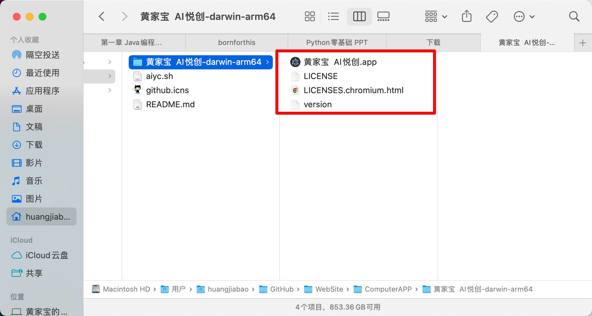

上面的名称不是让我很满意，所以能不能自定义呢？

答案肯定是可以的，让我们来看看如何自定义 app 名称，添加一个 name 参数即可：

```cmd
nativefier --name Bornforthis https://bornforthis.cn
```

这样就会以我们定义的名称生成客户端：

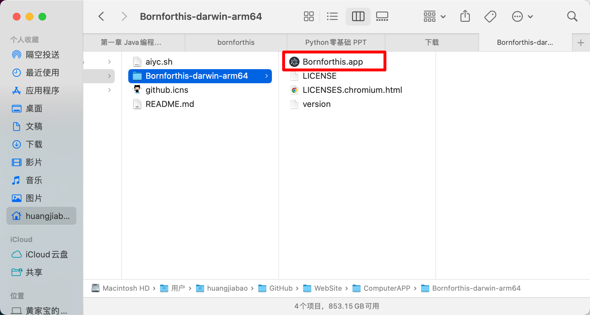

**另外我们可以看到客户端的图标也自动生成了，这个图标怎么来的呢？** 这个是用的 nativefier 维护的 icons。

如果你生成 GitHub 客户端，那恭喜你：恰好 GitHub 在它们的收录范围内，所以就用上了。这些 icons 也是一个公开的 Repository，链接为：[https://github.com/nativefier/nativefier-icons](https://github.com/nativefier/nativefier-icons) ，大家可以到这里搜集或者贡献图标。

如果我们觉得 nativefier 官方提供的图标不好看，想要自定义图标的话，也是可以的，只需要添加一个 icon 参数即可，这样便可以指定本地图片作为图标来生成了。

但值得注意的是，不同平台上要求的图标格式不一样。

- Windows 上需要 ico 格式。
- Linux 上需要 png 格式。
- Mac 上需要 icns 格式，如果安装了上文所需要的依赖，使用 png 格式也是可以的。

具体的参数用法说明可以看：[https://github.com/nativefier/nativefier/blob/master/API.md#icon](https://github.com/nativefier/nativefier/blob/master/API.md#icon) 。

**在上面的生成中，我们发图标是真的丑，所以接下来我自定义一个图标吧！**

我已经在 Mac 上我安装了依赖，那就直接用 png 格式的图标了。

在这里我自己做了一个圆形的图标如下，命名为 bornforthis.png：


然后把图片使用下面的命令就可以自定义图标了：

```cmd
nativefier --name Bornforthis --icon ./bornforthis.png https://bornforthis.cn/
```

这样就能生成自定义图标的客户端软件了。

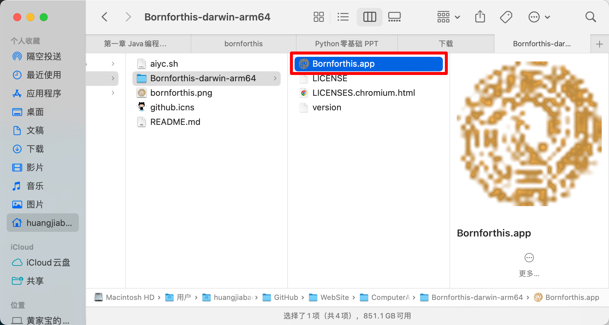

> Logo 有点草率了，不过没事。冲！

打开之后，我们就拥有了一个 Bornforthis 客户端了，界面和网页一模一样，但是已经摆脱了混杂选项卡的干扰，示意如下：


好了，这就是基本的用法，其实大部分情况只需要这几个参数就够了，如果想了解功能大家可以参考官方的 API 文档：[https://github.com/nativefier/nativefier/blob/master/API.md](https://github.com/nativefier/nativefier/blob/master/API.md) 。

如果想要生成其他的客户端，如微信公众平台、知乎、GitHub 、小红书等等都是可以的。

如微信公众平台就是这样的：

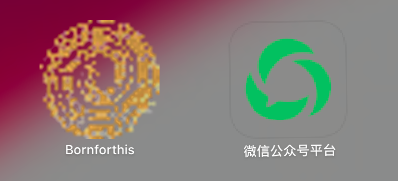


## 注意

在使用过程中我发现 name 参数对中文的支持并不好，总会生成一个 APP 的客户端，在这里推荐 name 使用英文名称，比如知乎用 Zhihu，微信平台用 WXMP 等等。

例如命令：

```
nativefier --name 知乎 --icon ./zhihu.png https://www.zhihu.com
```

可以用下面的命令代替：

```
nativefier --name Zhihu --icon ./zhihu.png https://www.zhihu.com
```

生成客户端软件知乎再手动修改下图标的名称即可。

另外生成的客户端软件是不支持插件的，如果你的站点对某些插件的依赖比较强，那就不建议使用 nativefier 转成的客户端了。

好了，这就是 nativefier 的基本用法，有了它我们就可以随意地将网页转成客户端软件了，快来试试吧！

## 补充：关于图标

如果你发现一些网站图标不好找，这个时候你可以按如下格式拼接并访问，理论上可以解决大部分网站：

```cmd
网站主页链接+favicon.ico
```

比如：

- AI悦创：[https://bornforthis.cn/](https://bornforthis.cn/) + favicon.ico

    - ```link
        https://bornforthis.cn/favicon.ico
        ```

- 小红书：[https://www.xiaohongshu.com/](https://www.xiaohongshu.com/) + favicon.ico

    - ```link
        https://www.xiaohongshu.com/favicon.ico
        ```

- 知乎：[https://www.zhihu.com/](https://www.zhihu.com/) + favicon.ico

    - ```link
        https://www.zhihu.com/favicon.ico
        ```

- 微信公众号：[https://mp.weixin.qq.com/favicon.ico](https://mp.weixin.qq.com/favicon.ico)

那如果你在转微信公众号的时候，不想要这个 favicon.ico：


想要这个：

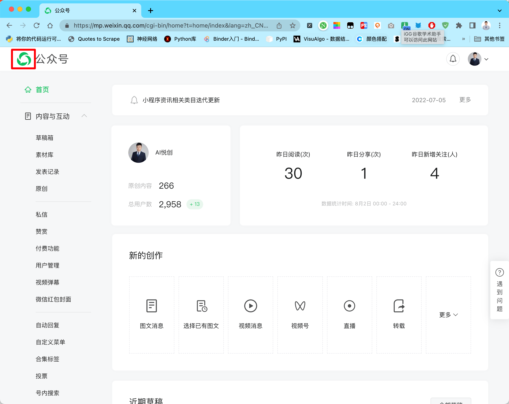

这个时候，还是需要用到浏览器的开发者工具，进行选择。

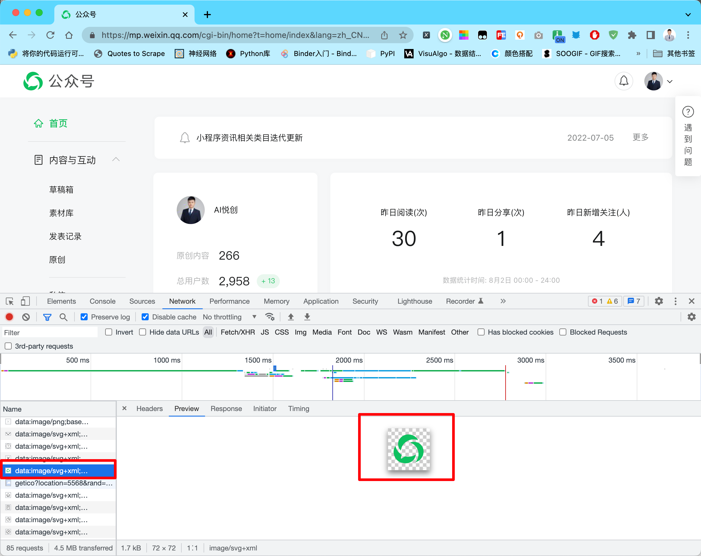

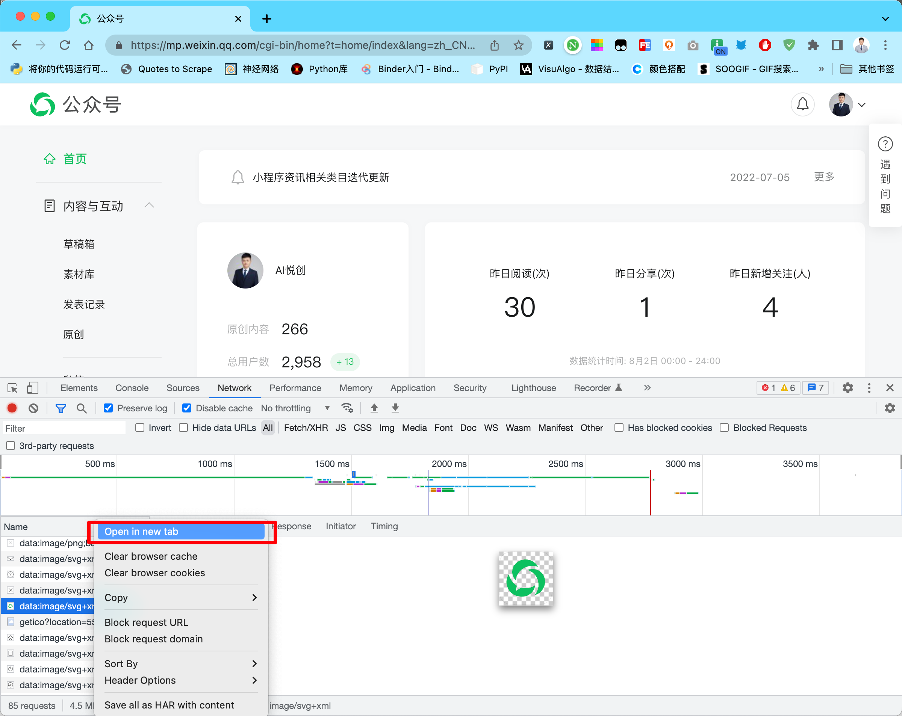

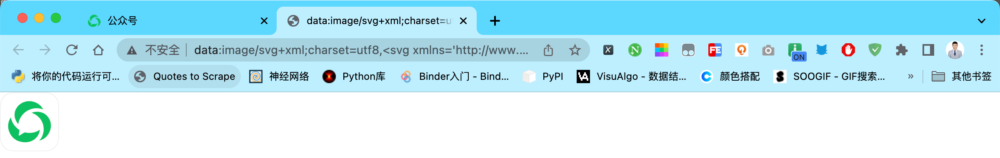


- Windows：Control + S
- MacOS：Command + S

然后将保存的 svg 在线转换 png。

在线 svg 转 png：[https://svgtopng.com/zh/](https://svgtopng.com/zh/)

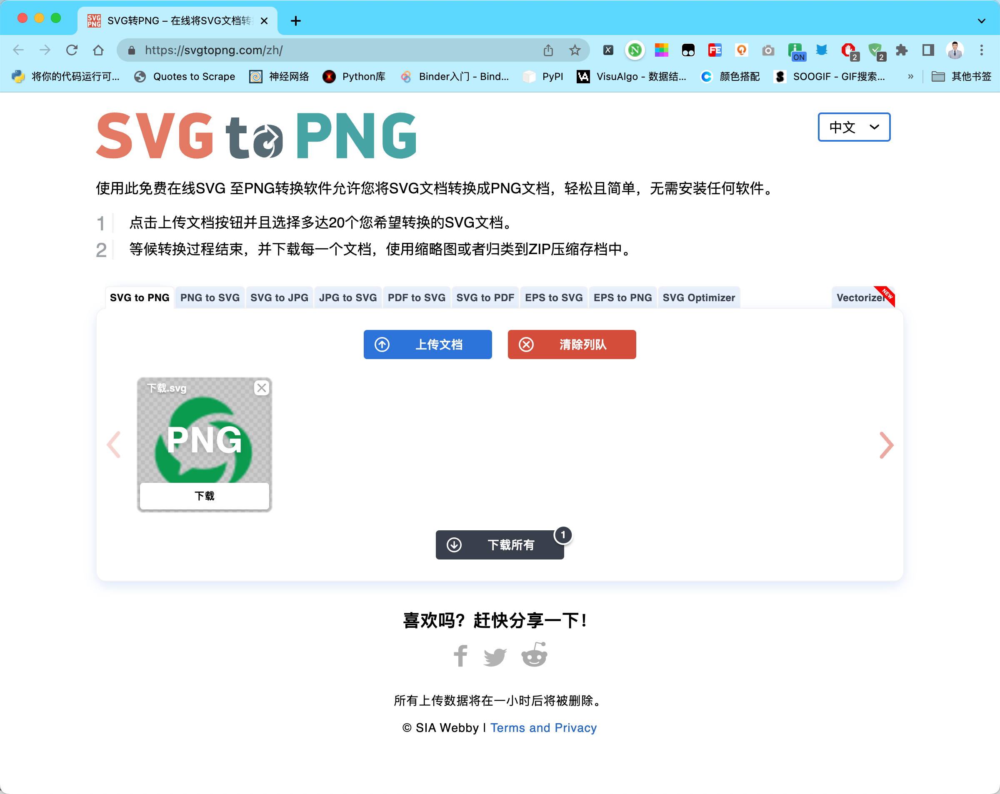

ok，就到这里，bye～

欢迎关注我公众号：AI悦创，有更多更好玩的等你发现！

::: details 公众号：AI悦创【二维码】


:::

::: info AI悦创·编程一对一

AI悦创·推出辅导班啦，包括「Python 语言辅导班、C++ 辅导班、java 辅导班、算法/数据结构辅导班、少儿编程、pygame 游戏开发」，全部都是一对一教学：一对一辅导 + 一对一答疑 + 布置作业 + 项目实践等。当然，还有线下线上摄影课程、Photoshop、Premiere 一对一教学、QQ、微信在线，随时响应！微信：Jiabcdefh

C++ 信息奥赛题解，长期更新！长期招收一对一中小学信息奥赛集训，莆田、厦门地区有机会线下上门，其他地区线上。微信：Jiabcdefh

方法一：[QQ](http://wpa.qq.com/msgrd?v=3&uin=1432803776&site=qq&menu=yes)

方法二：微信：Jiabcdefh

:::


