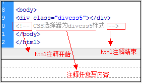

## HTML `<!--...-->` 注释标签

## 标签定义及使用说明

`<!--...-->` 注释标签用来在源文档中插入注释。注释不会在浏览器中显示。

您可使用注释对您的代码进行解释，这样做有助于您在以后的时间对代码的编辑。特别是代码量很大的情况下很有用。

您也可以在注释内容存储针对程序所定制的信息。在这种情况下，这些信息对用户是不可见的，但是对程序来说是可用的。一个好的习惯是把注释或样式元素放入注释文本中，这样就可避免不支持脚本或样式的老浏览器把它们显示为纯文本。

```javascript
<script type="text/javascript">            
<!--             
function displayMsg()                
{                
alert("Hello World!")                
}                
//-->                
</script> 
```



**注释：**命令行最后的两个正斜杠（`//`）是 JavaScript 注释符号。这确保了 JavaScript 不会执行 `-->` 标签。

除了在源文档中有非常明显的作用外，许多 Web 服务器也利用注释来实现文档服务端软件特有的特性。这些服务器可以扫描文档，从传统的 `HTML/XHTML` 注释中找到特定的字符序列，然后再根据嵌在注释中的命令采取相应的动作。这些动作可能是简单的包括其他文件中的文本（即所谓的服务器端包含，`server-inside include`），也可能是复杂地执行其他命令去动态生成文档的内容。

HTML 注释：

```html
<!DOCTYPE html>
<html>
<head>
    <meta charset="utf-8">
    <title>Bornforthis(bornforthis.cn)</title>
</head>
<body>

<!--这是一个注释，注释在浏览器中不会显示-->

    <p>这是一个段落</p>

</body>
</html>
```

可以使用的开发的在线 HTML 直接测试：[https://bornforthis.cn/html_runing/01-1.html](https://bornforthis.cn/html_runing/01-1.html)

## 待更新


