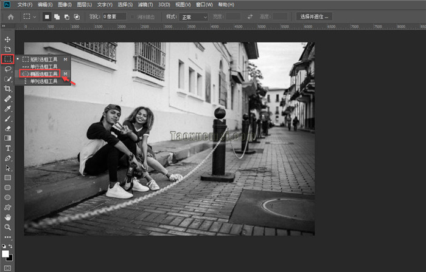

ps 把图片由方形或者矩形制作成圆形的方法有多种，常见的方法是利用椭圆选框工具，绘制出选区，然后建立图层，删除多余的透明区域后，保存为 png 透明背景格式即可，下面通过截图简单说明操作步骤。

1、打开图片之后，右键单击左侧菜单栏上的【矩形选框工具】，弹出的下拉菜单里面，点击选中【椭圆选框工具】，

2、接下来开始绘制圆形区域，如果想要正圆，可以按住 Shift 键，如果想要移动圆形选框的位置，加按【空格键】后，鼠标拖拉选框移动即可，全程不要松开鼠标左键，

3、位置调整好了之后，松开【空格键】，正圆和位置都调整好了之后，先松开鼠标，再松开 Shift，

4、圆形选区建立之后，下一步是建立新的图层，可以在选区范围内单击右键，下拉菜单里面，点击选择【通过拷贝的图层】，或者使用快捷键 Ctrl+J，

5、新建的选区图层，有大面积的透明区域，这些地方需要裁剪掉，

6、点击上端菜单栏上的【图像】，弹出的菜单里面，继续点击【裁切】，弹出的界面上，默认是基于【透明像素】，裁切的位置是【顶、底、左、右】，点击确定，

