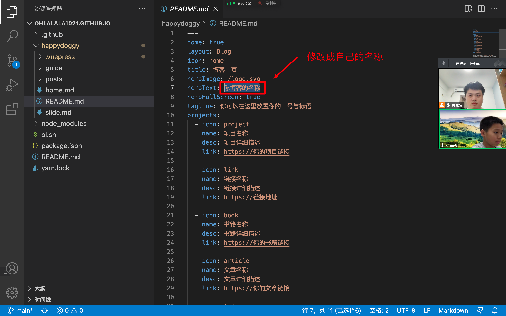
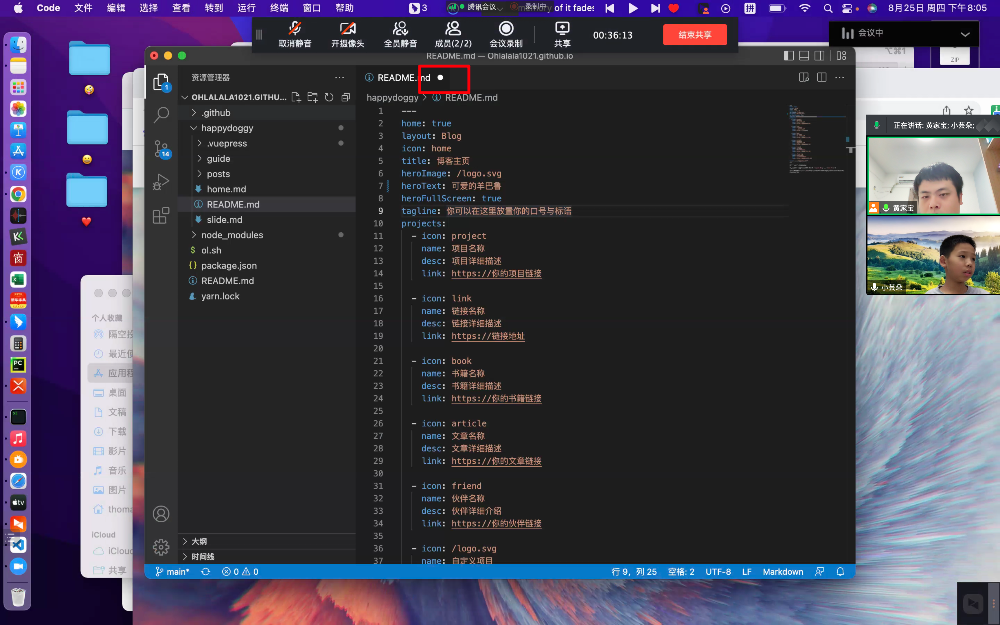
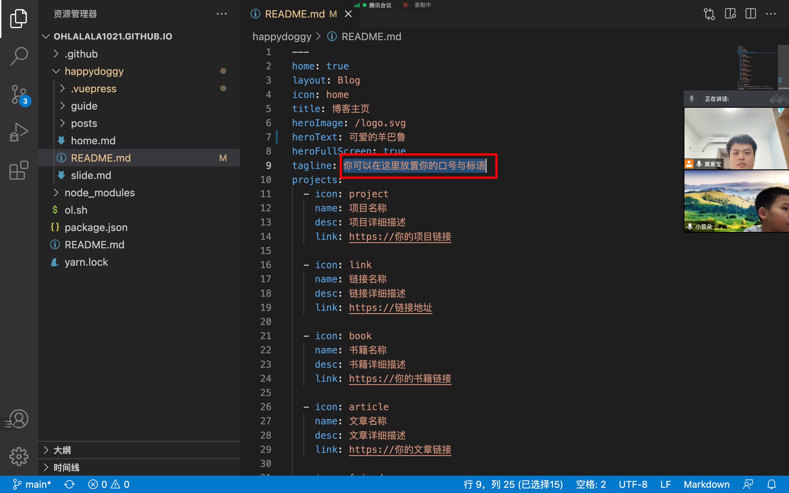
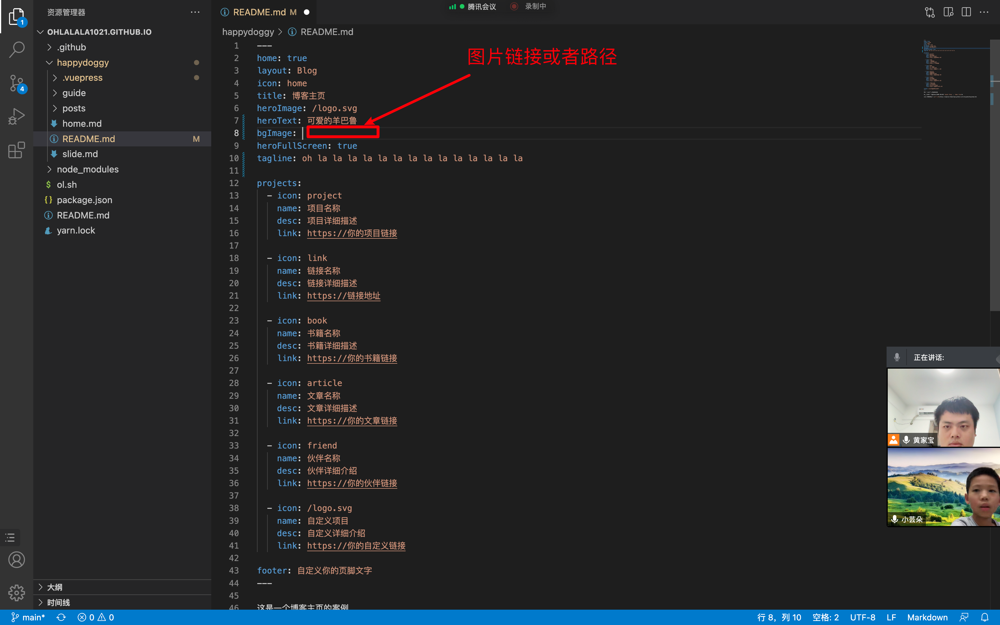
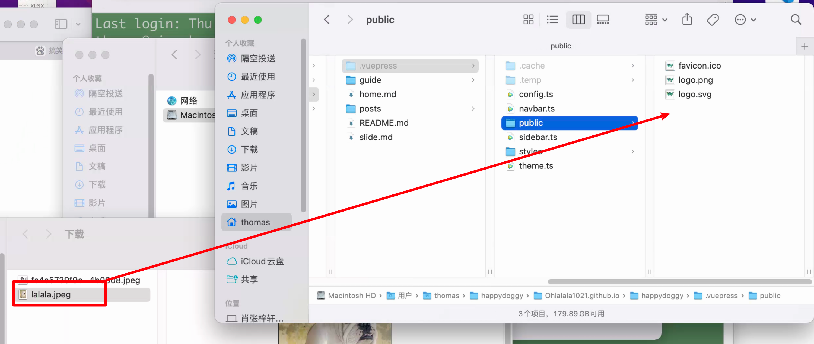

## 1. 进入网站路径

### 1.1 智慧方法

```cmd
cd happydoggy
cd Ohlalala1021.github.io
```

### 1.2 偷懒方法


### 1.3 运行本地运行

```cmd
yarn run docs:dev
```


## 2. 修改

### 2.1 修改博客名称

`happydoggy/README.md`



### 2.2 文件保存

未保存的话会如下显示：



**保存的快捷键：Command+S**


### 2.3 tagline 设置你的口号



```html
tagline: oh la la la la la la la la la la la la la la
```

### 2.4 背景图片

关键词：bgImage



显示隐藏文件：`command + shift + 。`

把图片放到特定路径下：



### 2.5 修改背景 logo


## 3. 把修改的部署上去

```cmd
sh lala.sh
```


## 作业

1. 写一个关于自己
2. 找一个属于自己的头像


## 课后反馈

1. 代码修改后，需要自己去保存；
2. 结束本地服务：Control + C


欢迎关注我公众号：AI悦创，有更多更好玩的等你发现！

::: details 公众号：AI悦创【二维码】


:::

::: info AI悦创·编程一对一

AI悦创·推出辅导班啦，包括「Python 语言辅导班、C++ 辅导班、java 辅导班、算法/数据结构辅导班、少儿编程、pygame 游戏开发」，全部都是一对一教学：一对一辅导 + 一对一答疑 + 布置作业 + 项目实践等。当然，还有线下线上摄影课程、Photoshop、Premiere 一对一教学、QQ、微信在线，随时响应！微信：Jiabcdefh

C++ 信息奥赛题解，长期更新！长期招收一对一中小学信息奥赛集训，莆田、厦门地区有机会线下上门，其他地区线上。微信：Jiabcdefh

方法一：[QQ](http://wpa.qq.com/msgrd?v=3&uin=1432803776&site=qq&menu=yes)

方法二：微信：Jiabcdefh

:::


