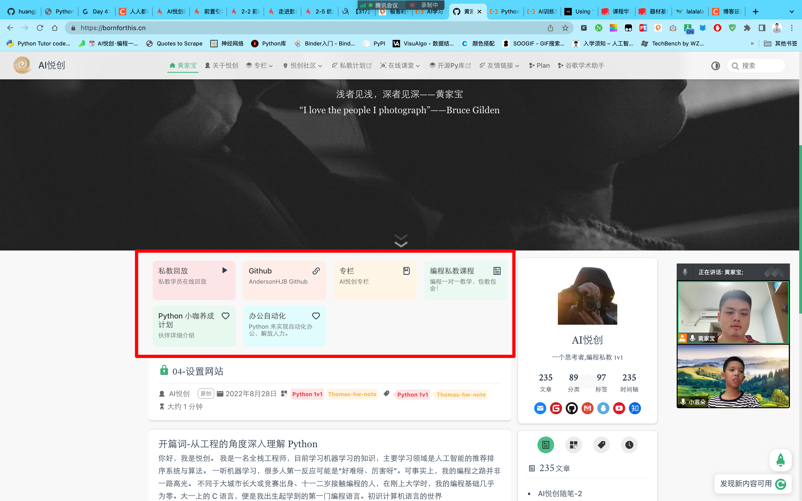

## 1. 购买域名

## 2. 注册 CSDN

利用 CSDN 做图床

Command + A 全选

## 3. 修改背景图片链接

## 4. 删除



README.md>projects

## 5. 修改 footer

## 6. 文章编写的初步操作

```python
title: 你的标题
date: 2022-08-30 19:59:55
author: AI悦创
isOriginal: true
category:
    - Python 1v1
    - Thomas-hw-note
tag:
    - Python 1v1
    - Thomas-hw-note
icon: blog
```

## 7. 文章日期生成

```python
import time  # 引入time模块
# 打印格式化时间
print(time.strftime('%Y-%m-%d %H:%M:%S', time.localtime(time.time())))       # 打印按指定格式排版的时间
```

## 8. 阿里云域名解析

[https://www.thomasxiao.com/](https://www.thomasxiao.com/)


## 作业

1. 把你以往的文章上传上去；
1. 要求：
    1. 文章标题
    1. 文章日期
    1. 文章作者
    1. 分类标签、标签
    1. 都要有


## 课后反馈

1. 忘记进入网站根目录，在根目录启动网站。
1. 修改完要记得保存哦。Command + S
1. 忘记部署命令了哎；
1. Run 经常打错，打成 yun


欢迎关注我公众号：AI悦创，有更多更好玩的等你发现！

::: details 公众号：AI悦创【二维码】


:::

::: info AI悦创·编程一对一

AI悦创·推出辅导班啦，包括「Python 语言辅导班、C++ 辅导班、java 辅导班、算法/数据结构辅导班、少儿编程、pygame 游戏开发」，全部都是一对一教学：一对一辅导 + 一对一答疑 + 布置作业 + 项目实践等。当然，还有线下线上摄影课程、Photoshop、Premiere 一对一教学、QQ、微信在线，随时响应！微信：Jiabcdefh

C++ 信息奥赛题解，长期更新！长期招收一对一中小学信息奥赛集训，莆田、厦门地区有机会线下上门，其他地区线上。微信：Jiabcdefh

方法一：[QQ](http://wpa.qq.com/msgrd?v=3&uin=1432803776&site=qq&menu=yes)

方法二：微信：Jiabcdefh

:::


