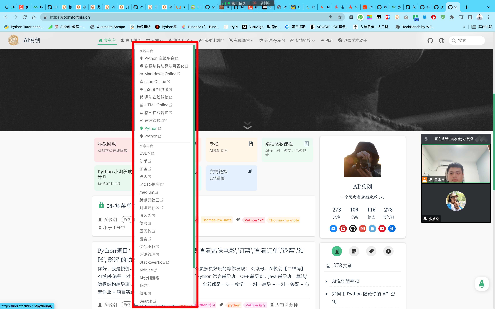
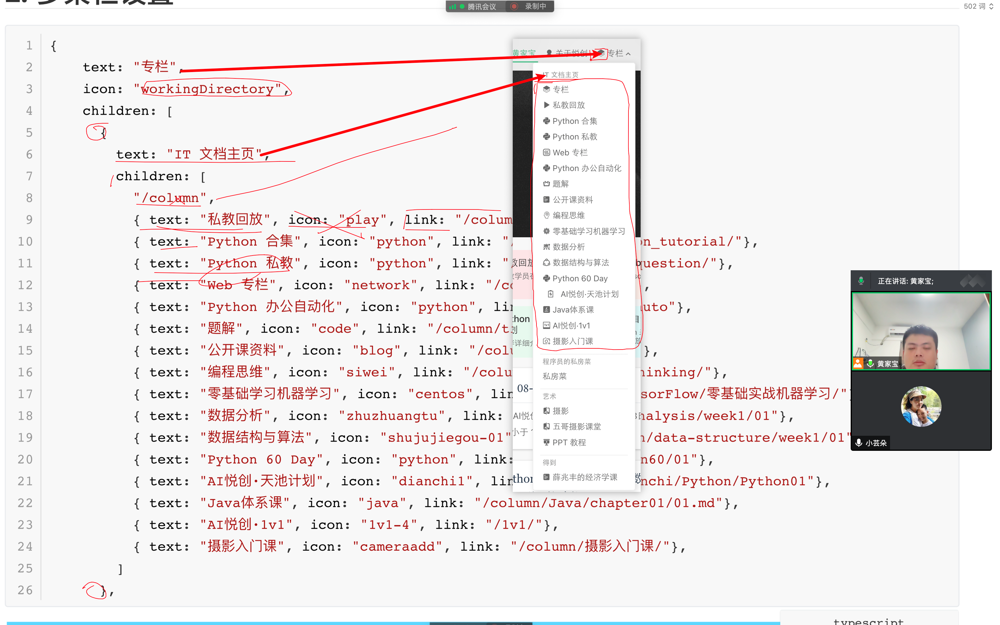

## 1.debug

缺少 `])`。

所有的符号，都是成双成对的。`()` 、`[]`。

## 2. 多菜栏设置

```typescript
{ 
    text: "专栏",
    icon: "workingDirectory",
    children: [
      { 
        text: "IT 文档主页",
        children: [
          "/column",
          { text: "私教回放", icon: "play", link: "/column/playback/"},
          { text: "Python 合集", icon: "python", link: "/column/py/Python_tutorial/"},
          { text: "Python 私教", icon: "python", link: "/column/py/basequestion/"},
          { text: "Web 专栏", icon: "network", link: "/column/web/base"},
          { text: "Python 办公自动化", icon: "python", link: "/column/pyauto"},
          { text: "题解", icon: "code", link: "/column/tijie"},
          { text: "公开课资料", icon: "blog", link: "/column/pyauto/gkk/"},
          { text: "编程思维", icon: "siwei", link: "/column/Programmingthinking/"},
          { text: "零基础学习机器学习", icon: "centos", link: "/column/TensorFlow/零基础实战机器学习/"},
          { text: "数据分析", icon: "zhuzhuangtu", link: "/column/data_analysis/week1/01"},
          { text: "数据结构与算法", icon: "shujujiegou-01", link: "/column/data-structure/week1/01"},
          { text: "Python 60 Day", icon: "python", link: "/column/python60/01"},
          { text: "AI悦创·天池计划", icon: "dianchi1", link: "/column/tianchi/Python/Python01"},
          { text: "Java体系课", icon: "java", link: "/column/Java/chapter01/01.md"},
          { text: "AI悦创·1v1", icon: "1v1-4", link: "/1v1/"},
          { text: "摄影入门课", icon: "cameraadd", link: "/column/摄影入门课/"},
        ]
      },
```





## 作业

1. 
1. 


## 课后反馈

1. 
1. 

欢迎关注我公众号：AI悦创，有更多更好玩的等你发现！

::: details 公众号：AI悦创【二维码】


:::

::: info AI悦创·编程一对一

AI悦创·推出辅导班啦，包括「Python 语言辅导班、C++ 辅导班、java 辅导班、算法/数据结构辅导班、少儿编程、pygame 游戏开发」，全部都是一对一教学：一对一辅导 + 一对一答疑 + 布置作业 + 项目实践等。当然，还有线下线上摄影课程、Photoshop、Premiere 一对一教学、QQ、微信在线，随时响应！微信：Jiabcdefh

C++ 信息奥赛题解，长期更新！长期招收一对一中小学信息奥赛集训，莆田、厦门地区有机会线下上门，其他地区线上。微信：Jiabcdefh

方法一：[QQ](http://wpa.qq.com/msgrd?v=3&uin=1432803776&site=qq&menu=yes)

方法二：微信：Jiabcdefh

:::


