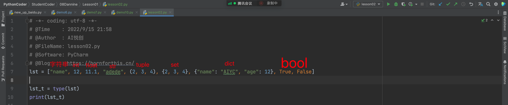

[[toc]]

## 1. Python 有哪些数据类型


## 2. type() 检测数据类型

### 2.1 int

```python
a = 1
print(type(a))

t = type(a)
print(t)
```

输出：

```python
<class 'int'>
<class 'int'>
```


### 2.2 float

```python
a = 2.1
print(type(a))

t = type(a)
print(t)
```

输出：

```python
<class 'float'>
<class 'float'>
```


## 3. 各个数据类型的特点

### 3.1 字符串「str」

```python
s = "aiyuechuang"
print(s)
print(type(s))

s_t = type(s)
print(s_t)
```

输出：

```python
aiyuechuang
<class 'str'>
<class 'str'>
```

**字符串特点**

1. **有序性** ：从左到右是 0 开始，从右到左是 -1 开始
2. **不可变性** ：字符串在被创建出来之后，在 **运行当中，字符串是不可以被改变的。** 非要改变，只能是覆盖「也就是重新赋值」
3. **任意数据类型** ：字符串中可以存放任意的数据类型，int、float、tuple……「你键盘能打入的所有字符，都可以存进去」

### 3.2 列表「list」

```python
lst = ["name", 12, 11.1, "adede", (2, 3, 4), {2, 3, 4}, {"name": "AIYC", "age": 12}, True, False]

lst_t = type(lst)
print(lst_t)
```

输出：

```python
<class 'list'>
```



**列表的特点：**

1. **有序性** ：从左到右是 0 开始，从右到左是 -1 开始


2. **任意数据类型** ：你放进去是什么类型，它还是原本的类型。
3. **可变性** ：列表的内容是可以被修改的「update、修改、查询、、、」

### 3.3 元组「tuple」

```python
tup = (1, 2, "aiyc", [1, 2, 3, 4])

print(type(tup))
```

输出：

```python
<class 'tuple'>
```

**元组的特点：**

1. **有序性** ：从左到右是 0 开始，从右到左是 -1 开始
2. **任意数据类型**
3. **不可变性**

### 3.4 字典「dict」

```python
d = {"name": "Dannie", "age": 18, "Game": "Play"}
print(d)
print(type(d))
```

输出：

```python
{'name': 'Dannie', 'age': 18, 'Game': 'Play'}
<class 'dict'>
```

**字典的特点：**

`{key1: value1, key2: value2, key3: value3}`

1. key：不可变「不可以使用可变的数据类型，[当作字典的 key」](#_3-4-字典「dict」)
    1. list：可以做 key 吗？——不可以，因为，[列表可变](#_3-2-列表「list」)
    2. 数字型可以做 key 吗？——可以，[数字不可变](#_2-1-int)
    3. 元组「tuple」可以做 key 吗？——可以，[元组不可变](#_3-3-元组「tuple」)
    4. 字符串「str」可以做 key 吗？——可以，[字符串不可变](#_3-1-字符串「str」)
    5. 集合「set」可以做 key 吗？——不可以，[集合可变](#_3-5-集合「set」)
    6. 布尔型「bool」可以做 key 吗？——可以，[bool 不可变](#_3-6-布尔型「bool」)
2. value：任意数据类型
3. 可变性


### 3.5 集合「set」

```python
s = {1, 2, 3, 4, 5, 6, 7, 8, "aiyc", "boo", ("1", "asdwdw")}
print(s)
print(type(s))
```

输出：

```python
{1, 2, 3, 4, 5, 6, 7, 8, ('1', 'asdwdw'), 'aiyc', 'boo'}
<class 'set'>
```

**集合的特点：**

1. 集合是没有成对的键对值「key:value」，每一个元素都是 value
2. 确定性：每一个值都是确定的
    1. 集合可以放列表吗？「列表可以做 value 吗？」——不可以，列表可变，所以它不确定
    2. 字典、集合、列表，都不能做集合的 value
3. 互异性：不能相同，相同的会去掉

```python
s = {1, 1, 1, 1, 3, 4, 5}
print(s)
```

输出：

```python
{1, 3, 4, 5}
```

4. 无序性

```python
s = {1, 1, 1, 1, 3, 4, 5, (1, 2, 3), "a", 1.1}
print(s)
```

输出：

```python
{1, 1.1, 3, 4, 5, 'a', (1, 2, 3)}
```

**把列表强制转换成集合**

```python
lst = [1, 1, 1, 2, 3, 4, 5, 6, "a"]
s = set(lst)
print(s)
```

输出：

```python
{1, 2, 3, 4, 5, 6, 'a'}
```


**其他强制转换的特点要自行测试。**

有时候巧妙的运用，可以实现数据去重。

```python
lst = ["aiyc", "aiyc", "Jaden", "Austin", "Dannie"]
print(set(lst))
```

输出：

```python
{'Dannie', 'Jaden', 'aiyc', 'Austin'}
```

### 3.6 布尔型「bool」


## 4. 练习

### 4.1 提取出字典的 key

```python
d = {"name": "Alex", "age": 18, "Dream": True}
```

输出结果：

```python
{"name", "age", "Dream"}
```

**Dannie 的答案：**

```python
d = {"name": "Curtis", "age": 18, "Dream": True}
s = set(d)
print(s)
```


### 4.2 把列表中重复的人名去掉吧

```python
lst = ["Aiyc", "Dannie", "Aiyc", "Alex", "Alex", "Jaden", "Cava", "WilliamQX", "Cody", "Cody"]
```

输出：

```pythn
{'Cava', 'Jaden', 'Cody', 'Dannie', 'WilliamQX', 'Aiyc', 'Alex'}
```

**Dannie 的答案：**

```python
lst = ["Aiyc", "Dannie", "Aiyc", "Alex", "Alex", "Jaden", ]
s = set(lst)
print(s)
```


### 4.3 创建一个字典

| 姓名   | 年龄 | 学历 | 兴趣爱好 |
| ------ | ---- | ---- | -------- |
| 马冬梅 | 18   | 本科 | Python   |

**Dannie 的答案：**

```python
d = {"姓名": "马冬梅", "年龄": 18, "学历": "本科", "兴趣爱好": "Python"}
print(d)
```


### 4.4 把如下表格创建成字典

PS：把对应的关键词调整好

| 名称   | 关键词 |
| ------ | ------ |
| 字典   | int    |
| 数字   | float  |
| 小数   | list   |
| 元组   | tuple  |
| 列表   | str    |
| 布尔型 | dict   |
| 字符串 | bool   |
| 集合   | set    |

**Dannie 的答案：**

```python
d = {"字典": "dict", "数字": "int", "小数": "float", "元组": "tuple", "列表": "lst", "布尔型": "bool", "字符串": "str", "集合": "set"}
print(d)
```

```python
d = {"字典": "dict",
     "数字": "int",
     "小数": "float",
     "元组": "tuple",
     "列表": "lst",
     "布尔型": "bool",
     "字符串": "str",
     "集合": "set"}
print(d)
```


### 4.5 找出下面的错误

```python
lst = [1, 2, 3, 4, 5, "aiyc"
```

> Dannie 的答案：括号没结束✅

```python
lst = [1, 2, 3, 4, 5, aiyc"]
```

> Dannie 的答案：aiyc 没有被引号引起来✅

```python
lst = [1, 2, 3, 4 5, "aiyc"]
```

> Dannie 的答案：4跟5之间没有逗号间隔✅

```python
tup = (1, 2, 3, [1, 2, "aiyc], ("book", "12"))
```

> Dannie 的答案：元组里面不能够有列❌
>
> Dannie 订正的答案：aiyc 里面的引号没有引结束✅

```python
s = 'I am lilei
```

> Dannie 的答案：i am lilei 没有被引号引起来作为 str，✅ 如果是作为集合 set 的话， 应该是使用括号，而不是使用引号。❌

```python
set1 = {1, 2, 3, 4, 4, 5, 6, [2, 3, 4, 5], (2, 3, 4, 5)}
```

> Dannie 的答案：列表不能成为集合里面的数值，列表不能成为集合里面的数值，因为是可变的。✅

```python
set1 = {1, 2, 3, 4, 4, 5, 6, {"name": "aiyc", [1, 2, 3]: "list", "age": 18}, (2, 3, 4, 5)}
```

> Dannie 的答案：【1，2，3】 ❌列表不能成为集合里面数值 ❌   
>
> Dannie 订正的答案：列表不能成为一个字典里面的 key❌✅

```python
s = {1, 2, 3}
set1 = {1, 2, 3, 4, 4, 5, 6, s, (2, 3, 4, 5)}
```

> Dannie 的答案：set 里面不能有 set✅

```python
d = {"name": "aiyc", [1, 2, 3]: "list", "age": 18}
```

> Dannie 的答案：列表不能成为关键词 key✅ 

```python
d = {"list": [1, 2, 3, 4], "tuple": (1, 2, 3, 4), "str": "aiyuechuang"}
```

> Dannie 的答案：这道题是对的 ✅ 

```python
b = true
```

> Dannie 的答案：ture 应该是 Ture✅

```python
b = false
```

> Dannie 的答案：false 应该是 False✅

```python
name = "aiyc"
d = {name: "name", age: 18}
```

> Dannie 的答案：应该是 d={"name": name, "age": 18}❌

**现在是判断，课后要把这些订正成正确答案。并提交给我。**

欢迎关注我公众号：AI悦创，有更多更好玩的等你发现！

::: info AI悦创·编程一对一

AI悦创·推出辅导班啦，包括「Python 语言辅导班、C++ 辅导班、java 辅导班、算法/数据结构辅导班、少儿编程、pygame 游戏开发」，全部都是一对一教学：一对一辅导 + 一对一答疑 + 布置作业 + 项目实践等。当然，还有线下线上摄影课程、Photoshop、Premiere 一对一教学、QQ、微信在线，随时响应！微信：Jiabcdefh

C++ 信息奥赛题解，长期更新！长期招收一对一中小学信息奥赛集训，莆田、厦门地区有机会线下上门，其他地区线上。微信：Jiabcdefh

方法一：[QQ](http://wpa.qq.com/msgrd?v=3&uin=1432803776&site=qq&menu=yes)

方法二：微信：Jiabcdefh

:::
