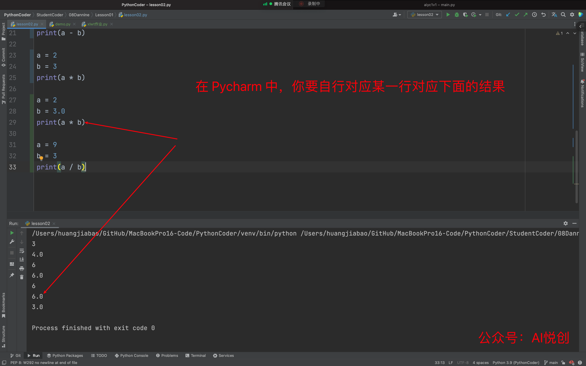
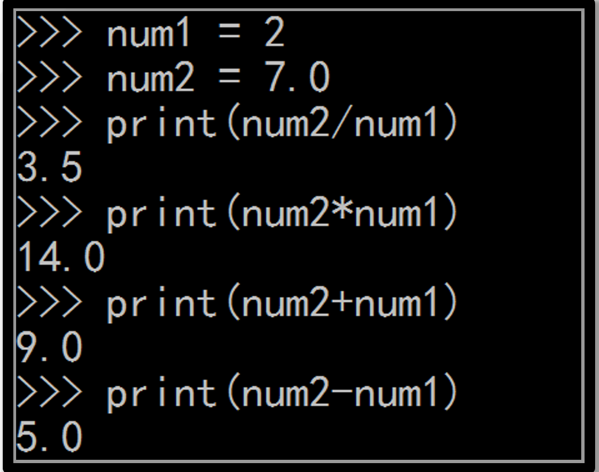
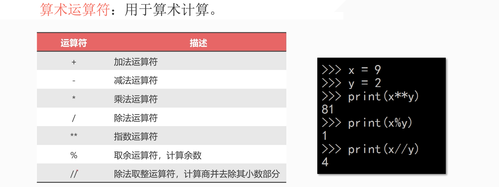
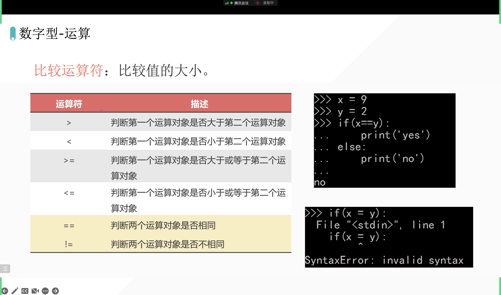
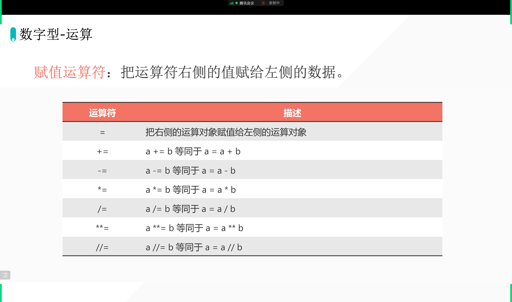

[[toc]]

## 1. 定义

1. int：整数类型
2. float：浮点数类型

## 2. 数字型运算特点

### 2.1 Pycharm 编写

```python
a = 1
b = 3
r = a + b
print(r)

a = 1
b = 3
print(a + b)

print(1 + 3)
```

### 2.2 Ipython 简写

ipython 用于快速测试代码：

```python
In [2]: 1 + 3
Out[2]: 4
```

**没有对比就没有伤害！！！**

### 2.3 Pycharm 编写代码并找规律

```python
a = 1
b = 2
print(a + b)

a = 1
b = 3.0
print(a + b)

a = 9
b = 3
print(a - b)

a = 9.0
b = 3
print(a - b)

a = 2
b = 3
print(a * b)

a = 2
b = 3.0
print(a * b)

a = 9
b = 3
print(a / b)
```

输出：

```python
3
4.0
6
6.0
6
6.0
3.0
```




### 2.4 ipython 编写代码并找规律

```python
In [4]: 1 + 2
Out[4]: 3

In [5]: 1 + 2.0
Out[5]: 3.0

In [6]: 3 - 2
Out[6]: 1

In [7]: 3.0 - 2
Out[7]: 1.0

In [8]: 2 * 3
Out[8]: 6

In [9]: 2 * 3.0
Out[9]: 6.0

In [10]: 9 / 3
Out[10]: 3.0

In [11]:
```

对比性，不言而喻。


### 2.5 结论

- 如果其中有一个数据类型是浮点数，最后的结果就是浮点数
- 除法涉及精度问题，所以最后是浮点数。

### 2.6 自行测试代码



## 3. 运算符




## 4. 20220928 作业

作业连接：[https://bornforthis.cn/column/py/basequestion/special_yunsuanfu.html](https://bornforthis.cn/column/py/basequestion/special_yunsuanfu.html)

### 4.1 Dannie 答案

#### 4.1.1 Q1✅

```python
a=26
b=a//10
print(b)

c=a%10
print(c)

d=b+c
print(d)
```

测试代码:

```python
In [7]: a = 26

In [8]: b = a // 10

In [9]: c = a % 10

In [10]: d = b + c

In [11]: d
Out[11]: 8
```

#### 4.1.2 Q2✅

```python
a=26
b=a//10
print(b)

c=a%10
print(c)

d=b+c
print(d)

e=c*10+b
print(e)
```

测试代码：

```python
In [12]: e = c * 10 + b

In [13]: e
Out[13]: 62
```


#### 4.1.3 Q3✅

```python
a=826
b=a//100
print(b)
c=(a-b*100)//10
print(c)
d=a-(b*100+c*10)
print(d)

e=b*100+d*10+c
print(e)
```

测试代码：

```python
In [14]: a = 826

In [15]: b = a // 100

In [16]: c = a % 100 // 10

In [17]: e = a % 100 % 10

In [18]: b + c + e
Out[18]: 16

In [19]: e * 100 + c * 10 + b
Out[19]: 628
```

## 5. 比较运算符



```python
In [20]: 1 >= 1
Out[20]: True

In [21]: 2 >= 1
Out[21]: True

In [22]: 2 >= 1
Out[22]: True
```

## 6. 赋值运算符



```python
In [24]: a = 1

In [25]: a = a + 10

In [26]: a
Out[26]: 11

In [27]: a += 10 # a = a + 10

In [28]: a
Out[28]: 21
```


欢迎关注我公众号：AI悦创，有更多更好玩的等你发现！

::: info AI悦创·编程一对一

AI悦创·推出辅导班啦，包括「Python 语言辅导班、C++ 辅导班、java 辅导班、算法/数据结构辅导班、少儿编程、pygame 游戏开发」，全部都是一对一教学：一对一辅导 + 一对一答疑 + 布置作业 + 项目实践等。当然，还有线下线上摄影课程、Photoshop、Premiere 一对一教学、QQ、微信在线，随时响应！微信：Jiabcdefh

C++ 信息奥赛题解，长期更新！长期招收一对一中小学信息奥赛集训，莆田、厦门地区有机会线下上门，其他地区线上。微信：Jiabcdefh

方法一：[QQ](http://wpa.qq.com/msgrd?v=3&uin=1432803776&site=qq&menu=yes)

方法二：微信：Jiabcdefh

:::
