[[toc]]

## 1. 字符串定义


## 2. 为什么会有三种创建字符串的方法？

### 2.1 单双引号混用

```python
s = "I'm lilei."  # 单双引号混用
print(s)
```

### 2.2 三个双引号 or 三个单引号「原样输出」

```python
# -*- coding: utf-8 -*-
# @Time    : 2022/9/29 22:57
# @Author  : AI悦创
# @FileName: lesson03.py
# @Software: PyCharm
# @Blog    ：https://bornforthis.cn/
# s = "I'm lilei."  # 单双引号混用
# print(s)
s = "AI悦创·编程一对一AI悦创·推出辅导班啦" \
    "，包括「Python 语言辅导班、C++ 辅导班、java 辅" \
    "导班、算法/数据结构辅导班、少儿编程、pygame 游戏" \
    "开发」，全部都是一对一教学：一对一辅导 + 一对一答疑" \
    " + 布置作业 + 项目实践等。当然，还有线下线上摄影课程、" \
    "Photoshop、Premiere 一对一教学、QQ、微信在线，随时响应" \
    "！微信：JiabcdefhC++ 信息奥赛题解，长期更新！长期招收一" \
    "对一中小学信息奥赛集训，莆田、厦门地区有机会线下上门，其他地" \
    "区线上。微信：Jiabcdefh方法一：QQopen in new window方法" \
    "二：微信：Jiabcdefh\
------\
著作权归黄家宝|AI悦创所有\
原文链接：https://bornforthis.cn/1v1/03-Dannie/10.html"
print(s)
```

输出：

```python
AI悦创·编程一对一AI悦创·推出辅导班啦，包括「Python 语言辅导班、C++ 辅导班、java 辅导班、算法/数据结构辅导班、少儿编程、pygame 游戏开发」，全部都是一对一教学：一对一辅导 + 一对一答疑 + 布置作业 + 项目实践等。当然，还有线下线上摄影课程、Photoshop、Premiere 一对一教学、QQ、微信在线，随时响应！微信：JiabcdefhC++ 信息奥赛题解，长期更新！长期招收一对一中小学信息奥赛集训，莆田、厦门地区有机会线下上门，其他地区线上。微信：Jiabcdefh方法一：QQopen in new window方法二：微信：Jiabcdefh------著作权归黄家宝|AI悦创所有原文链接：https://bornforthis.cn/1v1/03-Dannie/10.html
```

```python
s = """AI悦创·编程一对一AI悦创·推出辅导班啦，
   包括「Python 语言辅导班、C++ 辅导班、java 辅导班、算法/数据结构辅导班、少儿编程、pyg
    ame 游戏开发」，全部都是一对一教学：一对一辅导 + 一对一答疑 + 布置作业 + 项目实践等。当然，还有线下线上摄影课程、Photoshop、Premiere 一对一教学、QQ、微信在线，随时响应！微信：JiabcdefhC++ 信息奥赛题解，长期更新！长期招收一对一中小学信息奥赛集训，莆田、厦门地区有机会线下上门，其他地区线上。微信：Jiabcdefh方法一：QQopen in new window方法二：微信：Jiabcdefh
------
著作权归黄家宝|AI悦创所有
原文链接：https://bornforthis.cn/1v1/03-Dannie/10.html"""
print(s)
```

输出：

```python
AI悦创·编程一对一AI悦创·推出辅导班啦，
   包括「Python 语言辅导班、C++ 辅导班、java 辅导班、算法/数据结构辅导班、少儿编程、pyg
    ame 游戏开发」，全部都是一对一教学：一对一辅导 + 一对一答疑 + 布置作业 + 项目实践等。当然，还有线下线上摄影课程、Photoshop、Premiere 一对一教学、QQ、微信在线，随时响应！微信：JiabcdefhC++ 信息奥赛题解，长期更新！长期招收一对一中小学信息奥赛集训，莆田、厦门地区有机会线下上门，其他地区线上。微信：Jiabcdefh方法一：QQopen in new window方法二：微信：Jiabcdefh
------
著作权归黄家宝|AI悦创所有
原文链接：https://bornforthis.cn/1v1/03-Dannie/10.html
```

### 2.3 代码实操

1. 输出如下结果：

```python
Session was closed
Welcome to Ubuntu 18.04.6 LTS (GNU/Linux 4.15.0-189-generic x86_64)
 
 * Documentation:  https://help.ubuntu.com
 * Management:     https://landscape.canonical.com
 * Support:        https://ubuntu.com/advantage
New release '20.04.5 LTS' available.
Run 'do-release-upgrade' to upgrade to it.
```

#### Dannie 代码

```python
a='''Session was closed
Welcome to Ubuntu 18.04.6 LTS (GNU/Linux 4.15.0-189-generic x86_64)
 
 * Documentation:  https://help.ubuntu.com
 * Management:     https://landscape.canonical.com
 * Support:        https://ubuntu.com/advantage
New release '20.04.5 LTS' available.
Run 'do-release-upgrade' to upgrade to it.'''

print(a)
```

单行输出：

```python
a="Session was closed\
Welcome to Ubuntu 18.04.6 LTS (GNU/Linux 4.15.0-189-generic x86_64)\
\
 * Documentation:  https://help.ubuntu.com\
 * Management:     https://landscape.canonical.com\
 * Support:        https://ubuntu.com/advantage\
New release '20.04.5 LTS' available.\
Run 'do-release-upgrade' to upgrade to it."

print(a)
```

## 3. 获取字符串长度 len


```python
s = "aiyuechuang"
print(len(s))
```

输出：

```python
11
```

## 4. 字符串数据提取


### 4.1 单个字符提取

```python
s = "aiyuechuang"
print(s[0])

select = s[0]
print(select)
```

#### 代码练习

提取字符串中的单个字符：

1. y✅

```python
s="aiyuechuang"
print(s[2])

select=s[2]
print(select)
```

2. u✅

```python
s="aiyuechuang"
print(s[3])

select=s[3]
print(select)
```

3. g✅

```python
s="aiyuechuang"
print(s[-1])

select=s[10]
print(select)
```

```python
print(s[len(s)-1])
```

### 4.2 提取多个数据

```python
s = "aiyuechuang"

# aiy
select = s[0:3]  # 左闭右开「取到 3 的前面一位」
print(select)
```

#### 代码练习

1. aiyu

```python
s="aiyuechuang"
print(s[0:4])
```

2. chuan

```python
s="aiyuechuang"
print(s[5:10])
```

3. ang

```python
s="aiyuechuang"
print(s[8:11])
```

### 4.3 有间隔的提取数据 [start: end: 间隔]

```python
s = "aiyuechuang"

# a y e h a g
select = s[0:len(s):2]
print(select)
```

输出：

```python
ayehag
```

#### 代码练习

1. iucun

```python
s="aiyuechuang"
select=s[1:len(s)-1:2]
print(select)
```

2. ieug

```python
s="aiyuechuang"
select=s[1:len(s):3]
print(select)
```

3. auhn

```python
s="aiyuechuang"
select=s[0:len(s):3]
print(select)
```

### 4.4 如果知道是从开始到结尾的话，开始和结尾可以省略不写

```python
s="aiyuechuang"
select=s[::3]
print(select)
```

### 4.5 字符串倒序

```python
s = "aiyuechuang"

select = s[::-1]
print(select)
```

输出：

```python
gnauhceuyia
```

```python
s = "aiyuechuang"

select = s[-1:-len(s):-1]
print(select)
```

### 4.6 代码练习

**操作目标字符串：**

```python
s = "Dannie Alex Jaden Austin AndersonHJB Cava"
```

1. 提取：`D`

```python
In [4]: s = "Dannie Alex Jaden Austin AndersonHJB Cava"

In [5]: s[0]
Out[5]: 'D'
```

2. 提取：`A`

```python
In [6]: s = "Dannie Alex Jaden Austin AndersonHJB Cava"

In [7]: s[7]
Out[7]: 'A'
```

3. 提取：`Dan`

```python
In [8]: s = "Dannie Alex Jaden Austin AndersonHJB Cava"

In [9]: s[0:3]
Out[9]: 'Dan'
```

4. 提取：`Alex`

```python
In [10]: s = "Dannie Alex Jaden Austin AndersonHJB Cava"

In [11]: s[7:11]
Out[11]: 'Alex'
```

5. 提取偶数下标和奇数下标

```python
In [15]: s = "Dannie Alex Jaden Austin AndersonHJB Cava"

In [16]: s[::2]
Out[16]: 'Dni lxJdnAsi nesnJ aa'

In [17]: s[1::2]
Out[17]: 'aneAe ae utnAdroHBCv'
```

6. 倒序输出

```python
In [19]: s = "Dannie Alex Jaden Austin AndersonHJB Cava"

In [20]: s[::-1]
Out[20]: 'avaC BJHnosrednA nitsuA nedaJ xelA einnaD'
```


#### Dannie 答案

```python
In [2]: a[0]
Out[2]: 'D'

In [3]: a[6]
Out[3]: 'A'

In [4]: a[0:3]
Out[4]: 'Dan'

In [5]: a[6:10]
Out[5]: 'Alex'

In [6]: a[::2]
Out[6]: 'DneAe ae utnAdroHBCv'

In [7]: a[::1]
Out[7]: 'Danie Alex Jaden Austin AndersonHJB Cava'

In [8]: a[::-1]
Out[8]: 'avaC BJHnosrednA nitsuA nedaJ xelA einaD'
```

## 5. 字符串的内置函数

### 5.1 capitalize()

**作用：** 「对字符串开头的第一个单词大写」

#### ipython 实现运行

```python
In [22]: s.capitalize()
Out[22]: 'Dannie'
```

> 字符串本身不能被改变！！！需要得到最后改变的值，则需创建变量

#### pycharm 实现代码

```python
s = "dannie"
new_s = s.capitalize()
print(new_s)
```

输出：

```python
Dannie
```

### 5.2 count()

**作用/功能：** 某个字母或者单词出现的次数

#### ipython 实现

```python
In [23]: s.count("n")
Out[23]: 2
```

#### pycharm 实现

```python
s = "dannie"
count_s = s.count("n")
print(count_s)
```

输出：

```python
2
```

```python
s = "dannieni"
count_s = s.count("ni")
print(count_s)
```

输出：

```python
2
```

### 5.3 startswith()

**功能：** 判断字符串开始是不是所查询的字母或者单词

#### ipython 实现

```python
In [24]: s.startswith("d")
Out[24]: True

In [25]: s.startswith("dnn")
Out[25]: False

In [26]: s.startswith("dann")
Out[26]: True
```

#### pycharm 实现

```python
s = "dannieni"
judge = s.startswith("d")
judge1 = s.startswith("dnn")
judge2 = s.startswith("dann")
print(judge)
print(judge1)
print(judge2)
```

输出：

```python
True
False
True
```

### 提示：ipython 是用上面字符串

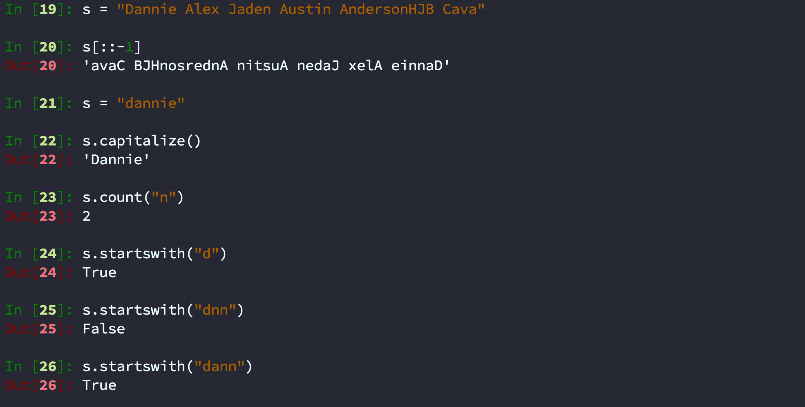

### 5.4 endswith()

**功能：** 判断字符串结尾的字母或者单词

#### ipython 实现

```python
In [27]: s.endswith("n")
Out[27]: False

In [28]: s.endswith("e")
Out[28]: True

In [29]: s.endswith("ie")
Out[29]: True
```

#### pycharm 实现

```python
s = "dannieni"
judge = s.endswith("n")
judge1 = s.endswith("e")
judge2 = s.endswith("ie")
print(judge)
print(judge1)
print(judge2)
```

输出：

```python
False
False
False
```

### 5.5 find()

**功能：** 寻找字符串中第一次出现的下标「字母或者单词都只会返回第一个出现的下标」**如果没有找到的，则返回：-1**

#### ipython 实现

```python
In [34]: s = "Dannie"

In [35]: s.find("D")
Out[35]: 0

In [36]: s.find("a")
Out[36]: 1

In [37]: s.find("n")
Out[37]: 2

In [38]: s.find("ww")
Out[38]: -1

In [39]: s.find("ni")
Out[39]: 3
```

#### pycharm 实现

```python
s = "Dannie"
find_position = s.find("D")
find_position1 = s.find("a")
find_position2 = s.find("n")
find_position3 = s.find("ww")
find_position4 = s.find("ni")
print(find_position)
print(find_position1)
print(find_position2)
print(find_position3)
print(find_position4)
```

输出：

```python
0
1
2
-1
3
```

### 5.6 index()

**功能：** 查找字母或者单词第一个次出现的下标，**如果没找到，则：报错**

#### ipython 实现

```python
In [40]: s = "Dannie"

In [41]: s.index("D")
Out[41]: 0

In [42]: s.index("Dn")
---------------------------------------------------------------------------
ValueError                                Traceback (most recent call last)
<ipython-input-42-96471f4f251a> in <module>
----> 1 s.index("Dn")

ValueError: substring not found

In [43]: s.index("Dn")
---------------------------------------------------------------------------
ValueError                                Traceback (most recent call last)
<ipython-input-43-96471f4f251a> in <module>
----> 1 s.index("Dn")

ValueError: substring not found

In [44]: s.index("Da")
Out[44]: 0
```

#### pycharm 实现

```python
s = "Dannie"
index_position = s.index("D")
# index_position1 = s.index("Dn") # 报错
index_position2 = s.index("Da")

print(index_position)
# print(index_position1)
print(index_position2)
```

输出：

```python
0
0
```

> 之后带你了解 find 与 index 的区别

### 5.7 rfind()

**rfind：** 寻找字符串中，被查询的「字母或单词」最后一次出现的位置。

> Python rfind() 返回字符串最后一次出现的位置，如果没有匹配项则返回 -1。

#### ipython 实现

```python
In [10]: s = "aiyuechuang"

In [11]: s.rfind("a")
Out[11]: 8

In [12]: s.rfind("an")
Out[12]: 8
```

#### pycharm 实现

```python
s = "aiyuechuang"
rfind_position = s.rfind("a")
print(rfind_position)

rfind_position1 = s.rfind("an")
print(rfind_position1)
```

### 5.8 rindex()

`rindex()` 返回子字符串 str 在字符串中最后出现的位置，如果没有匹配的字符串会报异常，你可以指定可选参数 `[beg:end]` 设置查找的区间。

#### ipython 实现

```python
略......
```

#### pycharm 实现

```python
str1 = "this is really a string example....wow!!!"
str2 = "is"

print (str1.rindex(str2))
print (str1.rindex(str2, 10))
```

```python
5
Traceback (most recent call last):
  File "test.py", line 6, in <module>
    print (str1.rindex(str2,10))
ValueError: substring not found
```

**Dannie**

```python
str1="this is really a string example....wow!!!"
str2="is"
print(str1.rindex(str2))
print(str1.rindex(str2,3))  # 就是从第三个字符开始查 is 所在的位置， 所以是第5
```

```python
5
5
```

> 就是从第三个字符开始查 is 所在的位置， 所以是第5

### 5.9 isalpha()

Python isalpha() 方法检测字符串是否只由**字母**或**文字**组成。

```python
#!/usr/bin/python3

str = "bornforthis"
print (str.isalpha())

# 字母和中文文字
str = "bornforthis教程"
print (str.isalpha())

str = "bornforthis example....wow!!!"  # 因为，存在空格、省略号、感叹号，所以最后结果是 False
print (str.isalpha())
```

以上实例输出结果如下：

```python
True
True
False
```

### 5.10 isdigit()

Python isdigit() 方法检测字符串是否只由数字组成。如果字符串只包含数字则返回 True 否则返回 False。

```python
#!/usr/bin/python3

str = "123456";
print (str.isdigit())

str = "bornforthis example....wow!!!"
print (str.isdigit())
```

以上实例输出结果如下：

```python
True
False
```

**isdigit() 方法只对正整数有效，负数及小数均返回不正确。**

```python
# 判断是否为数字
def is_number(s):    
    try:    # 如果能运⾏ float(s) 语句，返回 True（字符串 s 是浮点数）        
        float(s)        
        return True    
    except ValueError:  # ValueError 为 Python 的⼀种标准异常，表⽰"传⼊⽆效的参数"        
        pass  # 如果引发了 ValueError 这种异常，不做任何事情（pass：不做任何事情，⼀般⽤做占位语句）    
    try:        
        import unicodedata  # 处理 ASCII 码的包        
        unicodedata.numeric(s)  # 把⼀个表⽰数字的字符串转换为浮点数返回的函数        
        return True    
    except (TypeError, ValueError):        
        pass    
        return False
 
print(is_number(1))
print(is_number(1.0))
print(is_number(0))
print(is_number(-2))
print(is_number(-2.0))
print(is_number("abc"))
```

输出结果为：

```python
True
True
True
True
True
False
```

### 5.11 join()

Python `join()` 方法用于将序列中的元素以指定的字符连接生成一个新的字符串。返回通过指定字符连接序列中元素后生成的新字符串。

```python
s1 = "-"
s2 = ""
seq = ("b", "o", "r", "n", "f", "o", "r", "t", "h", "i", "s")  # 字符串序列
print(s1.join(seq))
print(s2.join(seq))
```

```python
b-o-r-n-f-o-r-t-h-i-s
bornforthis
```

```python
s1="$"
s2="&"
seq = ["b","o","r","n","f","o","r","t","h","i","s"]
print(s1.join(seq))
print(s2.join(seq))
```

```python
b$o$r$n$f$o$r$t$h$i$s
b&o&r&n&f&o&r&t&h&i&s
```

### 5.12 lower()

Python lower() 方法转换字符串中所有大写字符为小写。返回将字符串中所有大写字符转换为小写后生成的字符串。

以下实例展示了lower()的使用方法：

```python
str1 = "Bornforthis EXAMPLE....WOW!!!"

print(str1.lower())
```

以上实例输出结果如下：

```python
bornforthis example....wow!!!
```

```python
s="DANNIE IS A GOOD GIRL"
print(s.lower())
```


### 5.13 upper()

Python upper() 方法将字符串中的小写字母转为大写字母。返回小写字母转为大写字母的字符串。

以下实例展示了 upper() 函数的使用方法：

```python
str1 = "this is string example from bornforthis....wow!!!";

print ("str1.upper() : ", str1.upper())
```

以上实例输出结果如下：

```python
str1.upper() :  THIS IS STRING EXAMPLE FROM BORNFORTHIS....WOW!!!
```

### 5.14 strip()

Python strip() 方法用于移除字符串头尾指定的字符（默认为空格）或字符序列。

**注意：**该方法只能删除开头或是结尾的字符，不能删除中间部分的字符。

返回值：返回移除字符串头尾指定的字符序列生成的新字符串。

```python
s = "   aiyc    "
new_s = s.strip()
print(new_s)

s = "____aiyc___"
new_s = s.strip("_")
print(new_s)

s = "___ _aiyc_ __"  # 只会去除连续的，不连续的不会去除
new_s = s.strip("_")
print(new_s)
```

```python
aiyc
aiyc
 _aiyc_ 
```


### 5.15 replace()

replace() 方法把字符串中的 old（旧字符串） 替换成 new(新字符串)，如果指定第三个参数max，则替换不超过 max 次。

**replace() 方法语法：**

```python
str.replace(old, new[, max])
```

**参数**

- old -- 将被替换的子字符串。
- new -- 新字符串，用于替换 old 子字符串。
- max -- 可选字符串, 替换不超过 max 次

```python
s = "aiyuechuang"

new_s = s.replace("a", "K", 1)
print(new_s)
```

```python
# 请把 ATGCGGC  变成 CCCCCAA
s = "ATGCGGC"
n = s[::-1]
n = n.replace("G", "C")
n = n.replace("T", "A")
print(n)
```

**Dannie 的答案**

```python
s="ATGCGGC"
new_s1=s[::-1]
print(new_s1)
new_s2=new_s1.replace("G","C")
print(new_s2)
new_s3=new_s2.replace("T","A")
print(new_s3)
```


## 6.字符串不可变性

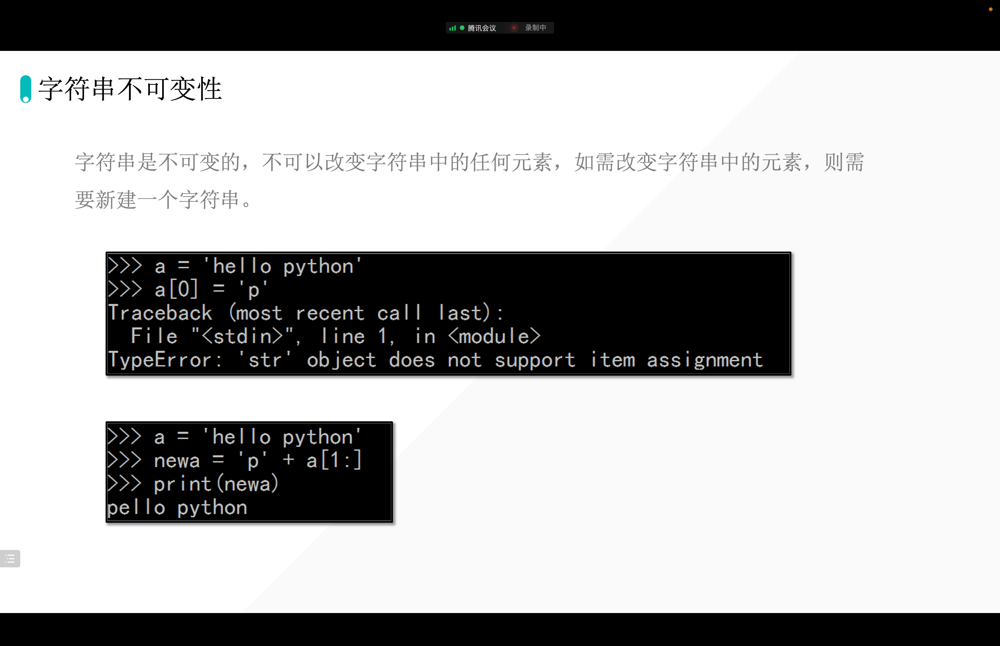

## 7. 字符串的不可变性

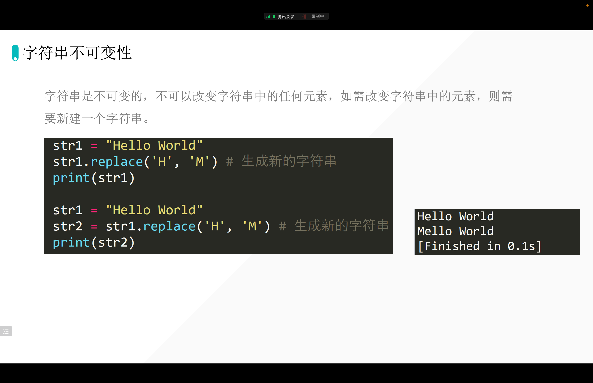

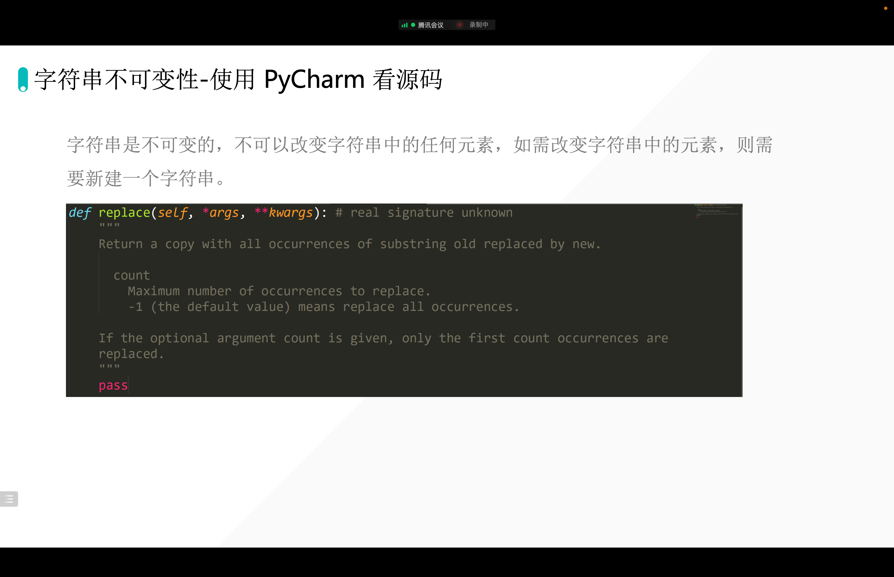

## 8. 字符串的转译

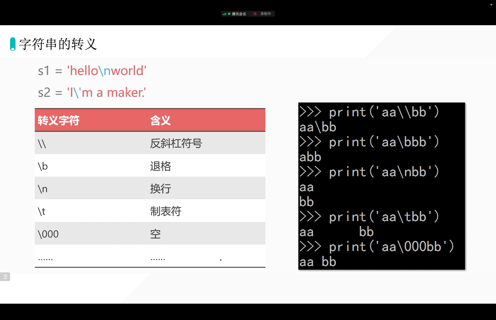

## 9. 字符串的连接

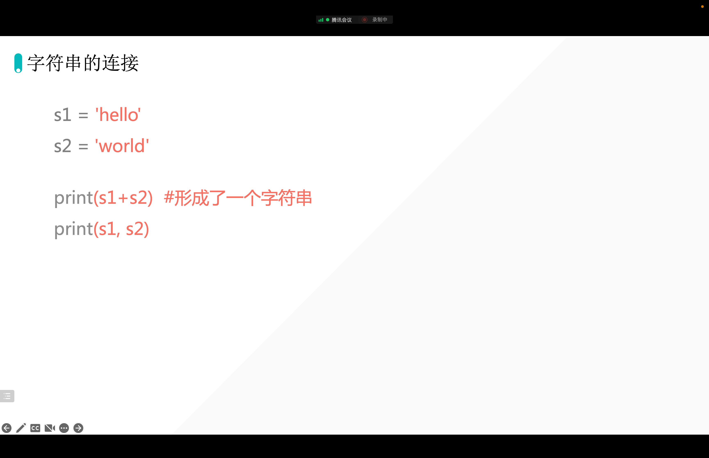


## 10. 用户输入

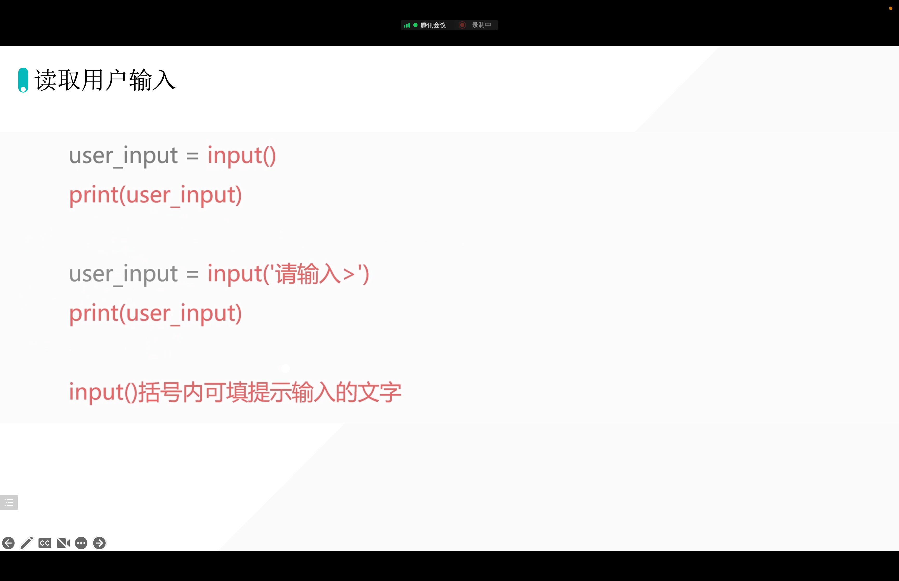

```python
s = input("Please enter name:>>>")
print(s)

print("Please enter name:")
s = input()
```

## 11. input 的特点

```python
In [1]: type(input())
aiyc
Out[1]: str

In [2]: type(input())
191
Out[2]: str

In [3]: type(input())
[1, 2, 3, 4]
Out[3]: str

In [4]: type(input())
(1, 2, 3, 4)
Out[4]: str
```

**input 得到的数据类型都是字符串。**

## 12. eval()

> `s=eval(input(s))` 是把输入的 s 的内容恢复到原来的类型
>
> 例如:
> `s = eval(input())`
> `print(type(s))`
> 输入： [1，2，，3]
> 输出： <class 'list'>

> 特殊情况 ：
> s=eval(input())
> print(type(s))
>
> 输入： “DANNIE"
> 输出： str
>
> 输入： DANNIE
> 输出： DANNIE

```python
In [21]: s=eval(input())
"dannie"

In [22]: type(s)
Out[22]: str
```

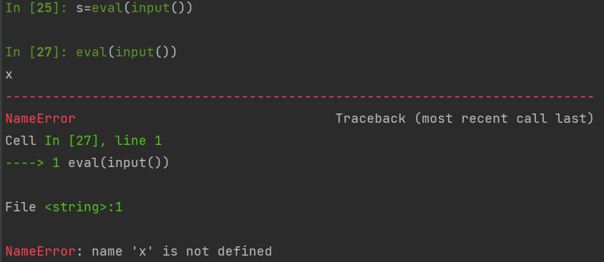


## 13. 强制转换

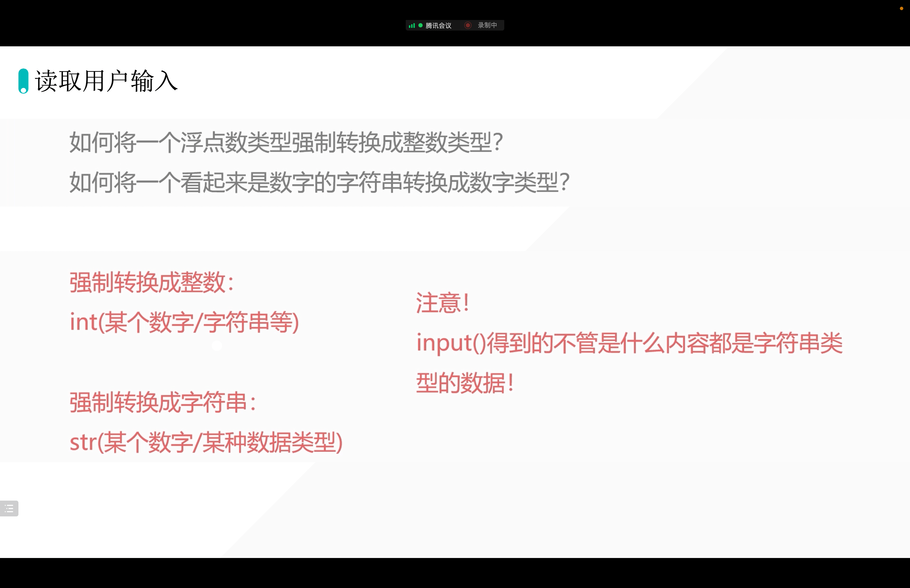

```python
In [31]: s = "12"

In [32]: s + 1
---------------------------------------------------------------------------
TypeError                                 Traceback (most recent call last)
<ipython-input-32-b8bba336fa32> in <module>
----> 1 s + 1

TypeError: must be str, not int

In [33]: int(s) + 1
Out[33]: 13
```

```python
In [34]: s = "19aaa"

In [35]: int(s)
---------------------------------------------------------------------------
ValueError                                Traceback (most recent call last)
<ipython-input-35-2c4720ab420a> in <module>
----> 1 int(s)

ValueError: invalid literal for int() with base 10: '19aaa'

In [36]: s = "1.1"

In [37]: int(s)
---------------------------------------------------------------------------
ValueError                                Traceback (most recent call last)
<ipython-input-37-2c4720ab420a> in <module>
----> 1 int(s)

ValueError: invalid literal for int() with base 10: '1.1'

In [38]: float(s)
Out[38]: 1.1
```

```python
In [29]: s=int(1.1)

In [30]: s1=s+1

In [31]: s1
Out[31]: 2
```

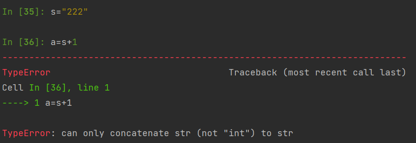

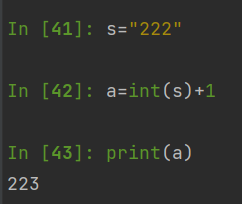


## 14. 作业：创建一个问答式简历生成软件

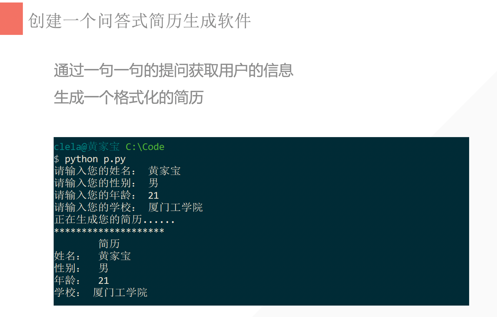

## 15. Dannie 作业

```python
name=input("请输入您的姓名： ")
gender=input("请输入您的性别： ")
age=input("请输入您的年龄： ")
school=input("请输入您的学校： ")
print("正在生成您的简历......")
print("**************************")
print("      简历       ")
print("姓名: ", name)
print("性别： ", gender)
print("年龄： ", age)
print("学校： ", school)
```

## 16. format

### 16.1 一个插入

```python
s="Hi AndersonJHB, Welcome to Beijing."
s1="Hi Dannie, Welcomel to Xiamen."
print(s)
print(s1)

# 每次换个人， 换个地点，都要从新打一次， 就特别繁琐。

# 但是可以用 format 来实现一点简便：

s="Hi {}, Welcome to Beijing.".format("Mason")
print(s)
```

输出： 

```python
Hi Mason, Welcome to Beijing.
```


### 16.2 两个位置

如果这里把地点也设置成 `{}`，也可以这样实现：

```python
s="Hi {}, Welcome to {}.".format("Mason", "Cairns")
print(s)
```

输出： 

```python
Hi Mason, Welcome to Cairns.
```


### 16.3 更像模版？

我直接在这行代码后面 `.format{}` 并没有发挥代码的作用。（并没有发挥 format 的全部优点）

但是如果可以这样 

```python
sample_str="Hi {}, Welcome to {}."

sample1=sample_str.format("Mason", "Cains")
sample2=sample_str.format("Curtis", "Fraser Island")
sample3=sample_str.format("Dannie", "Morington")

print(sample1)
print(sample2)
print(sample3)
```

输出：

```python
Hi Mason, Welcome to Cains.
Hi Curtis, Welcome to Fraser Island.
Hi Dannie, Welcome to Morington.
```

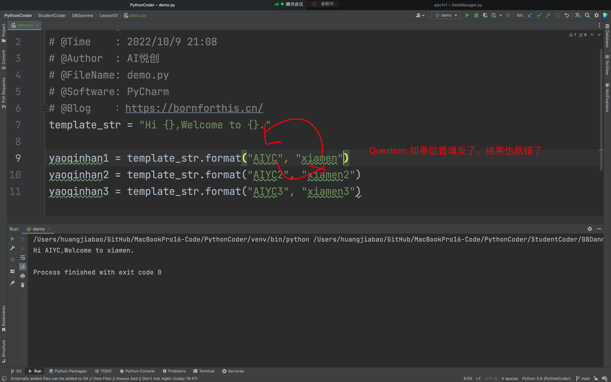

### 16.4 怕位置放反？

因为 Mason 和 Cairns 如果位置发生变化， 那么输出也会发生变化。怎么办呢？

可以这样， 指定名字 name 和 地点 location

比如： 

```python
sample_str="Hi {name}, Welcome to {location}."

sample1=sample_str.format(name="Mason", location="Cains")
print(sample1)
```

输出： Hi Mason, Welcome to Cains.

现在这样， 即使 name 和 location 换了位置， 都不用担心输出会变。

```python
sample_str="Hi {name}, Welcome to {location}."

sample1=sample_str.format(location="Cains", name="Mason")
print(sample1)
```

输出：

```python
Hi Mason, Welcome to Cains.
```


## 17. f

赋值 

```python
name= "Mason"
location= "Cairn"

sample1= f "Hi {name}, Welcome to {location}."
print(sample1)
```

输出： `Hi Mason, Welcome to Cairns.`

注意 ：`sample1= f"Hi {name}, Welcome to {location}."`  这里 有一个 **f** 

## 18. %

```python
# 这里，还可以用一个 %s 来替代。

template_str=f"Hi %s, Welcome to %s."
s=template_str %("Curtis", "Fraser Island")
print(s)

# 输出： Hi Curtis, Welcome to Fraser Island.
```

## 作业优化上节课的作业

```python
print("正在生成您的简历......")
print("**************************")
print("      简历       ")
name="黄家宝"
gender= "男"
age="21"
school="厦门工学院"
print("姓名:{}".format(name))
print("性别{}" .format(gender))
print("年龄：{}".format(age))
print("学校：{}".format(school))
```

```python
###用% 实现
print("正在生成您的简历......")
print("**************************")
print("      简历       ")
name="黄家宝"
gender= "男"
age="21"
school="厦门工学院"
resume=f'''姓名：%s
性别：%s
年龄：%s
学校：%s'''
data=resume %(name,gender,age,school)
print(data)
```

## 19. 保留小数点

- [https://bornforthis.cn/column/py/basequestion/radix_point.html](https://bornforthis.cn/column/py/basequestion/radix_point.html)

这里就是 1.23456 乘以了 1000 之后，被 int 截掉了 ， 变成了  1234， 然后再除以 1000 ， 所以答案 变成 ： 1.234


欢迎关注我公众号：AI悦创，有更多更好玩的等你发现！

::: info AI悦创·编程一对一

AI悦创·推出辅导班啦，包括「Python 语言辅导班、C++ 辅导班、java 辅导班、算法/数据结构辅导班、少儿编程、pygame 游戏开发」，全部都是一对一教学：一对一辅导 + 一对一答疑 + 布置作业 + 项目实践等。当然，还有线下线上摄影课程、Photoshop、Premiere 一对一教学、QQ、微信在线，随时响应！微信：Jiabcdefh

C++ 信息奥赛题解，长期更新！长期招收一对一中小学信息奥赛集训，莆田、厦门地区有机会线下上门，其他地区线上。微信：Jiabcdefh

方法一：[QQ](http://wpa.qq.com/msgrd?v=3&uin=1432803776&site=qq&menu=yes)

方法二：微信：Jiabcdefh

:::
