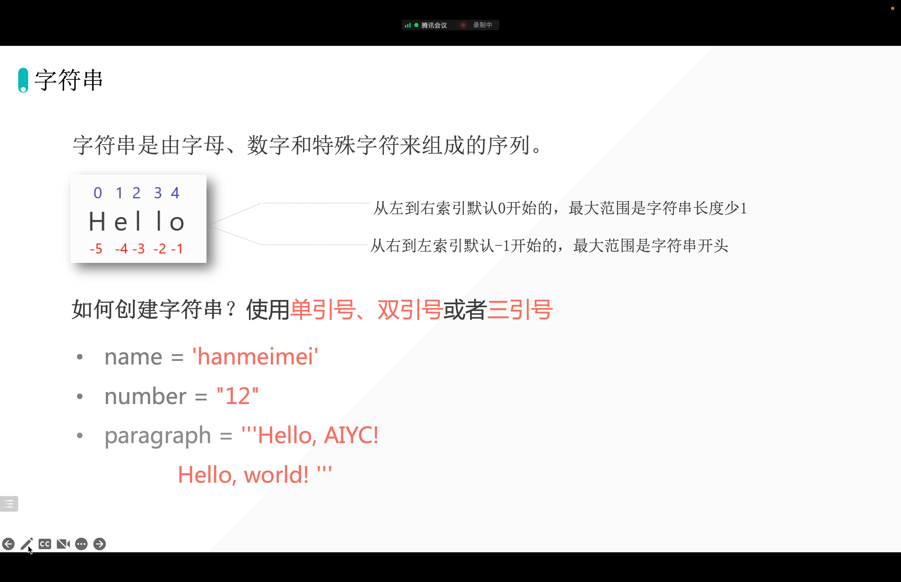
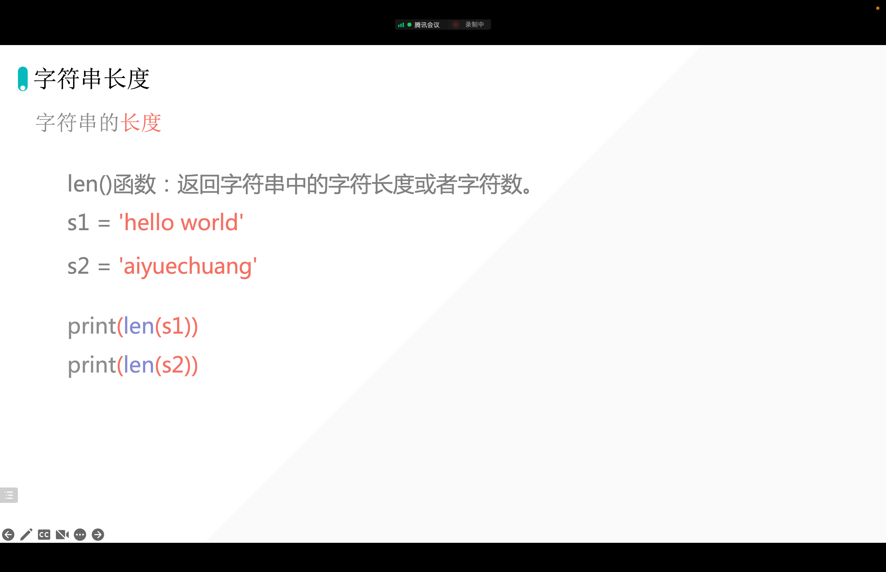
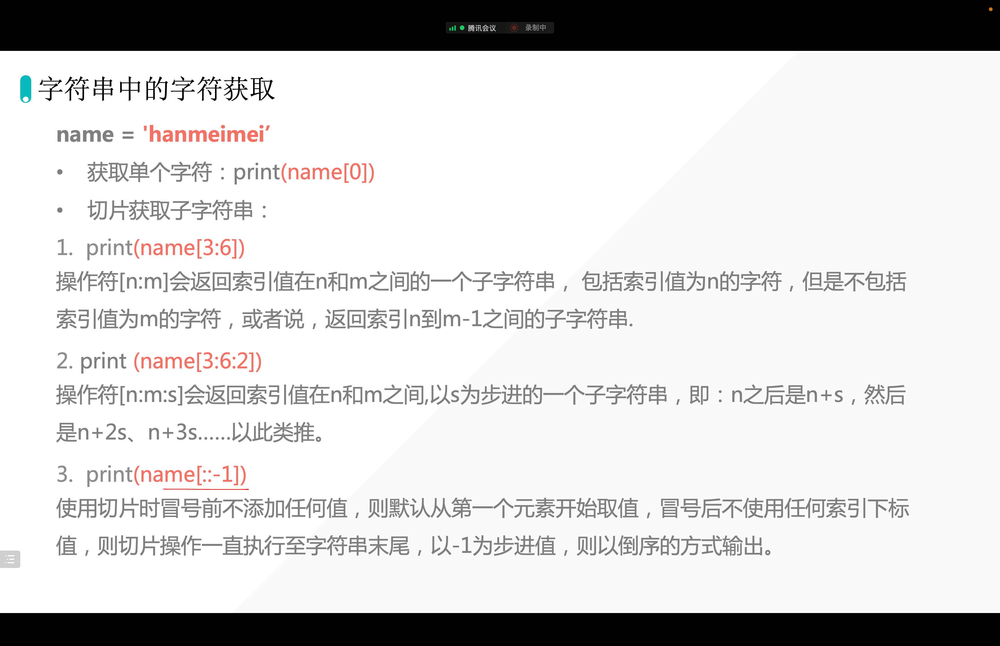

[[toc]]

## 1. 字符串定义



## 2. 为什么会有三种创建字符串的方法？

### 2.1 单双引号混用

```python
s = "I'm lilei."  # 单双引号混用
print(s)
```

### 2.2 三个双引号 or 三个单引号「原样输出」

```python
# -*- coding: utf-8 -*-
# @Time    : 2022/9/29 22:57
# @Author  : AI悦创
# @FileName: lesson03.py
# @Software: PyCharm
# @Blog    ：https://bornforthis.cn/
# s = "I'm lilei."  # 单双引号混用
# print(s)
s = "AI悦创·编程一对一AI悦创·推出辅导班啦" \
    "，包括「Python 语言辅导班、C++ 辅导班、java 辅" \
    "导班、算法/数据结构辅导班、少儿编程、pygame 游戏" \
    "开发」，全部都是一对一教学：一对一辅导 + 一对一答疑" \
    " + 布置作业 + 项目实践等。当然，还有线下线上摄影课程、" \
    "Photoshop、Premiere 一对一教学、QQ、微信在线，随时响应" \
    "！微信：JiabcdefhC++ 信息奥赛题解，长期更新！长期招收一" \
    "对一中小学信息奥赛集训，莆田、厦门地区有机会线下上门，其他地" \
    "区线上。微信：Jiabcdefh方法一：QQopen in new window方法" \
    "二：微信：Jiabcdefh\
------\
著作权归黄家宝|AI悦创所有\
原文链接：https://bornforthis.cn/1v1/03-Dannie/10.html"
print(s)
```

输出：

```python
AI悦创·编程一对一AI悦创·推出辅导班啦，包括「Python 语言辅导班、C++ 辅导班、java 辅导班、算法/数据结构辅导班、少儿编程、pygame 游戏开发」，全部都是一对一教学：一对一辅导 + 一对一答疑 + 布置作业 + 项目实践等。当然，还有线下线上摄影课程、Photoshop、Premiere 一对一教学、QQ、微信在线，随时响应！微信：JiabcdefhC++ 信息奥赛题解，长期更新！长期招收一对一中小学信息奥赛集训，莆田、厦门地区有机会线下上门，其他地区线上。微信：Jiabcdefh方法一：QQopen in new window方法二：微信：Jiabcdefh------著作权归黄家宝|AI悦创所有原文链接：https://bornforthis.cn/1v1/03-Dannie/10.html
```

```python
s = """AI悦创·编程一对一AI悦创·推出辅导班啦，
   包括「Python 语言辅导班、C++ 辅导班、java 辅导班、算法/数据结构辅导班、少儿编程、pyg
    ame 游戏开发」，全部都是一对一教学：一对一辅导 + 一对一答疑 + 布置作业 + 项目实践等。当然，还有线下线上摄影课程、Photoshop、Premiere 一对一教学、QQ、微信在线，随时响应！微信：JiabcdefhC++ 信息奥赛题解，长期更新！长期招收一对一中小学信息奥赛集训，莆田、厦门地区有机会线下上门，其他地区线上。微信：Jiabcdefh方法一：QQopen in new window方法二：微信：Jiabcdefh
------
著作权归黄家宝|AI悦创所有
原文链接：https://bornforthis.cn/1v1/03-Dannie/10.html"""
print(s)
```

输出：

```python
AI悦创·编程一对一AI悦创·推出辅导班啦，
   包括「Python 语言辅导班、C++ 辅导班、java 辅导班、算法/数据结构辅导班、少儿编程、pyg
    ame 游戏开发」，全部都是一对一教学：一对一辅导 + 一对一答疑 + 布置作业 + 项目实践等。当然，还有线下线上摄影课程、Photoshop、Premiere 一对一教学、QQ、微信在线，随时响应！微信：JiabcdefhC++ 信息奥赛题解，长期更新！长期招收一对一中小学信息奥赛集训，莆田、厦门地区有机会线下上门，其他地区线上。微信：Jiabcdefh方法一：QQopen in new window方法二：微信：Jiabcdefh
------
著作权归黄家宝|AI悦创所有
原文链接：https://bornforthis.cn/1v1/03-Dannie/10.html
```

### 2.3 代码实操

1. 输出如下结果：

```python
Session was closed
Welcome to Ubuntu 18.04.6 LTS (GNU/Linux 4.15.0-189-generic x86_64)
 
 * Documentation:  https://help.ubuntu.com
 * Management:     https://landscape.canonical.com
 * Support:        https://ubuntu.com/advantage
New release '20.04.5 LTS' available.
Run 'do-release-upgrade' to upgrade to it.
```

#### Dannie 代码

```python
a='''Session was closed
Welcome to Ubuntu 18.04.6 LTS (GNU/Linux 4.15.0-189-generic x86_64)
 
 * Documentation:  https://help.ubuntu.com
 * Management:     https://landscape.canonical.com
 * Support:        https://ubuntu.com/advantage
New release '20.04.5 LTS' available.
Run 'do-release-upgrade' to upgrade to it.'''

print(a)
```

单行输出：

```python
a="Session was closed\
Welcome to Ubuntu 18.04.6 LTS (GNU/Linux 4.15.0-189-generic x86_64)\
\
 * Documentation:  https://help.ubuntu.com\
 * Management:     https://landscape.canonical.com\
 * Support:        https://ubuntu.com/advantage\
New release '20.04.5 LTS' available.\
Run 'do-release-upgrade' to upgrade to it."

print(a)
```

## 3. 获取字符串长度 len



```python
s = "aiyuechuang"
print(len(s))
```

输出：

```python
11
```

## 4. 字符串数据提取



### 4.1 单个字符提取

```python
s = "aiyuechuang"
print(s[0])

select = s[0]
print(select)
```

#### 代码练习

提取字符串中的单个字符：

1. y✅

```python
s="aiyuechuang"
print(s[2])

select=s[2]
print(select)
```

2. u✅

```python
s="aiyuechuang"
print(s[3])

select=s[3]
print(select)
```

3. g✅

```python
s="aiyuechuang"
print(s[-1])

select=s[10]
print(select)
```

```python
print(s[len(s)-1])
```

### 4.2 提取多个数据

```python
s = "aiyuechuang"

# aiy
select = s[0:3]  # 左闭右开「取到 3 的前面一位」
print(select)
```

#### 代码练习

1. aiyu

```python
s="aiyuechuang"
print(s[0:4])
```

2. chuan

```python
s="aiyuechuang"
print(s[5:10])
```

3. ang

```python
s="aiyuechuang"
print(s[8:11])
```

### 4.3 有间隔的提取数据 [start: end: 间隔]

```python
s = "aiyuechuang"

# a y e h a g
select = s[0:len(s):2]
print(select)
```

输出：

```python
ayehag
```

#### 代码练习

1. iucun

```python
s="aiyuechuang"
select=s[1:len(s)-1:2]
print(select)
```

2. ieug

```python
s="aiyuechuang"
select=s[1:len(s):3]
print(select)
```

3. auhn

```python
s="aiyuechuang"
select=s[0:len(s):3]
print(select)
```

### 4.4 如果知道是从开始到结尾的话，开始和结尾可以省略不写

```python
s="aiyuechuang"
select=s[::3]
print(select)
```

### 4.5 字符串倒序

```python
s = "aiyuechuang"

select = s[::-1]
print(select)
```

输出：

```python
gnauhceuyia
```

```python
s = "aiyuechuang"

select = s[-1:-len(s):-1]
print(select)
```

欢迎关注我公众号：AI悦创，有更多更好玩的等你发现！

::: info AI悦创·编程一对一

AI悦创·推出辅导班啦，包括「Python 语言辅导班、C++ 辅导班、java 辅导班、算法/数据结构辅导班、少儿编程、pygame 游戏开发」，全部都是一对一教学：一对一辅导 + 一对一答疑 + 布置作业 + 项目实践等。当然，还有线下线上摄影课程、Photoshop、Premiere 一对一教学、QQ、微信在线，随时响应！微信：Jiabcdefh

C++ 信息奥赛题解，长期更新！长期招收一对一中小学信息奥赛集训，莆田、厦门地区有机会线下上门，其他地区线上。微信：Jiabcdefh

方法一：[QQ](http://wpa.qq.com/msgrd?v=3&uin=1432803776&site=qq&menu=yes)

方法二：微信：Jiabcdefh

:::
