[[toc]]

## 列表结构

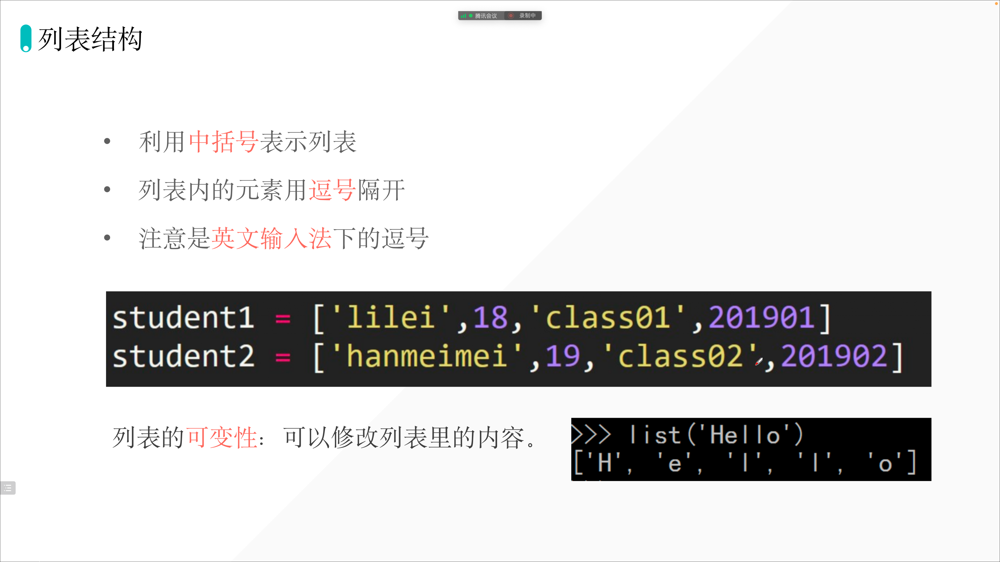

```python
In [82]: s = "aiyc"

In [83]: s_to_list = list(s)

In [84]: print(s_to_list)
['a', 'i', 'y', 'c']
```

## 获取列表中的某个元素


列表提取后， 可以直接相加, 例如：

```python
grade=[98,99,95,80]
print(grade[0]+grade[-1])
```

输出： 178

但是 字符串， 提取后， 不能相加

## 获取列表中连续的几个元素

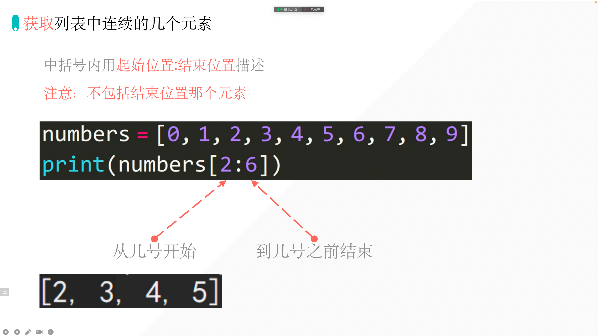

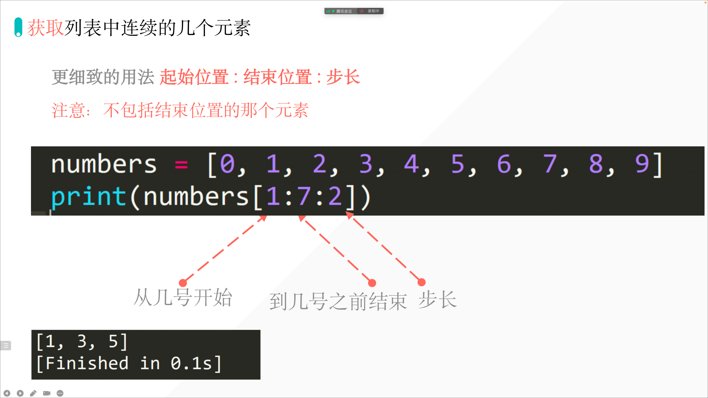

## 列表的切片赋值

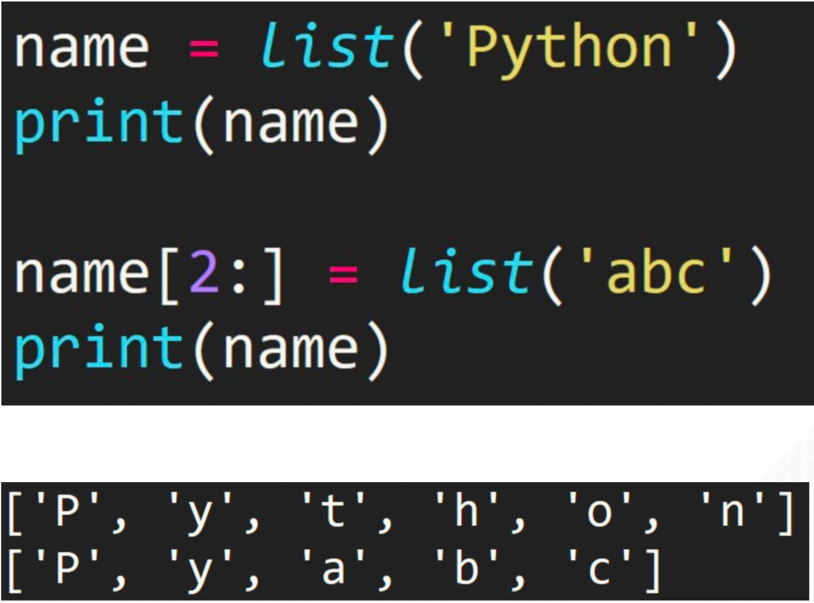

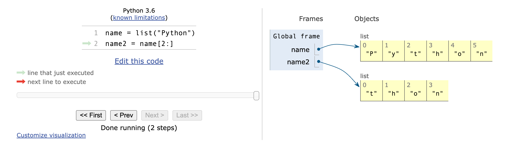


**列表被切片后，重新赋值， 新赋值的数据位置和最原始的列表数据位置不一样了。**

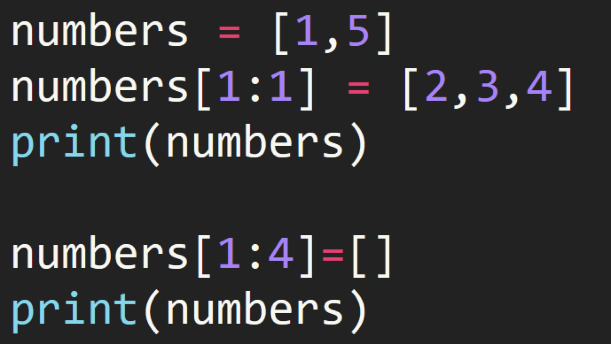

```python
numbers=[1,5]
print(numbers[1:1])
```

输出： `[]`  ---输出为空， 因为指示列的1号位置， 直至列的最后前一位， 所以不是5， 也不是1 ， 是 5和1之间。 所以为空

```python
# 例子二：

numbers=[1,5]
numbers[1:1]=[2,3,4]
print(numbers)

# 输出： [1, 2, 3, 4, 5]
```

```python
# 例子三：

numbers=[1,5]
numbers[1:4]=[]
print(numbers)

# 输出：[1]----因为 numbers[1:4] 数值不存在， 而且赋值为空， 也就是 numbers[1:5] 的1 之后被赋值为空。 所以 print (numbers) 只有 数值 [1]
```

```python
# 例子四：
numbers=[1,2,3,4,5,5]
numbers[1:5]=[]
print(numbers)
# 输出： [1, 5]  ---因为 1：5 号位置指示的是 列别i[1,2,3,4,5,5] 中的 2，3，4，5 为 空， 所以列表只剩下 ： [1, 5]
```

## 列表的长度「list length」

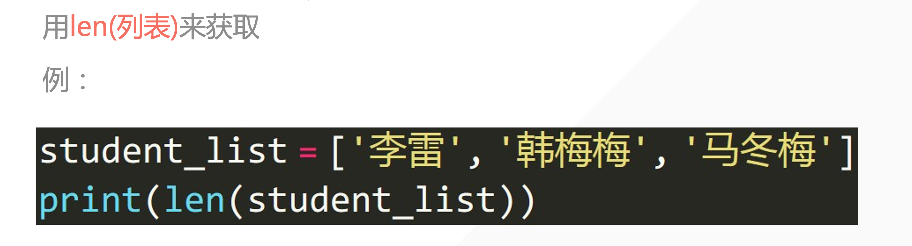

## 修改列表中的元素

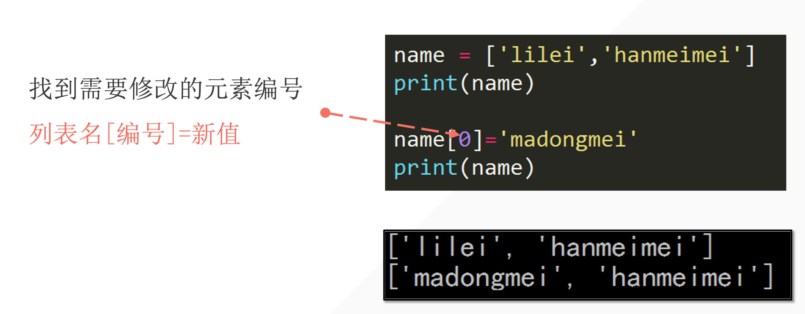

```python
numbers=[1,2,3,4,5,5]
numbers[0]='D'
print(numbers)
# 输出： ['D', 2, 3, 4, 5, 5]
```

## 向列表添加元素「append」

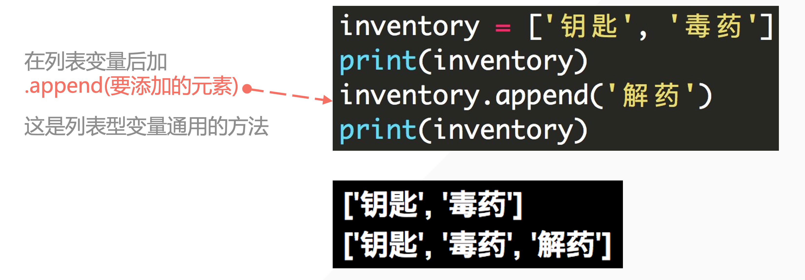

```python
In [28]: lst = [1, 2, 3, 4, 5]

In [29]: lst.append(101010101010100110)

In [30]: lst
Out[30]: [1, 2, 3, 4, 5, 101010101010100110]
```

**默认从原列表的最后添加元素。**

## 删除列表中的元素「del」

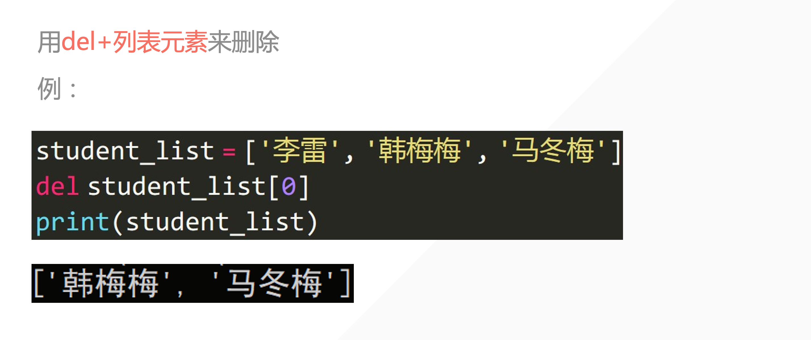

**del 是所有数据类型通用的，如果要删除某个数据类型中的特定数据，则需要该数据类型可以改变。另一种情况是：删除整个数据，那就无需区分是何种数据类型了。**

```python
numbers=['钥匙','毒药','解药']
del numbers[2]
print(numbers)
```

输出： ['钥匙', '毒药']

**后半句话：**

如果不指定删除特定数据，则删除整个变量。

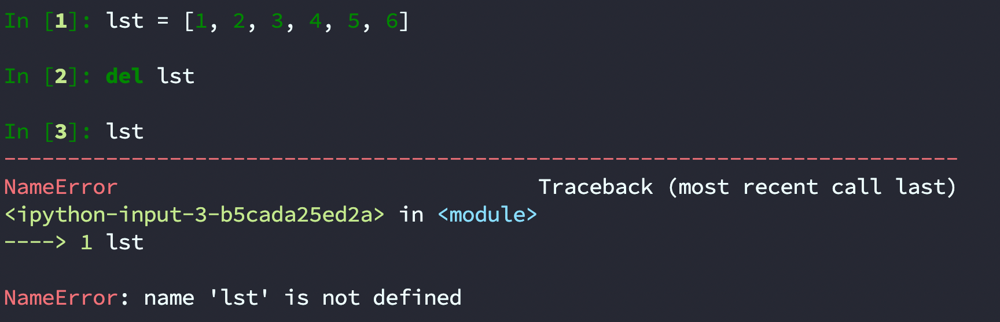

```python
# 例子 ：
numbers=['钥匙',{1,2,3},'解药']
print(numbers)
del numbers[1]
print(numbers)
```

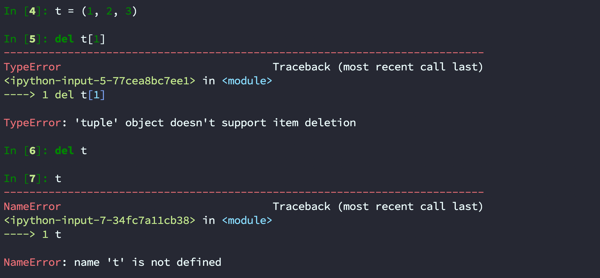

```python
# 例子  : 元组不可变， 所以当整个数值是 元组的时候， 是删除不了元组内特定元素。例如：

numbers=(1,2,3,4,5)
print(numbers)
del numbers [1]
print(numbers)

# 输出： 
```

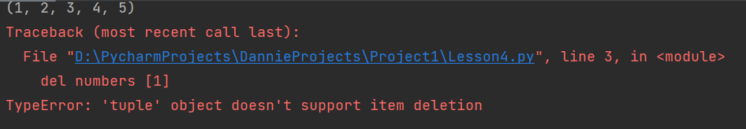

**但是 你可以 删除整个元组**

**del numbers 是可以的。**

**但是 del numbers [2]是不可以的。**


## clear() 「清空列表」

```python
In [1]: lst = [1, 2, 3, 4, 5]

In [2]: lst.clear() # 清空列表

In [3]: lst
Out[3]: []
```


## count() 「统计元素出现的次数」

```python
In [4]: lst = [1, 2, 3, 4, 5]

In [5]: lst.count(1) # 统计 1 出现的次数
Out[5]: 1

In [6]: lst = [1, 2, 3, 4, 5, 1, 1, 1, 1]

In [7]: lst.count(1) # 统计 1 出现的次数
Out[7]: 5

In [8]: lst = ["a", "a", "b", 3, 4, 3]

In [9]: lst.count("a")
Out[9]: 2

In [10]: lst.count("as")
Out[10]: 0
```


## index() 「寻找元素第一次出现的下标」

```python
In [12]: lst = ["a", "a", "b", 3, 4, 3]

In [13]: lst.index("a")  # 寻找 "a" 第一次出现的位置「下标」
Out[13]: 0

In [14]: lst.index("aaa")
---------------------------------------------------------------------------
ValueError                                Traceback (most recent call last)
<ipython-input-14-19704ea32973> in <module>
----> 1 lst.index("aaa")

ValueError: 'aaa' is not in list
```


## insert() 「insert 在特定位置插入元素」

```python
In [15]: lst = ["a", "a", "b", 3, 4, 3]

In [16]: lst.insert(1, "Dannie")  # insert 在特定位置插入元素，在 1 号位，插入 "Dannie"

In [17]: lst
Out[17]: ['a', 'Dannie', 'a', 'b', 3, 4, 3]
```

## pop() 「默认删除最后一个元素，也可以指定删除某位置的数据」

```python
In [21]: lst = ["a", "a", "b", 3, 4, 3]

In [22]: lst.pop()
Out[22]: 3

In [23]: lst.pop() #  默认删除最后一个元素
Out[23]: 4

In [24]: lst.pop(2) #  也可以指定删除某位置的数据，删除 2 号位数据
Out[24]: 'b'

In [25]: lst
Out[25]: ['a', 'a', 3]
```

## remove()

```python
In [28]: lst = ["a", "a", "b", 3, 4, 3]

In [29]: lst.remove(4) # 删除指定元素

In [30]: lst
Out[30]: ['a', 'a', 'b', 3, 3]

In [31]: lst.remove("a") # 删除指定元素

In [32]: lst
Out[32]: ['a', 'b', 3, 3]

In [33]: lst.remove("as") # 删除指定元素
---------------------------------------------------------------------------
ValueError                                Traceback (most recent call last)
<ipython-input-33-ae82557ed1c9> in <module>
----> 1 lst.remove("as") # 删除指定元素

ValueError: list.remove(x): x not in list
```

## reverse()

```python
In [34]: lst = ["a", "a", "b", 3, 4, 3]

In [35]: lst.reverse()

In [36]: lst
Out[36]: [3, 4, 3, 'b', 'a', 'a']
```

## sort() 元素排序「默认升序排序」修改原本的列表

```python
In [40]: lst = [1, 2, 2, 3, 4, 5, 6]

In [41]: lst.sort()

In [42]: lst
Out[42]: [1, 2, 2, 3, 4, 5, 6]

In [43]: lst = ["a", "g", "l", "c", "b"]

In [44]: lst.sort()

In [45]: lst
Out[45]: ['a', 'b', 'c', 'g', 'l']

In [46]: lst.sort(reverse=True)

In [47]: lst
Out[47]: ['l', 'g', 'c', 'b', 'a']

In [48]: lst.sort(reverse=False)

In [49]: lst
Out[49]: ['a', 'b', 'c', 'g', 'l']
```

## sorted()

```python
In [64]: lst = ['a', 'j', 'w', 'd', 'k', 'w', 'b', 'e', 'l', 'f', 'r', 'c', 'o']

In [65]: lst.sort() # 直接排序原本的列表

In [66]: lst
Out[66]: ['a', 'b', 'c', 'd', 'e', 'f', 'j', 'k', 'l', 'o', 'r', 'w', 'w']

In [67]: random.shuffle(lst)  #  打乱列表

In [68]: lst
Out[68]: ['k', 'c', 'b', 'l', 'j', 'd', 'a', 'r', 'f', 'o', 'w', 'w', 'e']

In [69]: sorted(lst)  # 生成排序好的列表，原本列表的顺序不会被改变，如需要得到改变的值，则需赋值
Out[69]: ['a', 'b', 'c', 'd', 'e', 'f', 'j', 'k', 'l', 'o', 'r', 'w', 'w']

In [70]: lst
Out[70]: ['k', 'c', 'b', 'l', 'j', 'd', 'a', 'r', 'f', 'o', 'w', 'w', 'e']
```


## 对比！！！！！！！！！！！！！！

```python
lst = ['k', 'c', 'b', 'l', 'j', 'd', 'a', 'r', 'f', 'o', 'w', 'w', 'e']
print("操作之前 lst：", lst)
new_lst = sorted(lst)
print("操作后 lst:", lst)
print("new_lst:", new_lst)
```

输出：

```python
操作之前 lst： ['k', 'c', 'b', 'l', 'j', 'd', 'a', 'r', 'f', 'o', 'w', 'w', 'e']
操作后 lst: ['k', 'c', 'b', 'l', 'j', 'd', 'a', 'r', 'f', 'o', 'w', 'w', 'e']
new_lst: ['a', 'b', 'c', 'd', 'e', 'f', 'j', 'k', 'l', 'o', 'r', 'w', 'w']
```


```python
lst = ['k', 'c', 'b', 'l', 'j', 'd', 'a', 'r', 'f', 'o', 'w', 'w', 'e']
print("操作之前 lst：", lst)
lst.sort()
print("操作后 lst:", lst)
```

输出：

```python
操作之前 lst： ['k', 'c', 'b', 'l', 'j', 'd', 'a', 'r', 'f', 'o', 'w', 'w', 'e']
操作后 lst: ['a', 'b', 'c', 'd', 'e', 'f', 'j', 'k', 'l', 'o', 'r', 'w', 'w']
```

**sort 是 帮你把列表排序好，**

**sorted: 需要赋值， 是返回排序好的列表。** 「它不会修改列表本身」

## 复习

### Dannie 练习的例子：

```python
study=["Dannie", "Anderson", "Curtis", "Mason"]
study.sort()
print(study) # ['Anderson', 'Curtis', 'Dannie', 'Mason']

study.sort(reverse=True)
print(study) # ['Mason', 'Dannie', 'Curtis', 'Anderson']

study_new=sorted(study)
print(study_new)  # 
```

输出：

```python
['Anderson', 'Curtis', 'Dannie', 'Mason']
['Mason', 'Dannie', 'Curtis', 'Anderson']
['Anderson', 'Curtis', 'Dannie', 'Mason']
```

## extend() 在列表尾部添加多个数据

```python
In [2]: lst = [1, 2, 3, 4, 5, "aiyc"]

In [3]: lst.append(1)

In [4]: lst
Out[4]: [1, 2, 3, 4, 5, 'aiyc', 1]

In [5]: lst.append((1, 2, 3))

In [6]: lst
Out[6]: [1, 2, 3, 4, 5, 'aiyc', 1, (1, 2, 3)]

In [7]: z = ["a", "b", "c"]

In [8]: lst.extend(z)

In [9]: lst
Out[9]: [1, 2, 3, 4, 5, 'aiyc', 1, (1, 2, 3), 'a', 'b', 'c']

In [10]:
```

```python
In [10]: lst = [1, 2, 3, 4]

In [11]: lst.extend((1, 2, 3, 4, 45))

In [12]: lst
Out[12]: [1, 2, 3, 4, 1, 2, 3, 4, 45]

In [13]: lst.extend({1, 2, 3, 4, 45})

In [14]: lst
Out[14]: [1, 2, 3, 4, 1, 2, 3, 4, 45, 1, 2, 3, 4, 45]
```

## copy()

浅拷贝：

```python
In [18]: x = [1, 2, 3, 4]

In [19]: y = x

In [20]: y[0] = "Dannie"

In [21]: y
Out[21]: ['Dannie', 2, 3, 4]

In [22]: x
Out[22]: ['Dannie', 2, 3, 4]
```

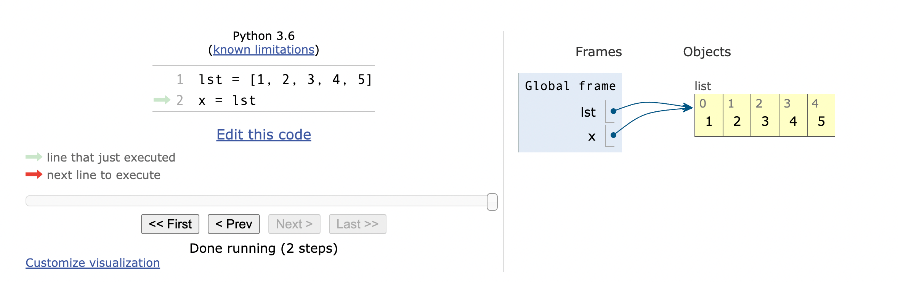

```python
In [26]: lst
Out[26]: [1, 2, 3, 4]

In [27]: lst = [1, 2, 3, 4]

In [28]: x = lst.copy()

In [29]: x
Out[29]: [1, 2, 3, 4]

In [30]: lst
Out[30]: [1, 2, 3, 4]

In [31]: x[0] = 100

In [32]: x
Out[32]: [100, 2, 3, 4]

In [33]: lst
Out[33]: [1, 2, 3, 4]
```

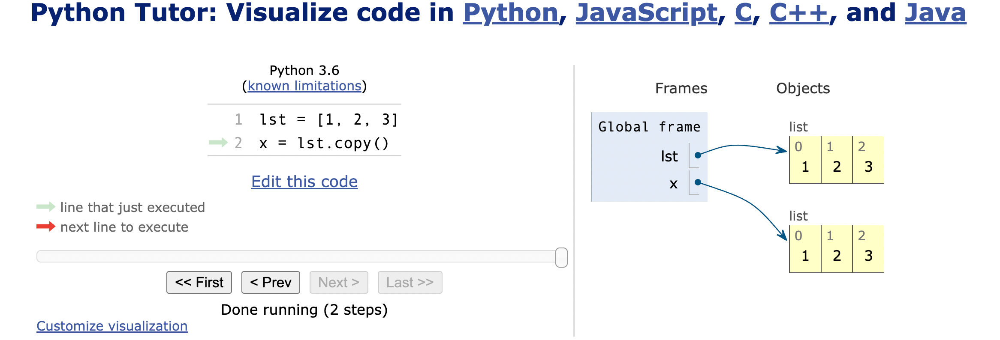


<iframe width="800" height="500" frameborder="0" src="https://pythontutor.com/iframe-embed.html#code=lst%20%3D%20%5B1,%202,%203%5D%0Ax%20%3D%20lst.copy%28%29&codeDivHeight=400&codeDivWidth=350&cumulative=false&curInstr=2&heapPrimitives=nevernest&origin=opt-frontend.js&py=3&rawInputLstJSON=%5B%5D&textReferences=false"> </iframe>

[https://pythontutor.com/render.html#mode=display](https://pythontutor.com/render.html#mode=display)


## 深拷贝「deepcopy()」

```python
In [38]: lst = [1, 2, 3, [2, 3, 4]]

In [39]: x = lst.copy()

In [40]: x[0] = 100

In [41]: x
Out[41]: [100, 2, 3, [2, 3, 4]]

In [42]: x[3]
Out[42]: [2, 3, 4]

In [43]: x[3][1] = "AndersonHJB"

In [44]: x
Out[44]: [100, 2, 3, [2, 'AndersonHJB', 4]]

In [45]: lst
Out[45]: [1, 2, 3, [2, 'AndersonHJB', 4]]
```

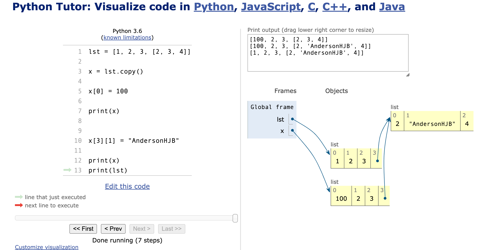


<iframe width="800" height="500" frameborder="0" src="https://pythontutor.com/iframe-embed.html#code=lst%20%3D%20%5B1,%202,%203,%20%5B2,%203,%204%5D%5D%0A%0Ax%20%3D%20lst.copy%28%29%0A%0Ax%5B0%5D%20%3D%20100%0A%0Aprint%28x%29%0A%0A%0Ax%5B3%5D%5B1%5D%20%3D%20%22AndersonHJB%22%0A%0Aprint%28x%29%0Aprint%28lst%29&codeDivHeight=400&codeDivWidth=350&cumulative=false&curInstr=7&heapPrimitives=nevernest&origin=opt-frontend.js&py=3&rawInputLstJSON=%5B%5D&textReferences=false"> </iframe>


<iframe width="800" height="500" frameborder="0" src="https://pythontutor.com/iframe-embed.html#code=lst%20%3D%20%5B1,%202,%203,%20%5B2,%203,%204%5D%5D%0A%0Ax%20%3D%20lst%0A%0Ax%5B0%5D%20%3D%20100%0A%0Aprint%28x%29%0A%0A%0Ax%5B3%5D%5B1%5D%20%3D%20%22AndersonHJB%22%0A%0Aprint%28x%29%0Aprint%28lst%29&codeDivHeight=400&codeDivWidth=350&cumulative=false&curInstr=0&heapPrimitives=nevernest&origin=opt-frontend.js&py=3&rawInputLstJSON=%5B%5D&textReferences=false"> </iframe>


```python
In [46]: from copy import deepcopy

In [47]: lst = [1, 2, 3, [2, 3, 4]]

In [48]: x = deepcopy(lst)

In [49]: x[3][1] = "aiyc"

In [50]: x
Out[50]: [1, 2, 3, [2, 'aiyc', 4]]

In [51]: lst
Out[51]: [1, 2, 3, [2, 3, 4]]
```

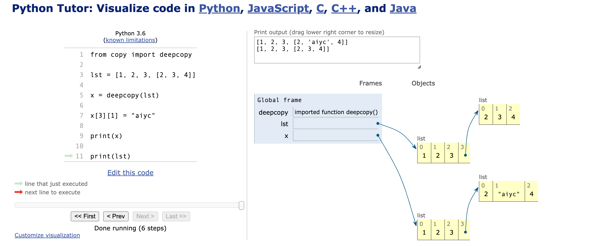


<iframe width="800" height="500" frameborder="0" src="https://pythontutor.com/iframe-embed.html#code=from%20copy%20import%20deepcopy%0A%0Alst%20%3D%20%5B1,%202,%203,%20%5B2,%203,%204%5D%5D%0A%0Ax%20%3D%20deepcopy%28lst%29%0A%0Ax%5B3%5D%5B1%5D%20%3D%20%22aiyc%22%0A%0Aprint%28x%29%0A%0Aprint%28lst%29&codeDivHeight=400&codeDivWidth=350&cumulative=false&curInstr=6&heapPrimitives=nevernest&origin=opt-frontend.js&py=3&rawInputLstJSON=%5B%5D&textReferences=false"> </iframe>

## 课堂练习

```python
s = "132569874"
lst = list(s)
# print(lst)
even_number = lst[::2]
# print(even_number)
even_number.sort(reverse=True)
# print(even_number)
lst[::2] = even_number
print(lst)
```

```python
In [1]: s = "132569874"

In [2]: list(s)
Out[2]: ['1', '3', '2', '5', '6', '9', '8', '7', '4']

In [3]: lst = list(s)

In [4]: lst[::2]
Out[4]: ['1', '2', '6', '8', '4']

In [5]: even_number = lst[::2]

In [6]: even_number
Out[6]: ['1', '2', '6', '8', '4']

In [7]: even_number.sort(reverse=True)

In [8]: even_number
Out[8]: ['8', '6', '4', '2', '1']

In [9]: lst[::2] = even_number

In [10]: lst
Out[10]: ['8', '3', '6', '5', '4', '9', '2', '7', '1']
```

## 练习代码

```python
s = "qwertyuioplkjhgfdsazxcvbnm"
lst=list(s)
print(lst)

lst_odd=lst[1::2]
print(lst_odd)
lst_odd.sort()
print (lst_odd)

lst[1::2]=lst_odd
print(lst)
```

```python
s = "qwertyuioplkjhgfdsazxcvbnm"
lst=list(s)
print(lst)

lst_gap=lst[::3]
print(lst_gap)
lst_gap.sort(reverse=True)
print (lst_gap)
```

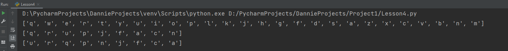

```python
s = "qwertyuioplkjhgfdsazxcvbnm"
lst=list(s)
print(lst)

lst_gap=lst[::3]
print(lst_gap)
lst_gap.sort(reverse=True)
print (lst_gap)

lst[::3]=lst_gap
print (lst)
```

## max

快速寻找序列中的最大值：

```python
lst = [1, 1, 2, 2222222, 333, 444, 55, 66]
max_value = max(lst)
print(max_value)
```

输出：

```python
2222222
```

## min

快速寻找序列当中的最小值：

```python
lst = [1, 1, 2, 2222222, 333, 444, 55, 66]
min_value = min(lst)
print(min_value)
```

Tips: 集合也可以使用哦。

欢迎关注我公众号：AI悦创，有更多更好玩的等你发现！

::: info AI悦创·编程一对一

AI悦创·推出辅导班啦，包括「Python 语言辅导班、C++ 辅导班、java 辅导班、算法/数据结构辅导班、少儿编程、pygame 游戏开发」，全部都是一对一教学：一对一辅导 + 一对一答疑 + 布置作业 + 项目实践等。当然，还有线下线上摄影课程、Photoshop、Premiere 一对一教学、QQ、微信在线，随时响应！微信：Jiabcdefh

C++ 信息奥赛题解，长期更新！长期招收一对一中小学信息奥赛集训，莆田、厦门地区有机会线下上门，其他地区线上。微信：Jiabcdefh

方法一：[QQ](http://wpa.qq.com/msgrd?v=3&uin=1432803776&site=qq&menu=yes)

方法二：微信：Jiabcdefh

:::
