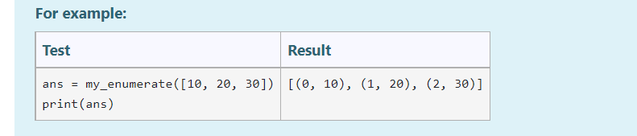
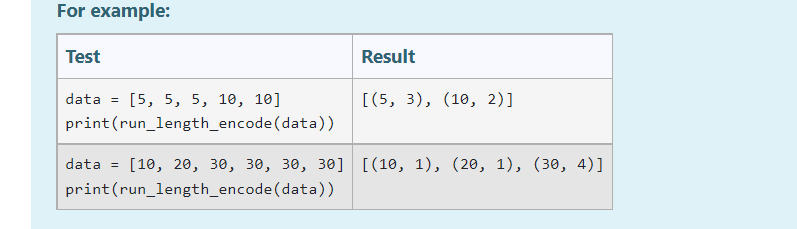
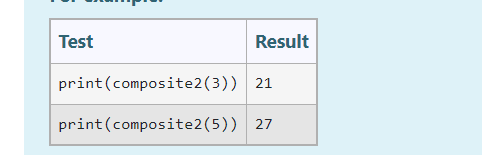

## 1. 词频分析

```python
# -*- coding: utf-8 -*-
# @Time    : 2022/10/13 11:05
# @Author  : AI悦创
# @FileName: demo.py
# @Software: PyCharm
# @Blog    ：https://bornforthis.cn/
def make_dictionary(filename):
	try:
		file = open(filename, "r")
		textoffile = file.read()
	except FileNotFoundError:
		print("The file was not found.")
	textoffile = textoffile.lower()
	# print(textoffile)
	for textoffiles in textoffile:
		# print(textoffiles)
		textoffiles = textoffile.strip()
		# print(textoffiles)
	# 	print(textoffiles)
		words = textoffiles.split("\n")
		# print(words)
		wdict = {}
		for word in words:
			if len(word) >= 1:
				if word in wdict:
					wdict[word] += 1
				else:
					wdict[word] = 1
			else:
				pass
		return wdict


# Testing with the example data in the question
dictionary = make_dictionary('data/data2.txt')
print(dictionary)
for key in sorted(dictionary.keys()):
	print(key + ': ' + str(dictionary[key]))
	print(key + ': ' + str(dictionary[key]))
```

-   [data.txt](/1v1/05-Patrick/02-CS-shaoshuai-Python-cs/data.txt)
-   [data2.txt](/1v1/05-Patrick/02-CS-shaoshuai-Python-cs/data2.txt)
-   [data3.txt](/1v1/05-Patrick/02-CS-shaoshuai-Python-cs/data3.txt)
-   [empty.txt](/1v1/05-Patrick/02-CS-shaoshuai-Python-cs/empty.txt)
-   [jelly.txt](/1v1/05-Patrick/02-CS-shaoshuai-Python-cs/jelly.txt)
-   [jolly.txt](/1v1/05-Patrick/02-CS-shaoshuai-Python-cs/jolly.txt)


## Question 2

Define a function my_enumerate(items) that behaves in a similar way to the built-in enumerate function. It should return a list of tuples (i, item) where item is the ith item, with 0 origin, of the list items (see the examples below). Check the test cases for how the function should work. Your function must not call python's inbuilt enumerate function.

>   定义一个函数 my_enumerate(items)，其行为方式与内置的 enumerate 函数类似。它应该返回元组(i, item)的列表，其中 item 是列表项的第 i 个项，原点为0(参见下面的示例)。检查测试用例以了解该功能应该如何工作。你的函数不能调用 python 的内置 enumerate 函数。



```python
def my_enumerate(items: list):
	index = 0
	result_lst = []
	for i in items:
		result_lst.append((index, i))
		index = index + 1
	return result_lst


if __name__ == '__main__':
	r = my_enumerate([10, 20, 30])
	print(r)
```

## Question 3

Sequences of numbers in which there are frequent "runs" of a particular number repeating several times can often be more compactly represented by use of what is called "run length encoding". A list is run-length encoded by representing it as a list of pairs (2-tuples), where each pair is a number and the length of the "run" of that number, where the length is 1 if a number occurs once, 2 if it occurs twice in a row, etc. Write a function run_length_encode(nums) that returns the run-length encoded representation of the list of integers, nums.

>   一个特定的数字频繁地重复出现几次的数字序列，通常可以用所谓的“长度编码”来更紧凑地表示。通过将列表表示为一对(2元组)的列表，将其编码为运行长度，其中每对是一个数字和该数字的“运行”长度，如果一个数字出现一次，则长度为1，如果它在一行中出现两次，则长度为2，以此类推。编写一个函数run_length_encode(nums)，它返回整数列表nums的运行长度编码表示。



```python
def run_length_encode(nums: list):
	count_dict = {}
	for word in nums:
		if word in count_dict:
			count_dict[word] += 1
		else:
			count_dict[word] = 1
	# print(count_dict)
	return list(count_dict.items())


if __name__ == '__main__':
	r = run_length_encode([5, 5, 5, 10, 10])
	print(r)
	r = run_length_encode([10, 20, 30, 30, 30, 30])
	print(r)
```

## Question 4

Write a function composite2(N) which takes an integer N as an input and returns the Nth composite number which is NOT divisible by 2. 

>   编写一个函数composit2 (N)，它接受整数N作为输入，并返回第N个不能被2整除的合数。




欢迎关注我公众号：AI悦创，有更多更好玩的等你发现！

::: details 公众号：AI悦创【二维码】


:::

::: info AI悦创·编程一对一

AI悦创·推出辅导班啦，包括「Python 语言辅导班、C++ 辅导班、java 辅导班、算法/数据结构辅导班、少儿编程、pygame 游戏开发」，全部都是一对一教学：一对一辅导 + 一对一答疑 + 布置作业 + 项目实践等。当然，还有线下线上摄影课程、Photoshop、Premiere 一对一教学、QQ、微信在线，随时响应！微信：Jiabcdefh

C++ 信息奥赛题解，长期更新！长期招收一对一中小学信息奥赛集训，莆田、厦门地区有机会线下上门，其他地区线上。微信：Jiabcdefh

方法一：[QQ](http://wpa.qq.com/msgrd?v=3&uin=1432803776&site=qq&menu=yes)

方法二：微信：Jiabcdefh

:::

