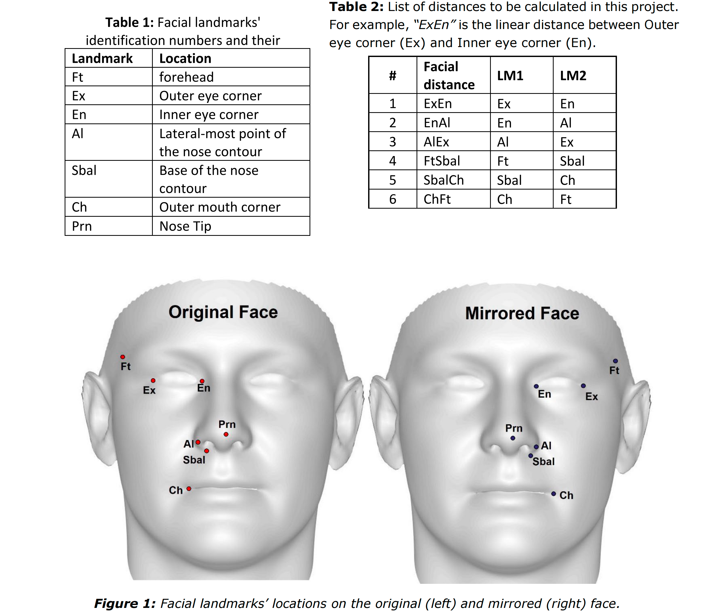
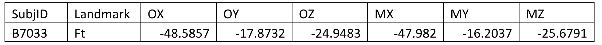

## [**SampleData.csv**](/1v1/05-Patrick/03-CITS1401-Computational-Thinking-wit-Python/SampleData.csv)

## [**CITS1401-Project-2-S2-2022.pdf**](/1v1/05-Patrick/03-CITS1401-Computational-Thinking-wit-Python/CITS1401-Project-2-S2-2022.pdf)

**Project 2:** 

**Submission deadlines:** **5:00 pm, Friday 21****st** **October 2022**

Value: **20%** of CITS1401.

*To be completed individually.*

You should construct a Python 3 program containing your solution to the following problem and submit your program electronically on Moodle. The name of the file containing your code should be your student ID e.g. 12345678.py. No other method of submission is allowed. Your program will be  automatically run on Moodle for sample test cases provided in the project sheet if you click the  “check” link. However, your submission will be tested thoroughly for grading purposes after the due  date. Remember you need to submit the program as a single file and copy-paste the same program in the provided text box. You have only one attempt to submit so don’t submit if you are not satisfied with your attempt. All open submissions at the time of the deadline will be automatically submitted. There is no way in the system to open the closed submission and reverse your submission. 

>   你应该构造一个包含以下问题解决方案的 Python 3程序，并在 Moodle 上以电子方式提交你的程序。包含你的代码的文件名应该是你的学生 ID，例如12345678.py。不允许以其他方式提交。如果单击“检查”链接，您的程序将自动在Moodle上运行，以获得项目表中提供的示例测试用例。但是，在截止日期之后，您的提交将被彻底测试，以达到评分目的。记住，您需要将程序作为单个文件提交，并在提供的文本框中复制粘贴相同的程序。你只有一次提交的尝试，所以如果你对你的尝试不满意，就不要提交。截止日期时所有公开提交的作品将自动提交。系统中没有办法打开已关闭的提交并撤销您的提交。

You are expected to have read and understood the University's guidelines on academic conduct. Following this policy, you may discuss with other students the general principles required to understand this project, but the work you submit must be the result of your own effort. Plagiarism detection, and other systems for detecting potential malpractice, will therefore be used. Besides, if what you submit is not your own work then you will have learned little and will, therefore, likely, fail the final exam.

>   你必须阅读并理解学校的学术行为准则。按照这个政策，你可以和其他学生讨论理解这个项目所需的一般原则，但你提交的作业必须是你自己努力的结果。因此，将使用剽窃检测和其他检测潜在渎职行为的系统。此外，如果你提交的不是你自己的作业，那么你就会学到很少，因此，很可能期末考试不及格。

You must submit your project before the submission deadline listed above. Following UWA policy, a late penalty of 5% will be deducted for each day (24 hours), after the deadline, that the assignment is submitted. No submissions will be allowed after 7 days following the deadline except approved special consideration cases.

>   您必须在上述提交截止日期之前提交您的项目。根据UWA的政策，在提交作业的截止日期之后，每天(24小时)将扣除5%的滞纳金。除获批准的特别考虑个案外，申请人不得在截止日期后7天内提交任何资料。

**Overview**

Impressed by your performance in Project-1, the scientists at UWA seek your help in another exciting project. Historically, facial asymmetry and distances between certain facial points (also called) landmarks have been linked to facial beauty and attractiveness (you can read this paper to find out more). This project will help the scientists in measuring facial asymmetry and distances between certain landmarks on the face.

>   你在项目1中的表现给UWA的科学家们留下了深刻的印象，他们在另一个令人兴奋的项目中寻求你的帮助。从历史上看，面部的不对称和某些面部点(也称为)之间的距离与面部的美丽和吸引力有关(你可以阅读这篇文章了解更多)。这个项目将帮助科学家测量面部的不对称性和面部某些地标之间的距离。

Your task is to find out facial asymmetry between 6 significant facial landmarks and also calculate 6 linear distances between certain landmarks on the face. Facial asymmetry is calculated by flipping the face on its longer axis and subtracting the mirrored landmark values from the original. Table 1 provides the details of each landmark, while Figures 1 and 2 show their location on the original and mirrored face. Table-2 gives you the details of the distances to be calculated. Remember these distances are between the landmarks mentioned in Table-1. Since the face is flipped on it axis, the asymmetry at the nose tip must always be zero i.e. 3D linear distance between “Prn” on original and mirrored faces is zero. We will use the asymmetry of this landmark as a control point.

>   你的任务是找出6个重要面部标志之间的面部不对称，并计算出脸部某些标志之间的6个线性距离。面部不对称的计算方法是在较长的轴上翻转面部，并从原始的图像中减去镜像的地标值。表1提供了每个地标的详细信息，而图1和图2显示了它们在原始和镜像表面上的位置。表2给出了要计算的距离的详细信息。记住这些距离是表1中提到的地标之间的距离。因为脸在它的轴上翻转，鼻尖的不对称必须总是零， **即“Prn”在原始和镜像脸之间的3D线性距离为零。** 我们将利用这个地标的不对称性作为控制点。

In this project, you are required to write a computer program that can read the data from a CSV (comma separated values) file provided to you. The file contains the 3D coordinates in X, Y and Z axes for the 7 facial landmarks mentioned in Table 1 for each subject. Yourtask is to write a program which fulfills the following requirements.

>   在这个项目中，您被要求编写一个计算机程序，可以从提供给您的CSV(逗号分隔值)文件中读取数据。该文件包含表1中提到的每个受试者的7个面部标志的X、Y和Z轴的3D坐标。你的任务是写一个满足以下要求的程序。




**Specification: What your program is required to do**

>   规范:你的程序需要做什么

**Input:**

Your program must define the function main with the following syntax: 

>   你的程序必须用以下语法定义main 函数:

`def main(csvfile, SubjIDs): `

The input arguments to this function are:

>   这个函数的输入参数是:

-   csvfile: The name oftheCSVfile containing the facial data recordwhich needs to be analysed. Below are the first two rows of the sample file.

>   csvfile:包含需要分析的面部数据记录的 csv 文件的名称。
>
>   下面是示例文件的前两行。



The first row of the CSV file contains the following headers: 

>   CSV 文件的第一行包含以下标题:

-   SubjID: The identity of a human subject.

>   SubjID:人类主体的身份。

-   Landmark: The facial landmark as mentioned in Table 1.

>   地标:如表1所示的面部地标。

-   “OX”, “OY” and “OZ”: The 3D location of the landmark in X, Y and Z axes respectively on the original face (See Figure-1 (left)).

>   “OX”、“OY”、“OZ”:分别是该标志在原面上X、Y、Z轴的三维位置(见图1(左))。

-   “MX”, “MY” and “MZ”: The 3D location of the landmark in X, Y and Z axes respectively on the mirrored face (See Figure-1 (right)).

>   “MX”、“MY”和“MZ”:分别是标志点在镜像面上X、Y、Z轴的三维位置(见图1(右))。

-   We do not have prior knowledge about the number of subjects we have to analyse (i.e. the number of rows) that the CSV file contains. Also, we are not aware of the order of the columns, so your program needs to check for the column heading to retrieve respective information. The columns ‘SubjID’ and ‘Landmark’ are strings while the remaining data is numeric.

>   对于CSV文件所包含的必须分析的主题的数量(即行数)，我们没有预先的知识。此外，我们不知道列的顺序，因此您的程序需要检查列标题以检索各自的信息。列' SubjID '和' Landmark '是字符串，而其余的数据是数字。

-   **Note:** The X, Y and Z coordinates are in millimetres and need to be within the bounds [-200,200].

>   **注:** X、Y和Z坐标以毫米为单位，需要在边界[-200,200]内。

-   SubjIDs: A list of two IDs of the subjects which need to be analysed. Remember that the ID is a string and is case insensitive.

>   SubjIDs:需要分析的主题的两个id的列表。请记住，ID是字符串，不区分大小写。

**Output:**

The function is required to return the following outputs in the order provided below. For ease of 

>   该函数需要按下面提供的顺序返回以下输出。为了便于

description, we will refer to the input SubjID containing two IDs: **“F1”** and **“F2”** as [“F1”,”F2”].

>   描述中，我们将输入SubjID包含两个id:  " F1 " **和** " F2 " 作为[" F1 "， " F2 "]。

-   **OP1:** A list of two dictionaries containing the facial asymmetry values between the original and mirrored face for the landmarks mentioned in Table-1 for each face F1 and F2 respectively. The keys in the dictionaries are the abbreviations (upper case) of the landmarks (e.g. EX, FT etc.) and their values contain the 3D asymmetry between the original and mirrored landmarks. The formula to calculate the 3D asymmetry is given at the end of this project sheet.

>   **OP1:**两个字典的列表，包含表1中提到的地标的原始脸和镜像脸之间的面部不对称值，分别针对每个脸F1和F2。字典中的键是地标的缩写(大写)(例如EX, FT等)，它们的值包含原始地标和镜像地标之间的3D不对称。本文在项目表的最后给出了三维非对称性的计算公式。

-   **OP2:** A list of two dictionaries containing the facial distances (as mentioned in Table-2) for each face F1 and F2 respectively. The keys in the dictionaries are the abbreviations (upper case) of the distances (e.g. EXEN, ENAL etc.) and their values contain the 3D Euclidean distance between the corresponding landmarks (see last two columns of Table-2) on the original face. The formula to calculate the Euclidean distance between two 3D landmarks is given at the end of this project sheet.

>   **OP2:**两个字典的列表，分别包含每个面部F1和F2的面部距离(如表2所示)。字典中的键是距离的缩写(大写)(例如EXEN, ENAL等)，它们的值包含原始表面上相应地标(参见表2的最后两列)之间的3D欧氏距离。计算两个三维地标之间的欧氏距离的公式在项目表的最后给出。

-   **OP3:** First calculate the total facial asymmetries of each subject in the CSV file. Your task is to return a list of Tuple sequences of the 5 faces having the lowest total face asymmetry. The first member of each tuple is the “SubjID” of the face while the second member is the total asymmetry of this face. The list must be in increasing order of total facial asymmetry such that the first tuple would indicate the face that has the lowest total facial asymmetry. Therefore, the 5 tuple sequences will represent 5 lowest total facial asymmetries. 

>   **OP3:**首先计算CSV文件中每个受试者的面部不对称总数。您的任务是返回一个Tuple序列的列表，其中包含5个总面孔不对称程度最低的面孔。每个元组的第一个成员是脸的“SubjID”，而第二个成员是这个脸的完全不对称。列表必须按面部整体不对称的递增顺序排列，这样第一个元组将表示面部整体不对称程度最低的脸。因此，5元组序列将代表5个最低的面部不对称。

-   **OP4:** The cosine similarity between faces F1 and F2 based on the six distances calculated above (OP2). The formula to calculate cosine similarity is provided at the end of this project sheet.

>   **OP4:**基于上面计算的6个距离的面F1和F2之间的余弦相似度(OP2)。计算余弦相似度的公式在项目表的最后提供。

All returned numeric outputs (in dictionaries, lists and individual values) must be rounded off to four decimal places (if required to be rounded off). Do not round off the values during calculations and round them off only while saving them into the final output variables.

>   所有返回的数字输出(在字典、列表和单个值中)必须四舍五入到小数点后四位(如果需要四舍五入)。不要在计算过程中对值进行四舍五入，只有在将值保存到最终输出变量时才对其进行四舍五入。

**Examples:**

Download sampledata.csv file from the folder of Project 2 on LMS or Moodle. Some examples of how you can call your program from the Python shell (and examine the results it returns) are:

>   从LMS或Moodle上的Project 2文件夹中下载sampledata.csv文件。下面是一些如何从Python shell调用程序(并检查它返回的结果)的例子:

\>>> [OP1,OP2,OP3,OP4]=main('SampleData.csv',['B7033','C1283'])

The outputs will be:

\>>> OP1

[{'FT': 1.9198, 'EX': 1.8028, 'EN': 1.6555, 'AL': 2.5577, 'SBAL': 0.9023, 'CH': 1.7901}, 

{'FT': 1.807, 'EX': 2.2892, 'EN': 0.9371, 'AL': 1.9393, 'SBAL': 1.1624, 'CH': 2.7713}]

\>>> OP2

[{'EXEN': 33.092, 'ENAL': 34.6946, 'ALEX': 50.1037, 'FTSBAL': 91.5324, 'SBALCH': 

33.7109, 'CHFT': 98.1642}, {'EXEN': 34.4401, 'ENAL': 37.7494, 'ALEX': 54.0952, 

'FTSBAL': 90.3202, 'SBALCH': 38.4123, 'CHFT': 104.8566}]

\>>> OP3

[('E4996', 8.3254), ('H1178', 9.1597), ('F7831', 9.3268), ('J6687', 9.3878), ('K6431', 

9.6359)]

\>>> OP4

0.9991

**Additional requirements:**

There are few more requirements for your program.

-   Your program needs to validate the inputs to the main() function and gracefully terminate if invalid inputs are provided.

>   您的程序需要验证main()函数的输入，并在提供无效输入时优雅地终止。

-   You program needs to terminate *gracefully* if the file cannot be found or opened. For graceful terminations, you need to print the message related to the problem and return None for each output.

>   如果找不到或打开该文件，您的程序需要“优雅地”终止。对于优雅终止，您需要打印与问题相关的消息，并为每个输出返回 None。✅

-   Your program needs to validate the input data from the file. The X, Y or Z coordinate (or all coordinates) of a landmark could be corrupted or missing. In that case the value in the cell would be empty or out of bounds. If data is not correct, then consider the entire data of this particular subject as corrupted. In such a case return ‘None’ for each unavailable output.

>   您的程序需要验证来自文件的输入数据。地标的X、Y或Z坐标(或所有坐标)可能损坏或丢失。在这种情况下，单元格中的值将为空或超出边界。如果数据不正确，则认为该特定主题的整个数据已损坏。在这种情况下，为每个不可用输出返回' None '。

-   It is possible that the Research Assistant marking these landmarks on the faces could have forgotten to mark/ record a landmark. In this case, that particular landmark will be missing from the CSV file. In such a case, consider the entire data of this particular subject as corrupted and return ‘None’ for each unavailable output.

>   有可能是研究助理在表面标记这些标志时忘记标记/记录一个标志。在本例中，CSV文件中将没有那个特定的地标。在这种情况下，将这个特定主题的整个数据视为已损坏，并为每个不可用输出返回“None”。

-   The facial asymmetry at nose tip must be zero. In case this value is non-zero, it means that the subject data has been corrupted and needs to be discarded. In such a case return ‘None’ for each unavailable output.

>   鼻尖的面部不对称必须为零。如果该值非零，则意味着主题数据已经损坏，需要丢弃。在这种情况下，为每个不可用输出返回' None '。

-   Your program needs to consider that record of the landmarks for a particular Adult may not have any specific order or can be in any order (excluding header row).

>   你的程序需要考虑到特定Adult的标记记录可能没有任何特定的顺序，也可能是任何顺序(不包括标题行)。

-   The columns in the CSV file can be in any order and the headings are case insensitive. The headings expected are: SubjID, Landmark, OX,O Y,0Z,MX,MY AND MZ.

>   CSV文件中的列可以是任意顺序的，标题不区分大小写。标题应该是:subject, Landmark, OX,O Y,0Z,MX,MY和MZ。

## OP1

```python
# -*- coding: utf-8 -*-
# @Time    : 2022/10/18 12:59
# @Author  : AI悦创
# @FileName: OP1.py
# @Software: PyCharm
# OP1@Blog    ：https://bornforthis.cn/
# 公式：0.5 ** ((MX - OX)^2 + (MY - OY)^2 + (MZ - OZ)^2)
def read_csv(csvfile):
    with open(csvfile, "rt") as f:
        # print(f.readlines())
        content_lst = f.readlines()
        # print(f.read())
        # content_lst = str(f.read())
        return content_lst
        # print(content_lst)


def parse(content_lst, subid):
    """
    ((MX - OX)^2 + (MY - OY)^2 + (MZ - OZ)^2) ** 0.5
    :param content_lst:
    :return: op1
    """
    OX_POSITION = 2
    OY_POSITION = 3
    OZ_POSITION = 4
    MX_POSITION = 5
    MY_POSITION = 6
    MZ_POSITION = 7

    judge_set_keys = {'FT', 'CH', 'AL', 'EX', 'EN', 'SBAL'}
    result_dict = {}
    for detail_content in content_lst[1:]:
        detail_lst = detail_content.replace("\n", "").split(",")
        # print(detail_lst)
        if subid in detail_lst:
            mx_value = detail_lst[MX_POSITION]
            ox_value = detail_lst[OX_POSITION]
            my_value = detail_lst[MY_POSITION]
            oy_value = detail_lst[OY_POSITION]
            mz_value = detail_lst[MZ_POSITION]
            oz_value = detail_lst[OZ_POSITION]
            # print("OX:", ox_value, "OY:", oy_value, "OZ:", oz_value, "MX:", mx_value, "MY:", my_value, "MZ:", mz_value)
            result_dict[detail_lst[1].upper()] = (
                                                         (float(mx_value) - float(ox_value)) ** 2 +
                                                         (float(my_value) - float(oy_value)) ** 2 +
                                                         (float(mz_value) - float(oz_value)) ** 2
                                                 ) ** 0.5
        else:
            pass
    del result_dict["PRN"]
    difference_set_keys = judge_set_keys - set(result_dict)
    if difference_set_keys:
        new_result_dict = {}
        for not_key in difference_set_keys:
            result_dict[not_key] = "None"
        sort_key = ['FT', 'EX', 'EN', 'AL', 'SBAL', 'CH']
        for key in sort_key:
            new_result_dict[key] = result_dict[key]
        return new_result_dict
    return result_dict
    # print(set(result_dict))


def main(csvfile, SubjIDs: list):
    content_lst = read_csv(csvfile)
    # print(content_lst)
    for subid in SubjIDs:
        # print(subid)
        r = parse(content_lst, subid)
        print(r)
    # print(content_lst)


if __name__ == '__main__':
    path = "data/SampleData.csv"  # 路径
    main(path, ['B7033', 'C1283', 'I0951'])
```

## 规范 1

```python
# -*- coding: utf-8 -*-
# @Time    : 2022/10/18 12:59
# @Author  : AI悦创
# @FileName: OP1.py
# @Software: PyCharm
# OP1@Blog    ：https://bornforthis.cn/
# 公式：0.5 ** ((MX - OX)^2 + (MY - OY)^2 + (MZ - OZ)^2)
def read_csv(csvfile):
    try:
        with open(csvfile, "rt") as f:
            # print(f.readlines())
            content_lst = f.readlines()
            # print(f.read())
            # content_lst = str(f.read())
            return content_lst
            # print(content_lst)
    except FileNotFoundError as e:
        # print(e)
        return e

def parse(content_lst, subid):
    """
    ((MX - OX)^2 + (MY - OY)^2 + (MZ - OZ)^2) ** 0.5
    :param content_lst:
    :return: op1
    """
    OX_POSITION = 2
    OY_POSITION = 3
    OZ_POSITION = 4
    MX_POSITION = 5
    MY_POSITION = 6
    MZ_POSITION = 7

    judge_set_keys = {'FT', 'CH', 'AL', 'EX', 'EN', 'SBAL'}
    result_dict = {}
    for detail_content in content_lst[1:]:
        detail_lst = detail_content.replace("\n", "").split(",")
        # print(detail_lst)
        if subid in detail_lst:
            mx_value = detail_lst[MX_POSITION]
            ox_value = detail_lst[OX_POSITION]
            my_value = detail_lst[MY_POSITION]
            oy_value = detail_lst[OY_POSITION]
            mz_value = detail_lst[MZ_POSITION]
            oz_value = detail_lst[OZ_POSITION]
            # print("OX:", ox_value, "OY:", oy_value, "OZ:", oz_value, "MX:", mx_value, "MY:", my_value, "MZ:", mz_value)
            result_dict[detail_lst[1].upper()] = (
                                                         (float(mx_value) - float(ox_value)) ** 2 +
                                                         (float(my_value) - float(oy_value)) ** 2 +
                                                         (float(mz_value) - float(oz_value)) ** 2
                                                 ) ** 0.5
        else:
            pass
    del result_dict["PRN"]
    difference_set_keys = judge_set_keys - set(result_dict)
    if difference_set_keys:
        new_result_dict = {}
        for not_key in difference_set_keys:
            result_dict[not_key] = "None"
        sort_key = ['FT', 'EX', 'EN', 'AL', 'SBAL', 'CH']
        for key in sort_key:
            new_result_dict[key] = result_dict[key]
        return new_result_dict
    return result_dict
    # print(set(result_dict))


def main(csvfile, SubjIDs: list):
    content_lst = read_csv(csvfile)
    # print(content_lst)
    string = "[Errno 2] No such file or directory: '{path}'".format(path=csvfile)
    # print(string)
    # print(str(content_lst) != string)
    if str(content_lst) != string:
        for subid in SubjIDs:
            # print(subid)
            r = parse(content_lst, subid)
            print(r)
    else:
        return None


if __name__ == '__main__':
    path = "data/SampleData.csv"  # 路径
    main(path, ['B7033', 'C1283', 'I0951'])
```

```python
# -*- coding: utf-8 -*-
# @Time    : 2022/10/18 12:59
# @Author  : AI悦创
# @FileName: OP1.py
# @Software: PyCharm
# OP1@Blog    ：https://bornforthis.cn/
# op1 公式1： ((MX - OX)^2 + (MY - OY)^2 + (MZ - OZ)^2) ** 0.5
# op2 公式2： ((En)) ** 0.5


def read_csv(csvfile):
    try:
        with open(csvfile, "rt") as f:
            # print(f.readlines())
            content_lst = f.readlines()
            # print(f.read())
            # content_lst = str(f.read())
            return content_lst
            # print(content_lst)
    except FileNotFoundError as e:
        # print(e)
        return e


def parse(content_lst, subid):
    """
    ((MX - OX)^2 + (MY - OY)^2 + (MZ - OZ)^2) ** 0.5
    :param content_lst:
    :return: op1
    """
    OX_POSITION = 2
    OY_POSITION = 3
    OZ_POSITION = 4
    MX_POSITION = 5
    MY_POSITION = 6
    MZ_POSITION = 7

    judge_set_keys = {'FT', 'CH', 'AL', 'EX', 'EN', 'SBAL'}
    result_dict = {}
    for detail_content in content_lst[1:]:
        detail_lst = detail_content.replace("\n", "").split(",")
        # print(detail_lst)
        if subid in detail_lst:
            mx_value = detail_lst[MX_POSITION]
            ox_value = detail_lst[OX_POSITION]
            my_value = detail_lst[MY_POSITION]
            oy_value = detail_lst[OY_POSITION]
            mz_value = detail_lst[MZ_POSITION]
            oz_value = detail_lst[OZ_POSITION]
            # print("OX:", ox_value, "OY:", oy_value, "OZ:", oz_value, "MX:", mx_value, "MY:", my_value, "MZ:", mz_value)
            # if mx_value == "0" or my_value == "0" or mz_value == "0" or oz_value == "0" or ox_value == "0" or oy_value == "0":
            if "0" in detail_lst:
                result_dict[detail_lst[1].upper()] = "None"
            else:
                result_dict[detail_lst[1].upper()] = (
                                                             (float(mx_value) - float(ox_value)) ** 2 +
                                                             (float(my_value) - float(oy_value)) ** 2 +
                                                             (float(mz_value) - float(oz_value)) ** 2
                                                     ) ** 0.5
    if result_dict["PRN"] != 0:
        # result_dict["PRN"] = "None"
        # result_dict = "None"
        return None
    else:
        del result_dict["PRN"]
    difference_set_keys = judge_set_keys - set(result_dict)
    if difference_set_keys:
        # new_result_dict = {}
        # for not_key in difference_set_keys:
        #     result_dict[not_key] = "None"
        # sort_key = ['FT', 'EX', 'EN', 'AL', 'SBAL', 'CH']
        # for key in sort_key:
        #     new_result_dict[key] = result_dict[key]
        # return new_result_dict
        return None
    return result_dict
    # print(set(result_dict))


def main(csvfile, SubjIDs: list):
    content_lst = read_csv(csvfile)
    # print(content_lst)
    string = "[Errno 2] No such file or directory: '{path}'".format(path=csvfile)
    # print(string)
    # print(str(content_lst) != string)
    op1 = []
    if str(content_lst) != string:
        for subid in SubjIDs:
            r = parse(content_lst, subid)
            op1.append(r)
        print(op1)
        return [op1, None, None, None]
    else:
        return [None, None, None, None]


def title(path):
    content_lst = read_csv(path)
    r = []
    for d in content_lst[1:]:
        n_d = d.split(",")[0]
        r.append(n_d)
    # print(r)
    return r


if __name__ == '__main__':
    path = "data/SampleData.csv"  # 路径
    main(path, ['B7033', 'C1283', 'I0951'])
    # lst = title(path)
    # main(path, ['B7033', 'C1283'])
    # main(path, lst)

```

## op2

```python
# -*- coding: utf-8 -*-
# @Time    : 2022/10/18 12:59
# @Author  : AI悦创
# @FileName: OP1.py
# @Software: PyCharm
# OP1@Blog    ：https://bornforthis.cn/
# op1 公式1： ((MX - OX)^2 + (MY - OY)^2 + (MZ - OZ)^2) ** 0.5
# op2 公式2： ((En)) ** 0.5


def read_csv(csvfile):
    try:
        with open(csvfile, "rt") as f:
            # print(f.readlines())
            content_lst = f.readlines()
            # print(f.read())
            # content_lst = str(f.read())
            return content_lst
            # print(content_lst)
    except FileNotFoundError as e:
        # print(e)
        return e


def op1_parse(content_lst, subid):
    """
    ((MX - OX)^2 + (MY - OY)^2 + (MZ - OZ)^2) ** 0.5
    :param content_lst:
    :return: op1
    """
    OX_POSITION = 2
    OY_POSITION = 3
    OZ_POSITION = 4
    MX_POSITION = 5
    MY_POSITION = 6
    MZ_POSITION = 7

    judge_set_keys = {'FT', 'CH', 'AL', 'EX', 'EN', 'SBAL'}
    result_dict = {}
    for detail_content in content_lst[1:]:
        detail_lst = detail_content.replace("\n", "").split(",")
        # print(detail_lst)
        if subid in detail_lst:
            mx_value = detail_lst[MX_POSITION]
            ox_value = detail_lst[OX_POSITION]
            my_value = detail_lst[MY_POSITION]
            oy_value = detail_lst[OY_POSITION]
            mz_value = detail_lst[MZ_POSITION]
            oz_value = detail_lst[OZ_POSITION]
            # print("OX:", ox_value, "OY:", oy_value, "OZ:", oz_value, "MX:", mx_value, "MY:", my_value, "MZ:", mz_value)
            # if mx_value == "0" or my_value == "0" or mz_value == "0" or oz_value == "0" or ox_value == "0" or oy_value == "0":
            if "0" in detail_lst:
                result_dict[detail_lst[1].upper()] = "None"
            else:
                result_dict[detail_lst[1].upper()] = (
                                                             (float(mx_value) - float(ox_value)) ** 2 +
                                                             (float(my_value) - float(oy_value)) ** 2 +
                                                             (float(mz_value) - float(oz_value)) ** 2
                                                     ) ** 0.5
    if result_dict["PRN"] != 0:
        # result_dict["PRN"] = "None"
        # result_dict = "None"
        return None
    else:
        del result_dict["PRN"]
    difference_set_keys = judge_set_keys - set(result_dict)
    if difference_set_keys:
        # new_result_dict = {}
        # for not_key in difference_set_keys:
        #     result_dict[not_key] = "None"
        # sort_key = ['FT', 'EX', 'EN', 'AL', 'SBAL', 'CH']
        # for key in sort_key:
        #     new_result_dict[key] = result_dict[key]
        # return new_result_dict
        return None
    return result_dict
    # print(set(result_dict))


def op2_parse(contet_lst, subid):
    # keys_list = ["OX", ]
    # print(contet_lst)

    result_list = []
    for detail_content in contet_lst[1:]:
        # print(detail_content)
        content_lst = detail_content.replace("\n", "").split(",")
        result_list.append(content_lst)

    data_list = []
    operation_lst = []
    for content in result_list:
        # print(content)
        if subid == content[0]:
            data_list.append(("SubID", content[0]))
            data_list.append((content[1].upper(), content[2:]))
    judge_dict = dict(data_list)
    # print(judge_dict)
    # keys = ["EXEN", "ENAI", "AIEX", "FTSBAL", "SBALCH", "CHFT"]
    result_dict = {}
    EN_LIST = list(map(float, judge_dict["EN"]))[:3]
    EX_LIST = list(map(float, judge_dict["EX"]))[:3]
    AL_LIST = list(map(float, judge_dict["AL"]))[:3]
    FT_LIST = list(map(float, judge_dict["FT"]))[:3]
    SBAL_LIST = list(map(float, judge_dict["SBAL"]))[:3]
    CH_LIST = list(map(float, judge_dict["CH"]))[:3]
    f_lambda = lambda x: (x[0] - x[1]) ** 2
    result_dict["EXEN"] = sum([f_lambda(detail) for detail in zip(EN_LIST, EX_LIST)]) ** 0.5
    result_dict["ENAL"] = sum([f_lambda(detail) for detail in zip(AL_LIST, EN_LIST)]) ** 0.5
    result_dict["ALEX"] = sum([f_lambda(detail) for detail in zip(EX_LIST, AL_LIST)]) ** 0.5
    result_dict["FTSBAL"] = sum([f_lambda(detail) for detail in zip(SBAL_LIST, FT_LIST)]) ** 0.5
    result_dict["SBALCH"] = sum([f_lambda(detail) for detail in zip(CH_LIST, SBAL_LIST)]) ** 0.5
    result_dict["CHFT"] = sum([f_lambda(detail) for detail in zip(FT_LIST, CH_LIST)]) ** 0.5
    # print(result_dict)
    return result_dict

def main(csvfile, SubjIDs: list):
    content_lst = read_csv(csvfile)
    # print(content_lst)
    string = "[Errno 2] No such file or directory: '{path}'".format(path=csvfile)
    # print(string)
    # print(str(content_lst) != string)
    # ------------- OP Code -------------
    if str(content_lst) != string:
        op1 = []
        op2 = []
        for subid in SubjIDs:
            # op1
            r = op1_parse(content_lst, subid)
            op1.append(r)
            # op2
            r = op2_parse(content_lst, subid)
            op2.append(r)
        # print(op1)
        # ------------- OP Code -------------
        return [op1, op2, None, None]
    else:
        return [None, None, None, None]


def title(path):
    content_lst = read_csv(path)
    r = []
    for d in content_lst[1:]:
        n_d = d.split(",")[0]
        r.append(n_d)
    # print(r)
    return r


if __name__ == '__main__':
    path = "data/SampleData.csv"  # 路径
    # main(path, ['B7033', 'C1283', 'I0951'])
    main(path, ['B7033', 'C1283'])
    # main(path, ['B7033'])
    # lst = title(path)
    # main(path, ['B7033', 'C1283'])
    # main(path, lst)

```

```python
# -*- coding: utf-8 -*-
# @Time    : 2022/10/18 12:59
# @Author  : AI悦创
# @FileName: OP1.py
# @Software: PyCharm
# OP1@Blog    ：https://bornforthis.cn/
# op1 公式1： ((MX - OX)^2 + (MY - OY)^2 + (MZ - OZ)^2) ** 0.5
# op2 公式2： ((En)) ** 0.5


def read_csv(csvfile):
    try:
        with open(csvfile, "rt") as f:
            # print(f.readlines())
            content_lst = f.readlines()[1:]
            # for detail_content in content_lst:
            #     detail_content.replace("\n", "").split(",")
            # print(f.read())
            # content_lst = str(f.read())
            # return content_lst
            return content_lst
            # print(content_lst)
    except FileNotFoundError as e:
        # print(e)
        return e


def op1_parse(content_lst, subid):
    """
    ((MX - OX)^2 + (MY - OY)^2 + (MZ - OZ)^2) ** 0.5
    :param content_lst:
    :return: op1
    """
    OX_POSITION = 2
    OY_POSITION = 3
    OZ_POSITION = 4
    MX_POSITION = 5
    MY_POSITION = 6
    MZ_POSITION = 7

    judge_set_keys = {'FT', 'CH', 'AL', 'EX', 'EN', 'SBAL'}
    result_dict = {}
    for detail_content in content_lst:
        detail_lst = detail_content.replace("\n", "").split(",")
        # print(detail_lst)
        if subid in detail_lst:
            mx_value = detail_lst[MX_POSITION]
            ox_value = detail_lst[OX_POSITION]
            my_value = detail_lst[MY_POSITION]
            oy_value = detail_lst[OY_POSITION]
            mz_value = detail_lst[MZ_POSITION]
            oz_value = detail_lst[OZ_POSITION]
            # print("OX:", ox_value, "OY:", oy_value, "OZ:", oz_value, "MX:", mx_value, "MY:", my_value, "MZ:", mz_value)
            # if mx_value == "0" or my_value == "0" or mz_value == "0" or oz_value == "0" or ox_value == "0" or oy_value == "0":
            if "0" in detail_lst:
                result_dict[detail_lst[1].upper()] = "None"
            else:
                result_dict[detail_lst[1].upper()] = (
                                                             (float(mx_value) - float(ox_value)) ** 2 +
                                                             (float(my_value) - float(oy_value)) ** 2 +
                                                             (float(mz_value) - float(oz_value)) ** 2
                                                     ) ** 0.5
    if result_dict["PRN"] != 0:
        # result_dict["PRN"] = "None"
        # result_dict = "None"
        return None
    else:
        del result_dict["PRN"]
    difference_set_keys = judge_set_keys - set(result_dict)
    if difference_set_keys:
        # new_result_dict = {}
        # for not_key in difference_set_keys:
        #     result_dict[not_key] = "None"
        # sort_key = ['FT', 'EX', 'EN', 'AL', 'SBAL', 'CH']
        # for key in sort_key:
        #     new_result_dict[key] = result_dict[key]
        # return new_result_dict
        return None
    return result_dict
    # print(set(result_dict))


def op2_parse(contet_lst, subid):
    # keys_list = ["OX", ]
    # print(contet_lst)

    result_list = []
    for detail_content in contet_lst:
        # print(detail_content)
        content_lst = detail_content.replace("\n", "").split(",")
        result_list.append(content_lst)

    data_list = []
    operation_lst = []
    for content in result_list:
        # print(content)
        if subid == content[0]:
            data_list.append(("SubID", content[0]))
            data_list.append((content[1].upper(), content[2:]))
    judge_dict = dict(data_list)
    # print(judge_dict)
    # keys = ["EXEN", "ENAI", "AIEX", "FTSBAL", "SBALCH", "CHFT"]
    result_dict = {}
    EN_LIST = list(map(float, judge_dict["EN"]))[:3]
    EX_LIST = list(map(float, judge_dict["EX"]))[:3]
    AL_LIST = list(map(float, judge_dict["AL"]))[:3]
    FT_LIST = list(map(float, judge_dict["FT"]))[:3]
    SBAL_LIST = list(map(float, judge_dict["SBAL"]))[:3]
    CH_LIST = list(map(float, judge_dict["CH"]))[:3]
    f_lambda = lambda x: (x[0] - x[1]) ** 2
    result_dict["EXEN"] = sum([f_lambda(detail) for detail in zip(EN_LIST, EX_LIST)]) ** 0.5
    result_dict["ENAL"] = sum([f_lambda(detail) for detail in zip(AL_LIST, EN_LIST)]) ** 0.5
    result_dict["ALEX"] = sum([f_lambda(detail) for detail in zip(EX_LIST, AL_LIST)]) ** 0.5
    result_dict["FTSBAL"] = sum([f_lambda(detail) for detail in zip(SBAL_LIST, FT_LIST)]) ** 0.5
    result_dict["SBALCH"] = sum([f_lambda(detail) for detail in zip(CH_LIST, SBAL_LIST)]) ** 0.5
    result_dict["CHFT"] = sum([f_lambda(detail) for detail in zip(FT_LIST, CH_LIST)]) ** 0.5
    # print(result_dict)
    return result_dict

def main(csvfile, SubjIDs: list):
    content_lst = read_csv(csvfile)
    # print(content_lst)
    string = "[Errno 2] No such file or directory: '{path}'".format(path=csvfile)
    # print(string)
    # print(str(content_lst) != string)
    # ------------- OP Code -------------
    if str(content_lst) != string:
        op1 = []
        op2 = []
        for subid in SubjIDs:
            # op1
            r = op1_parse(content_lst, subid)
            op1.append(r)
            # op2
            r = op2_parse(content_lst, subid)
            op2.append(r)
        # print(op1)
        # ------------- OP Code -------------
        return [op1, op2, None, None]
    else:
        return [None, None, None, None]


def title(path):
    content_lst = read_csv(path)
    r = []
    for d in content_lst[1:]:
        n_d = d.split(",")[0]
        r.append(n_d)
    # print(r)
    return r


if __name__ == '__main__':
    path = "data/SampleData.csv"  # 路径
    # main(path, ['B7033', 'C1283', 'I0951'])
    main(path, ['B7033', 'C1283'])
    # main(path, ['B7033'])
    # lst = title(path)
    # main(path, ['B7033', 'C1283'])
    # main(path, lst)

```

## op1 优化

```python
# -*- coding: utf-8 -*-
# @Time    : 2022/10/18 12:59
# @Author  : AI悦创
# @FileName: OP1.py
# @Software: PyCharm
# OP1@Blog    ：https://bornforthis.cn/
# op1 公式1： ((MX - OX)^2 + (MY - OY)^2 + (MZ - OZ)^2) ** 0.5
# op2 公式2： ((En)) ** 0.5


def read_csv(csvfile):
    try:
        with open(csvfile, "rt") as f:
            # print(f.readlines())
            content_lst = f.readlines()[1:]
            # for detail_content in content_lst:
            #     detail_content.replace("\n", "").split(",")
            # print(f.read())
            # content_lst = str(f.read())
            # return content_lst
            return content_lst
            # print(content_lst)
    except FileNotFoundError as e:
        # print(e)
        return e

def enegine(detail_lst):
    result_dict = {}
    # mx_value = detail_lst[MX_POSITION]  # 5
    # ox_value = detail_lst[OX_POSITION]  # 2
    # my_value = detail_lst[MY_POSITION]  # 6
    # oy_value = detail_lst[OY_POSITION]  # 3
    # mz_value = detail_lst[MZ_POSITION]  # 7
    # oz_value = detail_lst[OZ_POSITION]  # 4
    # print(mx_value, ox_value, my_value, oy_value, mz_value, oz_value)
    ox_value, oy_value, oz_value, mx_value, my_value, mz_value = detail_lst[2:]
    # print(mx_value, ox_value, my_value, oy_value, mz_value, oz_value)
    # print("OX:", ox_value, "OY:", oy_value, "OZ:", oz_value, "MX:", mx_value, "MY:", my_value, "MZ:", mz_value)
    # if mx_value == "0" or my_value == "0" or mz_value == "0" or oz_value == "0" or ox_value == "0" or oy_value == "0":
    # if "0" in detail_lst:
    #     result_dict[detail_lst[1].upper()] = "None"
    # else:
    #     result_dict[detail_lst[1].upper()] = (
    #                                                  (float(mx_value) - float(ox_value)) ** 2 +
    #                                                  (float(my_value) - float(oy_value)) ** 2 +
    #                                                  (float(mz_value) - float(oz_value)) ** 2
    #                                          ) ** 0.5
    result_dict[detail_lst[1].upper()] = (
                                                 (float(mx_value) - float(ox_value)) ** 2 +
                                                 (float(my_value) - float(oy_value)) ** 2 +
                                                 (float(mz_value) - float(oz_value)) ** 2
                                         ) ** 0.5
    return result_dict
def op1_parse(content_lst, subid):
    """
    ((MX - OX)^2 + (MY - OY)^2 + (MZ - OZ)^2) ** 0.5
    :param content_lst:
    :return: op1
    """
    OX_POSITION = 2
    OY_POSITION = 3
    OZ_POSITION = 4
    MX_POSITION = 5
    MY_POSITION = 6
    MZ_POSITION = 7

    judge_set_keys = {'FT', 'CH', 'AL', 'EX', 'EN', 'SBAL'}
    result_dict = {}
    for detail_content in content_lst:
        detail_lst = detail_content.replace("\n", "").split(",")
        # print(detail_lst)
        if subid in detail_lst:
            pass
    if result_dict["PRN"] != 0:
        # result_dict["PRN"] = "None"
        # result_dict = "None"
        return None
    else:
        del result_dict["PRN"]
    difference_set_keys = judge_set_keys - set(result_dict)
    if difference_set_keys:
        # new_result_dict = {}
        # for not_key in difference_set_keys:
        #     result_dict[not_key] = "None"
        # sort_key = ['FT', 'EX', 'EN', 'AL', 'SBAL', 'CH']
        # for key in sort_key:
        #     new_result_dict[key] = result_dict[key]
        # return new_result_dict
        return None
    return result_dict
    # print(set(result_dict))


def op2_parse(contet_lst, subid):
    # keys_list = ["OX", ]
    # print(contet_lst)

    result_list = []
    for detail_content in contet_lst:
        # print(detail_content)
        content_lst = detail_content.replace("\n", "").split(",")
        result_list.append(content_lst)

    data_list = []
    operation_lst = []
    for content in result_list:
        # print(content)
        if subid == content[0]:
            data_list.append(("SubID", content[0]))
            data_list.append((content[1].upper(), content[2:]))
    judge_dict = dict(data_list)
    # print(judge_dict)
    # keys = ["EXEN", "ENAI", "AIEX", "FTSBAL", "SBALCH", "CHFT"]
    result_dict = {}
    EN_LIST = list(map(float, judge_dict["EN"]))[:3]
    EX_LIST = list(map(float, judge_dict["EX"]))[:3]
    AL_LIST = list(map(float, judge_dict["AL"]))[:3]
    FT_LIST = list(map(float, judge_dict["FT"]))[:3]
    SBAL_LIST = list(map(float, judge_dict["SBAL"]))[:3]
    CH_LIST = list(map(float, judge_dict["CH"]))[:3]
    f_lambda = lambda x: (x[0] - x[1]) ** 2
    result_dict["EXEN"] = sum([f_lambda(detail) for detail in zip(EN_LIST, EX_LIST)]) ** 0.5
    result_dict["ENAL"] = sum([f_lambda(detail) for detail in zip(AL_LIST, EN_LIST)]) ** 0.5
    result_dict["ALEX"] = sum([f_lambda(detail) for detail in zip(EX_LIST, AL_LIST)]) ** 0.5
    result_dict["FTSBAL"] = sum([f_lambda(detail) for detail in zip(SBAL_LIST, FT_LIST)]) ** 0.5
    result_dict["SBALCH"] = sum([f_lambda(detail) for detail in zip(CH_LIST, SBAL_LIST)]) ** 0.5
    result_dict["CHFT"] = sum([f_lambda(detail) for detail in zip(FT_LIST, CH_LIST)]) ** 0.5
    # print(result_dict)
    return result_dict


def main(csvfile, SubjIDs: list):
    content_lst = read_csv(csvfile)
    # print(content_lst)
    string = "[Errno 2] No such file or directory: '{path}'".format(path=csvfile)
    # print(string)
    # print(str(content_lst) != string)
    # ------------- OP Code -------------
    if str(content_lst) != string:
        op1 = []
        op2 = []
        for subid in SubjIDs:
            # op1
            r = op1_parse(content_lst, subid)
            op1.append(r)
            # op2
            r = op2_parse(content_lst, subid)
            op2.append(r)
        print("op1:>>>>", op1)
        # ------------- OP Code -------------
        return [op1, op2, None, None]
    else:
        return [None, None, None, None]


def title(path):
    content_lst = read_csv(path)
    r = []
    for d in content_lst[1:]:
        n_d = d.split(",")[0]
        r.append(n_d)
    # print(r)
    return r


if __name__ == '__main__':
    path = "data/SampleData.csv"  # 路径
    # main(path, ['B7033', 'C1283', 'I0951'])
    main(path, ['B7033', 'C1283'])
    # main(path, ['B7033'])
    # lst = title(path)
    # main(path, ['B7033', 'C1283'])
    # main(path, lst)

```

## op3

```python
# -*- coding: utf-8 -*-
# @Time    : 2022/10/18 12:59
# @Author  : AI悦创
# @FileName: OP1.py
# @Software: PyCharm
# OP1@Blog    ：https://bornforthis.cn/
# op1 公式1： ((MX - OX)^2 + (MY - OY)^2 + (MZ - OZ)^2) ** 0.5
# op2 公式2： ((En)) ** 0.5

def read_csv(csvfile):
    try:
        with open(csvfile, "rt") as f:
            # print(f.readlines())
            content_lst = f.readlines()[1:]
            # for detail_content in content_lst:
            #     detail_content.replace("\n", "").split(",")
            # print(f.read())
            # content_lst = str(f.read())
            # return content_lst
            return content_lst
            # print(content_lst)
    except FileNotFoundError as e:
        # print(e)
        return e


def op1_parse(content_lst, subid):
    """
    ((MX - OX)^2 + (MY - OY)^2 + (MZ - OZ)^2) ** 0.5
    :param content_lst:
    :return: op1
    """

    judge_set_keys = {'FT', 'CH', 'AL', 'EX', 'EN', 'SBAL'}
    result_dict = {}
    for detail_content in content_lst:
        detail_lst = detail_content.replace("\n", "").split(",")
        # print(detail_lst)
        if subid in detail_lst:
            ox_value, oy_value, oz_value, mx_value, my_value, mz_value = detail_lst[2:]
            result_dict[detail_lst[1].upper()] = (
                                                         (float(mx_value) - float(ox_value)) ** 2 +
                                                         (float(my_value) - float(oy_value)) ** 2 +
                                                         (float(mz_value) - float(oz_value)) ** 2
                                                 ) ** 0.5
            # print(dict(result_dict))
    if result_dict["PRN"] != 0:
        # result_dict["PRN"] = "None"
        # result_dict = "None"
        return None
    else:
        del result_dict["PRN"]
    difference_set_keys = judge_set_keys - set(result_dict)
    if difference_set_keys:
        return None
    return result_dict


def op2_parse(contet_lst, subid):
    result_list = []
    for detail_content in contet_lst:
        # print(detail_content)
        content_lst = detail_content.replace("\n", "").split(",")
        result_list.append(content_lst)

    data_list = []
    operation_lst = []
    for content in result_list:
        # print(content)
        if subid == content[0]:
            data_list.append(("SubID", content[0]))
            data_list.append((content[1].upper(), content[2:]))
    judge_dict = dict(data_list)
    # print(judge_dict)
    # keys = ["EXEN", "ENAI", "AIEX", "FTSBAL", "SBALCH", "CHFT"]
    result_dict = {}
    EN_LIST = list(map(float, judge_dict["EN"]))[:3]
    EX_LIST = list(map(float, judge_dict["EX"]))[:3]
    AL_LIST = list(map(float, judge_dict["AL"]))[:3]
    FT_LIST = list(map(float, judge_dict["FT"]))[:3]
    SBAL_LIST = list(map(float, judge_dict["SBAL"]))[:3]
    CH_LIST = list(map(float, judge_dict["CH"]))[:3]
    f_lambda = lambda x: (x[0] - x[1]) ** 2
    result_dict["EXEN"] = sum([f_lambda(detail) for detail in zip(EN_LIST, EX_LIST)]) ** 0.5
    result_dict["ENAL"] = sum([f_lambda(detail) for detail in zip(AL_LIST, EN_LIST)]) ** 0.5
    result_dict["ALEX"] = sum([f_lambda(detail) for detail in zip(EX_LIST, AL_LIST)]) ** 0.5
    result_dict["FTSBAL"] = sum([f_lambda(detail) for detail in zip(SBAL_LIST, FT_LIST)]) ** 0.5
    result_dict["SBALCH"] = sum([f_lambda(detail) for detail in zip(CH_LIST, SBAL_LIST)]) ** 0.5
    result_dict["CHFT"] = sum([f_lambda(detail) for detail in zip(FT_LIST, CH_LIST)]) ** 0.5
    # print(result_dict)
    return result_dict


def op3_parse(content_lst):
    keys_list = set()
    result_list_data = []
    for detail_content in content_lst:
        result_dict = {}
        # middle_lst = []
        detail_lst = detail_content.replace("\n", "").split(",")
        ox_value, oy_value, oz_value, mx_value, my_value, mz_value = detail_lst[2:]
        result_dict["ID"] = detail_lst[0]
        keys_list.add(detail_lst[0])
        result_dict[detail_lst[1].upper()] = (
                                                     (float(mx_value) - float(ox_value)) ** 2 +
                                                     (float(my_value) - float(oy_value)) ** 2 +
                                                     (float(mz_value) - float(oz_value)) ** 2
                                             ) ** 0.5

        result_list_data.append(result_dict)
    # print(result_list_data)
    result_list_sort = []
    middle_dict = {}
    for key in keys_list:
        middle_list = []
        for detail_d in result_list_data:
            if key == detail_d["ID"]:
                middle_list.append(list(detail_d.values())[1])
        # print(f"key:>>>{key}", middle_list)
        middle_dict[key] = sum(middle_list)
    print(middle_dict)

def main(csvfile, SubjIDs: list):
    content_lst = read_csv(csvfile)
    # print(content_lst)
    string = "[Errno 2] No such file or directory: '{path}'".format(path=csvfile)
    # print(string)
    # print(str(content_lst) != string)
    # ------------- OP Code -------------
    if str(content_lst) != string:
        op1 = []
        op2 = []
        for subid in SubjIDs:
            # op1
            r = op1_parse(content_lst, subid)
            op1.append(r)
            # op2
            r = op2_parse(content_lst, subid)
            op2.append(r)
        # op3
        op3_parse(content_lst)
        # print("op1:>>>>", op1)
        # ------------- OP Code -------------
        return [op1, op2, None, None]
    else:
        return [None, None, None, None]


def title(path):
    content_lst = read_csv(path)
    r = []
    for d in content_lst[1:]:
        n_d = d.split(",")[0]
        r.append(n_d)
    # print(r)
    return r


if __name__ == '__main__':
    path = "data/SampleData.csv"  # 路径
    # main(path, ['B7033', 'C1283', 'I0951'])
    main(path, ['B7033', 'C1283'])
    # main(path, ['B7033'])
    # lst = title(path)
    # main(path, ['B7033', 'C1283'])
    # main(path, lst)

```

###  OP3

```python
# -*- coding: utf-8 -*-
# @Time    : 2022/10/18 12:59
# @Author  : AI悦创
# @FileName: OP1.py
# @Software: PyCharm
# OP1@Blog    ：https://bornforthis.cn/
# op1 公式1： ((MX - OX)^2 + (MY - OY)^2 + (MZ - OZ)^2) ** 0.5
# op2 公式2： ((En)) ** 0.5

def read_csv(csvfile):
    try:
        with open(csvfile, "rt") as f:
            # print(f.readlines())
            content_lst = f.readlines()[1:]
            # for detail_content in content_lst:
            #     detail_content.replace("\n", "").split(",")
            # print(f.read())
            # content_lst = str(f.read())
            # return content_lst
            return content_lst
            # print(content_lst)
    except FileNotFoundError as e:
        # print(e)
        return e


def op1_parse(content_lst, subid):
    """
    ((MX - OX)^2 + (MY - OY)^2 + (MZ - OZ)^2) ** 0.5
    :param content_lst:
    :return: op1
    """

    judge_set_keys = {'FT', 'CH', 'AL', 'EX', 'EN', 'SBAL'}
    result_dict = {}
    for detail_content in content_lst:
        detail_lst = detail_content.replace("\n", "").split(",")
        # print(detail_lst)
        if subid in detail_lst:
            ox_value, oy_value, oz_value, mx_value, my_value, mz_value = detail_lst[2:]
            result_dict[detail_lst[1].upper()] = (
                                                         (float(mx_value) - float(ox_value)) ** 2 +
                                                         (float(my_value) - float(oy_value)) ** 2 +
                                                         (float(mz_value) - float(oz_value)) ** 2
                                                 ) ** 0.5
            # print(dict(result_dict))
    if result_dict["PRN"] != 0:
        # result_dict["PRN"] = "None"
        # result_dict = "None"
        return None
    else:
        del result_dict["PRN"]
    difference_set_keys = judge_set_keys - set(result_dict)
    if difference_set_keys:
        return None
    return result_dict


def op2_parse(contet_lst, subid):
    result_list = []
    for detail_content in contet_lst:
        # print(detail_content)
        content_lst = detail_content.replace("\n", "").split(",")
        result_list.append(content_lst)

    data_list = []
    operation_lst = []
    for content in result_list:
        # print(content)
        if subid == content[0]:
            data_list.append(("SubID", content[0]))
            data_list.append((content[1].upper(), content[2:]))
    judge_dict = dict(data_list)
    # print(judge_dict)
    # keys = ["EXEN", "ENAI", "AIEX", "FTSBAL", "SBALCH", "CHFT"]
    result_dict = {}
    EN_LIST = list(map(float, judge_dict["EN"]))[:3]
    EX_LIST = list(map(float, judge_dict["EX"]))[:3]
    AL_LIST = list(map(float, judge_dict["AL"]))[:3]
    FT_LIST = list(map(float, judge_dict["FT"]))[:3]
    SBAL_LIST = list(map(float, judge_dict["SBAL"]))[:3]
    CH_LIST = list(map(float, judge_dict["CH"]))[:3]
    f_lambda = lambda x: (x[0] - x[1]) ** 2
    result_dict["EXEN"] = sum([f_lambda(detail) for detail in zip(EN_LIST, EX_LIST)]) ** 0.5
    result_dict["ENAL"] = sum([f_lambda(detail) for detail in zip(AL_LIST, EN_LIST)]) ** 0.5
    result_dict["ALEX"] = sum([f_lambda(detail) for detail in zip(EX_LIST, AL_LIST)]) ** 0.5
    result_dict["FTSBAL"] = sum([f_lambda(detail) for detail in zip(SBAL_LIST, FT_LIST)]) ** 0.5
    result_dict["SBALCH"] = sum([f_lambda(detail) for detail in zip(CH_LIST, SBAL_LIST)]) ** 0.5
    result_dict["CHFT"] = sum([f_lambda(detail) for detail in zip(FT_LIST, CH_LIST)]) ** 0.5
    # print(result_dict)
    return result_dict


def op3_parse(content_lst):
    keys_list = set()
    result_list_data = []
    for detail_content in content_lst:
        result_dict = {}
        # middle_lst = []
        detail_lst = detail_content.replace("\n", "").split(",")
        ox_value, oy_value, oz_value, mx_value, my_value, mz_value = detail_lst[2:]
        result_dict["ID"] = detail_lst[0]
        keys_list.add(detail_lst[0])
        result_dict[detail_lst[1].upper()] = (
                                                     (float(mx_value) - float(ox_value)) ** 2 +
                                                     (float(my_value) - float(oy_value)) ** 2 +
                                                     (float(mz_value) - float(oz_value)) ** 2
                                             ) ** 0.5

        result_list_data.append(result_dict)
    # print(result_list_data)
    result_list_sort = []
    middle_dict = {}
    for key in keys_list:
        middle_list = []
        for detail_d in result_list_data:
            if key == detail_d["ID"]:
                middle_list.append(list(detail_d.values())[1])
        # print(f"key:>>>{key}", middle_list)
        middle_dict[key] = sum(middle_list)
    # print(middle_dict)
    sorted_by_value = sorted(middle_dict.items(), key=lambda x: x[1])[:5]
    # print(sorted_by_value)
    return sorted_by_value

def main(csvfile, SubjIDs: list):
    content_lst = read_csv(csvfile)
    # print(content_lst)
    string = "[Errno 2] No such file or directory: '{path}'".format(path=csvfile)
    # print(string)
    # print(str(content_lst) != string)
    # ------------- OP Code -------------
    if str(content_lst) != string:
        op1 = []
        op2 = []
        for subid in SubjIDs:
            # op1
            r = op1_parse(content_lst, subid)
            op1.append(r)
            # op2
            r = op2_parse(content_lst, subid)
            op2.append(r)
        # op3
        op3 = op3_parse(content_lst)
        # print("op1:>>>>", op1)
        # ------------- OP Code -------------
        return [op1, op2, op3, None]
    else:
        return [None, None, None, None]


def title(path):
    content_lst = read_csv(path)
    r = []
    for d in content_lst[1:]:
        n_d = d.split(",")[0]
        r.append(n_d)
    # print(r)
    return r


if __name__ == '__main__':
    path = "data/SampleData.csv"  # 路径
    # main(path, ['B7033', 'C1283', 'I0951'])
    main(path, ['B7033', 'C1283'])
    # main(path, ['B7033'])
    # lst = title(path)
    # main(path, ['B7033', 'C1283'])
    # main(path, lst)
```

## OP4

```python
# -*- coding: utf-8 -*-
# @Time    : 2022/10/18 12:59
# @Author  : AI悦创
# @FileName: OP1.py
# @Software: PyCharm
# OP1@Blog    ：https://bornforthis.cn/
# op1 公式1： ((MX - OX)^2 + (MY - OY)^2 + (MZ - OZ)^2) ** 0.5
# op2 公式2： ((En)) ** 0.5

def read_csv(csvfile):
    try:
        with open(csvfile, "rt") as f:
            # print(f.readlines())
            content_lst = f.readlines()[1:]
            # for detail_content in content_lst:
            #     detail_content.replace("\n", "").split(",")
            # print(f.read())
            # content_lst = str(f.read())
            # return content_lst
            return content_lst
            # print(content_lst)
    except FileNotFoundError as e:
        # print(e)
        return e


def op1_parse(content_lst, subid):
    """
    ((MX - OX)^2 + (MY - OY)^2 + (MZ - OZ)^2) ** 0.5
    :param content_lst:
    :return: op1
    """

    judge_set_keys = {'FT', 'CH', 'AL', 'EX', 'EN', 'SBAL'}
    result_dict = {}
    for detail_content in content_lst:
        detail_lst = detail_content.replace("\n", "").split(",")
        # print(detail_lst)
        if subid in detail_lst:
            ox_value, oy_value, oz_value, mx_value, my_value, mz_value = detail_lst[2:]
            result_dict[detail_lst[1].upper()] = (
                                                         (float(mx_value) - float(ox_value)) ** 2 +
                                                         (float(my_value) - float(oy_value)) ** 2 +
                                                         (float(mz_value) - float(oz_value)) ** 2
                                                 ) ** 0.5
            # print(dict(result_dict))
    if result_dict["PRN"] != 0:
        # result_dict["PRN"] = "None"
        # result_dict = "None"
        return None
    else:
        del result_dict["PRN"]
    difference_set_keys = judge_set_keys - set(result_dict)
    if difference_set_keys:
        return None
    return result_dict


def op2_parse(contet_lst, subid):
    result_list = []
    for detail_content in contet_lst:
        # print(detail_content)
        content_lst = detail_content.replace("\n", "").split(",")
        result_list.append(content_lst)

    data_list = []
    operation_lst = []
    for content in result_list:
        # print(content)
        if subid == content[0]:
            data_list.append(("SubID", content[0]))
            data_list.append((content[1].upper(), content[2:]))
    judge_dict = dict(data_list)
    # print(judge_dict)
    # keys = ["EXEN", "ENAI", "AIEX", "FTSBAL", "SBALCH", "CHFT"]
    result_dict = {}
    EN_LIST = list(map(float, judge_dict["EN"]))[:3]
    EX_LIST = list(map(float, judge_dict["EX"]))[:3]
    AL_LIST = list(map(float, judge_dict["AL"]))[:3]
    FT_LIST = list(map(float, judge_dict["FT"]))[:3]
    SBAL_LIST = list(map(float, judge_dict["SBAL"]))[:3]
    CH_LIST = list(map(float, judge_dict["CH"]))[:3]
    f_lambda = lambda x: (x[0] - x[1]) ** 2
    result_dict["EXEN"] = sum([f_lambda(detail) for detail in zip(EN_LIST, EX_LIST)]) ** 0.5
    result_dict["ENAL"] = sum([f_lambda(detail) for detail in zip(AL_LIST, EN_LIST)]) ** 0.5
    result_dict["ALEX"] = sum([f_lambda(detail) for detail in zip(EX_LIST, AL_LIST)]) ** 0.5
    result_dict["FTSBAL"] = sum([f_lambda(detail) for detail in zip(SBAL_LIST, FT_LIST)]) ** 0.5
    result_dict["SBALCH"] = sum([f_lambda(detail) for detail in zip(CH_LIST, SBAL_LIST)]) ** 0.5
    result_dict["CHFT"] = sum([f_lambda(detail) for detail in zip(FT_LIST, CH_LIST)]) ** 0.5
    # print(result_dict)
    return result_dict


def op3_parse(content_lst):
    keys_list = set()
    result_list_data = []
    for detail_content in content_lst:
        result_dict = {}
        # middle_lst = []
        detail_lst = detail_content.replace("\n", "").split(",")
        ox_value, oy_value, oz_value, mx_value, my_value, mz_value = detail_lst[2:]
        result_dict["ID"] = detail_lst[0]
        keys_list.add(detail_lst[0])
        result_dict[detail_lst[1].upper()] = (
                                                     (float(mx_value) - float(ox_value)) ** 2 +
                                                     (float(my_value) - float(oy_value)) ** 2 +
                                                     (float(mz_value) - float(oz_value)) ** 2
                                             ) ** 0.5

        result_list_data.append(result_dict)
    # print(result_list_data)
    result_list_sort = []
    middle_dict = {}
    for key in keys_list:
        middle_list = []
        for detail_d in result_list_data:
            if key == detail_d["ID"]:
                middle_list.append(list(detail_d.values())[1])
        # print(f"key:>>>{key}", middle_list)
        middle_dict[key] = sum(middle_list)
    # print(middle_dict)
    sorted_by_value = sorted(middle_dict.items(), key=lambda x: x[1])[:5]
    # print(sorted_by_value)
    return sorted_by_value


def op4_parse(op2):
    # print(op2)
    v1 = list(op2[0].values())
    v2 = list(op2[1].values())
    total = 0
    total_v1 = 0
    total_v2 = 0
    for v1, v2 in zip(v1, v2):
        # print(v1, v2)
        total += v1 * v2
        total_v1 += v1 ** 2
        total_v2 += v2 ** 2
    # print(total)
    r = round(total / ((total_v1 ** 0.5) * (total_v2 ** 0.5)), 4)
    # print(r)
    return r

def main(csvfile, SubjIDs: list):
    content_lst = read_csv(csvfile)
    # print(content_lst)
    string = "[Errno 2] No such file or directory: '{path}'".format(path=csvfile)
    # print(string)
    # print(str(content_lst) != string)
    # ------------- OP Code -------------
    if str(content_lst) != string:
        op1 = []
        op2 = []
        for subid in SubjIDs:
            # op1
            r = op1_parse(content_lst, subid)
            op1.append(r)
            # op2
            r = op2_parse(content_lst, subid)
            op2.append(r)
        # op3
        op3 = op3_parse(content_lst)
        op4 = op4_parse(op2)
        # print("op1:>>>>", op1)
        # ------------- OP Code -------------
        return [op1, op2, op3, op4]
    else:
        return [None, None, None, None]


def title(path):
    content_lst = read_csv(path)
    r = []
    for d in content_lst[1:]:
        n_d = d.split(",")[0]
        r.append(n_d)
    # print(r)
    return r


if __name__ == '__main__':
    path = "data/SampleData.csv"  # 路径
    # main(path, ['B7033', 'C1283', 'I0951'])
    main(path, ['B7033', 'C1283'])
    # main(path, ['B7033'])
    # lst = title(path)
    # main(path, ['B7033', 'C1283'])
    # main(path, lst)
```

```python
result_dict[detail_lst[1].upper()] = float("%.4f" % value)
```

```python
value = (
                                                     (float(mx_value) - float(ox_value)) ** 2 +
                                                     (float(my_value) - float(oy_value)) ** 2 +
                                                     (float(mz_value) - float(oz_value)) ** 2
                                             ) ** 0.5

        result_dict[detail_lst[1].upper()] = float("%.4f" % value)
```

```python
middle_dict[key] = round(sum(middle_list), 4)
```


::: details 完整代码

```python
# -*- coding: utf-8 -*-
# @Time    : 2022/10/18 12:59
# @Author  : AI悦创
# @FileName: OP1.py
# @Software: PyCharm
# OP1@Blog    ：https://bornforthis.cn/
# op1 公式1： ((MX - OX)^2 + (MY - OY)^2 + (MZ - OZ)^2) ** 0.5
# op2 公式2： ((En)) ** 0.5

def read_csv(csvfile):
    try:
        with open(csvfile, "rt") as f:
            # print(f.readlines())
            content_lst = f.readlines()[1:]
            # for detail_content in content_lst:
            #     detail_content.replace("\n", "").split(",")
            # print(f.read())
            # content_lst = str(f.read())
            # return content_lst
            return content_lst
            # print(content_lst)
    except FileNotFoundError as e:
        # print(e)
        return e


def op1_parse(content_lst, subid):
    """
    ((MX - OX)^2 + (MY - OY)^2 + (MZ - OZ)^2) ** 0.5
    :param content_lst:
    :return: op1
    """

    judge_set_keys = {'FT', 'CH', 'AL', 'EX', 'EN', 'SBAL'}
    result_dict = {}
    for detail_content in content_lst:
        detail_lst = detail_content.replace("\n", "").split(",")
        # print(detail_lst)
        if subid in detail_lst:
            ox_value, oy_value, oz_value, mx_value, my_value, mz_value = detail_lst[2:]
            result_dict[detail_lst[1].upper()] = (
                                                         (float(mx_value) - float(ox_value)) ** 2 +
                                                         (float(my_value) - float(oy_value)) ** 2 +
                                                         (float(mz_value) - float(oz_value)) ** 2
                                                 ) ** 0.5
            # print(dict(result_dict))
    if result_dict["PRN"] != 0:
        # result_dict["PRN"] = "None"
        # result_dict = "None"
        return None
    else:
        del result_dict["PRN"]
    difference_set_keys = judge_set_keys - set(result_dict)
    if difference_set_keys:
        return None
    return result_dict


def op2_parse(contet_lst, subid):
    result_list = []
    for detail_content in contet_lst:
        # print(detail_content)
        content_lst = detail_content.replace("\n", "").split(",")
        result_list.append(content_lst)

    data_list = []
    operation_lst = []
    for content in result_list:
        # print(content)
        if subid == content[0]:
            data_list.append(("SubID", content[0]))
            data_list.append((content[1].upper(), content[2:]))
    judge_dict = dict(data_list)
    # print(judge_dict)
    # keys = ["EXEN", "ENAI", "AIEX", "FTSBAL", "SBALCH", "CHFT"]
    result_dict = {}
    EN_LIST = list(map(float, judge_dict["EN"]))[:3]
    EX_LIST = list(map(float, judge_dict["EX"]))[:3]
    AL_LIST = list(map(float, judge_dict["AL"]))[:3]
    FT_LIST = list(map(float, judge_dict["FT"]))[:3]
    SBAL_LIST = list(map(float, judge_dict["SBAL"]))[:3]
    CH_LIST = list(map(float, judge_dict["CH"]))[:3]
    f_lambda = lambda x: (x[0] - x[1]) ** 2
    result_dict["EXEN"] = sum([f_lambda(detail) for detail in zip(EN_LIST, EX_LIST)]) ** 0.5
    result_dict["ENAL"] = sum([f_lambda(detail) for detail in zip(AL_LIST, EN_LIST)]) ** 0.5
    result_dict["ALEX"] = sum([f_lambda(detail) for detail in zip(EX_LIST, AL_LIST)]) ** 0.5
    result_dict["FTSBAL"] = sum([f_lambda(detail) for detail in zip(SBAL_LIST, FT_LIST)]) ** 0.5
    result_dict["SBALCH"] = sum([f_lambda(detail) for detail in zip(CH_LIST, SBAL_LIST)]) ** 0.5
    result_dict["CHFT"] = sum([f_lambda(detail) for detail in zip(FT_LIST, CH_LIST)]) ** 0.5
    # print(result_dict)
    return result_dict


def op3_parse(content_lst):
    keys_list = set()
    result_list_data = []
    for detail_content in content_lst:
        result_dict = {}
        # middle_lst = []
        detail_lst = detail_content.replace("\n", "").split(",")
        ox_value, oy_value, oz_value, mx_value, my_value, mz_value = detail_lst[2:]
        result_dict["ID"] = detail_lst[0]
        keys_list.add(detail_lst[0])
        value = (
                                                     (float(mx_value) - float(ox_value)) ** 2 +
                                                     (float(my_value) - float(oy_value)) ** 2 +
                                                     (float(mz_value) - float(oz_value)) ** 2
                                             ) ** 0.5

        result_dict[detail_lst[1].upper()] = float("%.4f" % value)
        # print(result_dict)
        result_list_data.append(result_dict)
    # print(result_list_data)
    # result_list_sort = []
    middle_dict = {}
    for key in keys_list:
        middle_list = []
        for detail_d in result_list_data:
            if key == detail_d["ID"]:
                middle_list.append(list(detail_d.values())[1])
        # print(f"key:>>>{key}", middle_list)
        middle_dict[key] = round(sum(middle_list), 4)
    # print(middle_dict)
    sorted_by_value = sorted(middle_dict.items(), key=lambda x: x[1])[:5]
    # print(sorted_by_value)
    return sorted_by_value


def op4_parse(op2):
    # print(op2)
    v1 = list(op2[0].values())
    v2 = list(op2[1].values())
    total = 0
    total_v1 = 0
    total_v2 = 0
    for v1, v2 in zip(v1, v2):
        # print(v1, v2)
        total += v1 * v2
        total_v1 += v1 ** 2
        total_v2 += v2 ** 2
    # print(total)
    r = round(total / ((total_v1 ** 0.5) * (total_v2 ** 0.5)), 4)
    # print(r)
    return r

def main(csvfile, SubjIDs: list):
    content_lst = read_csv(csvfile)
    # print(content_lst)
    string = "[Errno 2] No such file or directory: '{path}'".format(path=csvfile)
    # print(string)
    # print(str(content_lst) != string)
    # ------------- OP Code -------------
    if str(content_lst) != string:
        op1 = []
        op2 = []
        for subid in SubjIDs:
            # op1
            r = op1_parse(content_lst, subid)
            op1.append(r)
            # op2
            r = op2_parse(content_lst, subid)
            op2.append(r)
        # op3
        op3 = op3_parse(content_lst)
        print(op3)
        op4 = op4_parse(op2)
        # print("op1:>>>>", op1)
        # ------------- OP Code -------------
        return [op1, op2, op3, op4]
    else:
        return [None, None, None, None]


def title(path):
    content_lst = read_csv(path)
    r = []
    for d in content_lst[1:]:
        n_d = d.split(",")[0]
        r.append(n_d)
    # print(r)
    return r


if __name__ == '__main__':
    path = "data/SampleData.csv"  # 路径
    # main(path, ['B7033', 'C1283', 'I0951'])
    main(path, ['B7033', 'C1283'])
    # main(path, ['B7033'])
    # lst = title(path)
    # main(path, ['B7033', 'C1283'])
    # main(path, lst)
```

:::

::: details 最终答案

```python
# -*- coding: utf-8 -*-
# @Time    : 2022/10/18 12:59
# @Author  : AI悦创
# @FileName: OP1.py
# @Software: PyCharm
# OP1@Blog    ：https://bornforthis.cn/
# op1 公式1： ((MX - OX)^2 + (MY - OY)^2 + (MZ - OZ)^2) ** 0.5
# op2 公式2： ((En)) ** 0.5
NONE_START = False
KEYS = set()

def read_csv(csvfile):
    global KEYS
    try:
        with open(csvfile, "rt") as f:
            # print(f.readlines())
            content_lst = f.readlines()[1:]
            for text in content_lst:
                KEYS.add(text.replace("\n", "").split(",")[0])
            return content_lst
            # print(content_lst)
    except FileNotFoundError as e:
        # print(e)
        return e


def op1_parse(content_lst, subid):
    """
    ((MX - OX)^2 + (MY - OY)^2 + (MZ - OZ)^2) ** 0.5
    :param content_lst:
    :return: op1
    """

    judge_set_keys = {'FT', 'CH', 'AL', 'EX', 'EN', 'SBAL'}
    result_dict = {}
    for detail_content in content_lst:
        detail_lst = detail_content.replace("\n", "").split(",")
        # print(detail_lst)
        if subid in detail_lst:
            ox_value, oy_value, oz_value, mx_value, my_value, mz_value = detail_lst[2:]
            result_dict[detail_lst[1].upper()] = (
                                                         (float(mx_value) - float(ox_value)) ** 2 +
                                                         (float(my_value) - float(oy_value)) ** 2 +
                                                         (float(mz_value) - float(oz_value)) ** 2
                                                 ) ** 0.5
            # print(dict(result_dict))
    if result_dict["PRN"] != 0:
        return None
    else:
        del result_dict["PRN"]
    difference_set_keys = judge_set_keys - set(result_dict)
    if difference_set_keys:
        global NONE_START
        NONE_START = True
        return None
    return result_dict


def op2_parse(contet_lst, subid):
    result_list = []
    for detail_content in contet_lst:
        # print(detail_content)
        content_lst = detail_content.replace("\n", "").split(",")
        result_list.append(content_lst)

    data_list = []
    operation_lst = []
    for content in result_list:
        # print(content)
        if subid == content[0]:
            data_list.append(("SubID", content[0]))
            data_list.append((content[1].upper(), content[2:]))
    judge_dict = dict(data_list)
    # print(judge_dict)
    judge_set_keys = {'FT', 'CH', 'AL', 'EX', 'EN', 'SBAL'}
    if (set(judge_dict) & judge_set_keys) == judge_set_keys:
        result_dict = {}
        EN_LIST = list(map(float, judge_dict["EN"]))[:3]
        EX_LIST = list(map(float, judge_dict["EX"]))[:3]
        AL_LIST = list(map(float, judge_dict["AL"]))[:3]
        FT_LIST = list(map(float, judge_dict["FT"]))[:3]
        SBAL_LIST = list(map(float, judge_dict["SBAL"]))[:3]
        CH_LIST = list(map(float, judge_dict["CH"]))[:3]
        f_lambda = lambda x: (x[0] - x[1]) ** 2
        result_dict["EXEN"] = sum([f_lambda(detail) for detail in zip(EN_LIST, EX_LIST)]) ** 0.5
        result_dict["ENAL"] = sum([f_lambda(detail) for detail in zip(AL_LIST, EN_LIST)]) ** 0.5
        result_dict["ALEX"] = sum([f_lambda(detail) for detail in zip(EX_LIST, AL_LIST)]) ** 0.5
        result_dict["FTSBAL"] = sum([f_lambda(detail) for detail in zip(SBAL_LIST, FT_LIST)]) ** 0.5
        result_dict["SBALCH"] = sum([f_lambda(detail) for detail in zip(CH_LIST, SBAL_LIST)]) ** 0.5
        result_dict["CHFT"] = sum([f_lambda(detail) for detail in zip(FT_LIST, CH_LIST)]) ** 0.5
        # print(result_dict)
        return result_dict
    else:
        return None


def op3_parse(content_lst):
    keys_list = set()
    result_list_data = []
    for detail_content in content_lst:
        result_dict = {}
        # middle_lst = []
        detail_lst = detail_content.replace("\n", "").split(",")
        ox_value, oy_value, oz_value, mx_value, my_value, mz_value = detail_lst[2:]
        result_dict["ID"] = detail_lst[0]
        keys_list.add(detail_lst[0])
        value = (
                        (float(mx_value) - float(ox_value)) ** 2 +
                        (float(my_value) - float(oy_value)) ** 2 +
                        (float(mz_value) - float(oz_value)) ** 2
                ) ** 0.5

        result_dict[detail_lst[1].upper()] = float("%.4f" % value)
        # print(result_dict)
        result_list_data.append(result_dict)
    # print(result_list_data)
    # result_list_sort = []
    middle_dict = {}
    for key in keys_list:
        middle_list = []
        for detail_d in result_list_data:
            if key == detail_d["ID"]:
                middle_list.append(list(detail_d.values())[1])
        # print(f"key:>>>{key}", middle_list)
        middle_dict[key] = round(sum(middle_list), 4)
    # print(middle_dict)
    sorted_by_value = sorted(middle_dict.items(), key=lambda x: x[1])[:5]
    # print(sorted_by_value)
    return sorted_by_value


def op4_parse(op2):
    # print("ssss", op2)
    if None in op2:
        return None
    v1 = list(op2[0].values())
    v2 = list(op2[1].values())
    total = 0
    total_v1 = 0
    total_v2 = 0
    for v1, v2 in zip(v1, v2):
        # print(v1, v2)
        total += v1 * v2
        total_v1 += v1 ** 2
        total_v2 += v2 ** 2
    # print(total)
    r = round(total / ((total_v1 ** 0.5) * (total_v2 ** 0.5)), 4)
    # print(r)
    return r


def main(csvfile, SubjIDs: list):
    content_lst = read_csv(csvfile)
    # print(content_lst)
    string = "[Errno 2] No such file or directory: '{path}'".format(path=csvfile)
    # print(string)
    # print(str(content_lst) != string)
    # ------------- OP Code -------------
    for id in SubjIDs:
        if id not in KEYS:
            return [None, None, None, None]
    if str(content_lst) != string:
        # print(content_lst)
        op1 = []
        op2 = []
        for subid in SubjIDs:
            # op1
            r = op1_parse(content_lst, subid)
            op1.append(r)
            # op2
            r = op2_parse(content_lst, subid)
            op2.append(r)
        # op3
        op3 = op3_parse(content_lst)
        # print(op3)
        op4 = op4_parse(op2)
        # print("op1:>>>>", op1)
        # ------------- OP Code -------------
        # if NONE_START:
        #     return [None, None, None, None]
        # else:
        return [op1, op2, op3, op4]
    else:
        return [None, None, None, None]


def title(path):
    content_lst = read_csv(path)
    r = []
    for d in content_lst[1:]:
        n_d = d.split(",")[0]
        r.append(n_d)
    # print(r)
    return r


if __name__ == '__main__':
    path = "data/SampleData.csv"  # 路径
    # op1, op2, op3, op4 = main(path, ['B7033', 'C1283', 'I0951'])
    op1, op2, op3, op4 = main(path, ['I0951', 'I0951'])
    # op1, op2, op3, op4 = main(path, ['B7033', 'C1283'])
    # main(path, ['B7033'])
    # print(op1, op2, op3, op4)
    print(op1)
    print(op2)
    print(op3)
    print(op4)

    # lst = title(path)
    # main(path, ['B7033', 'C1283'])
    # main(path, lst)

```

:::

```python
# -*- coding: utf-8 -*-
# @Time    : 2022/10/18 12:59
# @Author  : AI悦创
# @FileName: OP1.py
# @Software: PyCharm
# OP1@Blog    ：https://bornforthis.cn/
# op1 公式1： ((MX - OX)^2 + (MY - OY)^2 + (MZ - OZ)^2) ** 0.5
# op2 公式2： ((En)) ** 0.5
NONE_START = False
KEYS = set()

def read_csv(csvfile):
    global KEYS
    try:
        with open(csvfile, "rt") as f:
            # print(f.readlines())
            content_lst = f.readlines()[1:]
            for text in content_lst:
                KEYS.add(text.replace("\n", "").split(",")[0])
            return content_lst
            # print(content_lst)
    except FileNotFoundError as e:
        # print(e)
        return e


def op1_parse(content_lst, subid):
    """
    ((MX - OX)^2 + (MY - OY)^2 + (MZ - OZ)^2) ** 0.5
    :param content_lst:
    :return: op1
    """

    judge_set_keys = {'FT', 'CH', 'AL', 'EX', 'EN', 'SBAL'}
    result_dict = {}
    for detail_content in content_lst:
        detail_lst = detail_content.replace("\n", "").split(",")
        # print(detail_lst)
        if subid in detail_lst:
            ox_value, oy_value, oz_value, mx_value, my_value, mz_value = detail_lst[2:]
            result_dict[detail_lst[1].upper()] = (
                                                         (float(mx_value) - float(ox_value)) ** 2 +
                                                         (float(my_value) - float(oy_value)) ** 2 +
                                                         (float(mz_value) - float(oz_value)) ** 2
                                                 ) ** 0.5
            # print(dict(result_dict))
    if result_dict["PRN"] != 0:
        return None
    else:
        del result_dict["PRN"]
    difference_set_keys = judge_set_keys - set(result_dict)
    if difference_set_keys:
        global NONE_START
        NONE_START = True
        return None
    return result_dict


def op2_parse(contet_lst, subid):
    result_list = []
    for detail_content in contet_lst:
        # print(detail_content)
        content_lst = detail_content.replace("\n", "").split(",")
        result_list.append(content_lst)

    data_list = []
    operation_lst = []
    for content in result_list:
        # print(content)
        if subid == content[0]:
            data_list.append(("SubID", content[0]))
            data_list.append((content[1].upper(), content[2:]))
    judge_dict = dict(data_list)
    # print(judge_dict)
    judge_set_keys = {'FT', 'CH', 'AL', 'EX', 'EN', 'SBAL'}
    if (set(judge_dict) & judge_set_keys) == judge_set_keys:
        result_dict = {}
        EN_LIST = list(map(float, judge_dict["EN"]))[:3]
        EX_LIST = list(map(float, judge_dict["EX"]))[:3]
        AL_LIST = list(map(float, judge_dict["AL"]))[:3]
        FT_LIST = list(map(float, judge_dict["FT"]))[:3]
        SBAL_LIST = list(map(float, judge_dict["SBAL"]))[:3]
        CH_LIST = list(map(float, judge_dict["CH"]))[:3]
        f_lambda = lambda x: (x[0] - x[1]) ** 2
        result_dict["EXEN"] = sum([f_lambda(detail) for detail in zip(EN_LIST, EX_LIST)]) ** 0.5
        result_dict["ENAL"] = sum([f_lambda(detail) for detail in zip(AL_LIST, EN_LIST)]) ** 0.5
        result_dict["ALEX"] = sum([f_lambda(detail) for detail in zip(EX_LIST, AL_LIST)]) ** 0.5
        result_dict["FTSBAL"] = sum([f_lambda(detail) for detail in zip(SBAL_LIST, FT_LIST)]) ** 0.5
        result_dict["SBALCH"] = sum([f_lambda(detail) for detail in zip(CH_LIST, SBAL_LIST)]) ** 0.5
        result_dict["CHFT"] = sum([f_lambda(detail) for detail in zip(FT_LIST, CH_LIST)]) ** 0.5
        # print(result_dict)
        return result_dict
    else:
        return None


def op3_parse(content_lst):
    keys_list = set()
    result_list_data = []
    for detail_content in content_lst:
        result_dict = {}
        # middle_lst = []
        detail_lst = detail_content.replace("\n", "").split(",")
        ox_value, oy_value, oz_value, mx_value, my_value, mz_value = detail_lst[2:]
        result_dict["ID"] = detail_lst[0]
        keys_list.add(detail_lst[0])
        value = (
                        (float(mx_value) - float(ox_value)) ** 2 +
                        (float(my_value) - float(oy_value)) ** 2 +
                        (float(mz_value) - float(oz_value)) ** 2
                ) ** 0.5

        result_dict[detail_lst[1].upper()] = float("%.4f" % value)
        # print(result_dict)
        result_list_data.append(result_dict)
    # print(result_list_data)
    # result_list_sort = []
    middle_dict = {}
    for key in keys_list:
        middle_list = []
        for detail_d in result_list_data:
            if key == detail_d["ID"]:
                middle_list.append(list(detail_d.values())[1])
        # print(f"key:>>>{key}", middle_list)
        middle_dict[key] = round(sum(middle_list), 4)
    # print(middle_dict)
    sorted_by_value = sorted(middle_dict.items(), key=lambda x: x[1])[:5]
    # print(sorted_by_value)
    return sorted_by_value


def op4_parse(op2):
    # print("ssss", op2)
    if None in op2:
        return None
    v1 = list(op2[0].values())
    v2 = list(op2[1].values())
    total = 0
    total_v1 = 0
    total_v2 = 0
    for v1, v2 in zip(v1, v2):
        # print(v1, v2)
        total += v1 * v2
        total_v1 += v1 ** 2
        total_v2 += v2 ** 2
    # print(total)
    r = round(total / ((total_v1 ** 0.5) * (total_v2 ** 0.5)), 4)
    # print(r)
    return r


def main(csvfile, SubjIDs: list):
    content_lst = read_csv(csvfile)
    # print(content_lst)
    string = "[Errno 2] No such file or directory: '{path}'".format(path=csvfile)
    # print(string)
    # print(str(content_lst) != string)
    # ------------- OP Code -------------
    for id in SubjIDs:
        if id not in KEYS:
            return [None, None, None, None]
    if str(content_lst) != string:
        # print(content_lst)
        op1 = []
        op2 = []
        for subid in SubjIDs:
            # op1
            r = op1_parse(content_lst, subid)
            op1.append(r)
            # op2
            r = op2_parse(content_lst, subid)
            op2.append(r)
        # op3
        op3 = op3_parse(content_lst)
        # print(op3)
        op4 = op4_parse(op2)
        # print("op1:>>>>", op1)
        # ------------- OP Code -------------
        # if NONE_START:
        #     return [None, None, None, None]
        # else:
        return [op1, op2, op3, op4]
    else:
        return [None, None, None, None]


def title(path):
    content_lst = read_csv(path)
    r = []
    for d in content_lst[1:]:
        n_d = d.split(",")[0]
        r.append(n_d)
    # print(r)
    return r


if __name__ == '__main__':
    path = "data/SampleData.csv"  # 路径
    # op1, op2, op3, op4 = main(path, ['B7033', 'C1283', 'I0951'])
    # op1, op2, op3, op4 = main(path, ['I0951', 'I0951'])
    op1, op2, op3, op4 = main(path, ['B7033', 'C1283'])
    # op1, op2, op3, op4 = main(path, ['B7033', 'C1283'])
    # main(path, ['B7033'])
    # print(op1, op2, op3, op4)
    print(op1)
    print(op2)
    print(op3)
    print(op4)

    # lst = title(path)
    # main(path, ['B7033', 'C1283'])
    # main(path, lst)

```


欢迎关注我公众号：AI悦创，有更多更好玩的等你发现！

::: details 公众号：AI悦创【二维码】


:::

::: info AI悦创·编程一对一

AI悦创·推出辅导班啦，包括「Python 语言辅导班、C++ 辅导班、java 辅导班、算法/数据结构辅导班、少儿编程、pygame 游戏开发」，全部都是一对一教学：一对一辅导 + 一对一答疑 + 布置作业 + 项目实践等。当然，还有线下线上摄影课程、Photoshop、Premiere 一对一教学、QQ、微信在线，随时响应！微信：Jiabcdefh

C++ 信息奥赛题解，长期更新！长期招收一对一中小学信息奥赛集训，莆田、厦门地区有机会线下上门，其他地区线上。微信：Jiabcdefh

方法一：[QQ](http://wpa.qq.com/msgrd?v=3&uin=1432803776&site=qq&menu=yes)

方法二：微信：Jiabcdefh

:::

