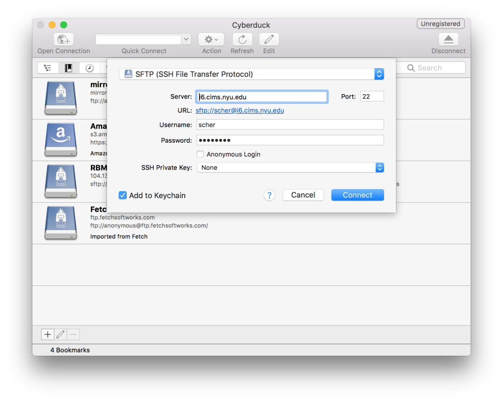
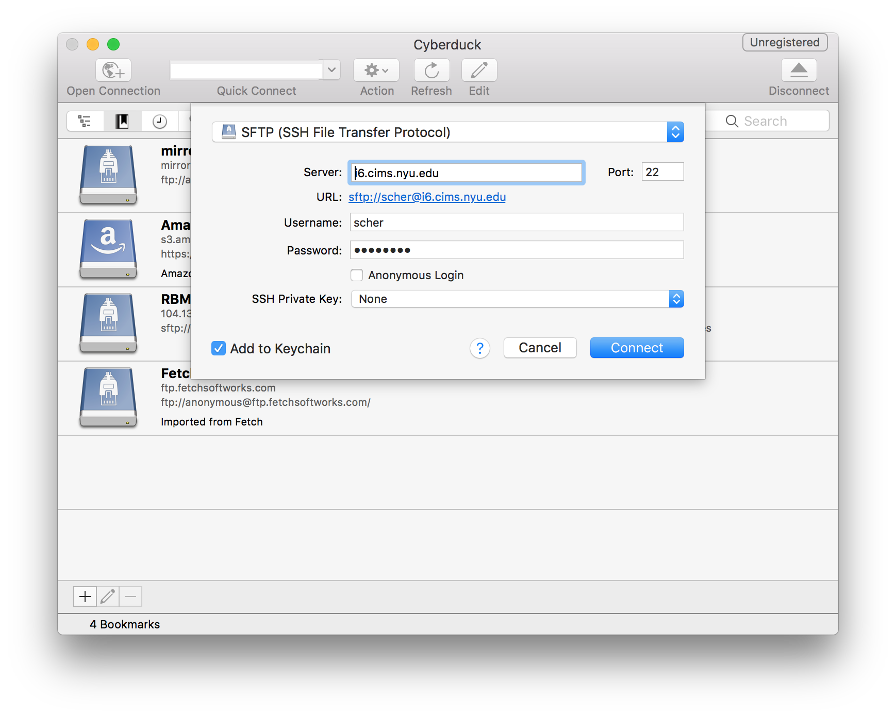
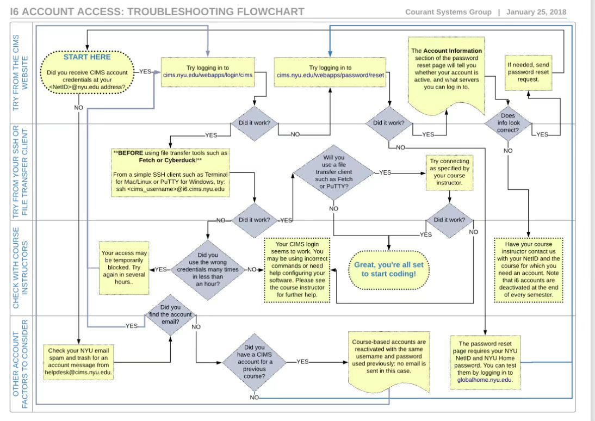

## 1. 软件安装

1. [https://atom.io/](https://atom.io/)
2. [http://www.barebones.com/products/textwrangler/](http://www.barebones.com/products/textwrangler/)
3. [https://notepad-plus-plus.org/](https://notepad-plus-plus.org/)
4. [https://fetchsoftworks.com/](https://fetchsoftworks.com/)
5. Putty：命令行操作服务器，SSH
6. WinScp：文件操作
7. SublimeText：[https://www.sublimetext.com/download](https://www.sublimetext.com/download)
8. [https://www.jetbrains.com/webstorm/](https://www.jetbrains.com/webstorm/)

## Windows Software For Secure Access:

**Login Shell Programs**

- **[putty](https://www.chiark.greenend.org.uk/~sgtatham/putty/latest.html):** Further [information ](http://the.earth.li/~sgtatham/putty/0.53b/htmldoc/)and some [example commands](https://cims.nyu.edu/webapps/content/systems/userservices/netaccess/secure#putty)

**File Transfer Programs**

- **[winscp](https://winscp.net/)**
- **[psftp](https://www.chiark.greenend.org.uk/~sgtatham/putty/latest.html):** Further [information](http://the.earth.li/~sgtatham/putty/0.53b/htmldoc/Chapter6.html#6) and some [example commands](https://cims.nyu.edu/webapps/content/systems/userservices/netaccess/secure#psftp)

## 2. Assignment 1: Unix

This assignment will create an initial Web page for you on a Unix server at i6.cims.nyu.edu/~netid.

This will just set up your Web page for the first time. Soon you will update the page, but for now you just need to access your account and establish your page.

### 2.1 Writing Your Web Page

You need to establish your page with your name in the title and body.

Use [Atom](https://atom.io/), [TextWrangler](http://www.barebones.com/products/textwrangler/) (Mac), or [Notepad++](http://notepad-plus-plus.org/) (Windows) to type in or copy the HTML code below and enter your name into the title and body of the page.

```html
<!DOCTYPE html>
<html>
  <head>
      <title>Your name goes here</title>
  </head>
  <body>
    <p>Your name and any other text you would like goes here.</p>
  </body>
</html>
```

Save this file as “`index.html`” on your computer. Test it locally in a Web browser to make sure it looks as it should using File > Open File . . . from within Chrome, Firefox, or Safari.

### 2.2 Uploading Your Web Page

Now, use an SFTP program to transfer your “index.html” Web page file from your computer to the i6 server. [Fetch](https://fetchsoftworks.com/) is a Mac SFTP program available for free to NYU students [from ITS](https://www.nyu.edu/its/software/#fetch). Alternatively, you can try [Cyberduck](http://cyberduck.ch/) for the Mac or [WinSCP](http://winscp.net/) for Windows. Whatever program you use, be sure to connect using SFTP (as opposed to FTP).

If you are using Fetch, here is the opening screen; fill it in as follows but with your own NetID and click “Connect.” After logging in, you can use “Put” to copy files to the server and “Get” to bring files down from the server to your local machine.



Upload the index.html file from your computer to your i6 account inside your **public_html** folder. Once you have uploaded the file, check to make sure your Web page is visible at: i6.cims.nyu.edu/~netid

### 2.3 Submitting Your Assignment

- Post the URL of your Web page to BrightSpace for your instructor and grader.

**Start Date**

- Sep 8, 2022 6:59 AM

**Due Date**

- Sep 13, 2022 8:00 AM



## 3. Submit

Text submission



成功：[https://i6.cims.nyu.edu/~zq2076/index.html](https://i6.cims.nyu.edu/~zq2076/index.html)

## 4. URL 是什么？

## 5. 时间表

- 每天一个小时
    - Java
    - Python
    - Blog
    - 。。。
    - 让自己更加高效。

欢迎关注我公众号：AI悦创，有更多更好玩的等你发现！

::: details 公众号：AI悦创【二维码】


:::

::: info AI悦创·编程一对一

AI悦创·推出辅导班啦，包括「Python 语言辅导班、C++ 辅导班、java 辅导班、算法/数据结构辅导班、少儿编程、pygame 游戏开发」，全部都是一对一教学：一对一辅导 + 一对一答疑 + 布置作业 + 项目实践等。当然，还有线下线上摄影课程、Photoshop、Premiere 一对一教学、QQ、微信在线，随时响应！微信：Jiabcdefh

C++ 信息奥赛题解，长期更新！长期招收一对一中小学信息奥赛集训，莆田、厦门地区有机会线下上门，其他地区线上。微信：Jiabcdefh

方法一：[QQ](http://wpa.qq.com/msgrd?v=3&uin=1432803776&site=qq&menu=yes)

方法二：微信：Jiabcdefh

:::

