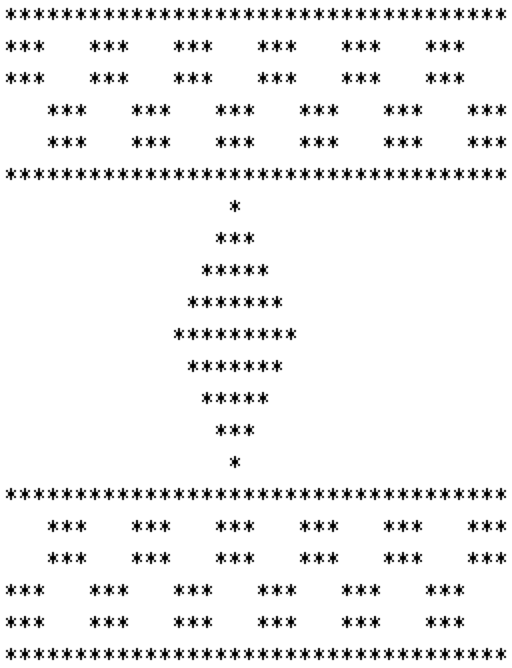
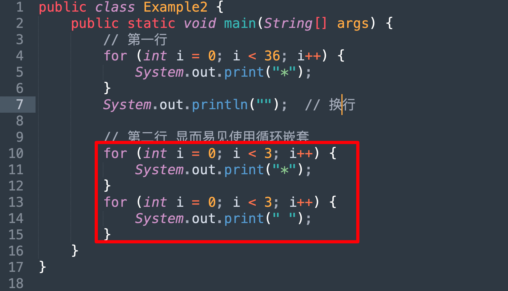
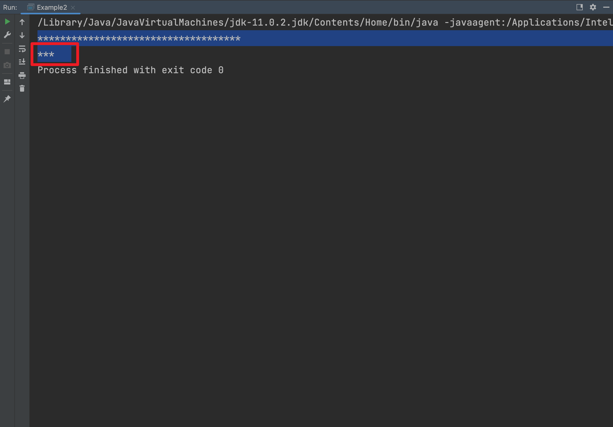
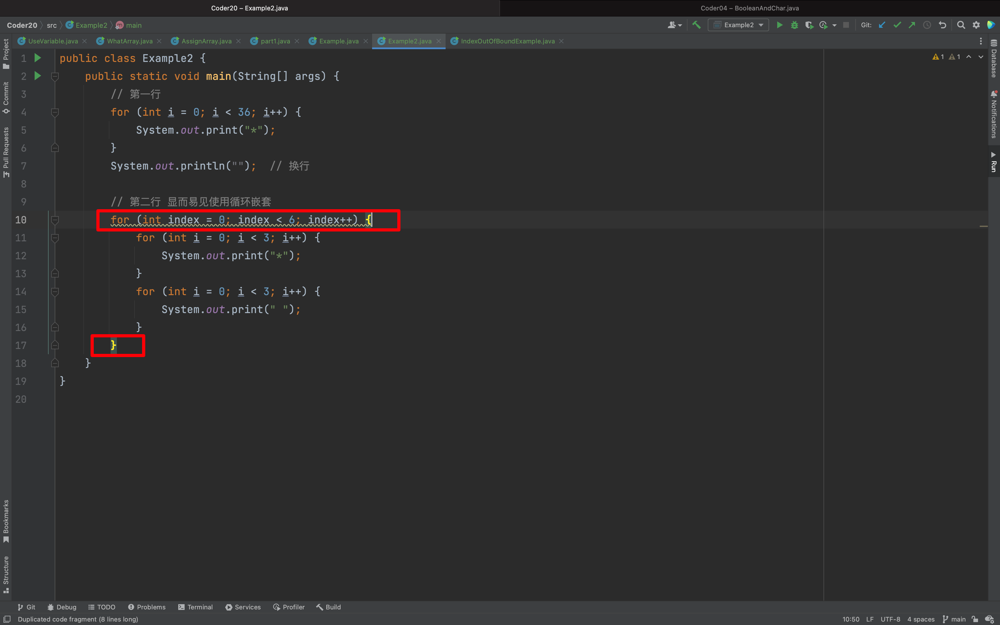
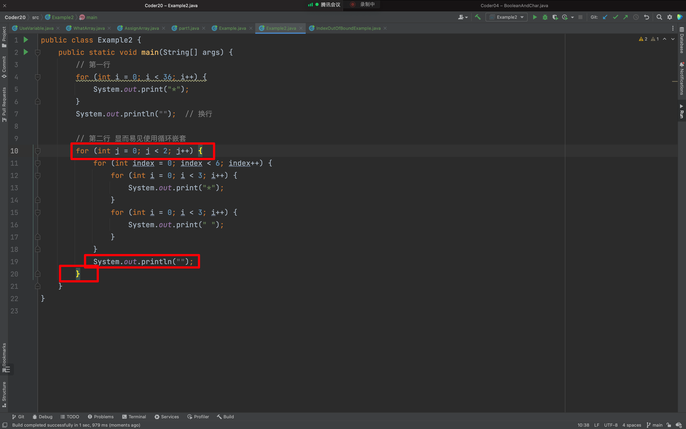
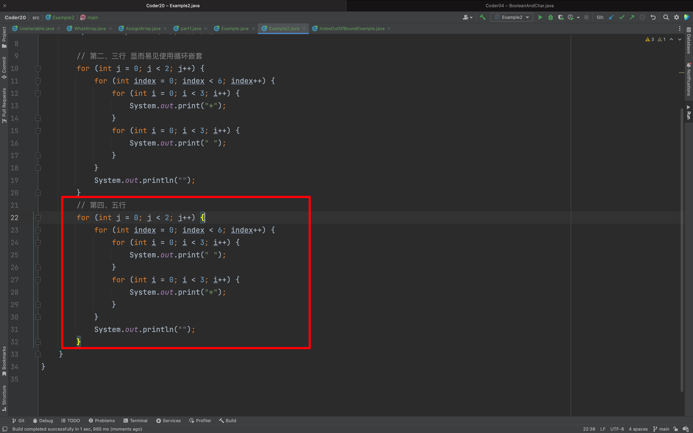
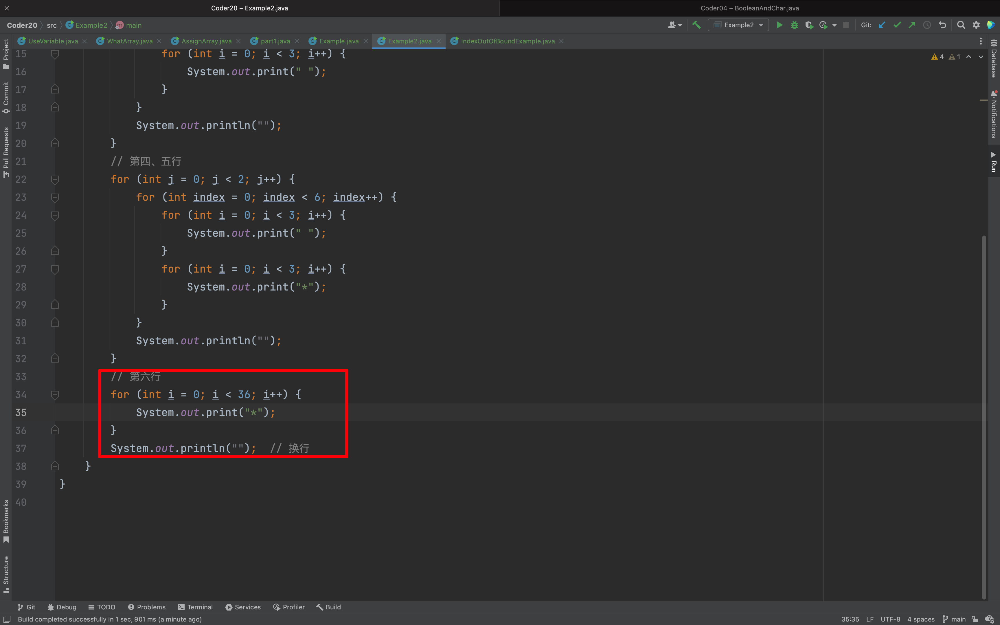
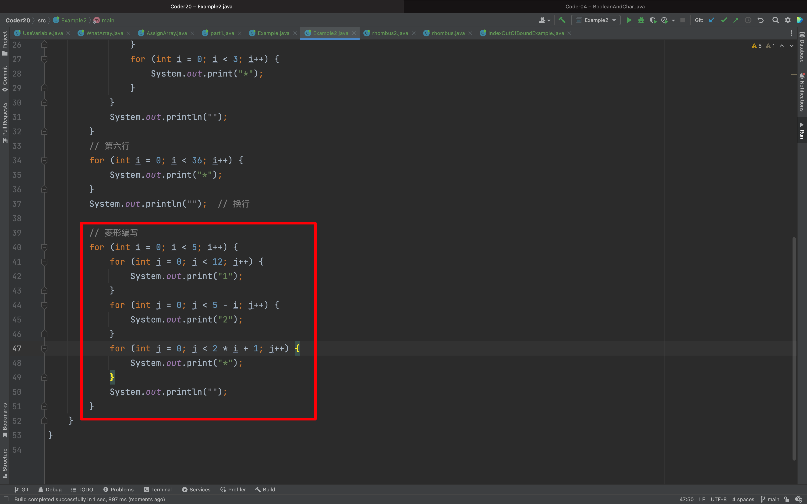
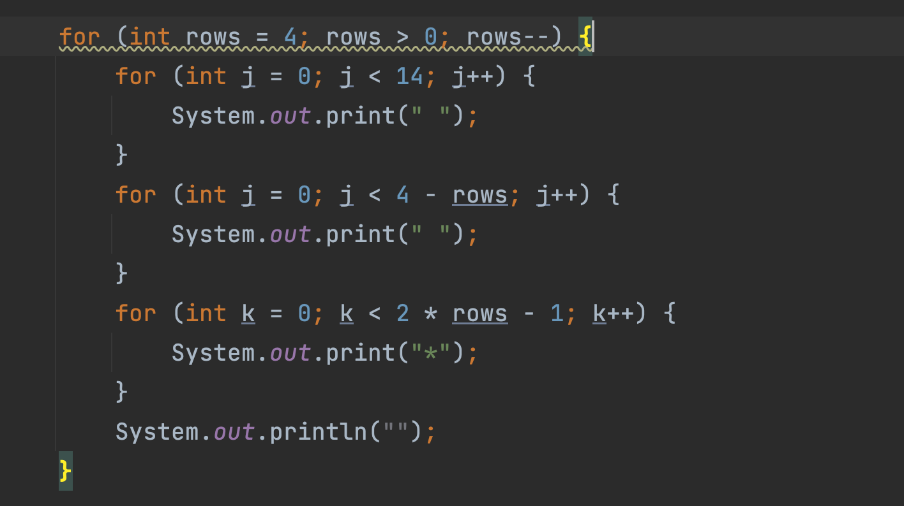
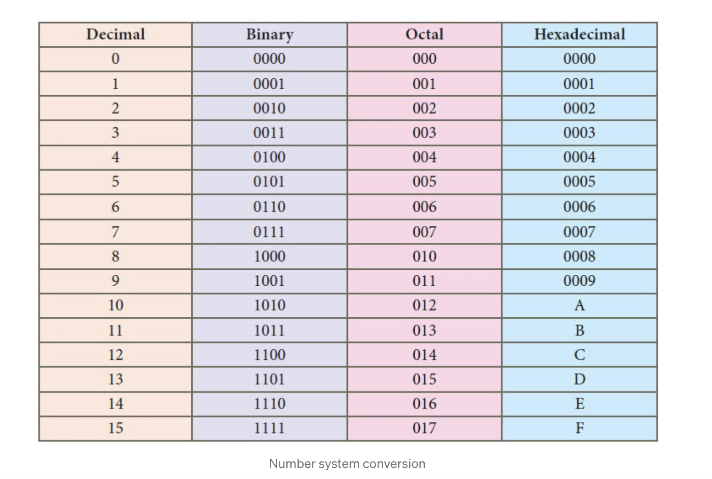

## POLICY & RULES

### ACADEMIC INTEGRITY

The Department of Computer Science believes that academic integrity is a core principle of education. According to the Center for Academic Integrity (www.academicintegrity.org), academic integrity begins as a commitment to five fundamental values: honesty, trust, fairness, respect and responsibility. These values begin with the individual and extend to others in the community of learning. In the classroom, they give rise to the following concrete but non-exhaustive rules for student behavior:

- Students are to do all assignments individually, with no collaboration or sharing of work, unless the instructor explicitly permits collaboration. If the instructor does not explicitly permit collaboration and one student shows or gives his/her work to another, then both students are considered to be cheating. Students may not use work provided by any person outside the class or by any external source such as the Web. Furthermore, students may not solicit other people to do assignments (in whole or in part) for them.
- When an instructor permits collaboration on an assignment, then collaboration is permitted only to the degree and in the respects that he/she specifies. Each assignment that is done collaboratively must state that it was done collaboratively and must list the collaborators.
- External sources, including published materials or material on the Web, may be used in assignments only to the extent permitted by the instructor. If such a source is used, the assignment must include an attribution to the source. Ideas, algorithms, text, code, and experimental results all require proper attribution.
- A student may not submit the same assignment to two different classes, whether in the same semester or in different semesters, without the explicit permission of both instructors.
- During an exam, students must not communicate in any way, nor use any materials or technology not explicitly permitted by the instructor. One student may not look at another student's test. If one student allows another student to look at his/her test, both students are considered to be cheating.
- A student may not attempt to gain possession of or look at an exam before the start of the exam.

Disciplinary actions can vary in severity and can result in probation or termination from the program. Students involved in academic misconduct incidents are no longer eligible for academic program support jobs (such as grader, tutor, etc.) in our department. See the CAS page on [academic integrity ](https://cas.nyu.edu/content/nyu-as/cas/academic-integrity.html)for more information.

## Introduction to Computer Science

::: center

## CSC1-UA- 0101

**Due date is 10/4 by 11:55 PM**

**Updated on 9/29**

**Methods are not required for this assignment!**

:::

## Code of Conduct

All assignments are graded, meaning we expect you to adhere to the academic integrity standards of NYU. To avoid any confusion regarding this, we will briefly state what is and isn’t allowed when working on an assignment.

Any document and program code that you submit must be fully written by yourself. You can, of course, discuss your work with fellow students, as long as these discussions are restricted to general solution techniques. Put differently, these discussions should not be about concrete code you are writing, nor about specific results you wish to submit. When discussing an assignment 

with others, this should never lead to you possessing the complete or partial solution of others, regardless of whether the solution is in paper or digital form, and independent of who made the solution. That means, you are also not allowed to possess solutions by someone from a different year or course, by someone from another university, or code from the Internet, etc. This also implies that there is never a valid reason to share your code with fellow students, and that there is no valid reason to publish your code online in any form.

Every student is responsible for the work they submit. If there is any doubt during the grading about whether a student created the assignment themselves (e.g. if the solution matches that of others), we reserve the option to let the student explain why this is the case. In case doubts remain, or we decide to directly escalate the issue, the suspected violations will be reported to the academic administration according to the policies of NYU (see [https://cs.nyu.edu/home/undergrad/policy.html](https://cs.nyu.edu/home/undergrad/policy.html)).


## Assignment # 2 Details

**Part 1 (50 points): Weaving a Kilim Carpet Application Weaving a Kilim Carpet Application using loops and nested loops: Save as Part1.java**

> 第1部分(50分):使用循环和嵌套循环编织 Kilim Carpet 应用程序:保存为 Part1.java

Kilims are woven carpets which generally use symmetrical designs. For this assignment, instead of using a loom, wool, and a shuttle, we are asking you to produce a pattern of your own design using loops and nested loops. 

> Kilims 是一种编织地毯，通常采用对称的设计。在这个作业中，我们不是使用织布机、羊毛和梭子，而是要求你使用循环和嵌套循环来制作你自己设计的图案。

Write a program to weave **your own Kilim carpet** with 30 rows by 30 columns. The patterns should be **designed by you (it should be different than the design of carpet below**). **Your carpet though MUST include at least one diamond shape, checkerboards, and squares** (See example below for these patterns). **Also, use other characters such as $ or % or + or @ rather than a “\*” to weave the rug. Make sure not to copy the entire pattern from the below rug or copy patterns from another student**! Show your creativity by weaving a different design while meeting the requirements mentioned above. You will get extra credit for excellent design and added features.

> 编写一个程序来编织你自己的 30 行 30 柱的 Kilim 地毯。图案应该是你自己设计的(应该和下面地毯的图案不一样)不过，你的地毯至少要有一种菱形、棋盘格和正方形的图案(见下面的例子)。此外，使用其他字符，如 $ 或 % 或 + 或 @ 而不是“*”来编织地毯。确保不要从下面的地毯复制整个图案或从其他学生复制图案!在满足上述要求的同时，通过编织不同的设计来展示你的创造力。优秀的设计和增加的功能将获得额外的学分。

**Here is a 12th Century Moroccan Kilim Carpet sample pattern made of 25 rows and 36 columns:**

**(This design is made up of stars (asterisks) and spaces, please ignore the border, color, and the shading effect):**

> 这是一张12世纪的摩洛哥Kilim地毯样品图案，25行36柱(这个图案由星号和空格组成，请忽略边框、颜色和阴影效果):




**Here are the requirements:** 

- Every print statement should print no more than one character such as '*' or one space ' '.  Do not use statements such as: `print("************************************")` but rather use loops for every repetition. 

> 每个打印语句应该打印不超过一个字符，例如'*'或一个空格' '。不要使用语句如: `print ("************************************")` 而是每个重复循环使用。

- Use loops and nested loops to produce these patterns. 

> 使用循环和嵌套循环来生成这些模式。

- You can't use control structure such as switch or if/ else if /else in your program.

> 不能在程序中使用switch或if/ else if/ else等控制结构。

- You have to design your own carpet (different than the carpet from above). 

> 你必须自己设计地毯(与上面的地毯不同)。

- Your carpet MUST include at least one diamond shape, checkerboards, and squares. (see example from above for these patterns).

> 你的地毯至少要有一种菱形、棋盘格和正方形。(参见上面的例子了解这些模式)。

- Some of the patterns are repeated; you might want to first isolate the elements in the design (eg. the first two rows, the "checkerboard" elements, the triangle) and then combine them to form the "rug". 

> 有些模式是重复的;你可能想要首先分离设计中的元素(例如。前两行，“棋盘”元素，三角形)，然后将它们组合成“地毯”。

- If the Dimond is too difficult to produce as one pattern, you can break it into 4 triangles or apply any solution you see fit as long you comply with the assignment’s requirements. 

> 如果菱形很难制作成一个图案，你可以把它分成4个三角形，或者应用任何你认为适合的解决方案，只要你符合作业的要求。

## 解题

### 1. 一行一行分析「第一行」


上面的 `*` 有几个？—— 36

```python
In [1]: s = len("中米米米米米米米米米米米本米米本米米本米米本米米本米米本米米本米米本米米") # 长度和上图是一样的，但是我使用图片识别直接提取的，所以字符串内容你不用管。

In [2]: s
Out[2]: 36
```

```java
public class Example2 {
    public static void main(String[] args) {
        for (int i = 0; i < 36; i++) {
            System.out.print("*");
        }
        System.out.println("");  // 换行
    }
}
```

输出：

```java
************************************

```

### 2. 第二、三行


3 * 6 = 18



```java
public class Example2 {
    public static void main(String[] args) {
        // 第一行
        for (int i = 0; i < 36; i++) {
            System.out.print("*");
        }
        System.out.println("");  // 换行

        // 第二行 显而易见使用循环嵌套
        for (int i = 0; i < 3; i++) {
            System.out.print("*");
        }
        for (int i = 0; i < 3; i++) {
            System.out.print(" ");
        }
    }
}
```

输出：



```java
************************************
***   
```

显而易见，这是单次循环生成的结果，那我们接下来可以实现多次循环。「也就是，在这两个循环外面包裹一次循环」



```java
public class Example2 {
    public static void main(String[] args) {
        // 第一行
        for (int i = 0; i < 36; i++) {
            System.out.print("*");
        }
        System.out.println("");  // 换行

        // 第二行 显而易见使用循环嵌套
        for (int index = 0; index < 2; index++) {
            for (int i = 0; i < 3; i++) {
                System.out.print("*");
            }
            for (int i = 0; i < 3; i++) {
                System.out.print(" ");
            }
        }
    }
}
```

输出：

```java
************************************
***   ***   ***   ***   ***   ***   
```

那还有一行？怎么弄？copy 一份，在写一个？——再嵌套吧！「谁叫你们老师要嵌套」



```java
public class Example2 {
    public static void main(String[] args) {
        // 第一行
        for (int i = 0; i < 36; i++) {
            System.out.print("*");
        }
        System.out.println("");  // 换行

        // 第二行 显而易见使用循环嵌套
        for (int j = 0; j < 2; j++) {
            for (int index = 0; index < 6; index++) {
                for (int i = 0; i < 3; i++) {
                    System.out.print("*");
                }
                for (int i = 0; i < 3; i++) {
                    System.out.print(" ");
                }
            }
            System.out.println("");
        }
    }
}
```

### 「看到这里，自己思考一下，下面如何实现吧～」

### 3. 第四、五行



```java
public class Example2 {
    public static void main(String[] args) {
        // 第一行
        for (int i = 0; i < 36; i++) {
            System.out.print("*");
        }
        System.out.println("");  // 换行

        // 第二、三行 显而易见使用循环嵌套
        for (int j = 0; j < 2; j++) {
            for (int index = 0; index < 6; index++) {
                for (int i = 0; i < 3; i++) {
                    System.out.print("*");
                }
                for (int i = 0; i < 3; i++) {
                    System.out.print(" ");
                }
            }
            System.out.println("");
        }
        // 第四、五行
        for (int j = 0; j < 2; j++) {
            for (int index = 0; index < 6; index++) {
                for (int i = 0; i < 3; i++) {
                    System.out.print(" ");
                }
                for (int i = 0; i < 3; i++) {
                    System.out.print("*");
                }
            }
            System.out.println("");
        }
    }
}
```

输出：

```java
************************************
***   ***   ***   ***   ***   ***   
***   ***   ***   ***   ***   ***   
   ***   ***   ***   ***   ***   ***
   ***   ***   ***   ***   ***   ***
```

### 4. 第六行



```java
public class Example2 {
    public static void main(String[] args) {
        // 第一行
        for (int i = 0; i < 36; i++) {
            System.out.print("*");
        }
        System.out.println("");  // 换行

        // 第二、三行 显而易见使用循环嵌套
        for (int j = 0; j < 2; j++) {
            for (int index = 0; index < 6; index++) {
                for (int i = 0; i < 3; i++) {
                    System.out.print("*");
                }
                for (int i = 0; i < 3; i++) {
                    System.out.print(" ");
                }
            }
            System.out.println("");
        }
        // 第四、五行
        for (int j = 0; j < 2; j++) {
            for (int index = 0; index < 6; index++) {
                for (int i = 0; i < 3; i++) {
                    System.out.print(" ");
                }
                for (int i = 0; i < 3; i++) {
                    System.out.print("*");
                }
            }
            System.out.println("");
        }
        // 第六行
        for (int i = 0; i < 36; i++) {
            System.out.print("*");
        }
        System.out.println("");  // 换行
    }
}
```

输出：

```java
************************************
***   ***   ***   ***   ***   ***   
***   ***   ***   ***   ***   ***   
   ***   ***   ***   ***   ***   ***
   ***   ***   ***   ***   ***   ***
************************************
```

### 5. 菱形编写

```python
In [48]: len("************************************")/2
Out[48]: 18.0
```

在此之前，我们先单独编写出菱形：

```java
public class rhombus {
    public static void main(String[] args) {
        // 菱形编写
        // 1
        for (int i = 0; i < 18 - 1; i++) {
            System.out.print(" ");
        }
        System.out.println("*");

        // 2
        for (int i = 0; i < 18 - 2; i++) {
            System.out.print(" ");
        }
        for (int i = 0; i < 3; i++) {
            System.out.print("*");
        }
        System.out.println("");

        // 3
        for (int i = 0; i < 18 - 3; i++) {
            System.out.print(" ");
        }
        for (int i = 0; i < 5; i++) {
            System.out.print("*");
        }
        System.out.println("");

        // 4
        for (int i = 0; i < 18 - 4; i++) {
            System.out.print(" ");
        }
        for (int i = 0; i < 7; i++) {
            System.out.print("*");
        }
        System.out.println("");

        // 5
        for (int i = 0; i < 18 - 5; i++) {
            System.out.print(" ");
        }
        for (int i = 0; i < 9; i++) {
            System.out.print("*");
        }
        System.out.println("");

    }
}
```

**观察循环规律，改写成嵌套循环。**



```java
public class Example2 {
    public static void main(String[] args) {
        // 第一行
        for (int i = 0; i < 36; i++) {
            System.out.print("*");
        }
        System.out.println("");  // 换行

        // 第二、三行 显而易见使用循环嵌套
        for (int j = 0; j < 2; j++) {
            for (int index = 0; index < 6; index++) {
                for (int i = 0; i < 3; i++) {
                    System.out.print("*");
                }
                for (int i = 0; i < 3; i++) {
                    System.out.print(" ");
                }
            }
            System.out.println("");
        }
        // 第四、五行
        for (int j = 0; j < 2; j++) {
            for (int index = 0; index < 6; index++) {
                for (int i = 0; i < 3; i++) {
                    System.out.print(" ");
                }
                for (int i = 0; i < 3; i++) {
                    System.out.print("*");
                }
            }
            System.out.println("");
        }
        // 第六行
        for (int i = 0; i < 36; i++) {
            System.out.print("*");
        }
        System.out.println("");  // 换行

        // 菱形编写
        for (int i = 0; i < 5; i++) {
            for (int j = 0; j < 12; j++) {
                System.out.print("1");
            }
            for (int j = 0; j < 5 - i; j++) {
                System.out.print("2");
            }
            for (int j = 0; j < 2 * i + 1; j++) {
                System.out.print("*");
            }
            System.out.println("");
        }
    }
}
```

---

```java
/*
 * Author: AndersonHJB
 * time: 2020年10月3日
 * Project: Java Kilim*/
public class kai_part1 {
    public static void main(String[] args) {
        for (int i = 0; i < 36; i++) {
            System.out.print("*");
        }
        System.out.println("");

        for (int j = 0; j < 2; j++) {
            for (int rows = 0; rows < 6; rows++) {
                for (int i = 0; i < 3; i++) {
                    System.out.print("*");
                }
                for (int i = 0; i < 3; i++) {
                    System.out.print(" ");
                }
            }
            System.out.println("");
        }

        for (int j = 0; j < 2; j++) {
            for (int rows = 0; rows < 6; rows++) {
                for (int i = 0; i < 3; i++) {
                    System.out.print(" ");
                }
                for (int i = 0; i < 3; i++) {
                    System.out.print("*");
                }
            }
            System.out.println("");
        }

        for (int i = 0; i < 36; i++) {
            System.out.print("*");
        }
        System.out.println("");

        // 菱形
        // 1
//        for (int i = 0; i < 17; i++) {
//            System.out.print(" ");
//        }
//        System.out.println("*");
//
//        // 2
//        for (int i = 0; i < 16; i++) {
//            System.out.print(" ");
//        }
//        for (int i = 0; i < 3; i++) {
//            System.out.print("*");
//        }
//        System.out.println("");
//
//        // 3
//        for (int i = 0; i < 15; i++) {
//            System.out.print(" ");
//        }
//        for (int i = 0; i < 5; i++) {
//            System.out.print("*");
//        }
//
//        // 4
//        for (int i = 0; i < 15; i++) {
//            System.out.print(" ");
//        }
//        for (int i = 0; i < 5; i++) {
//            System.out.print("*");
//        }
        for (int rows = 0; rows < 5; rows++) {
            for (int j = 0; j < 12; j++) {
                System.out.print(" ");
            }
            for (int j = 0; j < 5 - rows; j++) {
                System.out.print(" ");
            }
            for (int k = 0; k < 2 * rows + 1; k++) {
                System.out.print("*");
            }
            System.out.println("");
        }


    }
}
```

```java
for (int rows = 0; rows < 5; rows++) {
            for (int j = 0; j < 12; j++) {
                System.out.print(" ");
            }
            for (int j = 0; j < 5 - rows; j++) {
                System.out.print(" ");
            }
            for (int k = 0; k < 2 * rows + 1; k++) {
                System.out.print("*");
            }
            System.out.println("");
        }
```

下半部分菱形：



菱形解决之后，后面的和上面的如法炮制。

### 完整的代码1「复现你们老师的代码」

```java
public class kai_part1 {
    public static void main(String[] args) {
        String S_T = "*";

        for (int i = 0; i < 36; i++) {
            System.out.print(S_T);
        }
        System.out.println("");

        for (int j = 0; j < 2; j++) {
            for (int rows = 0; rows < 6; rows++) {
                for (int i = 0; i < 3; i++) {
                    System.out.print(S_T);
                }
                for (int i = 0; i < 3; i++) {
                    System.out.print(" ");
                }
            }
            System.out.println("");
        }

        for (int j = 0; j < 2; j++) {
            for (int rows = 0; rows < 6; rows++) {
                for (int i = 0; i < 3; i++) {
                    System.out.print(" ");
                }
                for (int i = 0; i < 3; i++) {
                    System.out.print(S_T);
                }
            }
            System.out.println("");
        }

        for (int i = 0; i < 36; i++) {
            System.out.print(S_T);
        }
        System.out.println("");

        // 菱形
        // 1
//        for (int i = 0; i < 17; i++) {
//            System.out.print(" ");
//        }
//        System.out.println("*");
//
//        // 2
//        for (int i = 0; i < 16; i++) {
//            System.out.print(" ");
//        }
//        for (int i = 0; i < 3; i++) {
//            System.out.print("*");
//        }
//        System.out.println("");
//
//        // 3
//        for (int i = 0; i < 15; i++) {
//            System.out.print(" ");
//        }
//        for (int i = 0; i < 5; i++) {
//            System.out.print("*");
//        }
//
//        // 4
//        for (int i = 0; i < 15; i++) {
//            System.out.print(" ");
//        }
//        for (int i = 0; i < 5; i++) {
//            System.out.print("*");
//        }


        for (int rows = 0; rows < 5; rows++) {
            for (int j = 0; j < 12; j++) {
                System.out.print(" ");
            }
            for (int j = 0; j < 5 - rows; j++) {
                System.out.print(" ");
            }
            for (int k = 0; k < 2 * rows + 1; k++) {
                System.out.print(S_T);
            }
            System.out.println("");

        }
        // 正方形
//        for (int rows = 0; rows < 4; rows++) {
//            for (int i = 0; i < 3; i++) {
//                for (int a = 0; a < 10; a++) {
//                    System.out.print("*");
//                }
//                for (int b = 0; b < 2; b++) {
//                    System.out.print(" ");
//                }
//            }
//            System.out.println("");
//        }
        // 结尾

        for (int rows = 4; rows > 0; rows--) {
            for (int j = 0; j < 14; j++) {
                System.out.print(" ");
            }
            for (int j = 0; j < 4 - rows; j++) {
                System.out.print(" ");
            }
            for (int k = 0; k < 2 * rows - 1; k++) {
                System.out.print(S_T);
            }
            System.out.println("");
        }

        for (int i = 0; i < 36; i++) {
            System.out.print(S_T);
        }
        System.out.println("");


        for (int j = 0; j < 2; j++) {
            for (int rows = 0; rows < 6; rows++) {
                for (int i = 0; i < 3; i++) {
                    System.out.print(" ");
                }
                for (int i = 0; i < 3; i++) {
                    System.out.print(S_T);
                }
            }
            System.out.println("");
        }

        for (int j = 0; j < 2; j++) {
            for (int rows = 0; rows < 6; rows++) {
                for (int i = 0; i < 3; i++) {
                    System.out.print(S_T);
                }
                for (int i = 0; i < 3; i++) {
                    System.out.print(" ");
                }
            }
            System.out.println("");
        }

        for (int i = 0; i < 36; i++) {
            System.out.print(S_T);
        }
        System.out.println("");

    }
}
```

输出：

```java
/Library/Java/JavaVirtualMachines/jdk-11.0.2.jdk/Contents/Home/bin/java -javaagent:/Applications/IntelliJ IDEA.app/Contents/lib/idea_rt.jar=52267:/Applications/IntelliJ IDEA.app/Contents/bin -Dfile.encoding=UTF-8 -classpath /Users/huangjiabao/GitHub/Java_Coder/Coder20/out/production/Coder20 kai_part1
************************************
***   ***   ***   ***   ***   ***   
***   ***   ***   ***   ***   ***   
   ***   ***   ***   ***   ***   ***
   ***   ***   ***   ***   ***   ***
************************************
                 *
                ***
               *****
              *******
             *********
              *******
               *****
                ***
                 *
************************************
   ***   ***   ***   ***   ***   ***
   ***   ***   ***   ***   ***   ***
***   ***   ***   ***   ***   ***   
***   ***   ***   ***   ***   ***   
************************************

Process finished with exit code 0
```

。。。。

经过不懈的努力，答案如下：

```java
public class part1000 {

    public static void main(String[] args) {
        // ************************************
        for (int i = 0; i < 36; i++) {
            System.out.print("*");
        }
        System.out.println("");

        /*
         ***   ***   ***   ***   ***   ***
         ***   ***   ***   ***   ***   ***
         */
        for (int i = 0; i < 2; i++) {
            for (int j = 0; j < 6; j++) {
                for (int k = 0; k < 3; k++) {
                    System.out.print("*");
                }
                for (int k = 0; k < 3; k++) {
                    System.out.print(" ");
                }
            }
            System.out.println("");
        }

        /*
         ——>***   ***   ***   ***   ***   ***
         ——>***   ***   ***   ***   ***   ***
        */
        for (int i = 0; i < 2; i++) {
            for (int j = 0; j < 6; j++) {
                for (int k = 0; k < 3; k++) {
                    System.out.print(" ");
                }
                for (int k = 0; k < 3; k++) {
                    System.out.print("*");
                }

            }
            System.out.println("");
        }
        // ************************************
        for (int i = 0; i < 36; i++) {
            System.out.print("*");
        }
        System.out.println("");

        /*
          *           *           *
         ***         ***         ***
        *****       *****       *****
       *******     *******     *******
      *********   *********   *********
         */
        for (int i = 0; i < 5; i++) {
            // 5 层  i<5
            for (int j = 0; j < 1; j++) {
                System.out.print("j");  // 一行一行的拆封解决
            }
            for (int j = 0; j < 3; j++) {
                dsj(i);
            }
            System.out.println("");
        }

        for (int i = 4; i > 0; i--) {
            for (int j = 0; j < 3; j++) {
                System.out.print(" ");
            }
            for (int j = 0; j < 3; j++) {
                xsj(i);
            }
            System.out.println("");
        }

        // 结尾
        for (int i = 0; i < 36; i++) {
            System.out.print("*");
        }
        System.out.println("");

        for (int i = 0; i < 2; i++) {
            for (int j = 0; j < 6; j++) {
                for (int k = 0; k < 3; k++) {
                    System.out.print(" ");
                }
                for (int k = 0; k < 3; k++) {
                    System.out.print("*");
                }

            }
            System.out.println("");
        }

        for (int i = 0; i < 2; i++) {
            for (int j = 0; j < 6; j++) {
                for (int k = 0; k < 3; k++) {
                    System.out.print("*");
                }
                for (int k = 0; k < 3; k++) {
                    System.out.print(" ");
                }

            }
            System.out.println("");
        }

        for (int i = 0; i < 36; i++) {
            System.out.print("*");
        }
        System.out.println("");
    }

    public static void xsj(int i) {
        for (int j = 0; j < 4 - i; j++) {
            System.out.print(" ");
        }
        for (int j = 0; j < 2 * i - 1; j++) {
            System.out.print("*");
        }
        for (int j = 0; j < 9 - i; j++) {
            System.out.print(" ");
        }
    }

    public static void dsj(int i) {
        for (int j = 0; j < 5 - i; j++) {
            System.out.print(" ");
        }
        for (int j = 0; j < 2 * i + 1; j++) {
            System.out.print("*");
        }
        for (int j = 0; j < 6 - i; j++) {
            System.out.print(" ");
        }
    }
}
```

输出：

```java
/Library/Java/JavaVirtualMachines/jdk-11.0.2.jdk/Contents/Home/bin/java -javaagent:/Applications/IntelliJ IDEA.app/Contents/lib/idea_rt.jar=52338:/Applications/IntelliJ IDEA.app/Contents/bin -Dfile.encoding=UTF-8 -classpath /Users/huangjiabao/GitHub/Java_Coder/Coder20/out/production/Coder20 part1000
************************************
***   ***   ***   ***   ***   ***   
***   ***   ***   ***   ***   ***   
   ***   ***   ***   ***   ***   ***
   ***   ***   ***   ***   ***   ***
************************************
j     *           *           *      
j    ***         ***         ***     
j   *****       *****       *****    
j  *******     *******     *******   
j *********   *********   *********  
   *******     *******     *******     
    *****       *****       *****      
     ***         ***         ***       
      *           *           *        
************************************
   ***   ***   ***   ***   ***   ***
   ***   ***   ***   ***   ***   ***
***   ***   ***   ***   ***   ***   
***   ***   ***   ***   ***   ***   
************************************

Process finished with exit code 0
```

**在中间再加个正方形？一共六个怎么样？big big Kilim！**

## 1.0 code

```java
public class Java_Generate_Carpet {
    public static void main(String[] args) {
        // 地毯图标修改变量
        String icon = "$";  // 你既然喜欢钻石，我给你满是 money 的你
        // ************************************
        for (int i = 0; i < 36; i++) {
            System.out.print(icon);
        }
        System.out.println("");

        /*
         ***   ***   ***   ***   ***   ***
         ***   ***   ***   ***   ***   ***
         */
        for (int i = 0; i < 2; i++) {
            for (int j = 0; j < 6; j++) {
                for (int k = 0; k < 3; k++) {
                    System.out.print(icon);
                }
                for (int k = 0; k < 3; k++) {
                    System.out.print(" ");
                }
            }
            System.out.println("");
        }

        /*
         ——>***   ***   ***   ***   ***   ***
         ——>***   ***   ***   ***   ***   ***
        */
        for (int i = 0; i < 2; i++) {
            for (int j = 0; j < 6; j++) {
                for (int k = 0; k < 3; k++) {
                    System.out.print(" ");
                }
                for (int k = 0; k < 3; k++) {
                    System.out.print(icon);
                }

            }
            System.out.println("");
        }
        // ************************************
        for (int i = 0; i < 36; i++) {
            System.out.print(icon);
        }
        System.out.println("");
        // 正方形「数据不是正方形，但图形是正方形
        for (int rows = 0; rows < 4; rows++) {
            for (int i = 0; i < 3; i++) {
                for (int a = 0; a < 10; a++) {
                    System.out.print(icon);
                }
                for (int b = 0; b < 2; b++) {
                    System.out.print(" ");
                }
            }
            System.out.println("");
        }
        /*
         *           *           *
        ***         ***         ***
       *****       *****       *****
      *******     *******     *******
     *********   *********   *********
         */
        // 菱形
        for (int i = 0; i < 5; i++) {
            // 5 层  i<5
            for (int j = 0; j < 1; j++) {
                System.out.print(" ");  // 一行一行的拆封解决
            }
            for (int j = 0; j < 3; j++) {
                dsj(i);
            }
            System.out.println("");
        }

        for (int i = 4; i > 0; i--) {
            for (int j = 0; j < 3; j++) {
                System.out.print(" ");
            }
            for (int j = 0; j < 3; j++) {
                xsj(i);
            }
            System.out.println("");
        }
        // 厦门正方形
        for (int rows = 0; rows < 4; rows++) {
            for (int i = 0; i < 3; i++) {
                for (int a = 0; a < 10; a++) {
                    System.out.print(icon);
                }
                for (int b = 0; b < 2; b++) {
                    System.out.print(" ");
                }
            }
            System.out.println("");
        }

        // 结尾
        for (int i = 0; i < 36; i++) {
            System.out.print(icon);
        }
        System.out.println("");

        for (int i = 0; i < 2; i++) {
            for (int j = 0; j < 6; j++) {
                for (int k = 0; k < 3; k++) {
                    System.out.print(" ");
                }
                for (int k = 0; k < 3; k++) {
                    System.out.print(icon);
                }

            }
            System.out.println("");
        }

        for (int i = 0; i < 2; i++) {
            for (int j = 0; j < 6; j++) {
                for (int k = 0; k < 3; k++) {
                    System.out.print(icon);
                }
                for (int k = 0; k < 3; k++) {
                    System.out.print(" ");
                }

            }
            System.out.println("");
        }

        for (int i = 0; i < 36; i++) {
            System.out.print(icon);
        }
        System.out.println("");
    }

    public static void xsj(int i) {
        String xsj_ico = "*";
        for (int j = 0; j < 4 - i; j++) {
            System.out.print(" ");
        }
        for (int j = 0; j < 2 * i - 1; j++) {
            System.out.print(xsj_ico);
        }
        for (int j = 0; j < 9 - i; j++) {
            System.out.print(" ");
        }
    }

    public static void dsj(int i) {
        String dsj_ico = "*";
        for (int j = 0; j < 5 - i; j++) {
            System.out.print(" ");
        }
        for (int j = 0; j < 2 * i + 1; j++) {
            System.out.print(dsj_ico);
        }
        for (int j = 0; j < 6 - i; j++) {
            System.out.print(" ");
        }
    }
}
```

## 2.0 Code

```java
public class Java_Generate_Carpet {
    public static void main(String[] args) {
        /*
        @@@@@@@@@@@@@@@ @@@@@@@@@@@@@@@
        @@@   @@@   @@@ @@@   @@@   @@@
        *********** *********** *********
        *** *** *** *** *** *** *** *** ***
        */
        // 地毯图标修改变量
        String icon = "$";  // 你既然喜欢钻石，我给你满是 money 的你
        // ************************************
        for (int i = 0; i < 36; i++) {
            System.out.print(icon);
        }
        System.out.println("");

        /*
         ***   ***   ***   ***   ***   ***
         ***   ***   ***   ***   ***   ***
         */
        for (int i = 0; i < 2; i++) {
            for (int j = 0; j < 6; j++) {
                for (int k = 0; k < 3; k++) {
                    System.out.print(icon);
                }
                for (int k = 0; k < 3; k++) {
                    System.out.print(" ");
                }
            }
            System.out.println("");
        }

        /*
         ——>***   ***   ***   ***   ***   ***
         ——>***   ***   ***   ***   ***   ***
        */
        for (int i = 0; i < 2; i++) {
            for (int j = 0; j < 6; j++) {
                for (int k = 0; k < 3; k++) {
                    System.out.print(" ");
                }
                for (int k = 0; k < 3; k++) {
                    System.out.print(icon);
                }

            }
            System.out.println("");
        }
        // ************************************
        for (int i = 0; i < 36; i++) {
            System.out.print(icon);
        }
        System.out.println("");
        // 正方形「数据不是正方形，但图形是正方形
        for (int rows = 0; rows < 4; rows++) {
            for (int i = 0; i < 3; i++) {
                for (int a = 0; a < 10; a++) {
                    System.out.print(icon);
                }
                for (int b = 0; b < 2; b++) {
                    System.out.print(" ");
                }
            }
            System.out.println("");
        }
        /*
         *           *           *
        ***         ***         ***
       *****       *****       *****
      *******     *******     *******
     *********   *********   *********
         */
        // 菱形
        for (int i = 0; i < 5; i++) {
            // 5 层  i<5
            for (int j = 0; j < 1; j++) {
                System.out.print(" ");  // 一行一行的拆封解决
            }
            for (int j = 0; j < 3; j++) {
                dsj(i);
            }
            System.out.println("");
        }

        for (int i = 4; i > 0; i--) {
            for (int j = 0; j < 3; j++) {
                System.out.print(" ");
            }
            for (int j = 0; j < 3; j++) {
                xsj(i);
            }
            System.out.println("");
        }
        // 厦门正方形
        for (int rows = 0; rows < 4; rows++) {
            for (int i = 0; i < 3; i++) {
                for (int a = 0; a < 10; a++) {
                    System.out.print(icon);
                }
                for (int b = 0; b < 2; b++) {
                    System.out.print(" ");
                }
            }
            System.out.println("");
        }

        // 结尾
        for (int i = 0; i < 36; i++) {
            System.out.print(icon);
        }
        System.out.println("");

        for (int i = 0; i < 2; i++) {
            for (int j = 0; j < 6; j++) {
                for (int k = 0; k < 3; k++) {
                    System.out.print(" ");
                }
                for (int k = 0; k < 3; k++) {
                    System.out.print(icon);
                }

            }
            System.out.println("");
        }

        for (int i = 0; i < 2; i++) {
            for (int j = 0; j < 6; j++) {
                for (int k = 0; k < 3; k++) {
                    System.out.print(icon);
                }
                for (int k = 0; k < 3; k++) {
                    System.out.print(" ");
                }

            }
            System.out.println("");
        }

        for (int i = 0; i < 36; i++) {
            System.out.print(icon);
        }
        System.out.println("");
    }

    public static void xsj(int i) {
        String xsj_ico = "*";
        for (int j = 0; j < 4 - i; j++) {
            System.out.print(" ");
        }
        for (int j = 0; j < 2 * i - 1; j++) {
            System.out.print(xsj_ico);
        }
        for (int j = 0; j < 9 - i; j++) {
            System.out.print(" ");
        }
    }

    public static void dsj(int i) {
        String dsj_ico = "*";
        for (int j = 0; j < 5 - i; j++) {
            System.out.print(" ");
        }
        for (int j = 0; j < 2 * i + 1; j++) {
            System.out.print(dsj_ico);
        }
        for (int j = 0; j < 6 - i; j++) {
            System.out.print(" ");
        }
    }
}
```


## Part2 (50 points): Number System Conversion Application using loops: Save it as Part2.java

> 第2部分(50分):使用循环的数字系统转换应用程序:将其保存为 `Part2.java` 

Number system helps to represent numbers used for humans and computers. Computers, in general, use binary numbers 0 and 1 to keep the calculations simple and to keep the amount of necessary circuitry less, which results in the least amount of space, energy consumption and cost. 

> 数字系统有助于表示人类和计算机使用的数字。一般来说，计算机使用二进制数字 0 和 1 来简化计算，减少必要的电路数量，从而减少空间、能源消耗和成本。

When we type any letter or word, the computer translates them into numbers (binary, base 2) since computers can understand only numbers. A computer can understand only a few symbols called digits and these symbols describe different values depending on the position they hold in the number. In general, the binary number system is used in computers. However, the octal, decimal and hexadecimal systems are also used sometimes. Numbers can be represented in any of the number system categories like binary, decimal, hex, etc. Number conversion is extremely important for computer scientist and therefor, you are asked to build an application to convert between these four number systems mentioned here. I’m aware that there are many of these programs posted on the web but you MUST produce your own as we have access to plagiarism software that allows us to detect plagiarism from the web and from any other student work from past years or this year. Please refer to the plagiarism policy posted on the syllabus. 

> 当我们输入任何字母或单词时，计算机会将它们翻译成数字(二进制，以2为基数)，因为计算机只能理解数字。
>
> 计算机只能理解少数被称为数字的符号，这些符号根据它们在数字中的位置描述不同的值。
>
> 一般来说，计算机使用二进制数系统。然而，八进制、十进制和十六进制有时也被使用。
>
> 数字可以用任何数字系统类别表示，如**二进制、十进制、十六进制**等。
>
> **数字转换**对于计算机科学家来说非常重要，因此，您需要构建一个应用程序来在这里提到的四种数字系统之间进行转换。我知道网上有很多这样的程序，但你必须制作你自己的，因为我们有剽窃软件，让我们可以检测从网上抄袭，从任何其他学生从过去几年或今年的作品。请参阅教学大纲上的抄袭规定。

**The following is a diagram of converting numbers from 1 to 15 in all four number systems:**

> 下面是四种数字系统中从1到15的转换示意图:



Your application allows the user to enter a number in a specific numbers system chosen by the user and then your program converts this number to the number system that the user has chosen. 

> 您的应用程序允许用户在用户选择的特定数字系统中输入一个数字，然后您的程序将该数字转换为用户选择的数字系统。

**For example, here is a sample run of the program:**

> 例如，下面是该程序的示例运行:

Enter the name of the number system to convert from: bin, or dec, or oct or hex: **bin**

> 输入要从:bin、dec、oct或hex: bin转换的数字系统的名称

Enter number as a String: **111**

> 输入number作为字符串:111

Enter the name of the number system you want to convert to: bin, or dec, or oct or hex: **dec**

> 输入您想要转换为的数字系统名称:bin、dec、oct或hex: dec

The result is: **7**

> 结果是:7

**Here is information on algorithms for converting between number systems:**

> 这里是关于数字系统之间转换的算法的信息:

- Algorithm to convert from binary (base 2) to any system and from any number system to binary https://byjus.com/maths/number-system-conversion/

> 将二进制(以2为基数)转换为任意系统，并将任意数字系统转换为二进制 [https://byjus.com/maths/number-system-conversion/](https://byjus.com/maths/number-system-conversion/) 的算法

- Algorithm to convert from Decimal (base 10) to any other number system and from any number system to Decimal https://byjus.com/maths/number-system-conversion/

> 从十进制(以10为基数)转换到任何其他数字系统以及从任何数字系统转换到十进制 [https://byjus.com/maths/number-system-conversion/](https://byjus.com/maths/number-system-conversion/) 的算法

- Algorithm to convert from Hexadecimal (base 16) to any other number system and from any number system to Hexadecimal: https://byjus.com/maths/hexadecimal-numbersystem/

> 从十六进制(以16为基数)转换到任何其他数字系统以及从任何数字系统转换到十六进制的算法: [https://byjus.com/maths/hexadecimal-numbersystem/](https://byjus.com/maths/hexadecimal-numbersystem/)

- Algorithm to convert from Octal (base 8) to any other number system and from any number system to Octal: https://byjus.com/maths/octal-number-system/

> 从八进制(以8为基数)转换到任何其他数字系统以及从任何数字系统转换到八进制的算法: [https://byjus.com/maths/octal-number-system/](https://byjus.com/maths/octal-number-system/)

**Requirements:**

> 要求:

- To keep thing simple for you, use the range of numbers entered by user in your program between 0 and 15 (the same range provided by the above table) allowing you to test and see the result easily as all of the answers is provided by the table above. 

> 为了简单起见，使用用户在程序中输入的0到15之间的数字范围(与上表提供的范围相同)，这样您就可以轻松地测试和查看结果，因为上表提供了所有的答案。

- You can use a String to input the number especially in the case of binary so you don’t lose the leading zeros on the left when you input the number. 

> 您可以使用 String 来输入数字，特别是在二进制的情况下，这样在输入数字时就不会丢失左边的前导零。

- Do NOT USE already Built-in method fin java for conversions. You should produce your own algorithms (code) to convert from one system to another.

> 不要使用已经内置的方法进行转换。您应该生成自己的算法(代码)来从一个系统转换到另一个系统。

- You MUST use loops for efficiency.

> 你必须使用循环来提高效率。

- Please get started on the assignment immediately, and contact the class tutors as soon as possible with any questions. Don't expect a response the day before the due date as tutors get very busy. 

> 请立即开始作业，并尽快与班主任联系。不要期望在截止日期的前一天得到回复，因为导师们非常忙。

- **Extra credit for added features and for producing excellent and efficient algorithm.**

> 额外的学分为增加的功能和产生优秀和高效的算法。


## Grading Criteria:

### A. Program Execution (90%)

> A.程序执行(90%)

- Meeting all of the requirements of the assignments

> 满足作业的所有要求

- No syntax, logical and runtime errors at all times

> 任何时候都没有语法、逻辑和运行时错误

- Produces the correct output all of the time for all cases

> 始终为所有情况产生正确的输出


### B. Coding Style (10%):

- Code clear and easy to read

> 代码清晰，易于阅读

- Proper indentation and spacing 

> 适当的缩进和间距

- Good commenting style

> 好的评论风格

- Good identifier names

> 好标识符名称

- Clarity of code - code that’s easy to follow

> 代码的清晰性——易于理解的代码


### C. Extra Credit (1 to 5):

> C.额外学分(1 - 5分):

For adding excellent technical features and implementing excellent and efficient algorithms

> 增加优秀的技术特性和实现优秀和高效的算法


## Notes about your program:

> 关于您的程序的注意事项:

- **Style counts** (that includes using meaningful names and providing sufficient comments in the body of the programs).

> 样式计数(包括使用有意义的名称和在程序体中提供足够的注释)。

- Make sure your program includes a comment at the beginning with your name, date, along with a brief synopsis of the program/algorithm using the multiline comment `\* */`.

> 确保您的程序在开头包含您的姓名、日期注释，以及使用多行注释' \* */ '的程序/算法概要。✅

- You should use comments throughout the source code to explain key steps and calculations

> 您应该在整个源代码中使用注释来解释关键步骤和计算

- You should use proper indentation (three or two spaces) and blank lines (or you can leave to the default of the text editor default spacing) to make your program easy to read

> 您应该使用适当的缩进(三个或两个空格)和空行(或者您可以使用文本编辑器默认的默认间距)，以使您的程序易于阅读

- Capitalize the first letter of the program name or class names (Prog1.java) 

> 将程序名或类名的第一个字母大写(Prog1.java)

- Choose intuitive names for variables and all identifiers such as names of programs, function or method names.

> 为变量和所有标识符(如程序名、函数名或方法名)选择直观的名称。

- You should use blank lines where appropriate to make your program easy to read.

> 应该在适当的地方使用空行，以使程序易于阅读。

- Make sure that your program does not contain any syntax errors, or logical or runtime errors.

> 确保您的程序不包含任何语法错误、逻辑错误或运行时错误。

- Make sure to use proper indentation after **{** with two spaces or whatever your editor default spacing is.

> 确保在**{**之后使用适当的缩进，并使用两个空格或编辑器默认的空格。

- Make sure to only submit your .java files with no errors to Brightspace. Place all the .java files inside a folder saved as FirstNameLastNameAsg2 and then zip the folder and submit it to Brightspace. No need to submit the .class files.

> 确保只向Brightspace提交没有错误的。java文件。将所有的。java文件放在一个名为FirstNameLastNameAsg2的文件夹中，然后将该文件夹压缩并提交给Brightspace。不需要提交.class文件。

- Late submissions will be penalized by 5% per 24 hours and it will not be accepted after the 3 days past the due date.

> 逾期提交将每24小时加收5%的罚款，逾期3天将不予受理。

- Note that your solution must work with no errors to be accepted. In case your program does not work using java, your submission will get a zero.

> 注意，您的解决方案必须没有错误才能被接受。如果你的程序不能使用java工作，你的提交将得到一个零。

- Make sure to check the lateness, extension, and plagiarism policy provided in the syllabus. 

> 一定要检查课程大纲中规定的迟到、延期和抄袭政策。

## Submission

Make sure to submit the assignment by the deadline as there a penalty for each date late (see homework Late Policy on the website) to Brightspace under the assignment posted by midnight in your time zone. Put all the .java files in a folder. The folder should be named with your name and the assignment number with no spaces such as **GraceHopperAsg2.zip** and place all the .java files needed for this assignment inside this folder and then zip it and submit it to BrightSpace. 


## 答案 1.0

```java
import java.util.Scanner;

public class NumberSystem {
    public static void main(String[] args) {
        NumberSystem nb = new NumberSystem();
        Scanner input = new Scanner(System.in);
        int user_input = input.nextInt();
        System.out.println(user_input);

        String r = nb.DecToBin(user_input);
        System.out.println(r);

//        for (int i = 0; user_input / 2 == 0; i++) {
////            System.out.println(5 / 2);
//            result_binary = result_binary + user_input % 2;
//            user_input = user_input / 2;
//        }
//        System.out.println(result_binary);

    }

    public String DecToBin(int userinput) {
        String result_binary = "";
        while (userinput != 0) {
            result_binary = (userinput % 2) + result_binary;
            userinput = userinput / 2;
        }
//        System.out.println(result_binary);
        return result_binary;
    }

}
```

## 答案 2.0

```java
/**
 * @ClassName: Part2
 * @Description: NumberSystem
 * @Author: AI悦创
 * @date: 2022/10/5 09:28
 * @Version: V1.0
 */

import java.util.Scanner;

public class Part2 {
    public static void main(String[] args) {
        Part2 ns = new Part2();  // 类的是例化
        Scanner in = new Scanner(System.in);  // 声明一个输入
        System.out.print("Enter the name of the number system to convert from: bin, or dec, or oct or hex:");
        String digital_system = in.next(); // 数字系统「用户描述用户输入的类型」
        System.out.print("Enter number as a String:");
        int inDec = in.nextInt();
        System.out.print("Enter the name of the number system you want to convert to: bin, or dec, or oct or hex: "); // 用户要转换的目标类型
        String target = in.next(); // 用户想要转换的目标类型

        if (target.equals("dec")) {
            String dec_to_binary = ns.DecToBin(inDec);
            System.out.print(dec_to_binary);
        } else if (target.equals("oct")) {
            String dec_to_binary = ns.DecToOct(inDec);
            System.out.print(dec_to_binary);
        } else if (target.equals("hex")) {
            String dec_to_binary = ns.DecToHex(inDec);
            System.out.print(dec_to_binary);
        }


    }


    public String DecToBin(int intDec) {
        /* 十进制转二进制，利用除2取余*/
        String result_binary = "";
        while (intDec != 0) {
            result_binary = (intDec % 2) + result_binary;
            intDec = intDec / 2;
        }
        return result_binary;
    }

    public String DecToOct(int intDec) {
        /* 十进制转二进制，利用除2取余*/
        String result_binary = "";
        while (intDec != 0) {
            result_binary = (intDec % 8) + result_binary;
            intDec = intDec / 8;
        }
        return result_binary;
    }

    public String DecToHex(int intDec) {
        if (intDec == 0) {
//            System.out.println(0);
//            System.exit(0);
            return "0";
        }
        StringBuffer stb = new StringBuffer(8);
        /*当对字符串进行修改的时候，需要使用 StringBuffer 和 StringBuilder 类。
        和 String 类不同的是，StringBuffer 和 StringBuilder 类的对象能够被多次的修改，并且不产生新的未使用对象。*/
        char[] a = {'0', '1', '2', '3', '4', '5', '6', '7', '8', '9', 'A', 'B', 'C', 'D', 'E', 'F'};
        while (intDec != 0) {
            stb = stb.append(a[intDec % 16]);
            intDec /= 16;
        }
        return stb.reverse().toString();
    }
}
```

## 测试

```java
public class 测试2 {
    public static void main(String[] args) {
        String bin = "aiyc";
        int dec = 0, i = 0;
        int str_length = bin.length();
        while (str_length > 0) {
//            dec += ()
            char ch = bin.charAt(i);
            System.out.println(ch);
            i += 1;
            str_length -= 1;
        }
    }
}
```

## 二进制转十进制

```java
public class 测试2 {
    public static void main(String[] args) {
        String bin = "101010111";
        int bin_to_dec = 0, i = 0;
        int str_length = bin.length();
        while (str_length > 0) {
//            dec += ()
            char ch = bin.charAt(i);
            int base = (ch == '1' ? 1 : 0);
            bin_to_dec += base * Math.pow(2, str_length - 1);
            ++i;
            --str_length;

        }
        System.out.println(bin_to_dec);
    }
}
```

## 完整代码

```java
/**
 * @ClassName: Part2
 * @Description: NumberSystem
 * @Author: AI悦创
 * @date: 2022/10/5 09:28
 * @Version: V1.0
 */

import java.util.Scanner;

public class Part2 {
    public static void main(String[] args) {
        Part2 ns = new Part2();  // 类的是例化
        Scanner in = new Scanner(System.in);  // 声明一个输入
        System.out.print("Enter the name of the number system to convert from: bin, or dec, or oct or hex:");
        String digital_system = in.next(); // 数字系统「用户描述用户输入的类型」
        System.out.print("Enter number as a String:");
        String Opr_num = in.next();
        System.out.print("Enter the name of the number system you want to convert to: bin, or dec, or oct or hex: "); // 用户要转换的目标类型
        String target = in.next(); // 用户想要转换的目标类型

        if (digital_system.equals("dec")) {
            if (target.equals("bin")) {
                String dec_to_binary = ns.DecToBin(Integer.parseInt(Opr_num));
                System.out.print(dec_to_binary);
            } else if (target.equals("oct")) {
                String dec_to_binary = ns.DecToOct(Integer.parseInt(Opr_num));
                System.out.print(dec_to_binary);
            } else if (target.equals("hex")) {
                String dec_to_binary = ns.DecToHex(Integer.parseInt(Opr_num));
                System.out.print(dec_to_binary);
            } else {
                System.out.println("Please enter valid number system.");
            }
        } else if (digital_system.equals("bin")) {
            if (target.equals("dec")) {
                int bin_to_dec = ns.BinToDec(Opr_num);  // 二进制转十进制
                System.out.println(bin_to_dec);
            } else if (target.equals("oct")) {
                int bin_to_dec = ns.OctToDec(Integer.parseInt(Opr_num));
                System.out.println(bin_to_dec);
            } else if (target.equals("hex")) {
                int bin_to_dec = ns.BinToDec(Opr_num);  // 二进制转十进制
                String dec_to_hex = ns.DecToHex(bin_to_dec);
                System.out.println(dec_to_hex);
            } else {
                System.out.println("Please enter valid number system.");
            }
        } else if (digital_system.equals("oct")) {
            if (target.equals("dec")) {
                int oct_to_dec = ns.OctToDec(Integer.parseInt(Opr_num));  //
                System.out.println(oct_to_dec);
            } else if (target.equals("bin")) {
                int oct_to_dec = ns.OctToDec(Integer.parseInt(Opr_num));
                String dec_to_bin = ns.DecToBin(oct_to_dec);
                System.out.println(dec_to_bin);
            } else if (target.equals("hex")) {
                int oct_to_dec = ns.OctToDec(Integer.parseInt(Opr_num));
                String dec_to_hex = ns.DecToHex(oct_to_dec);
                System.out.println(dec_to_hex);
            } else {
                System.out.println("Please enter valid number system.");
            }
        } else if (digital_system.equals("hex")) {
//            int hex_to_dec = ns.HexToDec(Opr_num); // 先转换成十进制 // 放在外面，直接里面不用编写
            if (target.equals("dec")) {
                int hex_to_dec = ns.HexToDec(Opr_num);
                System.out.println(hex_to_dec);
            } else if (target.equals("bin")) {
                int hex_to_dec = ns.HexToDec(Opr_num); // 先转换成十进制
                String dec_to_bin = ns.DecToBin(hex_to_dec); // 十进制转二进制
                System.out.println(dec_to_bin);
            } else if (target.equals("oct")) {
                int hex_to_dec = ns.HexToDec(Opr_num); // 先转换成十进制
                String dec_to_oct = ns.DecToOct(hex_to_dec);  // 十进制转八进制
                System.out.println(dec_to_oct);
            } else {
                System.out.println("Please enter valid number system.");
            }

        } else {
            System.out.println("Please enter valid number system.");
        }

//        if (digital_system.equals("dec") && target.equals("bin")) {
//            String dec_to_binary = ns.DecToBin(Integer.parseInt(inDec));
//            System.out.print(dec_to_binary);
//        } else if (digital_system.equals("dec") && target.equals("oct")) {
//            String dec_to_binary = ns.DecToOct(Integer.parseInt(inDec));
//            System.out.print(dec_to_binary);
//        } else if (digital_system.equals("dec") && target.equals("hex")) {
//            String dec_to_binary = ns.DecToHex(Integer.parseInt(inDec));
//            System.out.print(dec_to_binary);
//        }


    }


    public String DecToBin(int intDec) {
        /* 十进制转二进制，利用除2取余*/
        String result_binary = "";
        while (intDec != 0) {
            result_binary = (intDec % 2) + result_binary;
            intDec = intDec / 2;
        }
        return result_binary;
    }

    public String DecToOct(int intDec) {
        /* 十进制转八进制，利用除8取余*/
        String result_oct = "";
        while (intDec != 0) {
            result_oct = (intDec % 8) + result_oct;
            intDec = intDec / 8;
        }
        return result_oct;
    }

    public String DecToHex(int intDec) {
        /*十进制转十六进制*/
        if (intDec == 0) {
//            System.out.println(0);
//            System.exit(0);
            return "0";
        }
        StringBuffer stb = new StringBuffer(8);
        /*当对字符串进行修改的时候，需要使用 StringBuffer 和 StringBuilder 类。
        和 String 类不同的是，StringBuffer 和 StringBuilder 类的对象能够被多次的修改，并且不产生新的未使用对象。*/
        char[] a = {'0', '1', '2', '3', '4', '5', '6', '7', '8', '9', 'A', 'B', 'C', 'D', 'E', 'F'};
        while (intDec != 0) {
            stb = stb.append(a[intDec % 16]);
            intDec /= 16;
        }
        return stb.reverse().toString();
    }

//    public int method(String inMsg) {
//        int x = 0;
////        int mul = 1;
//        int str_length = inMsg.length();
//        for (int i = str_length - 1; i > 0; i--) {
////            x += mul * (inMsg.charAt(i) == '1' ? 1 : 0);
////            mul *= 2;
//            System.out.println(inMsg.charAt(i));
//            x += (int) Math.pow(2, str_length - 1) * (inMsg.charAt(i) == '1' ? 1 : 0);
////            System.out.println(x);
//        }
////        System.out.println(mul);
//        return x;
//    }

    public int HexToDec(String hex) {
        /*十六进制转十进制*/
//        int hex_to_dec = 0, i = 0;
//        int str_length = hex.length();
//        while (str_length > 0) {
////            dec += ()
//            char ch = hex.charAt(i);
//            int base = (ch == '1' ? 1 : 0);
//            hex_to_dec += base * Math.pow(16, str_length - 1);
//            ++i;
//            --str_length;
//        }
//        return hex_to_dec;
        String digits = "0123456789ABCDEF";
        hex = hex.toUpperCase();  // 全部变成大写
        int val = 0;
        for (int i = 0; i < hex.length(); i++) {
            char c = hex.charAt(i);
            int d = digits.indexOf(c);
            val = 16 * val + d;
        }
        return val;
    }

    public int OctToDec(int oct) {
        /*八进制转十进制*/
        int decimalNumber = 0, i = 0;
        while (oct != 0) {
            decimalNumber += (oct % 10) * Math.pow(8, i);
            ++i;
            oct /= 10;
        }
        return decimalNumber;
    }

    public int BinToDec(String bin) {
        /*二进制转十进制*/
        int bin_to_dec = 0, i = 0;
        int str_length = bin.length();
        while (str_length > 0) {
//            dec += ()
            char ch = bin.charAt(i);
            int base = (ch == '1' ? 1 : 0);
            bin_to_dec += base * Math.pow(2, str_length - 1);
            ++i;
            --str_length;
        }
        return bin_to_dec;
    }

//    public int binaryToDecimal(String radix) {
//        /*二进制到十进制*/
//        // 1010
//        int x = 0;
//        for (char c : radix.toCharArray())
//            x = x * 2 + (c == '1' ? 1 : 0);
////        System.out.println(x);
//        return x;
//    }
//
}
```


欢迎关注我公众号：AI悦创，有更多更好玩的等你发现！

::: details 公众号：AI悦创【二维码】


:::

::: info AI悦创·编程一对一

AI悦创·推出辅导班啦，包括「Python 语言辅导班、C++ 辅导班、java 辅导班、算法/数据结构辅导班、少儿编程、pygame 游戏开发」，全部都是一对一教学：一对一辅导 + 一对一答疑 + 布置作业 + 项目实践等。当然，还有线下线上摄影课程、Photoshop、Premiere 一对一教学、QQ、微信在线，随时响应！微信：Jiabcdefh

C++ 信息奥赛题解，长期更新！长期招收一对一中小学信息奥赛集训，莆田、厦门地区有机会线下上门，其他地区线上。微信：Jiabcdefh

方法一：[QQ](http://wpa.qq.com/msgrd?v=3&uin=1432803776&site=qq&menu=yes)

方法二：微信：Jiabcdefh

:::

