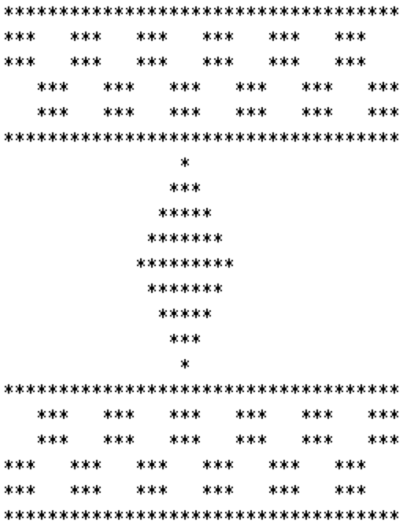

## Assignment # 3

**Introduction to Computer Science** 

**CSC1-UA- 0101**

**Due date is 10/10 by 11:55 PM**

**Re-design Assignment #2 and implement user-defined methods for part1 and Part2.**

> 重新设计任务#2并实现用户定义的方法
> 阅读第1和第2部分。

**Try to modalized your program and re-use code to make the program more efficient.**

> 尝试模块化您的程序，并重用代码，使程序更有效。

**If you don’t use methods then you will receive a zero in this assignment!** 

> 如果您不使用方法，那么您将在这个赋值中得到一个零!

## Code of Conduct

All assignments are graded, meaning we expect you to adhere to the academic integrity standards of NYU. To avoid any confusion regarding this, we will briefly state what is and isn’t allowed when working on an assignment.

Any document and program code that you submit must be fully written by yourself. You can, of course, discuss your work with fellow students, as long as these discussions are restricted to general solution techniques. Put differently, these discussions should not be about concrete code you are writing, nor about specific results you wish to submit. When discussing an assignment with others, this should never lead to you possessing the complete or partial solution of others, regardless of whether the solution is in paper or digital form, and independent of who made the solution. That means, you are also not allowed to possess solutions by someone from a different year or course, by someone from another university, or code from the Internet, etc. This also implies that there is never a valid reason to share your code with fellow students, and that there is no valid reason to publish your code online in any form.

Every student is responsible for the work they submit. If there is any doubt during the grading about whether a student created the assignment themselves (e.g. if the solution matches that of others), we reserve the option to let the student explain why this is the case. In case doubts remain, or we decide to directly escalate the issue, the suspected violations will be reported to the academic administration according to the policies of NYU (see https://cs.nyu.edu/home/undergrad/policy.html).

## Assignment # 2 Details

Redesign same requirements but implement user-defined methods! You will notice that the rug might not be a perfect symmetry, but that’s ok. Just try your best.

> 重新设计相同的需求，但实现用户定义的方法!你会注意到地毯可能不是完美的对称，但没关系。尽你最大的努力。

## Part 1 (50 points): Weaving a Kilim Carpet Application Weaving a Kilim Carpet Application using loops and nested loops: Save as Part1.java

> 第1部分(50分):编织 Kilim 地毯的应用使用循环和嵌套循环编织Kilim Carpet Application: 另存为Part1.java

Kilims are woven carpets which generally use symmetrical designs. For this assignment, instead of using a loom, wool, and a shuttle, we are asking you to produce a pattern of your own design using loops and nested loops. 

> Kilims是一种编织地毯，通常采用对称的设计。在这个作业中，我们不是使用织布机、羊毛和梭子，而是要求你使用循环和嵌套循环来制作你自己设计的图案。

Write a program to weave **your own Kilim carpet** with 30 rows by 30 columns. The patterns should be **designed by you (it should be different than the design of carpet below**). **Your** **carpet though MUST include at least one diamond shape, checkerboards, and squares** (See example below for these patterns). **Also, use other characters such as $ or % or + or @ rather** **than a “\*” to weave the rug. Make sure not to copy the entire pattern from the below rug** **or copy patterns from another student**! Show your creativity by weaving a different design while meeting the requirements mentioned above. You will get extra credit for excellent design and added features.

> 编写一个程序来编织你自己的30行30柱的Kilim地毯。的模式应该是你自己设计的(应该和下面地毯的设计不一样)。你的但地毯至少要有一种菱形、棋盘格和正方形(见下面是这些图案的例子。同样，使用其他字符，如$或%或+或@而不是用“*”来织地毯。一定不要从下面的地毯上复制整个图案或者复制其他学生的图案!通过编织不同的图案来展示你的创造力在满足上述要求的同时。优秀的设计将获得额外的学分并添加功能。

Here is a 12 th Century Moroccan Kilim Carpet sample pattern made of 25 rows and36 columns: (This design is made up of stars (asterisks) and spaces, please ignore the border, color, and the shading effect):

> 这是一张12世纪的摩洛哥基里姆地毯样品图案，由25行和36列:(本设计由星号(星号)和空格组成，请忽略边框，
> 颜色，以及底纹效果):



## Here are the requirements: 

- Every print statement should print no more than one character such as '*' or one space ' '. Do not use statements such as: print("************************************") but rather use loops for every repetition. 

> 每个打印语句应该打印不超过一个字符，例如'*'或一个空格' '。不要使用语句如:打印吗 ("************************************") 而是每个重复循环使用。

**Here are the requirements:** 

> 要求如下:

-   Every print statement should print no more than one character such as '*' or one space ' '. Do not use statements such as: print("************************************") but rather use loops for every repetition. 

> 每个打印语句应该打印不超过一个字符，例如'*'或一个空格' '。不要使用语句如:打印吗 ("************************************") 但每次重复都要使用循环。

-   Use loops and nested loops to produce these patterns. 

> 使用循环和嵌套循环来生成这些模式。

You can't use control structure such as switch or if/ else if /else in your program.

> 不能在程序中使用switch或if/ else if/ else等控制结构。

-   You have to design your own carpet (different than the carpet from above).

>   你必须自己设计地毯(与上面的地毯不同)。

-   Your carpet MUST include at least one diamond shape, checkerboards, and squares. (see example from above for these patterns).

>   你的地毯至少要有一种菱形、棋盘格和正方形。(参见上面的例子了解这些模式)。

-   Some of the patterns are repeated; you might want to first isolate the elements in the design (eg. the first two rows, the "checkerboard" elements, the triangle) and then combine them to form the "rug".

>   有些模式是重复的;你可能想要首先分离设计中的元素(例如。前两行，“棋盘”元素，三角形)，然后将它们组合成“地毯”。

-   If the Dimond is too difficult to produce as one pattern, you can break it into 4 triangles or apply any solution you see fit as long you comply with the assignment’s requirements.

>   如果菱形很难制作成一个图案，你可以把它分成4个三角形，或者应用任何你认为适合的解决方案，只要你符合作业的要求。

```java
public class demo {
    public static void main(String[] args) {
//        demo lx = new demo();
        for (int i = 0; i < 36; i++) {
            System.out.print("*");
        }
        System.out.println("");

        for (int i = 0; i < 2; i++) {
            for (int j = 0; j < 6; j++) {
                for (int k = 0; k < 3; k++) {
                    System.out.print("*");
                }
                for (int k = 0; k < 3; k++) {
                    System.out.print(" ");
                }

            }
            System.out.println("");
        }

        for (int i = 0; i < 2; i++) {
            for (int j = 0; j < 6; j++) {
                for (int k = 0; k < 3; k++) {
                    System.out.print(" ");
                }
                for (int k = 0; k < 3; k++) {
                    System.out.print("*");
                }

            }
            System.out.println("");
        }
        for (int i = 0; i < 36; i++) {
            System.out.print("*");
        }
        System.out.println("");
        // -------------------------------
//        36 / 3 = 12
//        lx.min_rhombus_up();
        demo.min_rhombus_up();
        demo.min_rhombus_middle();
        demo.min_rhombus_down();
//        System.out.println("");
//        demo.min_rhombus_middle();
//        demo.min_rhombus_down();


    }

    public static void min_rhombus_up() {
        // 小菱形 上
        for (int i = 0; i < 6; i++) {
            for (int j = 0; j < 2; j++) {
                System.out.print("");
//                System.out.print(" ");
            }
            System.out.print("--*");
//            System.out.print("*");
            System.out.print("-- ");
//            System.out.print("   ");
        }
        System.out.println("");
    }

    public static void min_rhombus_middle() {
        // 小菱形 中
        for (int i = 0; i < 6; i++) {
            for (int j = 0; j < 5; j++) {
                System.out.print("*");
            }
            System.out.print(" ");
        }
        System.out.println("");
    }

    public static void min_rhombus_down() {
        // 小菱形 下
        for (int i = 0; i < 6; i++) {
            for (int j = 0; j < 2; j++) {
                System.out.print(" ");
            }
            System.out.print("*");
            System.out.print("   ");
        }
    }
}
```

## 2.0 上下单个菱形合并方法：包括笑脸

```java
public class demo {
    public static void main(String[] args) {
//        demo lx = new demo();
        for (int i = 0; i < 36; i++) {
            System.out.print("*");
        }
        System.out.println("");

        for (int i = 0; i < 2; i++) {
            for (int j = 0; j < 6; j++) {
                for (int k = 0; k < 3; k++) {
                    System.out.print("*");
                }
                for (int k = 0; k < 3; k++) {
                    System.out.print(" ");
                }

            }
            System.out.println("");
        }

        for (int i = 0; i < 2; i++) {
            for (int j = 0; j < 6; j++) {
                for (int k = 0; k < 3; k++) {
                    System.out.print(" ");
                }
                for (int k = 0; k < 3; k++) {
                    System.out.print("*");
                }

            }
            System.out.println("");
        }
        for (int i = 0; i < 36; i++) {
            System.out.print("*");
        }
        System.out.println("");
        // -------------------------------
//        36 / 3 = 12
//        lx.min_rhombus_up();
        demo.min_rhombus_up_and_down();
        demo.min_rhombus_middle();
        demo.min_rhombus_up_and_down();
        demo.min_rhombus_middle();
        demo.min_rhombus_up_and_down();
        demo.min_rhombus_middle();
        demo.min_rhombus_up_and_down();

    }

    public static void min_rhombus_up_and_down() {
        // 小菱形 上
        for (int i = 0; i < 6; i++) {
            for (int j = 0; j < 2; j++) {
                System.out.print("");
//                System.out.print(" ");
            }
            System.out.print("-^*");
//            System.out.print("--*");
//            System.out.print("*");
            System.out.print("^- ");
//            System.out.print("   ");
        }
        System.out.println("");
    }

    public static void min_rhombus_middle() {
        // 小菱形 中
        for (int i = 0; i < 6; i++) {
            for (int j = 0; j < 5; j++) {
                System.out.print("*");
            }
            System.out.print(" ");
        }
        System.out.println("");
    }

//    public static void min_rhombus_down() {
//        // 小菱形 下
//        for (int i = 0; i < 6; i++) {
//            for (int j = 0; j < 2; j++) {
//                System.out.print(" ");
//            }
//            System.out.print("*");
//            System.out.print("   ");
//        }
//    }
}
```

## 正方形

```java
public class demo {
    public static void main(String[] args) {
//        demo lx = new demo();
        for (int i = 0; i < 36; i++) {
            System.out.print("*");
        }
        System.out.println("");

        for (int i = 0; i < 2; i++) {
            for (int j = 0; j < 6; j++) {
                for (int k = 0; k < 3; k++) {
                    System.out.print("*");
                }
                for (int k = 0; k < 3; k++) {
                    System.out.print(" ");
                }

            }
            System.out.println("");
        }

        for (int i = 0; i < 2; i++) {
            for (int j = 0; j < 6; j++) {
                for (int k = 0; k < 3; k++) {
                    System.out.print(" ");
                }
                for (int k = 0; k < 3; k++) {
                    System.out.print("*");
                }

            }
            System.out.println("");
        }
        for (int i = 0; i < 36; i++) {
            System.out.print("*");
        }
        System.out.println("");
        // -------------------------------
//        36 / 3 = 12
//        lx.min_rhombus_up();
        demo.min_rhombus_up_and_down();
        demo.min_rhombus_middle("*");
        demo.min_rhombus_up_and_down();
        demo.min_rhombus_middle("~");
        demo.min_rhombus_middle("|");// 正方形
        demo.min_rhombus_middle("~");
        demo.min_rhombus_up_and_down();
        demo.min_rhombus_middle("*");
        demo.min_rhombus_up_and_down();

    }

    public static void min_rhombus_up_and_down() {
        // 小菱形 上
        for (int i = 0; i < 6; i++) {
            for (int j = 0; j < 2; j++) {
                System.out.print("");
//                System.out.print(" ");
            }
            System.out.print("-^*");
//            System.out.print("--*");
//            System.out.print("*");
            System.out.print("^- ");
//            System.out.print("   ");
        }
        System.out.println("");
    }

    public static void min_rhombus_middle(String fuhao) {
        // 小菱形 中
        for (int i = 0; i < 6; i++) {
            for (int j = 0; j < 5; j++) {
                System.out.print(fuhao);
            }
            System.out.print(" ");
        }
        System.out.println("");
    }

//    public static void min_rhombus_down() {
//        // 小菱形 下
//        for (int i = 0; i < 6; i++) {
//            for (int j = 0; j < 2; j++) {
//                System.out.print(" ");
//            }
//            System.out.print("*");
//            System.out.print("   ");
//        }
//    }
}
```

## 开头编写成方法：

```java
public class demo {
    public static void main(String[] args) {
        line();
        space_line("*", " ");
        space_line(" ", "*");
        line();
        // -------------------------------
//        36 / 3 = 12
//        lx.min_rhombus_up();
        demo.min_rhombus_up_and_down();
        demo.min_rhombus_middle("*");
        demo.min_rhombus_up_and_down();
        demo.min_rhombus_middle("~");
        demo.min_rhombus_middle("|");// 正方形
        demo.min_rhombus_middle("~");
        demo.min_rhombus_up_and_down();
        demo.min_rhombus_middle("*");
        demo.min_rhombus_up_and_down();

    }

    public static void min_rhombus_up_and_down() {
        // 小菱形 上
        for (int i = 0; i < 6; i++) {
            for (int j = 0; j < 2; j++) {
                System.out.print("");
//                System.out.print(" ");
            }
            System.out.print("-^*");
//            System.out.print("--*");
//            System.out.print("*");
            System.out.print("^- ");
//            System.out.print("   ");
        }
        System.out.println("");
    }

    public static void min_rhombus_middle(String fuhao) {
        // 小菱形 中
        for (int i = 0; i < 6; i++) {
            for (int j = 0; j < 5; j++) {
                System.out.print(fuhao);
            }
            System.out.print(" ");
        }
        System.out.println("");
    }

    public static void line() {
        for (int i = 0; i < 36; i++) {
            System.out.print("*");
        }
        System.out.println("");
    }

    public static void space_line(String fuhao_first, String fuhao_second) {
        for (int i = 0; i < 2; i++) {
            for (int j = 0; j < 6; j++) {
                for (int k = 0; k < 3; k++) {
                    System.out.print(fuhao_first);
                }
                for (int k = 0; k < 3; k++) {
                    System.out.print(fuhao_second);
                }

            }
            System.out.println("");
        }
    }
}
```

## 最终代码

```java
public class demo {
    public static void main(String[] args) {
        line();
        space_line("*", " ");
        space_line(" ", "*");
        line();
        // -------------------------------
//        36 / 3 = 12
//        lx.min_rhombus_up();
        demo.min_rhombus_up_and_down();
        demo.min_rhombus_middle("*");
        demo.min_rhombus_up_and_down();
        demo.min_rhombus_middle("~");
        demo.min_rhombus_middle("|");// 正方形
        demo.min_rhombus_middle("~");
        demo.min_rhombus_up_and_down();
        demo.min_rhombus_middle("*");
        demo.min_rhombus_up_and_down();

        line();
        space_line(" ", "*");
        space_line("*", " ");
        line();

    }

    public static void min_rhombus_up_and_down() {
        // 小菱形 上
        for (int i = 0; i < 6; i++) {
            for (int j = 0; j < 2; j++) {
                System.out.print("");
//                System.out.print(" ");
            }
            System.out.print("-^*");
//            System.out.print("--*");
//            System.out.print("*");
            System.out.print("^- ");
//            System.out.print("   ");
        }
        System.out.println("");
    }

    public static void min_rhombus_middle(String fuhao) {
        // 小菱形 中
        for (int i = 0; i < 6; i++) {
            for (int j = 0; j < 5; j++) {
                System.out.print(fuhao);
            }
            System.out.print(" ");
        }
        System.out.println("");
    }

    public static void line() {
        for (int i = 0; i < 36; i++) {
            System.out.print("*");
        }
        System.out.println("");
    }

    public static void space_line(String fuhao_first, String fuhao_second) {
        for (int i = 0; i < 2; i++) {
            for (int j = 0; j < 6; j++) {
                for (int k = 0; k < 3; k++) {
                    System.out.print(fuhao_first);
                }
                for (int k = 0; k < 3; k++) {
                    System.out.print(fuhao_second);
                }

            }
            System.out.println("");
        }
    }
}
```

## 删除注释的代码

```java
public class demo {
    public static void main(String[] args) {
        line();
        space_line("*", " ");
        space_line(" ", "*");
        line();
        // -------------------------------
//        36 / 3 = 12
        demo.min_rhombus_up_and_down();
        demo.min_rhombus_middle("*");
        demo.min_rhombus_up_and_down();
        demo.min_rhombus_middle("~");
        demo.min_rhombus_middle("|");// 正方形
        demo.min_rhombus_middle("~");
        demo.min_rhombus_up_and_down();
        demo.min_rhombus_middle("*");
        demo.min_rhombus_up_and_down();

        line();
        space_line(" ", "*");
        space_line("*", " ");
        line();

    }

    public static void min_rhombus_up_and_down() {
        // 小菱形 上
        for (int i = 0; i < 6; i++) {
            for (int j = 0; j < 2; j++) {
                System.out.print("");
            }
            System.out.print("-^*");
            System.out.print("^- ");
        }
        System.out.println("");
    }

    public static void min_rhombus_middle(String fuhao) {
        // 小菱形 中
        for (int i = 0; i < 6; i++) {
            for (int j = 0; j < 5; j++) {
                System.out.print(fuhao);
            }
            System.out.print(" ");
        }
        System.out.println("");
    }

    public static void line() {
        for (int i = 0; i < 36; i++) {
            System.out.print("*");
        }
        System.out.println("");
    }

    public static void space_line(String fuhao_first, String fuhao_second) {
        for (int i = 0; i < 2; i++) {
            for (int j = 0; j < 6; j++) {
                for (int k = 0; k < 3; k++) {
                    System.out.print(fuhao_first);
                }
                for (int k = 0; k < 3; k++) {
                    System.out.print(fuhao_second);
                }

            }
            System.out.println("");
        }
    }
}
```

## 为了符合老师的标准：

```java
public class demo {
    public static void main(String[] args) {
        line();
        space_line("*", " ");
        space_line(" ", "*");
        line();
        // -------------------------------
//        36 / 3 = 12
        demo.min_rhombus_up_and_down();
        demo.min_rhombus_middle("*");
        demo.min_rhombus_up_and_down();
        demo.min_rhombus_middle("~");
        demo.min_rhombus_middle("|");// 正方形
        demo.min_rhombus_middle("~");
        demo.min_rhombus_up_and_down();
        demo.min_rhombus_middle("*");
        demo.min_rhombus_up_and_down();

        line();
        space_line(" ", "*");
        space_line("*", " ");
        line();

    }

    public static void min_rhombus_up_and_down() {
        // 小菱形 上
        for (int i = 0; i < 6; i++) {
            for (int j = 0; j < 2; j++) {
                System.out.print("");
            }
//            System.out.print("-^*");
            System.out.print("-");
            System.out.print("^");
            System.out.print("*");
//            System.out.print("^- ");
            System.out.print("^");
            System.out.print("-");
            System.out.print(" ");
        }
        System.out.println("");
    }

    public static void min_rhombus_middle(String fuhao) {
        // 小菱形 中
        for (int i = 0; i < 6; i++) {
            for (int j = 0; j < 5; j++) {
                System.out.print(fuhao);
            }
            System.out.print(" ");
        }
        System.out.println("");
    }

    public static void line() {
        for (int i = 0; i < 36; i++) {
            System.out.print("*");
        }
        System.out.println("");
    }

    public static void space_line(String fuhao_first, String fuhao_second) {
        for (int i = 0; i < 2; i++) {
            for (int j = 0; j < 6; j++) {
                for (int k = 0; k < 3; k++) {
                    System.out.print(fuhao_first);
                }
                for (int k = 0; k < 3; k++) {
                    System.out.print(fuhao_second);
                }

            }
            System.out.println("");
        }
    }
}
```

## NumberSystem

### 1.0

```java
/**
 * @ClassName: Part2
 * @Description: NumberSystem
 * @Author: AI悦创
 * @date: 2022/10/5 09:28
 * @Version: V1.0
 */

import java.util.Scanner;

public class NS {
    public static void main(String[] args) {
        NS ns = new NS();  // 类的是例化
        Scanner in = new Scanner(System.in);  // 声明一个输入
        System.out.print("Enter the name of the number system to convert from: bin, or dec, or oct or hex:");
        String digital_system = in.next(); // 数字系统「用户描述用户输入的类型」
        System.out.print("Enter number as a String:");
        String Opr_num = in.next();
        System.out.print("Enter the name of the number system you want to convert to: bin, or dec, or oct or hex: "); // 用户要转换的目标类型
        String target = in.next(); // 用户想要转换的目标类型


        switch (digital_system) {
            case ("bin"):
                int StringBinary_To_IntDec;
                switch (target) {
                    case ("dec"):
                        StringBinary_To_IntDec = ns.BinToDec(Opr_num);
                        System.out.println(StringBinary_To_IntDec);
                        break;
                    case ("oct"):
                        StringBinary_To_IntDec = ns.BinToDec(Opr_num);
                        String IntDec_To_StringOct = ns.DecToOct(StringBinary_To_IntDec);
                        System.out.println(IntDec_To_StringOct);
                        break;
                    case ("hex"):
                        StringBinary_To_IntDec = ns.BinToDec(Opr_num);
                        String IntDec_To_StringHex = ns.DecToHex(StringBinary_To_IntDec);
                        System.out.println(IntDec_To_StringHex);
                        break;
                }
            case ("oct"):
                int StringOct_To_IntDec;
                switch (target) {
                    /* This is my code, oct to binary*/
                    case ("bin"):
                        StringOct_To_IntDec = ns.OctToDec(Integer.parseInt(Opr_num));
                        String IntDec_To_StringBin = ns.DecToBin(StringOct_To_IntDec);
                        System.out.println(IntDec_To_StringBin);
                        break;
                    case ("dec"):
                        StringOct_To_IntDec = ns.OctToDec(Integer.parseInt(Opr_num));
                        System.out.println(StringOct_To_IntDec);
                        break;
                    case ("hex"):
                        StringOct_To_IntDec = ns.OctToDec(Integer.parseInt(Opr_num));
                        String IntDec_To_StringHex = ns.DecToHex(StringOct_To_IntDec);
                        System.out.println(IntDec_To_StringHex);
                        break;
                }
            case ("hex"):
                int StringHex_To_IntDec;
                switch (target) {
                    case ("bin"):
                        StringHex_To_IntDec = ns.HexToDec(Opr_num);
                        String  IntDec_To_StringBin = ns.DecToBin(StringHex_To_IntDec);
                        System.out.println(IntDec_To_StringBin);
                        break;
                    case ("dec"):
                        StringHex_To_IntDec = ns.HexToDec(Opr_num);
                        System.out.println(StringHex_To_IntDec);
                        break;
                    case ("oct"):
                        StringHex_To_IntDec = ns.HexToDec(Opr_num);
                        String IntDec_To_StringOct = ns.DecToOct(StringHex_To_IntDec);
                        System.out.println(IntDec_To_StringOct);
                        break;
                }
        }
    }


    public String DecToBin(int intDec) {
        /* 十进制转二进制，利用除2取余*/
        String result_binary = "";
        while (intDec != 0) {
            result_binary = (intDec % 2) + result_binary;
            intDec = intDec / 2;
        }
        return result_binary;
    }

    public String DecToOct(int intDec) {
        /* 十进制转八进制，利用除8取余*/
        String result_oct = "";
        while (intDec != 0) {
            result_oct = (intDec % 8) + result_oct;
            intDec = intDec / 8;
        }
        return result_oct;
    }

    public String DecToHex(int intDec) {
        /*十进制转十六进制*/
        if (intDec == 0) {
//            System.out.println(0);
//            System.exit(0);
            return "0";
        }
        StringBuffer stb = new StringBuffer(8);
        /*当对字符串进行修改的时候，需要使用 StringBuffer 和 StringBuilder 类。
        和 String 类不同的是，StringBuffer 和 StringBuilder 类的对象能够被多次的修改，并且不产生新的未使用对象。*/
        char[] a = {'0', '1', '2', '3', '4', '5', '6', '7', '8', '9', 'A', 'B', 'C', 'D', 'E', 'F'};
        while (intDec != 0) {
            stb = stb.append(a[intDec % 16]);
            intDec /= 16;
        }
        return stb.reverse().toString();
    }


    public int HexToDec(String hex) {
        /*十六进制转十进制*/
        String digits = "0123456789ABCDEF";
        hex = hex.toUpperCase();  // 全部变成大写
        int val = 0;
        for (int i = 0; i < hex.length(); i++) {
            char c = hex.charAt(i);
            int d = digits.indexOf(c);
            val = 16 * val + d;
        }
        return val;
    }

    public int OctToDec(int oct) {
        /*八进制转十进制*/
        int decimalNumber = 0, i = 0;
        while (oct != 0) {
            decimalNumber += (oct % 10) * Math.pow(8, i);
            ++i;
            oct /= 10;
        }
        return decimalNumber;
    }

    public int BinToDec(String bin) {
        /*二进制转十进制*/
        int bin_to_dec = 0, i = 0;
        int str_length = bin.length();
        while (str_length > 0) {
//            dec += ()
            char ch = bin.charAt(i);
            int base = (ch == '1' ? 1 : 0);
            bin_to_dec += base * Math.pow(2, str_length - 1);
            ++i;
            --str_length;
        }
        return bin_to_dec;
    }

//    public int binaryToDecimal(String radix) {
//        /*二进制到十进制*/
//        // 1010
//        int x = 0;
//        for (char c : radix.toCharArray())
//            x = x * 2 + (c == '1' ? 1 : 0);
////        System.out.println(x);
//        return x;
//    }
//
}
```

### 2.0

```java
/**
 * @ClassName: Part2
 * @Description: NumberSystem
 * @Author: AI悦创
 * @date: 2022/10/5 09:28
 * @Version: V1.0
 */

import java.util.Scanner;

public class NS {
    public static void main(String[] args) {
        NS ns = new NS();  // 类的是例化
        Scanner in = new Scanner(System.in);  // 声明一个输入
        System.out.print("Enter the name of the number system to convert from: bin, or dec, or oct or hex:");
        String digital_system = in.next(); // 数字系统「用户描述用户输入的类型」
        System.out.print("Enter number as a String:");
        String Opr_num = in.next();
        System.out.print("Enter the name of the number system you want to convert to: bin, or dec, or oct or hex: "); // 用户要转换的目标类型
        String target = in.next(); // 用户想要转换的目标类型


        switch (digital_system) {
            case ("bin"):
                int StringBinary_To_IntDec = ns.BinToDec(Opr_num);
                switch (target) {
                    case ("dec"):
                        System.out.println(StringBinary_To_IntDec);
                        break;
                    case ("oct"):
                        String IntDec_To_StringOct = ns.DecToOct(StringBinary_To_IntDec);
                        System.out.println(IntDec_To_StringOct);
                        break;
                    case ("hex"):
                        String IntDec_To_StringHex = ns.DecToHex(StringBinary_To_IntDec);
                        System.out.println(IntDec_To_StringHex);
                        break;
                }
            case ("oct"):
                int StringOct_To_IntDec = ns.OctToDec(Integer.parseInt(Opr_num));
                switch (target) {
                    /* This is my code, oct to binary*/
                    case ("bin"):
                        String IntDec_To_StringBin = ns.DecToBin(StringOct_To_IntDec);
                        System.out.println(IntDec_To_StringBin);
                        break;
                    case ("dec"):
                        System.out.println(StringOct_To_IntDec);
                        break;
                    case ("hex"):
                        String IntDec_To_StringHex = ns.DecToHex(StringOct_To_IntDec);
                        System.out.println(IntDec_To_StringHex);
                        break;
                }
            case ("hex"):
                int StringHex_To_IntDec = ns.HexToDec(Opr_num);
                switch (target) {
                    case ("bin"):
                        String IntDec_To_StringBin = ns.DecToBin(StringHex_To_IntDec);
                        System.out.println(IntDec_To_StringBin);
                        break;
                    case ("dec"):
                        System.out.println(StringHex_To_IntDec);
                        break;
                    case ("oct"):
                        String IntDec_To_StringOct = ns.DecToOct(StringHex_To_IntDec);
                        System.out.println(IntDec_To_StringOct);
                        break;
                }
        }
    }


    public String DecToBin(int intDec) {
        /* 十进制转二进制，利用除2取余*/
        String result_binary = "";
        while (intDec != 0) {
            result_binary = (intDec % 2) + result_binary;
            intDec = intDec / 2;
        }
        return result_binary;
    }

    public String DecToOct(int intDec) {
        /* 十进制转八进制，利用除8取余*/
        String result_oct = "";
        while (intDec != 0) {
            result_oct = (intDec % 8) + result_oct;
            intDec = intDec / 8;
        }
        return result_oct;
    }

    public String DecToHex(int intDec) {
        /*十进制转十六进制*/
        if (intDec == 0) {
//            System.out.println(0);
//            System.exit(0);
            return "0";
        }
        StringBuffer stb = new StringBuffer(8);
        /*当对字符串进行修改的时候，需要使用 StringBuffer 和 StringBuilder 类。
        和 String 类不同的是，StringBuffer 和 StringBuilder 类的对象能够被多次的修改，并且不产生新的未使用对象。*/
        char[] a = {'0', '1', '2', '3', '4', '5', '6', '7', '8', '9', 'A', 'B', 'C', 'D', 'E', 'F'};
        while (intDec != 0) {
            stb = stb.append(a[intDec % 16]);
            intDec /= 16;
        }
        return stb.reverse().toString();
    }


    public int HexToDec(String hex) {
        /*十六进制转十进制*/
        String digits = "0123456789ABCDEF";
        hex = hex.toUpperCase();  // 全部变成大写
        int val = 0;
        for (int i = 0; i < hex.length(); i++) {
            char c = hex.charAt(i);
            int d = digits.indexOf(c);
            val = 16 * val + d;
        }
        return val;
    }

    public int OctToDec(int oct) {
        /*八进制转十进制*/
        int decimalNumber = 0, i = 0;
        while (oct != 0) {
            decimalNumber += (oct % 10) * Math.pow(8, i);
            ++i;
            oct /= 10;
        }
        return decimalNumber;
    }

    public int BinToDec(String bin) {
        /*二进制转十进制*/
        int bin_to_dec = 0, i = 0;
        int str_length = bin.length();
        while (str_length > 0) {
//            dec += ()
            char ch = bin.charAt(i);
            int base = (ch == '1' ? 1 : 0);
            bin_to_dec += base * Math.pow(2, str_length - 1);
            ++i;
            --str_length;
        }
        return bin_to_dec;
    }

//    public int binaryToDecimal(String radix) {
//        /*二进制到十进制*/
//        // 1010
//        int x = 0;
//        for (char c : radix.toCharArray())
//            x = x * 2 + (c == '1' ? 1 : 0);
////        System.out.println(x);
//        return x;
//    }
//
}
```

### 3.0 修复多输出 bug

```java
/**
 * @ClassName: Part2
 * @Description: NumberSystem
 * @Author: AI悦创
 * @date: 2022/10/5 09:28
 * @Version: V1.0
 */

import java.util.Scanner;

public class NS {
    public static void main(String[] args) {
        NS ns = new NS();  // 类的是例化
        Scanner in = new Scanner(System.in);  // 声明一个输入
        System.out.print("Enter the name of the number system to convert from: bin, or dec, or oct or hex:");
        String digital_system = in.next(); // 数字系统「用户描述用户输入的类型」
        System.out.print("Enter number as a String:");
        String Opr_num = in.next();
        System.out.print("Enter the name of the number system you want to convert to: bin, or dec, or oct or hex: "); // 用户要转换的目标类型
        String target = in.next(); // 用户想要转换的目标类型
        switch (digital_system) {
            case ("bin"):
                int StringBinary_To_IntDec = ns.BinToDec(Opr_num);
                switch (target) {
                    case ("dec"):
                        System.out.println(StringBinary_To_IntDec);
                        break;
                    case ("oct"):
                        String IntDec_To_StringOct = ns.DecToOct(StringBinary_To_IntDec);
                        System.out.println(IntDec_To_StringOct);
                        break;
                    case ("hex"):
                        String IntDec_To_StringHex = ns.DecToHex(StringBinary_To_IntDec);
                        System.out.println(IntDec_To_StringHex);
                        break;
                }
                break;
            case ("oct"):
                int StringOct_To_IntDec = ns.OctToDec(Integer.parseInt(Opr_num));
                switch (target) {
                    /* This is my code, oct to binary*/
                    case ("bin"):
                        String IntDec_To_StringBin = ns.DecToBin(StringOct_To_IntDec);
                        System.out.println(IntDec_To_StringBin);
                        break;
                    case ("dec"):
                        System.out.println(StringOct_To_IntDec);
                        break;
                    case ("hex"):
                        String IntDec_To_StringHex = ns.DecToHex(StringOct_To_IntDec);
                        System.out.println(IntDec_To_StringHex);
                        break;
                }
                break;
            case ("hex"):
                int StringHex_To_IntDec = ns.HexToDec(Opr_num);
                switch (target) {
                    case ("bin"):
                        String IntDec_To_StringBin = ns.DecToBin(StringHex_To_IntDec);
                        System.out.println(IntDec_To_StringBin);
                        break;
                    case ("dec"):
                        System.out.println(StringHex_To_IntDec);
                        break;
                    case ("oct"):
                        String IntDec_To_StringOct = ns.DecToOct(StringHex_To_IntDec);
                        System.out.println(IntDec_To_StringOct);
                        break;
                }
                break;
        }
    }


    public String DecToBin(int intDec) {
        /* 十进制转二进制，利用除2取余*/
        String result_binary = "";
        while (intDec != 0) {
            result_binary = (intDec % 2) + result_binary;
            intDec = intDec / 2;
        }
        return result_binary;
    }

    public String DecToOct(int intDec) {
        /* 十进制转八进制，利用除8取余*/
        String result_oct = "";
        while (intDec != 0) {
            result_oct = (intDec % 8) + result_oct;
            intDec = intDec / 8;
        }
        return result_oct;
    }

    public String DecToHex(int intDec) {
        /*十进制转十六进制*/
        if (intDec == 0) {
//            System.out.println(0);
//            System.exit(0);
            return "0";
        }
        StringBuffer stb = new StringBuffer(8);
        /*当对字符串进行修改的时候，需要使用 StringBuffer 和 StringBuilder 类。
        和 String 类不同的是，StringBuffer 和 StringBuilder 类的对象能够被多次的修改，并且不产生新的未使用对象。*/
        char[] a = {'0', '1', '2', '3', '4', '5', '6', '7', '8', '9', 'A', 'B', 'C', 'D', 'E', 'F'};
        while (intDec != 0) {
            stb = stb.append(a[intDec % 16]);
            intDec /= 16;
        }
        return stb.reverse().toString();
    }


    public int HexToDec(String hex) {
        /*十六进制转十进制*/
        String digits = "0123456789ABCDEF";
        hex = hex.toUpperCase();  // 全部变成大写
        int val = 0;
        for (int i = 0; i < hex.length(); i++) {
            char c = hex.charAt(i);
            int d = digits.indexOf(c);
            val = 16 * val + d;
        }
        return val;
    }

    public int OctToDec(int oct) {
        /*八进制转十进制*/
        int decimalNumber = 0, i = 0;
        while (oct != 0) {
            decimalNumber += (oct % 10) * Math.pow(8, i);
            ++i;
            oct /= 10;
        }
        return decimalNumber;
    }

    public int BinToDec(String bin) {
        /*二进制转十进制*/
        int bin_to_dec = 0, i = 0;
        int str_length = bin.length();
        while (str_length > 0) {
//            dec += ()
            char ch = bin.charAt(i);
            int base = (ch == '1' ? 1 : 0);
            bin_to_dec += base * Math.pow(2, str_length - 1);
            ++i;
            --str_length;
        }
        return bin_to_dec;
    }

//    public int binaryToDecimal(String radix) {
//        /*二进制到十进制*/
//        // 1010
//        int x = 0;
//        for (char c : radix.toCharArray())
//            x = x * 2 + (c == '1' ? 1 : 0);
////        System.out.println(x);
//        return x;
//    }
//
}
```

### 4.0 修复：dec to oct、hex、bin

```java
/**
 * @ClassName: Part2
 * @Description: NumberSystem
 * @Author: AI悦创
 * @date: 2022/10/5 09:28
 * @Version: V1.0
 */

import java.util.Scanner;

public class NS {
    public static void main(String[] args) {
        NS ns = new NS();  // 类的是例化
        Scanner in = new Scanner(System.in);  // 声明一个输入
        System.out.print("Enter the name of the number system to convert from: bin, or dec, or oct or hex:");
        String digital_system = in.next(); // 数字系统「用户描述用户输入的类型」
        System.out.print("Enter number as a String:");
        String Opr_num = in.next();
        System.out.print("Enter the name of the number system you want to convert to: bin, or dec, or oct or hex: "); // 用户要转换的目标类型
        String target = in.next(); // 用户想要转换的目标类型
        switch (digital_system) {
            case ("bin"):
                int StringBinary_To_IntDec = ns.BinToDec(Opr_num);
                switch (target) {
                    case ("dec"):
                        System.out.println(StringBinary_To_IntDec);
                        break;
                    case ("oct"):
                        String IntDec_To_StringOct = ns.DecToOct(StringBinary_To_IntDec);
                        System.out.println(IntDec_To_StringOct);
                        break;
                    case ("hex"):
                        String IntDec_To_StringHex = ns.DecToHex(StringBinary_To_IntDec);
                        System.out.println(IntDec_To_StringHex);
                        break;
                }
                break;
            case ("oct"):
                int StringOct_To_IntDec = ns.OctToDec(Integer.parseInt(Opr_num));
                switch (target) {
                    /* This is my code, oct to binary*/
                    case ("bin"):
                        String IntDec_To_StringBin = ns.DecToBin(StringOct_To_IntDec);
                        System.out.println(IntDec_To_StringBin);
                        break;
                    case ("dec"):
                        System.out.println(StringOct_To_IntDec);
                        break;
                    case ("hex"):
                        String IntDec_To_StringHex = ns.DecToHex(StringOct_To_IntDec);
                        System.out.println(IntDec_To_StringHex);
                        break;
                }
                break;
            case ("hex"):
                int StringHex_To_IntDec = ns.HexToDec(Opr_num);
                switch (target) {
                    case ("bin"):
                        String IntDec_To_StringBin = ns.DecToBin(StringHex_To_IntDec);
                        System.out.println(IntDec_To_StringBin);
                        break;
                    case ("dec"):
                        System.out.println(StringHex_To_IntDec);
                        break;
                    case ("oct"):
                        String IntDec_To_StringOct = ns.DecToOct(StringHex_To_IntDec);
                        System.out.println(IntDec_To_StringOct);
                        break;
                }
                break;
            case ("dec"):
                switch (target) {
                    case ("bin"):
                        String StringDec_To_StringBin = ns.DecToBin(Integer.parseInt(Opr_num));
                        System.out.println(StringDec_To_StringBin);
                        break;
                    case ("oct"):
                        String StringDec_To_StringOct = ns.DecToOct(Integer.parseInt(Opr_num));
                        System.out.println(StringDec_To_StringOct);
                        break;
                    case ("hex"):
                        String StringDec_To_StringHex = ns.DecToHex(Integer.parseInt(Opr_num));
                        System.out.println(StringDec_To_StringHex);
                        break;
                }
                break;
        }
    }


    public String DecToBin(int intDec) {
        /* 十进制转二进制，利用除2取余*/
        String result_binary = "";
        while (intDec != 0) {
            result_binary = (intDec % 2) + result_binary;
            intDec = intDec / 2;
        }
        return result_binary;
    }

    public String DecToOct(int intDec) {
        /* 十进制转八进制，利用除8取余*/
        String result_oct = "";
        while (intDec != 0) {
            result_oct = (intDec % 8) + result_oct;
            intDec = intDec / 8;
        }
        return result_oct;
    }

    public String DecToHex(int intDec) {
        /*十进制转十六进制*/
        if (intDec == 0) {
//            System.out.println(0);
//            System.exit(0);
            return "0";
        }
        StringBuffer stb = new StringBuffer(8);
        /*当对字符串进行修改的时候，需要使用 StringBuffer 和 StringBuilder 类。
        和 String 类不同的是，StringBuffer 和 StringBuilder 类的对象能够被多次的修改，并且不产生新的未使用对象。*/
        char[] a = {'0', '1', '2', '3', '4', '5', '6', '7', '8', '9', 'A', 'B', 'C', 'D', 'E', 'F'};
        while (intDec != 0) {
            stb = stb.append(a[intDec % 16]);
            intDec /= 16;
        }
        return stb.reverse().toString();
    }


    public int HexToDec(String hex) {
        /*十六进制转十进制*/
        String digits = "0123456789ABCDEF";
        hex = hex.toUpperCase();  // 全部变成大写
        int val = 0;
        for (int i = 0; i < hex.length(); i++) {
            char c = hex.charAt(i);
            int d = digits.indexOf(c);
            val = 16 * val + d;
        }
        return val;
    }

    public int OctToDec(int oct) {
        /*八进制转十进制*/
        int decimalNumber = 0, i = 0;
        while (oct != 0) {
            decimalNumber += (oct % 10) * Math.pow(8, i);
            ++i;
            oct /= 10;
        }
        return decimalNumber;
    }

    public int BinToDec(String bin) {
        /*二进制转十进制*/
        int bin_to_dec = 0, i = 0;
        int str_length = bin.length();
        while (str_length > 0) {
//            dec += ()
            char ch = bin.charAt(i);
            int base = (ch == '1' ? 1 : 0);
            bin_to_dec += base * Math.pow(2, str_length - 1);
            ++i;
            --str_length;
        }
        return bin_to_dec;
    }

//    public int binaryToDecimal(String radix) {
//        /*二进制到十进制*/
//        // 1010
//        int x = 0;
//        for (char c : radix.toCharArray())
//            x = x * 2 + (c == '1' ? 1 : 0);
////        System.out.println(x);
//        return x;
//    }
//
}
```

### 5.0

```java
/**
 * @ClassName: Part2
 * @Description: NumberSystem
 * @Author: AI悦创
 * @date: 2022/10/5 09:28
 * @Version: V1.0
 */

import java.util.Scanner;

public class NS {
    public static void main(String[] args) {
        NS ns = new NS();  // 类的是例化
        Scanner in = new Scanner(System.in);  // 声明一个输入
        System.out.print("Enter the name of the number system to convert from: bin, or dec, or oct or hex:");
        String digital_system = in.next(); // 数字系统「用户描述用户输入的类型」
        System.out.print("Enter number as a String:");
        String Opr_num = in.next();
        System.out.print("Enter the name of the number system you want to convert to: bin, or dec, or oct or hex: "); // 用户要转换的目标类型
        String target = in.next(); // 用户想要转换的目标类型
        ns.switch_case(digital_system, target, Opr_num);

    }

    public void switch_case(String digital_system, String target, String Opr_num) {
        switch (digital_system) {
            case ("bin"):
                int StringBinary_To_IntDec = BinToDec(Opr_num);
                switch (target) {
                    case ("dec"):
                        System.out.println(StringBinary_To_IntDec);
                        break;
                    case ("oct"):
                        String IntDec_To_StringOct = DecToOct(StringBinary_To_IntDec);
                        System.out.println(IntDec_To_StringOct);
                        break;
                    case ("hex"):
                        String IntDec_To_StringHex = DecToHex(StringBinary_To_IntDec);
                        System.out.println(IntDec_To_StringHex);
                        break;
                }
                break;
            case ("oct"):
                int StringOct_To_IntDec = OctToDec(Integer.parseInt(Opr_num));
                switch (target) {
                    /* This is my code, oct to binary*/
                    case ("bin"):
                        String IntDec_To_StringBin = DecToBin(StringOct_To_IntDec);
                        System.out.println(IntDec_To_StringBin);
                        break;
                    case ("dec"):
                        System.out.println(StringOct_To_IntDec);
                        break;
                    case ("hex"):
                        String IntDec_To_StringHex = DecToHex(StringOct_To_IntDec);
                        System.out.println(IntDec_To_StringHex);
                        break;
                }
                break;
            case ("hex"):
                int StringHex_To_IntDec = HexToDec(Opr_num);
                switch (target) {
                    case ("bin"):
                        String IntDec_To_StringBin = DecToBin(StringHex_To_IntDec);
                        System.out.println(IntDec_To_StringBin);
                        break;
                    case ("dec"):
                        System.out.println(StringHex_To_IntDec);
                        break;
                    case ("oct"):
                        String IntDec_To_StringOct = DecToOct(StringHex_To_IntDec);
                        System.out.println(IntDec_To_StringOct);
                        break;
                }
                break;
            case ("dec"):
                switch (target) {
                    case ("bin"):
                        String StringDec_To_StringBin = DecToBin(Integer.parseInt(Opr_num));
                        System.out.println(StringDec_To_StringBin);
                        break;
                    case ("oct"):
                        String StringDec_To_StringOct = DecToOct(Integer.parseInt(Opr_num));
                        System.out.println(StringDec_To_StringOct);
                        break;
                    case ("hex"):
                        String StringDec_To_StringHex = DecToHex(Integer.parseInt(Opr_num));
                        System.out.println(StringDec_To_StringHex);
                        break;
                }
                break;
        }
    }

    public String DecToBin(int intDec) {
        /* 十进制转二进制，利用除2取余*/
        String result_binary = "";
        while (intDec != 0) {
            result_binary = (intDec % 2) + result_binary;
            intDec = intDec / 2;
        }
        return result_binary;
    }

    public String DecToOct(int intDec) {
        /* 十进制转八进制，利用除8取余*/
        String result_oct = "";
        while (intDec != 0) {
            result_oct = (intDec % 8) + result_oct;
            intDec = intDec / 8;
        }
        return result_oct;
    }

    public String DecToHex(int intDec) {
        /*十进制转十六进制*/
        if (intDec == 0) {
//            System.out.println(0);
//            System.exit(0);
            return "0";
        }
        StringBuffer stb = new StringBuffer(8);
        /*当对字符串进行修改的时候，需要使用 StringBuffer 和 StringBuilder 类。
        和 String 类不同的是，StringBuffer 和 StringBuilder 类的对象能够被多次的修改，并且不产生新的未使用对象。*/
        char[] a = {'0', '1', '2', '3', '4', '5', '6', '7', '8', '9', 'A', 'B', 'C', 'D', 'E', 'F'};
        while (intDec != 0) {
            stb = stb.append(a[intDec % 16]);
            intDec /= 16;
        }
        return stb.reverse().toString();
    }


    public int HexToDec(String hex) {
        /*十六进制转十进制*/
        String digits = "0123456789ABCDEF";
        hex = hex.toUpperCase();  // 全部变成大写
        int val = 0;
        for (int i = 0; i < hex.length(); i++) {
            char c = hex.charAt(i);
            int d = digits.indexOf(c);
            val = 16 * val + d;
        }
        return val;
    }

    public int OctToDec(int oct) {
        /*八进制转十进制*/
        int decimalNumber = 0, i = 0;
        while (oct != 0) {
            decimalNumber += (oct % 10) * Math.pow(8, i);
            ++i;
            oct /= 10;
        }
        return decimalNumber;
    }

    public int BinToDec(String bin) {
        /*二进制转十进制*/
        int bin_to_dec = 0, i = 0;
        int str_length = bin.length();
        while (str_length > 0) {
//            dec += ()
            char ch = bin.charAt(i);
            int base = (ch == '1' ? 1 : 0);
            bin_to_dec += base * Math.pow(2, str_length - 1);
            ++i;
            --str_length;
        }
        return bin_to_dec;
    }

//    public int binaryToDecimal(String radix) {
//        /*二进制到十进制*/
//        // 1010
//        int x = 0;
//        for (char c : radix.toCharArray())
//            x = x * 2 + (c == '1' ? 1 : 0);
////        System.out.println(x);
//        return x;
//    }
//
}
```

### over

```java
/**
 * @ClassName: Part2
 * @Description: NumberSystem
 * @Author: AI悦创
 * @date: 2022/10/5 09:28
 * @Version: V1.0
 */

import java.util.Scanner;

public class NS {
    public static void main(String[] args) {
//        NS ns = new NS();  // 类的是例化
        Scanner in = new Scanner(System.in);  // 声明一个输入
        System.out.print("Enter the name of the number system to convert from: bin, or dec, or oct or hex:");
        String digital_system = in.next(); // 数字系统「用户描述用户输入的类型」
        System.out.print("Enter number as a String:");
        String Opr_num = in.next();
        System.out.print("Enter the name of the number system you want to convert to: bin, or dec, or oct or hex: "); // 用户要转换的目标类型
        String target = in.next(); // 用户想要转换的目标类型
        switch_case(digital_system, target, Opr_num);

    }

    public static void switch_case(String digital_system, String target, String Opr_num) {
        NS sc = new NS();
        switch (digital_system) {
            case ("bin"):
                int StringBinary_To_IntDec = sc.BinToDec(Opr_num);
                switch (target) {
                    case ("dec"):
                        System.out.println(StringBinary_To_IntDec);
                        break;
                    case ("oct"):
                        String IntDec_To_StringOct = sc.DecToOct(StringBinary_To_IntDec);
                        System.out.println(IntDec_To_StringOct);
                        break;
                    case ("hex"):
                        String IntDec_To_StringHex = sc.DecToHex(StringBinary_To_IntDec);
                        System.out.println(IntDec_To_StringHex);
                        break;
                }
                break;
            case ("oct"):
                int StringOct_To_IntDec = sc.OctToDec(Integer.parseInt(Opr_num));
                switch (target) {
                    /* This is my code, oct to binary*/
                    case ("bin"):
                        String IntDec_To_StringBin = sc.DecToBin(StringOct_To_IntDec);
                        System.out.println(IntDec_To_StringBin);
                        break;
                    case ("dec"):
                        System.out.println(StringOct_To_IntDec);
                        break;
                    case ("hex"):
                        String IntDec_To_StringHex = sc.DecToHex(StringOct_To_IntDec);
                        System.out.println(IntDec_To_StringHex);
                        break;
                }
                break;
            case ("hex"):
                int StringHex_To_IntDec = sc.HexToDec(Opr_num);
                switch (target) {
                    case ("bin"):
                        String IntDec_To_StringBin = sc.DecToBin(StringHex_To_IntDec);
                        System.out.println(IntDec_To_StringBin);
                        break;
                    case ("dec"):
                        System.out.println(StringHex_To_IntDec);
                        break;
                    case ("oct"):
                        String IntDec_To_StringOct = sc.DecToOct(StringHex_To_IntDec);
                        System.out.println(IntDec_To_StringOct);
                        break;
                }
                break;
            case ("dec"):
                switch (target) {
                    case ("bin"):
                        String StringDec_To_StringBin = sc.DecToBin(Integer.parseInt(Opr_num));
                        System.out.println(StringDec_To_StringBin);
                        break;
                    case ("oct"):
                        String StringDec_To_StringOct = sc.DecToOct(Integer.parseInt(Opr_num));
                        System.out.println(StringDec_To_StringOct);
                        break;
                    case ("hex"):
                        String StringDec_To_StringHex = sc.DecToHex(Integer.parseInt(Opr_num));
                        System.out.println(StringDec_To_StringHex);
                        break;
                }
                break;
        }
    }

    public String DecToBin(int intDec) {
        /* 十进制转二进制，利用除2取余*/
        String result_binary = "";
        while (intDec != 0) {
            result_binary = (intDec % 2) + result_binary;
            intDec = intDec / 2;
        }
        return result_binary;
    }

    public String DecToOct(int intDec) {
        /* 十进制转八进制，利用除8取余*/
        String result_oct = "";
        while (intDec != 0) {
            result_oct = (intDec % 8) + result_oct;
            intDec = intDec / 8;
        }
        return result_oct;
    }

    public String DecToHex(int intDec) {
        /*十进制转十六进制*/
        if (intDec == 0) {
//            System.out.println(0);
//            System.exit(0);
            return "0";
        }
        StringBuffer stb = new StringBuffer(8);
        /*当对字符串进行修改的时候，需要使用 StringBuffer 和 StringBuilder 类。
        和 String 类不同的是，StringBuffer 和 StringBuilder 类的对象能够被多次的修改，并且不产生新的未使用对象。*/
        char[] a = {'0', '1', '2', '3', '4', '5', '6', '7', '8', '9', 'A', 'B', 'C', 'D', 'E', 'F'};
        while (intDec != 0) {
            stb = stb.append(a[intDec % 16]);
            intDec /= 16;
        }
        return stb.reverse().toString();
    }


    public int HexToDec(String hex) {
        /*十六进制转十进制*/
        String digits = "0123456789ABCDEF";
        hex = hex.toUpperCase();  // 全部变成大写
        int val = 0;
        for (int i = 0; i < hex.length(); i++) {
            char c = hex.charAt(i);
            int d = digits.indexOf(c);
            val = 16 * val + d;
        }
        return val;
    }

    public int OctToDec(int oct) {
        /*八进制转十进制*/
        int decimalNumber = 0, i = 0;
        while (oct != 0) {
            decimalNumber += (oct % 10) * Math.pow(8, i);
            ++i;
            oct /= 10;
        }
        return decimalNumber;
    }

    public int BinToDec(String bin) {
        /*二进制转十进制*/
        int bin_to_dec = 0, i = 0;
        int str_length = bin.length();
        while (str_length > 0) {
//            dec += ()
            char ch = bin.charAt(i);
            int base = (ch == '1' ? 1 : 0);
            bin_to_dec += base * Math.pow(2, str_length - 1);
            ++i;
            --str_length;
        }
        return bin_to_dec;
    }

//    public int binaryToDecimal(String radix) {
//        /*二进制到十进制*/
//        // 1010
//        int x = 0;
//        for (char c : radix.toCharArray())
//            x = x * 2 + (c == '1' ? 1 : 0);
////        System.out.println(x);
//        return x;
//    }
//
}
```

## 修复 dec to bin bug

```java
/**
 * @ClassName: Part2
 * @Description: NumberSystem
 * @Author: AI悦创
 * @date: 2022/10/5 09:28
 * @Version: V1.0
 */

import java.util.Scanner;

public class NS {
    public static void main(String[] args) {
//        NS ns = new NS();  // 类的是例化
        Scanner in = new Scanner(System.in);  // 声明一个输入
        System.out.print("Enter the name of the number system to convert from: bin, or dec, or oct or hex:");
        String digital_system = in.next(); // 数字系统「用户描述用户输入的类型」
        System.out.print("Enter number as a String:");
        String Opr_num = in.next();
        System.out.print("Enter the name of the number system you want to convert to: bin, or dec, or oct or hex: "); // 用户要转换的目标类型
        String target = in.next(); // 用户想要转换的目标类型
        switch_case(digital_system, target, Opr_num);
    }

    public static void switch_case(String digital_system, String target, String Opr_num) {
        NS sc = new NS();
        switch (digital_system) {
            case ("bin"):
                int StringBinary_To_IntDec = sc.BinToDec(Opr_num);
                switch (target) {
                    case ("dec"):
                        System.out.println(StringBinary_To_IntDec);
                        break;
                    case ("oct"):
                        String IntDec_To_StringOct = sc.DecToOct(StringBinary_To_IntDec);
                        System.out.println(IntDec_To_StringOct);
                        break;
                    case ("hex"):
                        String IntDec_To_StringHex = sc.DecToHex(StringBinary_To_IntDec);
                        System.out.println(IntDec_To_StringHex);
                        break;
                }
                break;
            case ("oct"):
                int StringOct_To_IntDec = sc.OctToDec(Integer.parseInt(Opr_num));
                switch (target) {
                    /* This is my code, oct to binary*/
                    case ("bin"):
                        String IntDec_To_StringBin = sc.DecToBin(StringOct_To_IntDec);
                        System.out.println(IntDec_To_StringBin);
                        break;
                    case ("dec"):
                        System.out.println(StringOct_To_IntDec);
                        break;
                    case ("hex"):
                        String IntDec_To_StringHex = sc.DecToHex(StringOct_To_IntDec);
                        System.out.println(IntDec_To_StringHex);
                        break;
                }
                break;
            case ("hex"):
                int StringHex_To_IntDec = sc.HexToDec(Opr_num);
                switch (target) {
                    case ("bin"):
                        String IntDec_To_StringBin = sc.DecToBin(StringHex_To_IntDec);
                        System.out.println(IntDec_To_StringBin);
                        break;
                    case ("dec"):
                        System.out.println(StringHex_To_IntDec);
                        break;
                    case ("oct"):
                        String IntDec_To_StringOct = sc.DecToOct(StringHex_To_IntDec);
                        System.out.println(IntDec_To_StringOct);
                        break;
                }
                break;
            case ("dec"):
                switch (target) {
                    case ("bin"):
//                        System.out.println("xxx:>>>" + Integer.parseInt(Opr_num));
                        String StringDec_To_StringBin = sc.DecToBin(Integer.parseInt(Opr_num));
                        System.out.println(StringDec_To_StringBin);
                        break;
                    case ("oct"):
                        String StringDec_To_StringOct = sc.DecToOct(Integer.parseInt(Opr_num));
                        System.out.println(StringDec_To_StringOct);
                        break;
                    case ("hex"):
                        String StringDec_To_StringHex = sc.DecToHex(Integer.parseInt(Opr_num));
                        System.out.println(StringDec_To_StringHex);
                        break;
                }
                break;
        }
    }

    public String DecToBin(int intDec) {
        /* 十进制转二进制，利用除2取余*/
        String result_binary = "";
        if (intDec == 0) {
            return "0";
        } else {
            while (intDec != 0) {
                result_binary = (intDec % 2) + result_binary;
                intDec = intDec / 2;
            }
            return result_binary;
        }
    }

    public String DecToOct(int intDec) {
        /* 十进制转八进制，利用除8取余*/
        String result_oct = "";
        while (intDec != 0) {
            result_oct = (intDec % 8) + result_oct;
            intDec = intDec / 8;
        }
        return result_oct;
    }

    public String DecToHex(int intDec) {
        /*十进制转十六进制*/
        if (intDec == 0) {
//            System.out.println(0);
//            System.exit(0);
            return "0";
        }
        StringBuffer stb = new StringBuffer(8);
        /*当对字符串进行修改的时候，需要使用 StringBuffer 和 StringBuilder 类。
        和 String 类不同的是，StringBuffer 和 StringBuilder 类的对象能够被多次的修改，并且不产生新的未使用对象。*/
        char[] a = {'0', '1', '2', '3', '4', '5', '6', '7', '8', '9', 'A', 'B', 'C', 'D', 'E', 'F'};
        while (intDec != 0) {
            stb = stb.append(a[intDec % 16]);
            intDec /= 16;
        }
        return stb.reverse().toString();
    }


    public int HexToDec(String hex) {
        /*十六进制转十进制*/
        String digits = "0123456789ABCDEF";
        hex = hex.toUpperCase();  // 全部变成大写
        int val = 0;
        for (int i = 0; i < hex.length(); i++) {
            char c = hex.charAt(i);
            int d = digits.indexOf(c);
            val = 16 * val + d;
        }
        return val;
    }

    public int OctToDec(int oct) {
        /*八进制转十进制*/
        int decimalNumber = 0, i = 0;
        while (oct != 0) {
            decimalNumber += (oct % 10) * Math.pow(8, i);
            ++i;
            oct /= 10;
        }
        return decimalNumber;
    }

    public int BinToDec(String bin) {
        /*二进制转十进制*/
        int bin_to_dec = 0, i = 0;
        int str_length = bin.length();
        while (str_length > 0) {
//            dec += ()
            char ch = bin.charAt(i);
            int base = (ch == '1' ? 1 : 0);
            bin_to_dec += base * Math.pow(2, str_length - 1);
            ++i;
            --str_length;
        }
        return bin_to_dec;
    }
}
```

## KAI 提交代码

```java
import jdk.swing.interop.SwingInterOpUtils;

import java.util.Scanner;

public class Part2 {
    public static void main(String[] args) {
        Part2 ns = new Part2();
        Scanner in = new Scanner(System.in);  // setting an output
        System.out.print("Enter the name of the number system to convert from: bin, or dec, or oct or hex:");
        String digital_system = in.next(); // number system, let user describe the datatype
        System.out.print("Enter number as a String:");
        String Opr_num = in.next();
        System.out.print("Enter the name of the number system you want to convert to: bin, or dec, or oct or hex: "); // 用户要转换的目标类型
        String target = in.next(); // the purpose number system that user want to convert
        ns.switch_case(digital_system, Opr_num, target);
        //                if (target.equals("dec")) {
//                    int bin_to_dec = ns.BinToDec(Opr_num);
//                    System.out.println(bin_to_dec);
//                break;
//                } else if (target.equals("oct")) {
//                    break;
//                } else if (target.equals("hex")) {
//                    break;
//                } else if (target.equals("bin")) {
//                    break;
//                }
    }

    //        if (digital_system.equals("dec") && target.equals("bin")) {
//            String dec_to_binary = ns.DecToBin(Integer.parseInt(inDec));
//            System.out.print(dec_to_binary);
//        } else if (digital_system.equals("dec") && target.equals("oct")) {
//            String dec_to_binary = ns.DecToOct(Integer.parseInt(inDec));
//            System.out.print(dec_to_binary);
//        } else if (digital_system.equals("dec") && target.equals("hex")) {
//            String dec_to_binary = ns.DecToHex(Integer.parseInt(inDec));
//            System.out.print(dec_to_binary);
//        }
    public void switch_case(String digital_system, String Opr_num, String target) {
        switch (digital_system) {
            case ("bin"):
                int StringBinary_To_IntDec;
                switch (target) {
                    case ("dec"):
                        StringBinary_To_IntDec = BinToDec(Opr_num);
                        System.out.println(StringBinary_To_IntDec);
                        break;
                    case ("oct"):
                        StringBinary_To_IntDec = BinToDec(Opr_num);
                        String IntDec_To_StringOct = DecToOct(StringBinary_To_IntDec);
                        System.out.println(IntDec_To_StringOct);
                        break;
                    case ("hex"):
                        StringBinary_To_IntDec = BinToDec(Opr_num);
                        String IntDec_to_StringHex = DecToHex(StringBinary_To_IntDec);
                        System.out.println(IntDec_to_StringHex);
                        break;
                }
                break;
            case ("oct"):
                int StringOct_To_IntDec = OctToDec(Integer.parseInt(Opr_num));
                /*
                 * This is my code about the transition of Octal
                 * by transfer the number system to Decimal first
                 * And we can easily reach any number system after when we were in Decimal
                 */
                switch (target) {
                    case ("bin"):
                        String IntDec_To_StringBin = DecToBin(StringOct_To_IntDec);
                        System.out.println(IntDec_To_StringBin);
                        break;
                    case ("dec"):
                        System.out.println(StringOct_To_IntDec);
                        break;
                    case ("hex"):
                        String IntDec_To_StringHex = DecToHex(StringOct_To_IntDec);
                        System.out.println(IntDec_To_StringHex);
                        break;
                }
                break;
            case ("hex"):
                int StringHex_To_IntDec = HexToDec(Opr_num);
                switch (target) {
                    case ("bin"):
                        String IntDec_TO_StringBin = DecToBin(StringHex_To_IntDec);
                        System.out.println(IntDec_TO_StringBin);
                        break;
                    case ("dec"):

                        System.out.println(StringHex_To_IntDec);
                        break;
                    case ("oct"):

                        String IntDec_TO_StringOct = DecToOct(StringHex_To_IntDec);
                        System.out.println(IntDec_TO_StringOct);
                        break;
                }
                break;
            case ("dec"):
                switch (target) {
                    case ("bin"):
                        String StringDec_To_StringBin = DecToBin(Integer.parseInt(Opr_num));
                        System.out.println(StringDec_To_StringBin);
                        break;
                    case ("oct"):
                        String StringDec_To_StringHex = DecToOct(Integer.parseInt(Opr_num));
                        System.out.println(StringDec_To_StringHex);
                        break;
                    case ("hex"):
                        String IntDec_To_StringHex = DecToHex(Integer.parseInt(Opr_num));
                        System.out.println(IntDec_To_StringHex);
                        break;
                }
                break;
        }
    }
    public String DecToBin(int intDec) {
        /* decimal to binary and then use%2 */
        String result_binary = "";
        if (intDec == 0) {
            return "0";
        } else {
            while (intDec != 0) {
                result_binary = (intDec % 2) + result_binary;
                intDec = intDec / 2;
            }
            return result_binary;
        }
    }
    public String DecToOct(int intDec) {
        /* decimal to oct and then use%8*/
        String result_oct = "";
        if (intDec==0){
            return"0";
        }else
            while (intDec != 0) {
            result_oct = (intDec % 8) + result_oct;
            intDec = intDec / 8;
        }
        return result_oct;
    }

    public String DecToHex(int intDec) {
        /*decimal to hex*/
        if (intDec == 0) {
//            System.out.println(0);
//            System.exit(0);
            return "0";
        }
        StringBuffer stb = new StringBuffer(8);
        char[] a = {'0', '1', '2', '3', '4', '5', '6', '7', '8', '9', 'A', 'B', 'C', 'D', 'E', 'F'};
        while (intDec != 0) {
            stb = stb.append(a[intDec % 16]);
            intDec /= 16;
        }
        return stb.reverse().toString();
    }

//    public int method(String inMsg) {
//        int x = 0;
////        int mul = 1;
//        int str_length = inMsg.length();
//        for (int i = str_length - 1; i > 0; i--) {
////            x += mul * (inMsg.charAt(i) == '1' ? 1 : 0);
////            mul *= 2;
//            System.out.println(inMsg.charAt(i));
//            x += (int) Math.pow(2, str_length - 1) * (inMsg.charAt(i) == '1' ? 1 : 0);
////            System.out.println(x);
//        }
////        System.out.println(mul);
//        return x;
//    }

    public int HexToDec(String hex) {
        /*hexadecimal to decimal*/
//        int hex_to_dec = 0, i = 0;
//        int str_length = hex.length();
//        while (str_length > 0) {
////            dec += ()
//            char ch = hex.charAt(i);
//            int base = (ch == '1' ? 1 : 0);
//            hex_to_dec += base * Math.pow(16, str_length - 1);
//            ++i;
//            --str_length;
//        }
//        return hex_to_dec;
        String digits = "0123456789ABCDEF";
        hex = hex.toUpperCase();  // convert all it in uppercase
        int val = 0;
        for (int i = 0; i < hex.length(); i++) {
            char c = hex.charAt(i);
            int d = digits.indexOf(c);
            val = 16 * val + d;
        }
        return val;
    }

    public int OctToDec(int oct) {
        /*octal to decimal*/
        int decimalNumber = 0, i = 0;
        while (oct != 0) {
            decimalNumber += (oct % 10) * Math.pow(8, i);
            ++i;
            oct /= 10;
        }
        return decimalNumber;
    }

    public int BinToDec(String bin) {
        /*binary to decimal*/
        int bin_to_dec = 0, i = 0;
        int str_length = bin.length();
        while (str_length > 0) {
//            dec += ()
            char ch = bin.charAt(i);
            int base = (ch == '1' ? 1 : 0);
            bin_to_dec += base * Math.pow(2, str_length - 1);
            ++i;
            --str_length;
        }
        return bin_to_dec;
    }

//    public int binaryToDecimal(String radix) {

//        // 1010
//        int x = 0;
//        for (char c : radix.toCharArray())
//            x = x * 2 + (c == '1' ? 1 : 0);
////        System.out.println(x);
//        return x;
//    }
//
}

```


欢迎关注我公众号：AI悦创，有更多更好玩的等你发现！

::: details 公众号：AI悦创【二维码】


:::

::: info AI悦创·编程一对一

AI悦创·推出辅导班啦，包括「Python 语言辅导班、C++ 辅导班、java 辅导班、算法/数据结构辅导班、少儿编程、pygame 游戏开发」，全部都是一对一教学：一对一辅导 + 一对一答疑 + 布置作业 + 项目实践等。当然，还有线下线上摄影课程、Photoshop、Premiere 一对一教学、QQ、微信在线，随时响应！微信：Jiabcdefh

C++ 信息奥赛题解，长期更新！长期招收一对一中小学信息奥赛集训，莆田、厦门地区有机会线下上门，其他地区线上。微信：Jiabcdefh

方法一：[QQ](http://wpa.qq.com/msgrd?v=3&uin=1432803776&site=qq&menu=yes)

方法二：微信：Jiabcdefh

:::

