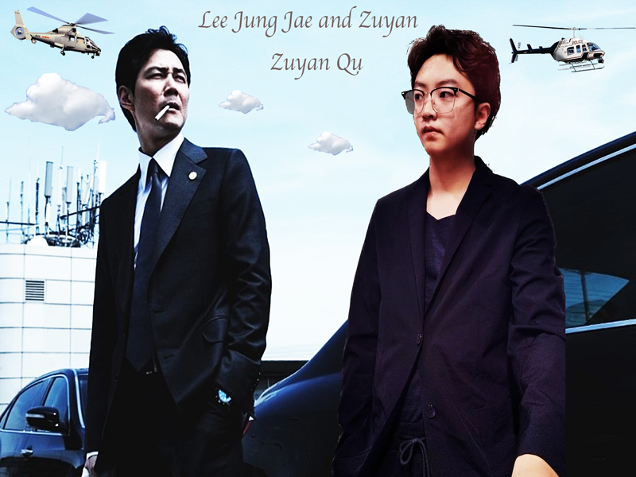

## Instructions

Did you ever want to see yourself at the top of Mount Everest, walking on a rainbow, or hanging out with world leaders at a global summit? In this assignment, you can . . .

> 你是否曾想看到自己登上珠穆朗玛峰的顶峰，在彩虹上漫步，或在全球峰会上与世界各国领导人一起闲逛?在这个作业中，你可以……

## Your Image

Using Photoshop, create a multilayered image that features you placed in an unlikely, unique, or impossible location. The final image should be 600 × 800 pixels (horizontal or vertical orientation). Your project should consist of at least five different layers.

> 使用 Photoshop，创建一个多层图像的特点，你放在一个不可能的，独特的，或不可能的位置。最终的图像应该是600 × 800像素(水平或垂直方向)。您的项目应该至少包含五个不同的层。

A picture of yourself, decontextualized from the original image

> 一张你自己的照片，从原始图像中去文本化

A background image layer (different from the original image) that provides context for your location

> 背景图像层(与原始图像不同)，为您的位置提供上下文

A text layer with your name, a caption, or a title

> 带有您的姓名、标题或标题的文本层

Two additional image layers that enhance the overall impression of your imaginary scene

> 两个额外的图像层，增强您想象的场景的整体印象

Try to make the image as realistic as possible, even as you create a fictional scene. You might place yourself in the Arctic, climbing a national monument, walking on the moon, or standing beside a celebrity. Pay attention to things like the edges of objects, shadows, and color as well as to the proportions of your objects. Use a variety of tools to enhance your image—there are many available in Photoshop and you are encouraged to explore them.

>   试着让图像尽可能真实，即使你创造了一个虚构的场景。你可以把自己置身于北极，攀登国家纪念碑，在月球上漫步，或站在名人身边。注意物体的边缘、阴影和颜色以及物体的比例。使用各种各样的工具来增强你的形象——在 Photoshop 中有很多可用的工具，我们鼓励你去探索它们。

## Saving Your Work

> 节省你的工作

Save your original project file, layers intact, in Photoshop (PSD) format. Then, when your work is complete, export the image as a JPEG or PNG file for the Web. Pay attention to the file size of your exported images, that they are suitable for the web. The JPEG or PNG file should be less than 2 MB.

> 保存您的原始项目文件，图层完整，在Photoshop (PSD)格式。然后，当您的工作完成后，将图像导出为JPEG或PNG文件以供Web使用。注意您导出的图像的文件大小，以确保它们适合于web。JPEG或PNG文件的大小应小于2mb。

You should keep your PSD file after you've exported the images as well. Do not delete it as the Photoshop document will be part of your assignment submission.

> 在导出图像之后，您应该保留 PSD 文件。不要删除它，因为 Photoshop 文档将是你作业提交的一部分。

## Publishing Your Image

>   发布你的形象

Create a new directory on your i6 account called "image". Within this directory, create a basic web page called "index.html" for your project and give the page a title.

>   在你的i6账户上创建一个名为image的新目录。在这个目录中，为你的项目创建一个名为“index.html”的基本网页，并给这个页面一个标题。

Use the \!\[img\]\(\)  element to display your JPEG or PNG on the page. The \!\[img\]\(\) element should include `src`, `width`, `height`, and `alt`attributes that correspond to the image. Add a short paragraph of text that describes the concept for your image.

>   使用 \!\[img\]\(\)  元素在页面上显示你的JPEG或PNG。 \!\[img\]\(\) 元素应该包含与图像对应的 'src'， 'width '， ' height '和' alt '属性。添加一小段文字来描述你的图像的概念。

Add CSS to give your page some basic styles. At minimum, this should include rule sets for the \!\[img\]\(\) element, paragraph text, and background of the page.

>   添加 CSS 为您的页面提供一些基本样式。这至少应该包括用于 \!\[img\]\(\)  元素、段落文本和页面背景的规则集。

Publish the web page, along with your image (the JPEG or PNG, not the Photoshop document), to the i6 server. Your project should be available at: i6.cims.nyu.edu/~netid/image/. Update the code of your assignments directory to link to this new page.

>   将网页和您的图像(JPEG或PNG，不是Photoshop文档)一起发布到i6服务器。您的项目应该可以在以下网站获得:i6.cims.nyu.edu/~netid/image/。更新作业目录的代码以链接到这个新页面。

## Submitting Your Assignment

>   提交作业

Submit the following via Bright Space. 

>   通过 Bright Space 提交以下内容。

The URL to your new web page that displays the image on i6

>   在 i6 上显示图像的新网页的URL

A compressed archive containing your Photoshop project file, JPG or PNG, HTML and CSS The upload may take time; wait for confirmation before closing the browser window

>   一个压缩档案包含您的Photoshop项目文件，JPG或PNG, HTML和CSS 上传可能需要时间;关闭浏览器窗口前请等待确认

Please note that you are required to submit files along with the URL in order to receive credit for your work.

>   请注意，您需要提交文件连同URL，以便为您的工作获得学分。

## Grading

>   分级

This assignment is worth 10 points.

>   这个作业值10分。

A Photoshop project with at least 5 different layers: 4 image layers and 1 text layer (5 points—1 per layer)

>   一个至少有5个不同层的Photoshop项目:4个图像层和1个文本层(每层5个点)

A recognizable image of the student, skillfully decontextualized and proportionally placed in a new location (1 point)

>   一个可识别的学生图像，巧妙地去文本化，并按比例放置在一个新位置(1点)

The image should be 600 × 800 pixels (horizontal or vertical orientation) and the JPEG or PNG file should be under 2 MB in size (1 point)

>   图片尺寸为600 × 800像素(水平或垂直方向)，JPEG或PNG文件大小不超过2mb(1点)

A basic HTML web page that displays the JPG or PNG file on i6 along with a paragraph of text. (1 point)

>   一个基本的HTML网页，在i6上显示JPG或PNG文件以及一段文本。(1分)

Basic CSS for the image, text, and background of the page. (1 point)

>   用于页面的图像、文本和背景的基本CSS。(1分)

The web page's \!\[img\]\(\)  element should include `src`, `width`, `height`, and `alt` attributes that accurately correspond to the image. (1 point)

>   网页的  \!\[img\]\(\) 元素应该包含 'src '， ' width '， ' height '和' alt '属性，准确对应图像。(1分)

**Start Date**

Oct 13, 2022 7:17 AM

**Due Date**

Oct 20, 2022 8:00 AM

## Submit Assignment

**Files to submit**

**(0) file(s) to submit  After uploading, you must click Submit to complete the submission.**




```html
<!DOCTYPE html>
<html lang="en">
<head>
    <meta charset="UTF-8">
    <title>Raster Graphics</title>
    <link rel="stylesheet" type="text/css" href="css/style.css">
</head>
<body>
    <h1>Raster Graphics: Photoshop</h1>
    
    <p>dwdwdwdw</p>
</body>
</html>
```

```css
body {
    background-color: dimgray;
}

img {
    display: block;
    margin: auto;
}

#whiteBox {
    background-color: rgba(187, 11, 11, 0.85);
    border: 5px solid blue;
    width: 75%;
    margin: auto;
    padding: 25px;
    /*background-color: azure;*/
}

p {
    font-family: 'Bungee Spice', cursive;
    font-size: 50px;
    text-align: center;
}

h1 {
    font-family: 'Bungee Spice', cursive;
    font-size: 80px;
    text-align: center;
    background-color: gray;
    padding: 15px;
}
```


欢迎关注我公众号：AI悦创，有更多更好玩的等你发现！


::: details 公众号：AI悦创【二维码】


:::

::: info AI悦创·编程一对一

AI悦创·推出辅导班啦，包括「Python 语言辅导班、C++ 辅导班、java 辅导班、算法/数据结构辅导班、少儿编程、pygame 游戏开发」，全部都是一对一教学：一对一辅导 + 一对一答疑 + 布置作业 + 项目实践等。当然，还有线下线上摄影课程、Photoshop、Premiere 一对一教学、QQ、微信在线，随时响应！微信：Jiabcdefh

C++ 信息奥赛题解，长期更新！长期招收一对一中小学信息奥赛集训，莆田、厦门地区有机会线下上门，其他地区线上。微信：Jiabcdefh

方法一：[QQ](http://wpa.qq.com/msgrd?v=3&uin=1432803776&site=qq&menu=yes)

方法二：微信：Jiabcdefh

:::

