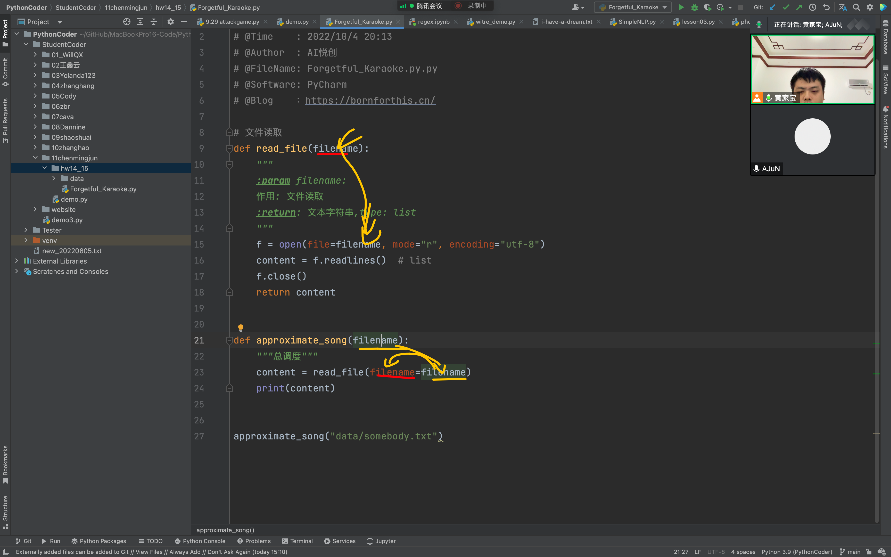
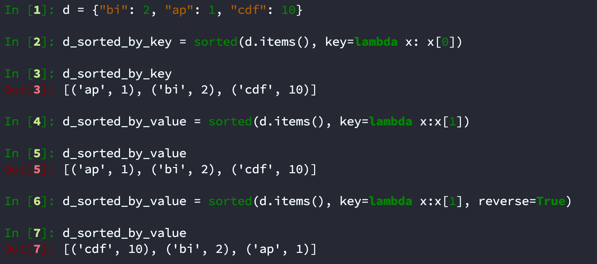

## 1. Forgetful Karaoke

> 健忘的卡拉ok

**Life hack:**  if you're really bad at karaoke and can't remember the words, you can just repeatedly sing one word. If it's the most common word in the song, you'll be right more often than you might think (and may get away with it!).

> 生活小贴士:如果你真的不擅长卡拉 ok，不记得歌词，你可以重复唱一个词。如果它是歌曲中最常见的单词，那么你猜对的次数比你想象的要多(而且可能会侥幸逃脱!)

Write a function `approximate_song(filename)` that reads the lyrics of the song in the file of name filename, and returns the most common word in the song. In the event of a tie, your function should return the word that comes first alphabetically. Assume that words are whitespace-delimited, and use .split() with no stripping of punctuation or folding of case to extract the words from the text.

> 编写一个函数 `approximate_song(filename)`，它读取文件名为 filename 的文件中歌曲的歌词，并返回歌曲中最常见的单词。在平局的情况下，函数应该返回字母顺序排在前面的单词。假设单词是用空格分隔的，并使用 `.split()` 从文本中提取单词，不删除标点符号或折叠大小写。

We have provided lyrics for three songs for you to test your function: somebody.txt, barbrastrelsand.txt, and fakesong.txt. Note these are not the only files we will use to test your code. You can see the contents of these files by clicking on the tabs at the top-right of the page.

> 我们提供了三首歌曲的歌词供您测试您的功能: `some.txt`、`barbrastrelsand.txt` 和 `faksong .txt` 。注意，这些并不是我们用来测试代码的唯一文件。您可以通过单击页面右上角的选项卡查看这些文件的内容。

Outputs should be as below:

> 产出应如下:

```python
>>> approximate_song('somebody.txt")
'that'
>>> approximate_song("fakesong.txt")
"dum1"
>>> approx-imate_song("arbrastre-isand.txt")
"whooo-oo"
```

::: tip 提示 Dictionaries

This is very similar to the Top-5 Frequent words problem in Worksheet 11. Feel free to reuse your solution!

> 这与习题11中的前5个经常出现的单词问题非常相似。请随意重用您的解决方案!

:::

::: tip 翻译

写一个 function approximate_song(filename)，来提取一个歌词文件中出现最多的词，如果有多个词出现频率一样的话就依字母顺序取第一个

:::

### 1. 编写文件读取函数

```python
# -*- coding: utf-8 -*-
# @Time    : 2022/10/4 20:13
# @Author  : AI悦创
# @FileName: Forgetful_Karaoke.py.py
# @Software: PyCharm
# @Blog    ：https://bornforthis.cn/

# 文件读取
def read_file(filename):
    """
    :param filename:
    作用: 文件读取
    :return: 文本字符串,type: list
    """
    f = open(file=filename, mode="r", encoding="utf-8")
    content = f.readlines()  # list
    f.close()
    return content


def approximate_song(filename):
    """总调度"""
    content = read_file(filename=filename)
    print(content)


approximate_song("data/somebody.txt")
```

### 2. 编写单词解析 and 字典

```python
# -*- coding: utf-8 -*-
# @Time    : 2022/10/4 20:13
# @Author  : AI悦创
# @FileName: Forgetful_Karaoke.py.py
# @Software: PyCharm
# @Blog    ：https://bornforthis.cn/

# 文件读取
DATA_DICT = {}
def read_file(filename):
    """
    :param filename:
    作用: 文件读取
    :return: 文本字符串,type: list
    """
    f = open(file=filename, mode="r", encoding="utf-8")
    content = f.readlines()  # list
    f.close()
    return content


def details_words(word):
    global DATA_DICT
    if word in DATA_DICT:
        DATA_DICT[word] += 1
    else:
        DATA_DICT[word] = 1
def parse(content_list):
    for line in content_list:
        # print(line)
        line = line.replace("\n", " ")
        # print(line, end="")
        word_list = line.split(" ")
        # print(word_list)
        for word in word_list:
            if word:
                # print(word)
                details_words(word)


def approximate_song(filename):
    """总调度"""
    content_list = read_file(filename=filename)
    # print(content_list)
    parse(content_list)
    print(DATA_DICT)


approximate_song("data/somebody.txt")
```

### 3. 字典排序

```python
In [1]: d = {"bi": 2, "ap": 1, "cdf": 10}

In [2]: d_sorted_by_key = sorted(d.items(), key=lambda x: x[0])

In [3]: d_sorted_by_key
Out[3]: [('ap', 1), ('bi', 2), ('cdf', 10)]

In [4]: d_sorted_by_value = sorted(d.items(), key=lambda x:x[1])

In [5]: d_sorted_by_value
Out[5]: [('ap', 1), ('bi', 2), ('cdf', 10)]

In [6]: d_sorted_by_value = sorted(d.items(), key=lambda x:x[1], reverse=True)

In [7]: d_sorted_by_value
Out[7]: [('cdf', 10), ('bi', 2), ('ap', 1)]
```

### 4. 词频结果排序

```java
# -*- coding: utf-8 -*-
# @Time    : 2022/10/4 20:13
# @Author  : AI悦创
# @FileName: Forgetful_Karaoke.py.py
# @Software: PyCharm
# @Blog    ：https://bornforthis.cn/

# 文件读取
DATA_DICT = {}


def read_file(filename):
    """
    :param filename:
    作用: 文件读取
    :return: 文本字符串,type: list
    """
    f = open(file=filename, mode="r", encoding="utf-8")
    content = f.readlines()  # list
    f.close()
    return content


def details_words(word):
    global DATA_DICT
    if word in DATA_DICT:
        DATA_DICT[word] += 1
    else:
        DATA_DICT[word] = 1


def parse(content_list):
    for line in content_list:
        # print(line)
        line = line.replace("\n", " ")
        # print(line, end="")
        word_list = line.split(" ")
        # print(word_list)
        for word in word_list:
            if word:
                # print(word)
                details_words(word)


def sorted_words(words: dict):
    words_items = words.items()
    # sorted_by_key = sorted(words_items, key=lambda x: x[0])
    sorted_by_value = sorted(words_items, key=lambda x: x[1], reverse=True)
    # print(sorted_by_value)
    # for word, freq in sorted_by_value:
    #     if
    # first = sorted_by_value[0][1]
    first = sorted_by_value[0]
    position = 0
    target_words = []
    while True:
        if len(sorted_by_value) - 1 < position + 1:
            break
        else:
            second = sorted_by_value[position + 1]
        if first[1] != second[1]:
            # if first > second[1]:
            # return first
            break
        elif first[1] == second[1]:
            target_words.append(second)
            position += 1
        else:
            break
    # print(result_words)
    # print(first)
    if target_words:
        target_words.append(first)
        # print(target_list)
        result_lst = sorted(target_words, key=lambda x: x[0])
        return result_lst[0][0]
    else:
        return first[0]


def approximate_song(filename):
    """总调度"""
    content_list = read_file(filename=filename)
    # print(content_list)
    parse(content_list)
    # print(DATA_DICT)
    # sorted_words(DATA_DICT)
    # d = dict([('that', 24), ('I', 24), ('to', 24), ('you', 16), ('used', 12), ('know', 12), ('and', 9), ('But', 9),
    #           ('your', 9), ('Now', 8), ('me', 7), ('somebody', 7), ('we', 6), ('so', 6), ("you're", 6), ('just', 6),
    #           ('it', 5), ("don't", 5), ('Somebody', 5), ('then', 4), ('were', 4), ('was', 4), ("didn't", 4),
    #           ('have', 4), ('like', 4), ('need', 4), ('of', 3), ('when', 3), ('said', 3), ('could', 3), ('love', 3),
    #           ('a', 3), ('the', 3), ('friends', 3), ('And', 3), ('think', 2), ('Like', 2), ('felt', 2), ('still', 2),
    #           ('You', 2), ('always', 2), ('over', 2), ('cut', 2), ('off', 2), ('Make', 2), ('out', 2), ('never', 2),
    #           ('happened', 2), ('nothing', 2), ('even', 2), ('treat', 2), ('stranger', 2), ('feels', 2), ('rough', 2),
    #           ('No', 2), ('stoop', 2), ('low', 2), ('Have', 2), ('collect', 2), ('records', 2), ('change', 2),
    #           ('number', 2), ('guess', 2), ('though', 2), ('together', 1), ('happy', 1), ('die', 1), ('Told', 1),
    #           ('myself', 1), ('right', 1), ('for', 1), ('lonely', 1), ('in', 1), ('company', 1), ("it's", 1), ('an', 1),
    #           ('ache', 1), ('remember', 1), ('can', 1), ('get', 1), ('addicted', 1), ('certain', 1), ('kind', 1),
    #           ('sadness', 1), ('resignation', 1), ('end,', 1), ('end', 1), ('So', 1), ('found', 1), ('not', 1),
    #           ('make', 1), ('sense', 1), ('Well', 1), ('would', 1), ('be', 1), ("I'll", 1), ('admit', 1), ('glad', 1),
    #           ('all', 1), ('times', 1), ('screwed', 1), ('had', 1), ('believing', 1), ('something', 1), ("I'd", 1),
    #           ('done', 1), ('wanna', 1), ('live', 1), ('way', 1), ('Reading', 1), ('into', 1), ('every', 1),
    #           ('word', 1), ('say', 1), ('let', 1), ('go', 1), ("wouldn't", 1), ('catch', 1), ('hung', 1), ('up', 1),
    #           ('on', 1), ('That', 1)])
    r = sorted_words(DATA_DICT)
    # print(r)
    return r


r = approximate_song("data/fakesong.txt")
print(r)
```


### Question






## 2. Concatenate Files

> 连接文件

Write a function concatenate_files (filename1, filename2, new_filename) that concatenates the text from two source files such that the text from the file named by argument filename2 follows the text from filename1. The concatenated text should be written to a new file with the name given by new_file name. Your function must not return anything.

> 编写一个函数 concatenate_files(filename1, filename2, new_filename)，它将来自两个源文件的文本连接在一起，这样，由参数filename2 命名的文件中的文本会跟随来自 filename1 的文本。连接的文本应该被写入一个名为 new_file name 的新文件。你的函数不能返回任何东西。

We have provided sample input files named [part1.txt](/1v1/07-AJuN/01-W14-Worksheet-14-File-IO-and-CSV-Files/part1.txt) and [part2.txt](/1v1/07-AJuN/01-W14-Worksheet-14-File-IO-and-CSV-Files/part2.txt) containing a portion of the text from the novel *Alice* in  WonderlandXo test your function.

> 我们在 WonderlandXo 中提供了名为 `part1.txt` 和 `part2.txt` 的示例输入文件，其中包含小说《爱丽丝》中的部分文本。

> 写一个function concatenate_files(filename1, filename2, new_filename)，来串接filename1 和 
>
> filename2 两个文本文件，串接好的文本需要被创建到new_filename。 这个function不能return任何
>
> 东西

**Don't leave them open!**

**Remember to close your files!**

## 答案

```python
# -*- coding: utf-8 -*-
# @Time    : 2022/10/6 17:10
# @Author  : AI悦创
# @FileName: ConcatenateFiles.py
# @Software: PyCharm
# @Blog    ：https://bornforthis.cn/

def read_file(path: str):
    with open(path, "r", encoding="utf-8") as f:
        return f.read()


def save_file(path: str, content: str):
    with open(path, "w", encoding="utf-8") as f:
        f.write(content)


def concatenate_files(filename1, filename2, new_filename):
    part1 = read_file(filename1)
    part2 = read_file(filename2)
    content = part1 + "\n" + part2
    save_file(new_filename, content)


if __name__ == '__main__':
    concatenate_files("data/part1.txt", "data/part2.txt", "new_file.txt")
```

## Sorting CSV Records

> 排序 CSV 记录


欢迎关注我公众号：AI悦创，有更多更好玩的等你发现！

::: details 公众号：AI悦创【二维码】


:::

::: info AI悦创·编程一对一

AI悦创·推出辅导班啦，包括「Python 语言辅导班、C++ 辅导班、java 辅导班、算法/数据结构辅导班、少儿编程、pygame 游戏开发」，全部都是一对一教学：一对一辅导 + 一对一答疑 + 布置作业 + 项目实践等。当然，还有线下线上摄影课程、Photoshop、Premiere 一对一教学、QQ、微信在线，随时响应！微信：Jiabcdefh

C++ 信息奥赛题解，长期更新！长期招收一对一中小学信息奥赛集训，莆田、厦门地区有机会线下上门，其他地区线上。微信：Jiabcdefh

方法一：[QQ](http://wpa.qq.com/msgrd?v=3&uin=1432803776&site=qq&menu=yes)

方法二：微信：Jiabcdefh

:::


