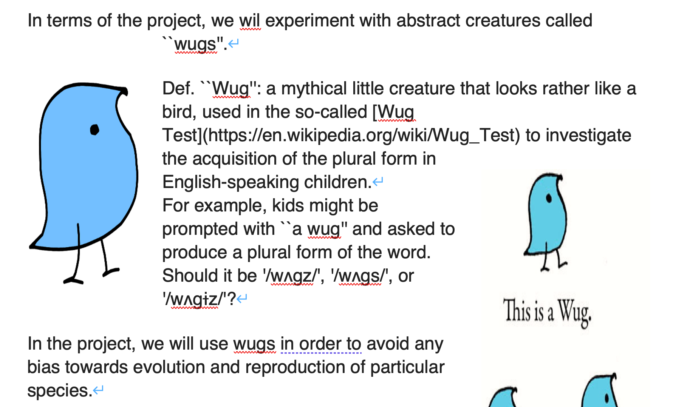
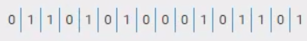
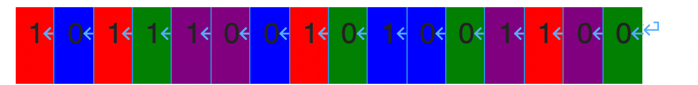
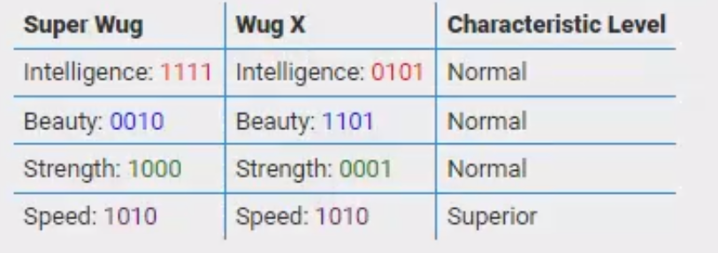
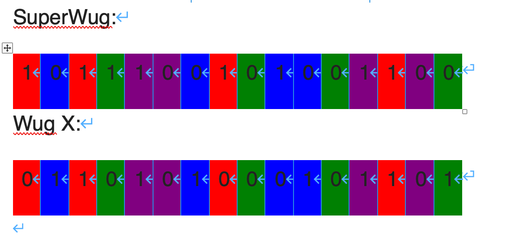

In terms of the project, we wil experiment with abstract creatures called ``wugs''.

>   在这个项目中，我们将用被称为“wugs”的抽象生物进行实验。

Def. ``Wug'': a mythical little creature that looks rather like a bird, used in the so-called [Wug Test](https://en.wikipedia.org/wiki/Wug_Test) to investigate the acquisition of the plural form in English-speaking children.

>   Def。“Wug”:一种看起来很像鸟的神秘小生物，被用于所谓的“Wug测试”(https://en.wikipedia.org/wiki/Wug_Test)中，用来调查说英语的儿童对复数形式的习得。

For example, kids might be prompted with ``a wug'' and asked to produce a plural form of the word. Should it be '/wʌgz/', '/wʌgs/', or '/wʌgɨz/'?

>   例如，孩子们可能会被提示“a wug”，并被要求说出这个词的复数形式。它应该是'/wʌgz/'， '/wʌgs/'，还是'/wʌgɨz/'?

In the project, we will use wugs in order to avoid any bias towards evolution and reproduction of particular species.

>   在项目中，我们将使用wugs，以避免对特定物种的进化和繁殖的任何偏见。

## Wug Characteristics

>   Wug特点

Each wug has the following four binary characteristics:

>   每个wug具有以下四个二进制特征:

-   Intelligence (0 – Normal, 1 – Outstanding)

>   智力(0 -正常，1 -优秀)

-   Beauty (0 – Normal, 1 – Outstanding)

>   美貌(0 -普通，1 -卓越)

-   Strength (0 – Normal, 1 – Outstanding)

>   强度(0 -正常，1 -优异)

-   Speed (0 – Normal, 1 – Outstanding) And they can either be male (M) or female (F), this is encoded in one more characteristic, ``Sex''.

>   速度(0 -正常，1 -突出)他们可以是男性(M)或女性(F)，这是编码在另一个特征，“性别”。

Each wug is represented as a tuple comprising a list of 0s/1s (its genome) and a character (its sex; F/M).

>   每个wug都表示为一个元组，由0 /1(它的基因组)和一个字符(它的性别;F / M)。

## Wug Genome

Characteristic levels (Normal/Outstanding) of an individual wug are determined by its genome.A genome is a sequence comprising 16 genes.
Each gene is expressed as a single bit, i.e. can be either zero (0) or one (1).

>   单个wug的特征水平(正常/突出)由其基因组决定。基因组是由16个基因组成的序列。
>   每个基因都表示为单个位，即可以是0(0)或1(1)。

A sample genome:

>   基因组样本:




## Genome and characteristic levels

>   基因组和特征水平

Each characteristic is defined by a combination of (genome_length/4) genes. Each gene position in a genome corresponds to one of four zones.

>   每个特征都是由(基因组长度/4)基因的组合定义的。基因组中的每个基因位置对应四个带中的一个。

For example,

-   Intelligence: 0101

>   智力:0101

-   Beauty: 1101

>   美:1101

-   Strength: 0001

>   力量:0001

-   Speed: 1010

>   速度:1010

The genome zoning is the same across the wugs. It's also the same across questions (but different to the one provided in the current example).

>   整个wugs的基因组分区是一样的。在所有问题中也是一样的(但与当前示例中提供的不同)。


## SuperWug

There is a target ``super wug genome’’. Once a wug has that genome, it would demonstrate an outstanding level in each characteristic.

>   有一个目标“超级wug基因组”。一旦一只wug有了这个基因组，它就会在每个特征上表现出出色的水平。

-   Intelligence: 1111

>   情报:1111

-   Beauty: 0010

>   美:0010

-   Strength: 1000

>   力量:1000

-   Speed: 1010

>   速度:1010



## Normal vs. Superior

If at least one gene within a genome zone doesn't coincide with that found in the ``super wug genome’’, the individual wug demonstrates a normal level in the respective characteristic. Otherwise, if all genes in a zone coincide with golden ones, an outstanding level in the respective property would be developed.

>   如果基因组区中至少有一个基因与“超级wug基因组”中的基因不一致，则单个wug在各自的特征中显示正常水平。否则，如果一个区域的所有基因都与黄金基因重合，则会发展出各自属性的突出水平。






## Question 1: Decode Genomes

>    问题1:解码基因组

You will write a function called **genome2features** which produces levels of four characteristics for a wug based on its individual genome. You are provided with the "the superwug" genome and the genome zoning information.

>   您将编写一个名为 genome2features 的函数，它根据wug的单个基因组为其生成四个特征的级别。您将获得“the superwug”基因组和基因组分区信息。

`def genome2features(genome)`

-   Input: genome (a list of 0s and 1s)

>   输入:基因组(0和1的列表)

-   Returns: a list of 4 True/False values for **Intelligence,     Beauty, Strength, Speed**. True – Superior, False – Normal

>   返回:**智力，美貌，力量，速度**的4个真/假值列表。True -高级，False -普通

The order of characteristics will be provided and should be preserved!

>   特征的顺序会提供的，应该保留!

```python
>>> characteristics = ["intelligence", "beauty", "strength", "speed"]
>>> superwug_genome = [1, 1, 0, 1, 1, 0, 0, 0, 0, 0, 0, 0, 1, 0, 0, 0]
>>> gene_zones      = [2, 1, 2, 3, 3, 1, 3, 3, 0, 0, 2, 2, 0, 1, 0, 1]
>>> genome_sample1 = [0, 1, 0, 1, 0, 1, 0, 0, 0, 1, 0, 1, 1, 0, 0, 0]
>>> genome_sample2 = [1, 0, 0, 0, 0, 0, 0, 0, 1, 1, 0, 0, 1, 0, 0, 0]
>>> genome_sample3 = [1, 1, 0, 1, 0, 0, 0, 0, 0, 0, 0, 0, 1, 0, 0, 0]
>>> genome_sample4 = [1, 1, 0, 1, 1, 1, 0, 0, 0, 1, 0, 0, 1, 1, 1, 1]

>>> genome2features(genome_sample1)
[False, False, False, False]
>>> genome2features(genome_sample2)
[False, False, True, False]
```

```python
characteristics = ["intelligence", "beauty", "strength", "speed"]
superwug_genome = [1, 1, 0, 1, 1, 0, 0, 0, 0, 0, 0, 0, 1, 0, 0, 0]
gene_zones      = [2, 1, 2, 3, 3, 1, 3, 3, 0, 0, 2, 2, 0, 1, 0, 1]

def genome2features(genome):
    # TODO: Write your function here
```

### Q1 Answer

```python
# -*- coding: utf-8 -*-
# @Time    : 2022/10/20 13:39
# @Author  : AI悦创
# @FileName: q1.py
# @Software: PyCharm
# @Blog    ：https://bornforthis.cn/
characteristics = ["intelligence", "beauty", "strength", "speed"]  # 特征，每个特征都对应着 4 个基因 superwug_genome
superwug_genome = [1, 1, 0, 1, 1, 0, 0, 0, 0, 0, 0, 0, 1, 0, 0, 0]
gene_zones = [2, 1, 2, 3, 3, 1, 3, 3, 0, 0, 2, 2, 0, 1, 0, 1]  # 下标


def generate(g_z, super_genome):
    d = {}
    lst = list(zip(g_z, super_genome))
    # print(list(lst))
    for index, level in enumerate(characteristics):
        middle_list = []
        # print(index, level)
        for t in lst:
            # print("tttt", t)
            if index == t[0]:
                middle_list.append(t[1])
        # print(middle_list)
        d[level] = middle_list
    return d

def judge(d1, d2):
    r_lst = []
    d1_list = list(d1.items())
    d2_list = list(d2.items())
    # print(d1_list)
    # print(d2_list)
    for t1, t2 in zip(d1_list, d2_list):
        # print(t1 == t2)
        r_lst.append(t1 == t2)
    return r_lst


def genome2features(genome):
    # TODO: Write your function here
    super_d = generate(gene_zones, superwug_genome)
    judge_d = generate(gene_zones, genome)
    # print(super_d)
    # print(judge_d)
    return judge(super_d, judge_d)

if __name__ == '__main__':
    # genome = [0, 1, 0, 1, 0, 1, 0, 0, 0, 1, 0, 1, 1, 0, 0, 0]
    genome = [1, 0, 0, 0, 0, 0, 0, 0, 1, 1, 0, 0, 1, 0, 0, 0]
    genome2features(genome)

```

## Question 1b: Describe Wugs

>   问题1b:描述Wugs

You will write a function called **report_population** which aggregates all wugs (the whole population) based on their characteristics. The function will return all observed sets of characteristics with their counts (the number of wugs that have the corresponding characteristics)

>   您将编写一个名为 report_population 的函数，该函数基于所有wug(整个总体)的特征聚合它们。函数将返回所有观察到的特征集及其计数(具有相应特征的wug的数量)

`def report_population(population)`

-   Input: population (a list of tuples representing wugs)

>   输入:population(表示wugs的元组列表)

-   Returns: returns a summary of all population (a list of (tuple, int) pairs ) aggregating those that share the same characteristics. Follow a lexicographical order (descending) in output records.

>   返回:返回所有填充((tuple, int)对的列表)的摘要，聚合了那些具有相同特征的填充。在输出记录中遵循字典顺序(降序)。

The order of characteristics will be provided and should be preserved!

>   特征的顺序会提供的，应该保留!

```python
>>> characteristics = ["intelligence", "beauty", "strength", "speed"]
>>> superwug_genome = [1, 1, 0, 1, 1, 0, 0, 0, 0, 0, 0, 0, 1, 0, 0, 0]
>>> gene_zones      = [2, 1, 2, 3, 3, 1, 3, 3, 0, 0, 2, 2, 0, 1, 0, 1]
>>> genome_sample1 = [0, 1, 0, 1, 0, 1, 0, 0, 0, 1, 0, 1, 1, 0, 0, 0]
>>> genome_sample2 = [1, 1, 0, 1, 0, 1, 0, 0, 0, 1, 0, 1, 1, 0, 0, 0]
>>> genome_sample3 = [1, 1, 0, 1, 0, 0, 0, 0, 0, 0, 0, 0, 1, 0, 0, 0]
>>> genome_sample4 = [1, 1, 0, 1, 1, 1, 0, 0, 0, 1, 0, 0, 1, 1, 1, 1]

>>> report_population([(genome_sample1, 'F'), (genome_sample2, 'F'), (genome_sample3, 'F'), (genome_sample4, 'F')])
[((True, True, True, False, 'F'), 1), ((False, False, True, True, 'F'), 1), ((False, False, False, False, 'F'), 2)]
```

A working implementation of the genome2features function have been made available, you may make calls to the function if you wish

>   genome2features函数的工作实现已经可用，如果您愿意，您可以调用该函数

```python
# DO NOT DELETE/EDIT THIS LINE OF CODE, AS IT IS USED TO PROVIDE ACCESS TO
# A WORKING IMPLEMENTATION OF THE FUNCTION FROM Q1a
from hidden import genome2features

characteristics = ["intelligence", "beauty", "strength", "speed"]
superwug_genome = [1, 1, 0, 1, 1, 0, 0, 0, 0, 0, 0, 0, 1, 0, 0, 0]
gene_zones      = [2, 1, 2, 3, 3, 1, 3, 3, 0, 0, 2, 2, 0, 1, 0, 1]

def report_population(population):
    # TODO: Write your function here
```

### Q1b Answer

```python
# -*- coding: utf-8 -*-
# @Time    : 2022/10/20 15:26
# @Author  : AI悦创
# @FileName: q2.py
# @Software: PyCharm
# @Blog    ：https://bornforthis.cn/

# DO NOT DELETE/EDIT THIS LINE OF CODE, AS IT IS USED TO PROVIDE ACCESS TO
# A WORKING IMPLEMENTATION OF THE FUNCTION FROM Q1a
from q1 import genome2features

characteristics = ["intelligence", "beauty", "strength", "speed"]
superwug_genome = [1, 1, 0, 1, 1, 0, 0, 0, 0, 0, 0, 0, 1, 0, 0, 0]
gene_zones = [2, 1, 2, 3, 3, 1, 3, 3, 0, 0, 2, 2, 0, 1, 0, 1]


def report_population(population):
    # TODO: Write your function here
    result_lst = []
    for g_s, sex in population:
        # print(g_s)
        r = genome2features(g_s)
        # print(r)
        # r.sort(reverse=True)
        r.append(sex)
        result_lst.append(tuple(r))
    # print(result_lst)
    # set_r = set(result_lst)
    d = {}
    for s in result_lst:
        if s in d:
            d[s] += 1
        else:
            d[s] = 1
    new_lst = list(d.items())
    new_lst.sort(reverse=True)
    return new_lst


if __name__ == '__main__':
    genome_sample1 = [0, 1, 0, 1, 0, 1, 0, 0, 0, 1, 0, 1, 1, 0, 0, 0]
    genome_sample2 = [1, 1, 0, 1, 0, 1, 0, 0, 0, 1, 0, 1, 1, 0, 0, 0]
    genome_sample3 = [1, 1, 0, 1, 0, 0, 0, 0, 0, 0, 0, 0, 1, 0, 0, 0]
    genome_sample4 = [1, 1, 0, 1, 1, 1, 0, 0, 0, 1, 0, 0, 1, 1, 1, 1]
    r = report_population([(genome_sample1, 'F'), (genome_sample2, 'F'), (genome_sample3, 'F'), (genome_sample4, 'F')])
    print(r)

```

## Question 1c: How Many Superior Characteristics does a Wug Have?

>   问题1c: Wug有多少优越的特性?

You will write a function called **rank** which returns a number indicating how many superior characteristics a wug has.

>   您将编写一个名为rank的函数，该函数返回一个数字，指示wug具有多少优越特征。

`def rank(wug)`

-   Input: a tuple describing an individual wug (in     which the very first element is genome)

>   输入:描述单个wug的元组(其中第一个元素是基因组)

-   Returns: a number of superior characteristics     that the given wug demonstrates

>   返回:给定wug所演示的一些优越特性

The order of characteristics will be provided and should be preserved!

>   特征的顺序会提供的，应该保留!

```python
>>> characteristics = ["intelligence", "beauty", "strength", "speed"]
>>> superwug_genome = [1, 1, 0, 1, 1, 0, 0, 0, 0, 0, 0, 0, 1, 0, 0, 0]
>>> gene_zones      = [2, 1, 2, 3, 3, 1, 3, 3, 0, 0, 2, 2, 0, 1, 0, 1]
>>> genome_sample1 = [0, 1, 0, 1, 0, 1, 0, 0, 0, 1, 0, 1, 1, 0, 0, 0]  #[False, False, False, False]
>>> genome_sample2 = [1, 0, 0, 0, 0, 0, 0, 0, 1, 1, 0, 0, 1, 0, 0, 0]  #[False, False, True, False]
>>> genome_sample3 = [1, 1, 0, 1, 0, 0, 0, 0, 0, 0, 0, 0, 1, 0, 0, 0]  #[True, True, True, False]
>>> genome_sample4 = [1, 1, 0, 1, 1, 1, 0, 0, 0, 1, 0, 0, 1, 1, 1, 1]  #[False, False, True, True]

>>> rank((genome_sample1, 'F'))
0
>>> rank((genome_sample2, 'M'))
1
>>> rank((genome_sample3, 'M'))
3
>>> rank((genome_sample4, 'F'))
2
```

A working implementation of the genome2features function have been made available, you may make calls to the function if you wish.

>   genome2features 函数的工作实现已经可用，如果您愿意，您可以调用该函数。

```python
# DO NOT DELETE/EDIT THIS LINE OF CODE, AS IT IS USED TO PROVIDE ACCESS TO
# A WORKING IMPLEMENTATION OF THE FUNCTION FROM Q1a
from hidden import genome2features

characteristics = ["intelligence", "beauty", "strength", "speed"]
superwug_genome = [1, 1, 0, 1, 1, 0, 0, 0, 0, 0, 0, 0, 1, 0, 0, 0]
gene_zones      = [2, 1, 2, 3, 3, 1, 3, 3, 0, 0, 2, 2, 0, 1, 0, 1]

def rank(wug):
    # TODO: Write your function here
```

### Q1c Answer

```python
# -*- coding: utf-8 -*-
# @Time    : 2022/10/20 16:06
# @Author  : AI悦创
# @FileName: q3.py
# @Software: PyCharm
# @Blog    ：https://bornforthis.cn/
# DO NOT DELETE/EDIT THIS LINE OF CODE, AS IT IS USED TO PROVIDE ACCESS TO
# A WORKING IMPLEMENTATION OF THE FUNCTION FROM Q1a
from q1 import genome2features

characteristics = ["intelligence", "beauty", "strength", "speed"]
superwug_genome = [1, 1, 0, 1, 1, 0, 0, 0, 0, 0, 0, 0, 1, 0, 0, 0]
gene_zones = [2, 1, 2, 3, 3, 1, 3, 3, 0, 0, 2, 2, 0, 1, 0, 1]


def rank(wug):
    # TODO: Write your function here
    # for g_s, sex in wug:
    bool_numbers = genome2features(wug[0]).count(True)
    return bool_numbers

if __name__ == '__main__':
    genome_sample2 = [1, 0, 0, 0, 0, 0, 0, 0, 1, 1, 0, 0, 1, 0, 0, 0]  # [False, False, True, False]
    genome_sample3 = [1, 1, 0, 1, 0, 0, 0, 0, 0, 0, 0, 0, 1, 0, 0, 0]  # [True, True, True, False]
    genome_sample4 = [1, 1, 0, 1, 1, 1, 0, 0, 0, 1, 0, 0, 1, 1, 1, 1]  # [False, False, True, True]
    r = rank((genome_sample2, 'M'))
    print(r)
    r = rank((genome_sample3, 'M'))
    print(r)

```

## Question 2a: Implement Ranked Wug Population

>   问题2a:实施Wug人口排名

You will write a function called insert_ranked which adds an element to a list keeping the list

>   您将编写一个名为 insert_ranking 的函数，该函数将一个元素添加到保持列表的列表中

-   sorted according to the rank (in a descending order)

>   按等级(按降序)排序

-   not exceeding a predefined maximum number of elements

>   不超过预定义的元素的最大数量

-   preserving chronological order of elements whenever a rank tie occurs

>   每当出现排名相同的情况时，保持元素的时间顺序

`def insert_ranked(population, new_wug, limit=64)`

-   Input: a list to insert into; a new wug; (opt.; default value = 64) the maximum number of elements in the list. You may assume that the input population is already sorted correctly.

>   输入:要插入的列表;一个新的wug;(选择。默认值= 64)列表中元素的最大数量。您可以假设输入总体已经正确排序。

-   Returns: nothing, but modifies the list

>   返回:什么都没有，但是修改列表

Below are some sample function calls:

>   下面是一些函数调用示例:

```python
>>> characteristics = ["intelligence", "beauty", "strength", "speed"]
>>> superwug_genome = [1, 1, 0, 1, 1, 0, 0, 0, 0, 0, 0, 0, 1, 0, 0, 0]
>>> gene_zones   =   [2, 1, 2, 3, 3, 1, 3, 3, 0, 0, 2, 2, 0, 1, 0, 1]
>>> genome_sample1 = [0, 1, 0, 1, 0, 1, 0, 0, 0, 1, 0, 1, 1, 0, 0, 0]  #[False, False, False, False]
>>> genome_sample2 = [1, 0, 0, 0, 0, 0, 0, 0, 1, 1, 0, 0, 1, 0, 0, 0]  #[False, False, True, False]
>>> genome_sample3 = [1, 1, 0, 1, 0, 0, 0, 0, 0, 0, 0, 0, 1, 0, 0, 0]  #[True, True, True, False]
>>> genome_sample4 = [1, 1, 0, 1, 1, 1, 0, 0, 0, 1, 0, 0, 1, 1, 1, 1]  #[False, False, True, True]

# Step1. Start with initial population, example a Female-rank1 and a Male-rank0
>>> population = [ (genome_sample2, 'F'), (genome_sample1, 'M') ]
>>> [rank(wug) for wug in population]
[1, 0]

# Step2. Insert a wug, Male-Rank0
>>> insert_ranked(population, (genome_sample1, 'M'), 4)
>>> [rank(wug) for wug in population]
[1, 0, 0]
# the new Male-Rank0 wug is inserted after the original Male-rank0 wug based on chronological order if there is a tie

# Step3. Insert another wug, Female-Rank3
>>> insert_ranked(population, (genome_sample3, 'F'), 4)
>>> [rank(wug) for wug in population]
[3, 1, 0, 0]
# the new Female-Rank3 wug is inserted at top list based on sort order

# after the 2 inserts (Step2 and Step3), the population list is now equivalent to: 
# population = [ (genome_sample3, 'F'), (genome_sample2, 'F'), (genome_sample1, 'M'), (genome_sample1, 'M') ]

# Step4. Insert another wug, Female-Rank1
>>> insert_ranked(population, (genome_sample2, 'F'), 4)
>>> [rank(wug) for wug in population]
[3, 1, 1, 0]
# the new Female-Rank1 wug is inserted after the original Female-Rank1 (from Step1) based on chronological order 
# if there is a tie and sort order, and thus pushing the last Male-rank0 out because of list size limit

# Step5. Insert another wug, Male-Rank0
>>> insert_ranked(population, (genome_sample1, 'M'), 4)
>>> [rank(wug) for wug in population]
[3, 1, 1, 0]
# Nothing has been inserted due to a low rank of new wug (
```

Working implementations of the genome2features and rank functions have been made available, you may make calls to these functions if you wish.

>   genome2features和rank函数的工作实现已经可用，如果你愿意，你可以调用这些函数。

```python
# DO NOT DELETE/EDIT THIS LINE OF CODE, AS IT IS USED TO PROVIDE ACCESS TO
# WORKING IMPLEMENTATIONS OF THE FUNCTIONS FROM Q1
from hidden import genome2features, rank

characteristics = ["intelligence", "beauty", "strength", "speed"]
superwug_genome = [1, 1, 0, 1, 1, 0, 0, 0, 0, 0, 0, 0, 1, 0, 0, 0]
gene_zones      = [2, 1, 2, 3, 3, 1, 3, 3, 0, 0, 2, 2, 0, 1, 0, 1]

def insert_ranked(population, new_wug, limit=64):
    # TODO: Write your function here
```

### Q2a Answer

```python
# -*- coding: utf-8 -*-
# @Time    : 2022/10/21 13:49
# @Author  : AI悦创
# @FileName: q4.py
# @Software: PyCharm
# @Blog    ：https://bornforthis.cn/


# DO NOT DELETE/EDIT THIS LINE OF CODE, AS IT IS USED TO PROVIDE ACCESS TO
# WORKING IMPLEMENTATIONS OF THE FUNCTIONS FROM Q1
from q1 import genome2features
from q3 import rank

characteristics = ["intelligence", "beauty", "strength", "speed"]
superwug_genome = [1, 1, 0, 1, 1, 0, 0, 0, 0, 0, 0, 0, 1, 0, 0, 0]
gene_zones = [2, 1, 2, 3, 3, 1, 3, 3, 0, 0, 2, 2, 0, 1, 0, 1]

genome_sample1 = [0, 1, 0, 1, 0, 1, 0, 0, 0, 1, 0, 1, 1, 0, 0, 0]  # [False, False, False, False]
genome_sample2 = [1, 0, 0, 0, 0, 0, 0, 0, 1, 1, 0, 0, 1, 0, 0, 0]  # [False, False, True, False]
genome_sample3 = [1, 1, 0, 1, 0, 0, 0, 0, 0, 0, 0, 0, 1, 0, 0, 0]  # [True, True, True, False]
genome_sample4 = [1, 1, 0, 1, 1, 1, 0, 0, 0, 1, 0, 0, 1, 1, 1, 1]  # [False, False, True, True]


def insert_ranked(population: list, new_wug, limit=64):
    # TODO: Write your function here
    population.append(new_wug)
    data_list = []
    for p_c in population:
        data_list.append((p_c, rank(p_c)))
    sorted_by_value = sorted(data_list, key=lambda x: x[1], reverse=True)
    # print(sorted_by_value)
    if len(sorted_by_value) <= limit:
        middle_list = []
        for s_t in sorted_by_value:
            middle_list.append(s_t[0])
        population = middle_list
        # middle_list.sort(reverse=False)
    else:
        middle_list = []
        # sorted_by_value.sort(reverse=True)
        for s_t in sorted_by_value[:limit]:
            middle_list.append(s_t[0])
        # middle_list.sort(reverse=False)
        population = middle_list


if __name__ == '__main__':
    population = [(genome_sample2, 'F'), (genome_sample1, 'M')]
    print([rank(wug) for wug in population])
    insert_ranked(population, (genome_sample1, 'M'), 4)
    print([rank(wug) for wug in population])
    insert_ranked(population, (genome_sample3, 'F'), 4)
    print([rank(wug) for wug in population])

```

```python
# -*- coding: utf-8 -*-
# @Time    : 2022/10/21 13:49
# @Author  : AI悦创
# @FileName: q4.py
# @Software: PyCharm
# @Blog    ：https://bornforthis.cn/


# DO NOT DELETE/EDIT THIS LINE OF CODE, AS IT IS USED TO PROVIDE ACCESS TO
# WORKING IMPLEMENTATIONS OF THE FUNCTIONS FROM Q1
from q1 import genome2features
from q3 import rank

characteristics = ["intelligence", "beauty", "strength", "speed"]
superwug_genome = [1, 1, 0, 1, 1, 0, 0, 0, 0, 0, 0, 0, 1, 0, 0, 0]
gene_zones = [2, 1, 2, 3, 3, 1, 3, 3, 0, 0, 2, 2, 0, 1, 0, 1]

genome_sample1 = [0, 1, 0, 1, 0, 1, 0, 0, 0, 1, 0, 1, 1, 0, 0, 0]  # [False, False, False, False]
genome_sample2 = [1, 0, 0, 0, 0, 0, 0, 0, 1, 1, 0, 0, 1, 0, 0, 0]  # [False, False, True, False]
genome_sample3 = [1, 1, 0, 1, 0, 0, 0, 0, 0, 0, 0, 0, 1, 0, 0, 0]  # [True, True, True, False]
genome_sample4 = [1, 1, 0, 1, 1, 1, 0, 0, 0, 1, 0, 0, 1, 1, 1, 1]  # [False, False, True, True]


def insert_ranked(population1: list, new_wug, limit=64):
    # TODO: Write your function here
    global population
    population1.append(new_wug)
    # new_p = population + [new_wug]
    data_list = []
    for p_c in population1:
        data_list.append((p_c, rank(p_c)))
        # data_list.append((p_c, genome2features(p_c[0]).count(True)))
    sorted_by_value = sorted(data_list, key=lambda x: x[1], reverse=True)
    # print("sorted_by_value:>>>>", sorted_by_value)
    if len(sorted_by_value) <= limit:
        middle_list = []
        for s_t in sorted_by_value:
            middle_list.append(s_t[0])
        # print("middle_list:>>>", middle_list)
        population = middle_list
        # middle_list.sort(reverse=False)
    else:
        middle_list = []
        # sorted_by_value.sort(reverse=True)
        for s_t in sorted_by_value[:limit]:
            middle_list.append(s_t[0])
        # middle_list.sort(reverse=False)
        population = middle_list


if __name__ == '__main__':
    population = [(genome_sample2, 'F'), (genome_sample1, 'M')]
    print("1:>>>>", population)
    print([rank(wug) for wug in population])
    insert_ranked(population, (genome_sample1, 'M'), 4)
    print("2:>>>>", population)
    print([rank(wug) for wug in population])
    insert_ranked(population, (genome_sample3, 'F'), 4)
    print("3:>>>>", population)
    print([rank(wug) for wug in population])
    insert_ranked(population, (genome_sample2, 'F'), 4)
    print("4:>>>>", population)
    print([rank(wug) for wug in population])
    insert_ranked(population, (genome_sample1, 'M'), 4)
    print("5:>>>>", population)
    print([rank(wug) for wug in population])
```

```python
# -*- coding: utf-8 -*-
# @Time    : 2022/10/21 13:49
# @Author  : AI悦创
# @FileName: q4.py
# @Software: PyCharm
# @Blog    ：https://bornforthis.cn/


# DO NOT DELETE/EDIT THIS LINE OF CODE, AS IT IS USED TO PROVIDE ACCESS TO
# WORKING IMPLEMENTATIONS OF THE FUNCTIONS FROM Q1
from q1 import genome2features
from q3 import rank

characteristics = ["intelligence", "beauty", "strength", "speed"]
superwug_genome = [1, 1, 0, 1, 1, 0, 0, 0, 0, 0, 0, 0, 1, 0, 0, 0]
gene_zones = [2, 1, 2, 3, 3, 1, 3, 3, 0, 0, 2, 2, 0, 1, 0, 1]

genome_sample1 = [0, 1, 0, 1, 0, 1, 0, 0, 0, 1, 0, 1, 1, 0, 0, 0]  # [False, False, False, False]
genome_sample2 = [1, 0, 0, 0, 0, 0, 0, 0, 1, 1, 0, 0, 1, 0, 0, 0]  # [False, False, True, False]
genome_sample3 = [1, 1, 0, 1, 0, 0, 0, 0, 0, 0, 0, 0, 1, 0, 0, 0]  # [True, True, True, False]
genome_sample4 = [1, 1, 0, 1, 1, 1, 0, 0, 0, 1, 0, 0, 1, 1, 1, 1]  # [False, False, True, True]


def insert_ranked(population1: list, new_wug, limit=64):
    # TODO: Write your function here
    global population
    population1.append(new_wug)
    # new_p = population + [new_wug]
    data_list = []
    for p_c in population1:
        data_list.append((p_c, rank(p_c)))
        # data_list.append((p_c, genome2features(p_c[0]).count(True)))
    sorted_by_value = sorted(data_list, key=lambda x: x[1], reverse=True)
    # print("sorted_by_value:>>>>", sorted_by_value)
    if len(sorted_by_value) <= limit:
        middle_list = []
        for s_t in sorted_by_value:
            middle_list.append(s_t[0])
        # print("middle_list:>>>", middle_list)
        population = middle_list
        # middle_list.sort(reverse=False)
    else:
        middle_list = []
        # sorted_by_value.sort(reverse=True)
        for s_t in sorted_by_value[:limit]:
            middle_list.append(s_t[0])
        # middle_list.sort(reverse=False)
        population = middle_list


if __name__ == '__main__':
    population = [(genome_sample2, 'F'), (genome_sample1, 'M')]
    print("1:>>>>", population)
    print([rank(wug) for wug in population])
    insert_ranked(population, (genome_sample1, 'M'), 4)
    print("2:>>>>", population)
    print([rank(wug) for wug in population])
    insert_ranked(population, (genome_sample3, 'F'), 4)
    print("3:>>>>", population)
    print([rank(wug) for wug in population])
    insert_ranked(population, (genome_sample2, 'F'), 4)
    print("4:>>>>", population)
    print([rank(wug) for wug in population])
    insert_ranked(population, (genome_sample1, 'M'), 4)
    print("5:>>>>", population)
    print([rank(wug) for wug in population])
```

## Question 2b: Implement Wug Cloning with Gene Mutations

>   问题2b:用基因突变实现Wug克隆

You will write a function called proliferate which clones 16 wugs from each existing wug in a population. Each cloned wug has exactly one gene altered from its cloned value, at different positions across the mentioned 16 wugs. Use previously developed insert_ranked function to put the offsprings to the population, accounting for the population size limit and ranking requirements.

>   您将编写一个名为 proliferate 的函数，它从种群中的每个现有 wug 中克隆16个wug。每个克隆的wug都有一个基因从其克隆值改变，在上述16个wug的不同位置。使用以前开发的insert_ranking函数将后代放到种群中，考虑种群大小限制和排序要求。

Note that the function can be called for both male and female wugs.

>   注意，对于男性wugs和女性wugs都可以调用该函数。

`def proliferate(population, limit = 64)`

-   Input: a population, i.e. a list of (genome, sex) tuples and the maximum size of the population

>   输入:种群，即(基因组，性别)元组列表和种群的最大大小

-   Returns: nothing, but modifies the list

>   返回:什么都没有，但是修改列表

Below are some sample function calls:

>   下面是一些函数调用示例:

```python
>>> characteristics = ["intelligence", "beauty", "strength", "speed"]
>>> superwug_genome = [1, 1, 0, 1, 1, 0, 0, 0, 0, 0, 0, 0, 1, 0, 0, 0]
>>> gene_zones      =   [2, 1, 2, 3, 3, 1, 3, 3, 0, 0, 2, 2, 0, 1, 0, 1]
>>> wug1 = ([0, 1, 0, 1, 0, 1, 0, 1, 0, 1, 0, 1, 0, 1, 0, 1], 'F')
>>> wug2 = ([0, 1, 1, 0, 1, 0, 1, 0, 0, 0, 1, 0, 1, 1, 0, 1], 'M')
>>> wug3 = ([1, 0, 1, 1, 1, 0, 1, 1, 0, 0, 0, 0, 1, 0, 0, 1], 'F')

>>> population1 = [wug1]
>>> proliferate(population1)
>>> population1
[([0, 1, 0, 1, 0, 1, 0, 1, 0, 1, 0, 1, 0, 1, 0, 1], 'F'), ([1, 1, 0, 1, 0, 1, 0, 1, 0, 1, 0, 1, 0, 1, 0, 1], 'F'), ([0, 0, 0, 1, 0, 1, 0, 1, 0, 1, 0, 1, 0, 1, 0, 1], 'F'), ([0, 1, 1, 1, 0, 1, 0, 1, 0, 1, 0, 1, 0, 1, 0, 1], 'F'), ([0, 1, 0, 0, 0, 1, 0, 1, 0, 1, 0, 1, 0, 1, 0, 1], 'F'), ([0, 1, 0, 1, 1, 1, 0, 1, 0, 1, 0, 1, 0, 1, 0, 1], 'F'), ([0, 1, 0, 1, 0, 0, 0, 1, 0, 1, 0, 1, 0, 1, 0, 1], 'F'), ([0, 1, 0, 1, 0, 1, 1, 1, 0, 1, 0, 1, 0, 1, 0, 1], 'F'), ([0, 1, 0, 1, 0, 1, 0, 0, 0, 1, 0, 1, 0, 1, 0, 1], 'F'), ([0, 1, 0, 1, 0, 1, 0, 1, 1, 1, 0, 1, 0, 1, 0, 1], 'F'), ([0, 1, 0, 1, 0, 1, 0, 1, 0, 0, 0, 1, 0, 1, 0, 1], 'F'), ([0, 1, 0, 1, 0, 1, 0, 1, 0, 1, 1, 1, 0, 1, 0, 1], 'F'), ([0, 1, 0, 1, 0, 1, 0, 1, 0, 1, 0, 0, 0, 1, 0, 1], 'F'), ([0, 1, 0, 1, 0, 1, 0, 1, 0, 1, 0, 1, 1, 1, 0, 1], 'F'), ([0, 1, 0, 1, 0, 1, 0, 1, 0, 1, 0, 1, 0, 0, 0, 1], 'F'), ([0, 1, 0, 1, 0, 1, 0, 1, 0, 1, 0, 1, 0, 1, 1, 1], 'F'), ([0, 1, 0, 1, 0, 1, 0, 1, 0, 1, 0, 1, 0, 1, 0, 0], 'F')]
>>> report_population(population1)
[((False, False, False, False, 'F'), 17)]
```

```python
# DO NOT DELETE/EDIT THIS LINE OF CODE, AS IT IS USED TO PROVIDE ACCESS TO
# WORKING IMPLEMENTATIONS OF THE FUNCTIONS FROM Q1 and Q2a
from hidden import genome2features, report_population, rank, insert_ranked  

characteristics = ["intelligence", "beauty", "strength", "speed"]
superwug_genome = [1, 1, 0, 1, 1, 0, 0, 0, 0, 0, 0, 0, 1, 0, 0, 0]
gene_zones      = [2, 1, 2, 3, 3, 1, 3, 3, 0, 0, 2, 2, 0, 1, 0, 1]

def proliferate(population, limit=64):
    # TODO: Write your function here
```

### Q2a Answer

```python
# -*- coding: utf-8 -*-
# @Time    : 2022/10/21 20:34
# @Author  : AI悦创
# @FileName: lo.py
# @Software: PyCharm
# @Blog    ：https://bornforthis.cn/
# -*- coding: utf-8 -*-
# @Time    : 2022/10/21 16:53
# @Author  : AI悦创
# @FileName: q5.py
# @Software: PyCharm
# @Blog    ：https://bornforthis.cn/


def proliferate(pop_lst, limit=64):
    result_lst = []
    new_pop = pop_lst[0].copy()
    word = pop_lst[1]
    for index, item in enumerate(new_pop):
        loop = new_pop.copy()
        # print("loop:", loop)
        if item == 1:
            loop[index] = 0
            tup = (loop, word)
            result_lst.append(tup)
        elif item == 0:
            loop[index] = 1
            tup = (loop, word)
            result_lst.append(tup)
    # return result_lst
    # print(len(result_lst))
    result_lst.insert(0, pop_lst)
    pop_lst[0][:] = result_lst


if __name__ == '__main__':
    wug1 = ([0, 1, 0, 1, 0, 1, 0, 1, 0, 1, 0, 1, 0, 1, 0, 1], 'F')
    wug2 = ([0, 1, 1, 0, 1, 0, 1, 0, 0, 0, 1, 0, 1, 1, 0, 1], 'M')
    wug3 = ([1, 0, 1, 1, 1, 0, 1, 1, 0, 0, 0, 0, 1, 0, 0, 1], 'F')
    proliferate(wug1)
    # print(population)
    print(wug1)

```


欢迎关注我公众号：AI悦创，有更多更好玩的等你发现！

::: details 公众号：AI悦创【二维码】


:::

::: info AI悦创·编程一对一

AI悦创·推出辅导班啦，包括「Python 语言辅导班、C++ 辅导班、java 辅导班、算法/数据结构辅导班、少儿编程、pygame 游戏开发」，全部都是一对一教学：一对一辅导 + 一对一答疑 + 布置作业 + 项目实践等。当然，还有线下线上摄影课程、Photoshop、Premiere 一对一教学、QQ、微信在线，随时响应！微信：Jiabcdefh

C++ 信息奥赛题解，长期更新！长期招收一对一中小学信息奥赛集训，莆田、厦门地区有机会线下上门，其他地区线上。微信：Jiabcdefh

方法一：[QQ](http://wpa.qq.com/msgrd?v=3&uin=1432803776&site=qq&menu=yes)

方法二：微信：Jiabcdefh

:::


