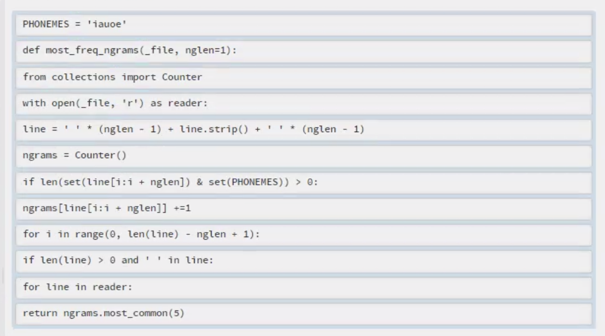
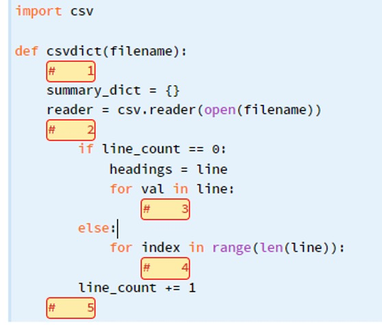

This assignment is locked until Nov 1 at 15:00.

> 此作业锁定到11月1日15:00。

## Question 1

### (a) Output value: `'wombat'`

Required operations:

1. `.join()` method
2. list slicing

```python
In [22]: "".join(list('waobmcbdaet')[::2])
Out[22]: 'wombat'
```

### (b) Output value: True

Required operations:

1. len() function
2. dictionary lookup

```python
len({1:[1,2,3]}[1]) == 3
```

### (c) Output value: '6 // 3 == 2!'

Required operations:

1. floor division
2. f-string

```python
f'{12//2} // 3 == 2'
```

### (d) Output value: 1

Required operations:

1. `.pop()` method
2. `.split()` method
3. `.index()` method

```python
"1,2,3".split(",").index("2") + [1, 2, 0].pop()
```

### (e) Output value:  True

Required operations:

1. `.keys()` method
2. in operator
3. tuple indexing

```python
tuple({(1, 2): "value"}.keys())[0][0] in (1, 2, 3)
```


## Question 2

An ngram is a sequence of symbols (such as characters) of length n. Each string can be represented as a sequence of n-grams. For example, `'cat'` can be represented as `'c'`, `'a'`, `'t'` (1-grams, or unigrams), or as `'c'`,` 'ca'`, `'at'`, `'t'` (2-grams, or bigrams). [Note that the first bigram of the word `'cat'` is `'c'`, i.e., a space and c, and the last bigram of the word `'cat'` is `'t'`, i.e., t and a space.]

> 一个 ngram 是长度为 n 的符号序列(如字符)。每个字符串都可以表示为 n 个 gram 的序列。例如，`'cat'` 可以表示为 `'c'`， `'a'`， `'t'` (1克，或字母组合)，或表示为 `'c'`， `'ca'`， `'at'`， `'t'` (2克，或字母组合)。[请注意，单词 “cat” 的第一个重音是 “c”，即一个空格和 c，单词 “cat” 的最后一个重音是 “t”，即 t 和一个空格。]

The function `most_freq_ngrams(_file, nglen=1)` takes a file name _file and the ngram length nglen, processes the file, and returns the top 5 most common ngrams that have at least one symbol specified in the global variable PHONEMES.

> 函数 `most_freq_ngrams(_file, nglen=1)` 接受文件名_file和ngram长度nglen，处理该文件，并返回在全局变量phoneme中至少有一个符号的前5个最常见的ngram。

The input file contains poetry pieces as well as some empty lines or lines with auxiliary information (AABB, ABAB ... etc.). Here is a sample input file (Q2poems.txt):

> 输入文件包含诗歌片段以及一些空行或带有辅助信息的行(AABB, ABAB…等等)。下面是一个示例输入文件(Q2poems.txt):

**Q2poems.txt**

```txt
ABAB

Bid me to weep, and I will weep
While I have eyes to see
And having none, yet I will keep
A heart to weep for thee

ABCB
All in a hot and copper sky
The bloody Sun, at noon,
Right up above the mast did stand,
No bigger than the Moon.

AABB

New life, a little baby, a little star,
The world awaits you near and far
With guidance and loving care
That will keep you safe and happy there.

ABBA

All is luminous, self-existent light
And yet we see it not
Being in mind games caught
Look again hermit, with spherical sight
```

The function reads the file line by line skipping empty lines as well as those that only contain a single word (assuming words are separated by a whitespace character).

> 该函数通过跳过空行和只包含一个单词的行(假设单词由空格字符分隔)来读取文件行。

For example,

```python
>>> most_freq_ngrams('Q2poems.txt')
[('e', 50), ('a', 32), ('i', 30), ('o', 23), ('u', 8)]

>>> most_freq_ngrams('Q2poems.txt', 2)
[('e ', 17), (' a', 12), ('he', 9), ('ee', 8), ('an', 8)]

>>> most_freq_ngrams('Q2poems.txt', 5)
[(' and ', 5), (' weep', 3), (' will', 3), ('will ', 3), ('e    ', 3)]
```

As presented, the lines of the function are out of order in the window to the right. Put the lines in the correct order and introduce appropriate indentation. Note that as an additional constraint, your code must follow PEP8 and should not produce any PEP8 warnings when run.

> 如图所示，在右边的窗口中，函数的行顺序是乱的。把线条按正确的顺序排列，并引入适当的缩进。注意，作为一个附加约束，您的代码必须遵循PEP8，并且在运行时不应该产生任何PEP8警告。

Note: A Counter is a dict subclass, it is a collection where elements are stored as dictionary keys and their counts are stored as dictionary values. most_common(n) returns a list of the n most common elements and their counts from the most common to the least.

> 注意: Counter 是一个 dict 子类，它是一个集合，其中元素被存储为字典键，它们的计数被存储为字典值。Most_common(n)返回n个最常见元素的列表，以及它们从最常见到最不常见的计数。

```python
PHONEMES = 'iauoe'
def most_freq_ngrams(_file, nglen=1):
from collections import Counter
with open(_file, 'r') as reader:
line = ' ' * (nglen - 1) + line.strip() + ' ' * (nglen - 1)
ngrams = Counter()
if len(set(line[i:i + nglen]) & set(PHONEMES)) > 0:
ngrams[line[i:i + nglen]] +=1
for i in range(0, len(line) - nglen + 1):
if len(line) > 0 and ' ' in line:
for line in reader:
return ngrams.most_common(5)
```



### 答案

```python
from collections import Counter


def most_freq_ngrams(_file, nglen=1):
    PHONEMES = 'iauoe'
    ngrams = Counter()
    with open(_file, 'r') as reader:
        for line in reader:
            if len(line) > 0 and ' ' in line:
                line = ' ' * (nglen - 1) + line.strip() + ' ' * (nglen - 1)
                for i in range(0, len(line) - nglen + 1):
                    if len(set(line[i:i + nglen]) & set(PHONEMES)) > 0:
                        ngrams[line[i:i + nglen]] += 1

        return ngrams.most_common(5)


if __name__ == '__main__':
    r = most_freq_ngrams('Q2poems.txt')
    print(r)
    r = most_freq_ngrams('Q2poems.txt', 2)
    print(r)
    r = most_freq_ngrams('Q2poems.txt', 5)
    print(r)
```

## Question 3

In this question, we will play with a new form of poetry. In this form of poetry, each line of the poem should follow a specified format, in terms of containing a sequence of short and long words. The function provided here is designed to check whether a given poem follows the provided format.

> 在这个问题中，我们将玩转一种新的诗歌形式。在这种形式的诗歌中，诗的每一行都应该遵循特定的格式，即包含一系列长短词。这里提供的函数旨在检查给定的诗歌是否遵循所提供的格式。

The format for a line in a poem is specified by a string of the characters `'S'` (for short words) and `'L'` (for long words). For example, the format `'SSL'` specifies that the corresponding line of the poem should contain 3 words: a short word, followed by another short word, followed by a long word. We will consider a word with 3 characters or less to be a short word, otherwise it is considered a long word. The line of poetry 'a big balloon' satisfies the format `'SSL'`, while none of the lines 'one big dog', 'advance australia fair' or 'tomorrow for dinner' satisfy the format `'SSL'`.

> 诗中一行的格式由一串字符“S”(用于短词)和“L”(用于长词)指定。例如，“SSL”格式指定诗歌的对应行应该包含3个单词:一个短单词，后面跟着另一个短单词，后面跟着一个长单词。我们会认为一个少于3个字符的单词是短单词，否则它被认为是长单词。“一个大气球”这一行诗满足“SSL”的格式，而“一只大狗”、“推进澳大利亚博览会”或“明天的晚餐”这几行诗都不满足“SSL”的格式。

The format for a poem is given as a list of strings, where each string represents the format of the corresponding line of the poem. For example, `['SSSL', 'LL', 'SLS']` is the format for poems containing 3 lines, where the first line has the format `'SSSL'`, and so on. An example of a poem that matches this format is:

> 一首诗的格式是一个字符串列表，其中每个字符串代表诗中相应行的格式。例如，[' ssl '， 'LL'， 'SLS']是包含3行诗的格式，其中第一行的格式为' ssl '，以此类推。一个符合这种格式的诗歌例子是:

```python
I saw a crocodile
Smiling strangely
But rather fat
```

This poem can be represented as a single string, with each line separated by a newline character `\n`, for example, 'I saw a crocodile\nSmiling strangely\nBut rather fat'. Each word contains only letters, and words in a line are separated by whitespace.

> 这首诗可以表示为单行，每行之间用换行字符“n”隔开，例如，“我看到一条鳄鱼\n微笑得很奇怪\n但很胖”。每个单词只包含字母，一行中的单词用空格分隔。

The function `check_poem(poem, structure)` takes as input a poem and its format specification, and returns either `True` or `False`. The `True` value is returned if the poem matches the given format, otherwise it should return `False`.

> 函数check_poem(poem, structure)接受一首诗及其格式规范作为输入，并返回True或False。如果诗歌匹配给定的格式，则返回True值，否则返回False值。

- `poem` - a non-empty string comprising lines separated by `\n` that represents a poem.
-  `structure` - a list of strings representing the correct format of a poem.

```python
def check_poem(poem, structure):
    short = 3
    lines = poem.strip().split('\n')
    all_match = True
    for (line, form) in zip(lines, structure):
        words = line.split()
        line_match = True
        i = 0
        while i < len(words) and i < len(form):
            if form[i] == 'S' and len(words[i]) >= short:
                line_match = False
            if form[i] == 'L' and len(words[i]) < short:
                line_match = False
            i += 1
        all_match = all_match and line_match
return all_match
```


## Question 4

for 编程 while

```python
def make_pack(weights, _max):
    weights.sort()

    for i in range(2, len(weights)):
        if weights[i] <= sum(weights[:i]):
            return []
    pack = []
    remaining = _max
    for item in weights[::-1]:
        if item <= remaining:
            pack.append(item)
            remaining = remaining - item
    return pack
```

### 答案

```python
def make_pack(weights, _max):
    weights.sort()
    index = 2
    while index < len(weights):
        if weights[index] <= sum(weights[:index]):
            return []
        index += 1
    pack = []
    remaining = _max
    index = 0
    opt_object = weights[::-1]
    while index < len(weights[::-1]):
        item = opt_object[index]
        if item <= remaining:
            pack.append(item)
            remaining = remaining - item
    return pack
```

### 学员答案

```python
def make_pack(weights, _max):
    weights.sort()
    i = 2
    while i <= len(weights):
        if weights[i] <= sum(weights[:i]):
            return []
        i+=1
    pack = []
    remaining = _max
    for item in weights[::-1]:
        if item <= remaining:
            pack.append(item)
            remaining = remaining - item
    return pack
```

## Question 5

Esperanto is one of the most widely used constructed languages. Unlike many natural languages, it is considered to be easy to learn as it has high regularity. For instance, the suffixes ‑o, ‑a, ‑e, and ‑i indicate that a word is a noun (kato, a cat), adjective (bela, beautiful), adverb (bele, beautifully), and infinitive verb (paroli, to speak), respectively. It has a single definite article (la) and a set of pronouns (mi, ni, vi, li, ŝi, ĝi, ili). Plural forms of nouns and adjectives are formed by attaching j as in katoj (cats).

> 世界语是使用最广泛的构造语言之一。与许多自然语言不同，它被认为很容易学习，因为它有很高的规律性。例如，后缀o、a、e和i分别表示一个单词是名词(kato，一只猫)、形容词(bela，美丽)、副词(bele，美丽)和不定式动词(paroli，说话)。它有一个定冠词(la)和一组代词(mi, ni, vi, li， ŝi, i, ili)。名词和形容词的复数形式是通过在katoj (cats)中加上j来形成的。

The sentence structure is very much like English (Subject–Verb–Object) while objects are additionally marked by the n suffix (La hundo amas la katon, the dog loves the cat).

> 这句话的句子结构很像英语(主语-动词-宾语)，而宾语则附加了n后缀(La hundo amas La katon，狗爱猫)。

Verbs tenses are also expressed via endings: -is, -as, -os for the past, present, future tense, respectively. E.g., estas means is, ĉasis— chased, esperos— will hope. Finally, negation is expressed via the ne particle.

> 动词的时态也可以通过结尾来表达:-is， -as， -os分别用于过去时，现在时和将来时。例如，estas的意思是“是”、“是”、“是”、“是”。最后，否定通过ne粒子来表达。

Here are some sample sentences and their English translations:

> 下面是一些例句和它们的英文翻译:

- La floro estas bela //  The flower is beautiful

> La floro estas bela //这朵花很漂亮

- La kato ne kuris //     The cat didn't run

> 灵魂使者不跟猫咪跑

- Ŝi havas belajn florojn // She has beautiful flowers

> Ŝi havas belajn florojn //她有漂亮的花

- Kato kuris // A cat ran

> Kato kuris //一只猫跑了

The code is intended to take an Esperanto sentence as its input and return a list of parts of speech (verb, noun,...) for each word in the sentence. The word classes (parts of speech) are provided as a dictionary pos comprising markers that signify each part of speech and the corresponding part of speech. The markers are either 1-3 character suffixes starting with "-" for nouns, verbs, adjectives, adverbs, or whole 2-3 character words for pronouns, articles, particles). The function process(text) takes a string text and returns a list of parts of speech. It attempts to match the whole-word units first and then suffixes (starting from the longest ones). If it doesn't find a string match, it assigns a corresponding word to OOV (out-of-vocabulary).

> 该代码的目的是将世界语句子作为输入，并返回句子中每个单词的词性(动词、名词、……)的列表。词类(词类)作为字典pos提供，其中包含标记，表示每个词类和对应的词类。标记要么是名词、动词、形容词、副词以“-”开头的1-3个字符的后缀，要么是代词、冠词、助词的2-3个字符的完整单词)。函数process(text)接受字符串文本并返回词性列表。它首先尝试匹配整个单词的单位，然后是后缀(从最长的开始)。如果它没有找到匹配的字符串，它就将相应的单词分配给OOV(词汇表外)。

```python
def process(text):                              # 1
    pos = {'-o': 'N', '-oj': 'N', '-on': 'N', '-ojn': 'N', '-a': 'ADJ', '-aj': 'ADJ', '-an': 'ADJ', '-ajn': 'ADJ', '-i': 'V', '-is': 'V', '-as': 'V', '-os': 'V', '-e': 'ADV', 'mi': 'PRON', 'ni': 'PRON', 'vi': 'PRON', 'li': 'PRON', 'ŝi': 'PRON', 'ĝi': 'PRON', 'ili': 'PRON', 'la': 'ART', 'ne': 'NEG'}  # 2
    out = ()                                    # 3
    for word in text.split():                   # 4
        found = False                           # 5
        word = word.lower().replace('.','').replace(',','')  # 6
        if len(word)>1 and len(word)<=4:        # 7
            if word in pos:                     # 8
                found = True                    # 9
                out.append(pos[word])           # 10
        elif len(word)>=4:                      # 11
            for i in range(3,0,-1)              # 12
                if '-'+word[-i:] in pos:        # 13
                    found = True                # 14
                    out.append(pos[word[-i:]])  # 15
                    break                       # 16
        if not found:                           # 17
            out.append('OOV')                   # 18
    return out
```

examples:

```python
>>> process('La floro estas bela')
['ART', 'N', 'V', 'ADJ']
>>> process('La virino ne estas malbela')
['ART', 'N', 'NEG', 'V', 'ADJ']
>>> process('Ili ne taŭgas por karesi')
['PRON', 'NEG', 'V', 'OOV', 'V']
```

However, there are several errors in the given function definitions. Identify **exactly** three (3) errors and specify:

> 然而，在给定的函数定义中有几个错误。确定**准确**三(3)个错误并指定:

 (a) the line where the error occurs;

> (a)发生错误的线;

 (b) the type of error, as *syntax*, *run-time*, or logic; and

> (b)错误类型，如*语法*、*运行时*或逻辑;和

(c) how you would fix each error, in the form of the corrected (single) line of code.

> (c)你们将如何以纠正的(单)行代码的形式修正每个错误。

### 答案

1. 12 行的 for 缺少冒号 `:`
2. 10、15 tuple 没有 append，把 3行改成列表。

## Question 6

The following function csvdict`(filename)` is intended to read a csv file with the given filename. The first line of the csv file contains the headings of each column in the file. Each subsequent line of the csv file contains an integer value for each column. You can assume that the csv file exists, is correctly formatted, it contains at least one column, it has at least one row of values in addition to the heading row, and each row has the correct number of values.

> 下面的函数csvdict ' (filename) '用于读取具有给定文件名的csv文件。csv文件的第一行包含文件中每个列的标题。csv文件的后续每一行都包含每个列的整数值。您可以假设csv文件存在，格式正确，至少包含一列，除标题行外至少有一行值，并且每行值的数量正确。

The function csvdict`(filename)` should return a dictionary, whose keys correspond to the headings of the columns in the csv file, and the value of each key is the integer sum of the values of the corresponding column.

> 函数 `csvdict'(filename)'` 应该返回一个字典，它的键对应于 csv 文件中列的标题，每个键的值是对应列值的整数和。

For example, if the csv file test `.csv` contains:

> 例如，如果 csv 文件test ' .csv '包含:

```python
col1, col2, col3
12, 2, 101
10, 3, 102
8, 4, 110
```

then csvdict`('test.csv')` will return:

```python
{'col1': 30, 'col2': 9, 'col3': 313}
```

Provide code to insert into each of the numbered boxes in the code below to complete the function as described. Note that your code will be evaluated at the indentation level indicated for each box.

> 提供代码，将其插入到下面代码中的每个编号框中，以完成所述的功能。请注意，您的代码将在每个框所指示的缩进级别上计算。

```python
import csv

def csvdict(filename):
    #    1 
    summary_dict = {}
    reader = csv.reader(open(filename))
    #    2 
        if line_count == 0:
            headings = line
            for val in line:
                #    3 
        else:
            for index in range(len(line)):
                #    4 
        line_count += 1  
#    5
```



### 答案

```python
import csv


def csvdict(filename):
    line_count = 0  # 1
    summary_dict = {}
    reader = csv.reader(open(filename))
    for line in reader:  # 2
        if line_count == 0:
            headings = line
            for val in line:
                summary_dict[val] = 0  # 3
        else:
            for index in range(len(line)):
                summary_dict[headings[index]] += int(line[index])  # 4
        line_count += 1
    return summary_dict  # 5


if __name__ == '__main__':
    r = csvdict("q6.csv")
    print(r)
```

## Question 7

Write a function brackets_match`(instring)` that takes a string as input, and returns True if all the brackets in instring match correctly, or False otherwise. You can assume that the input string contains only digits (i.e., '0123456789') and brackets (i.e., '(' and ')').

> 编写一个函数 brackets_match(instring)，它接受一个字符串作为输入，如果instring中的所有方括号都正确匹配则返回 True，否则返回False。您可以假设输入字符串只包含数字(即'0123456789')和括号(即'('和')')。

The brackets in the string are considered to match correctly if for every opening bracket '(' there is a matching closing bracket ')' later in the string, and conversely every closing bracket has a matching opening bracket earlier in the string.

> 如果字符串中后面的每个开始括号'('有一个匹配的结束括号')'，则认为字符串中的括号是正确匹配的，相反，每个结束括号在字符串中较早的时候都有一个匹配的开始括号。

Note that digits can appear anywhere in the string but can be ignored, and instring will always contain one or more brackets.

> 注意，数字可以出现在字符串中的任何位置，但可以忽略，instring 将始终包含一个或多个方括号。

For example:

```python
>>> brackets_match('()')
True
>>> brackets_match('(1)(2)')
True
>>> brackets_match('(1(3))')
True
>>> brackets_match(')((3)')
False
>>> brackets_match('(1)(56))')
False
>>> brackets_match('(1(')
False
```

### 答案

```python
def brackets_match(instring):
    left_parentheses = "("
    right_parentheses = ")"
    # left_parentheses_count = instring.count("(")
    # right_parentheses_count = instring.count(")")
    # if left_parentheses_count == right_parentheses_count:
    #     return True
    # return False
    detail_str = ""
    # sum_count = 0
    for s in instring:
        if not s.isdigit():
            detail_str += s
        else:
            pass
    # print("xxx:>>>", detail_str)
    if detail_str.count("()") != 0:
        # sum_count += detail_str.count("()")
        new_detail_str = detail_str.replace("()", "")
        if new_detail_str:
            if new_detail_str.count("()") != 0:
                # sum_count += new_detail_str.count("()")
                return True
            else:
                return False
        return True
    else:
        return False
    # print(detail_str)


if __name__ == '__main__':
    r1 = brackets_match('()')
    print(r1)
    r2 = brackets_match('(1)(2)')
    print(r2)
    r3 = brackets_match('(1(3))')
    print(r3)
    r4 = brackets_match(')((3)')
    print(r4)
    r5 = brackets_match('(1)(56))')
    print(r5)
    r6 = brackets_match('(1(')
    print(r6)
    r7 = brackets_match('(1())(1)')
    print(r7)
```

## Question 8

Write a function digisum`(num)` that takes a positive integer as its input num, and returns an integer containing a single digit, which is calculated as follows:

> 编写一个函数 digisum ' (num) '，它接受一个正整数作为输入num，并返回一个包含单个数字的整数，其计算方法如下:

- Your function should add up the digits  in num.

> 函数应该将num中的数字相加。

- If the resulting sum is in the range 0 to 9, i.e., the sum has a single digit, then return that sum.

> 如果结果的和在0到9的范围内，也就是说，这个和只有一个数字，那么返回这个和。

- Otherwise, the resulting sum has more than  one digit, so you need to repeat the process by adding up the digits in     the resulting sum.

> 否则，得到的和有不止一个数字，因此您需要通过将得到的和中的数字相加来重复这个过程。

- You need to keep repeating the process of calculating a new sum by adding up the digits in the previous sum until you reach a sum that has a single digit.

> 你需要不断重复计算一个新的和的过程，将前一个和中的数字相加，直到得到一个只有一个数字的和。

For example, if the input num is 8979, the sum of its digits is 8+ 9+7+9=33. Since this sum has more than one digit, we repeat by calculating the sum of its digits 3 + 3 = 6. Since this new sum has a single digit, we return the new sum 6.

> 例如，如果输入的数字是 8979，则其数字的和为 8+ 9+7+9=33。因为这个和不止一个数字，我们重复计算它的数字3 + 3 = 6的和。因为这个新的和只有一位数字，所以我们返回新的和6。

Similarly, if the input num is 999999999999993, the return value is 3, since 9+9+9+9+9+9+9+9+9+9+9+9+9+9+3 = 129, and 1+2+9 = 12, and 1+2 = 3.

> 类似地，如果输入数字为999999999999993，则返回值为3，因为9+9+9+9+9+9+9+9+9+9+9+9+9+9+3 = 129,1+2+9 = 12,1+2 = 3。

For example:

```python
>>> digisum(8979)
6
>>> digisum(999999999999993)
3
>>> digisum(88)
7
>>> digisum(6)
6
```

### 答案

```python
def parse(num):
    num_list = []
    while (num > 0):
        num_list.append(num % 10)
        num = num // 10
    return sum(list(reversed(num_list)))  # 将顺序倒过来


def digisum(num):
    if 0 <= num < 10:
        return num
    value = parse(num)
    while True:
        # print("xsxsxsxsxs", value)
        if 0 <= value < 10:
            # print("if:>>>", value)
            return value
        # else:
        value = parse(value)
        # print("xx", value)
            # break


if __name__ == '__main__':
    r1 = digisum(8979)
    print(r1)
    r2 = digisum(999999999999993)
    print(r2)
    r3 = digisum(88)
    print(r3)
    r4 = digisum(6)
    print(r4)
    r5 = digisum(4567)
    print(r5)
```


欢迎关注我公众号：AI悦创，有更多更好玩的等你发现！

::: details 公众号：AI悦创【二维码】


:::

::: info AI悦创·编程一对一

AI悦创·推出辅导班啦，包括「Python 语言辅导班、C++ 辅导班、java 辅导班、算法/数据结构辅导班、少儿编程、pygame 游戏开发」，全部都是一对一教学：一对一辅导 + 一对一答疑 + 布置作业 + 项目实践等。当然，还有线下线上摄影课程、Photoshop、Premiere 一对一教学、QQ、微信在线，随时响应！微信：Jiabcdefh

C++ 信息奥赛题解，长期更新！长期招收一对一中小学信息奥赛集训，莆田、厦门地区有机会线下上门，其他地区线上。微信：Jiabcdefh

方法一：[QQ](http://wpa.qq.com/msgrd?v=3&uin=1432803776&site=qq&menu=yes)

方法二：微信：Jiabcdefh

:::


