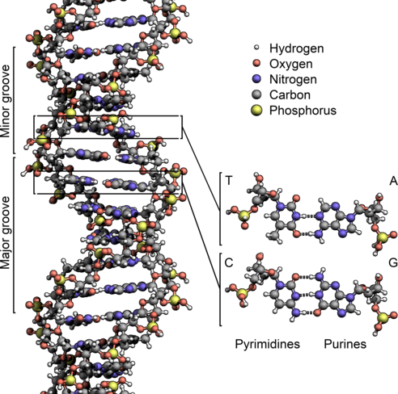

[/1v1/08-LionGuo/01-Homework-Problem-DNA-sequencing/problem_1.ipynb](/1v1/08-LionGuo/01-Homework-Problem-DNA-sequencing/problem_1.ipynb)

**Hand-in format:** IPython Notebook or python program. Submit via email.

> **提交格式:** IPython Notebook 或 python 程序。通过电子邮件提交。

As a reminder: please make sure your code is clean, documentated, and understandable. Make sure it runs without errors.

> 作为一个提醒:请确保您的代码是干净的、有文档记录的和可理解的。确保它没有错误地运行。

## Background

[DNA](http://en.wikipedia.org/wiki/DNA) is a molecule that encodes genetic instructions for living organisms. DNA typically takes the form of double-stranded helix: each strand corresponds to a sequence of *nucleotides*.

> [DNA](http://en.wikipedia.org/wiki/DNA) 是一种为生物体编码遗传指令的分子。DNA 通常采用双链螺旋结构:每条链对应一个核苷酸序列。

Each nucleotide consists of a nucleobase (guanine, adenine, thymine, or cytosine) attached to sugars, which are in turn separated from each other by phosphate groups:

> 每个核苷酸由附在糖上的一个碱基(鸟嘌呤、腺嘌呤、胸腺嘧啶或胞嘧啶)组成，这些碱基又由磷酸基彼此分离:



The nucleobases are commonly referred to with the letters:

> 碱基通常用字母表示:

* `G` (guanine)

> “G”(鸟嘌呤)

* `A` (adenine)

> A(腺嘌呤)

* `T` (thymine) and 

> (胸腺嘧啶)和“T”

* `C` (cytosine).

> “C”(胞嘧啶)。

The nucleobases form pairs (or "complements"): `G` pairs with `C`, and `T` pairs with `A`. 

> 碱基形成一对(或“补体”):“G”对与“C”，“T”对与“A”。

The information content of a piece of DNA is therefore commonly represented as a string, giving a sequence of nucleobases, such as `GATTACACCTCATTATAAA`.

> 因此，一段 DNA 的信息内容通常被表示为一个字符串，给出一个碱基序列，如 “GATTACACCTCATTATAAA”。

In this problem set, we will be working with fake genetic data, since real-life data often has added complications, but the functions and techniques uses here are the same or very similar to techniques used on real data.

> 在这个问题集中，我们将处理假的基因数据，因为现实生活中的数据通常会增加复杂性，但这里使用的功能和技术与真实数据中使用的技术相同或非常相似。


## Part 1

### Question 1

The **reverse complement** of DNA is found by reversing the DNA sequence, then replacing each base by its complement. For example, the reverse complement of `ATGCGGC` is `GCCGCAT`.

> DNA 的逆补体是通过颠倒 DNA 序列，然后用其补体替换每个碱基来发现的。例如，' ATGCGGC '的反向补语是' GCCGCAT '。

Write a Python function `reverse_complement()` that takes a DNA sequence as a string, and returns the reverse complement. Test your function, then find and print the reverse complement of the following sequence:

> 编写一个 Python 函数' reverse_complement() '，它接受一个 DNA 序列作为字符串，并返回反向补体。测试你的函数，然后找到并打印以下序列的逆补:

    ATGCGCGGATCGTACCTAATCGATGGCATTAGCCGAGCCCGATTACGC

Note that this function is not needed for the remaining questions below.

> 注意，下面其余的问题不需要这个函数。

### 替换原则

1. G-C
2. T-A

### 答案

```python
# -*- coding: utf-8 -*-
# @Time    : 2022/10/5 21:48
# @Author  : AI悦创
# @FileName: hw1.py
# @Software: PyCharm
# @Blog    ：https://bornforthis.cn/
def reverse_complement(dna_str):
    reverse_dna_str = dna_str[::-1]
    # replace_dna_str = reverse_dna_str.replace("G", "C")
    # replace_dna_str = replace_dna_str.replace("C", "G")
    # replace_dna_str = replace_dna_str.replace("A", "T")
    # replace_dna_str = replace_dna_str.replace("T", "A")
    # return replace_dna_str
    TA = ["T", "A"]
    CG = ["C", "G"]
    result = []
    for s in reverse_dna_str:
        if s in TA:
            if s == "T":
                result.append("A")
            else:
                result.append("T")
        else:
            if s == "C":
                result.append("G")
            else:
                result.append("C")
    return "".join(result)


reverse_complement("ATGCGGC")
```


### Question 2

[Ribonucleic acid (RNA)](http://en.wikipedia.org/wiki/RNA) is a family of large biological molecules that are *transcribed* from DNA by the "RNA polymerase" enzyme. 

> [核糖核酸(RNA)](http://en.wikipedia.org/wiki/RNA) 是一个大分子家族，由“RNA 聚合酶”酶从 DNA 转录而来。

[Messenger RNA](http://en.wikipedia.org/wiki/Messenger_RNA) molecules (or mRNA) are a subset of RNA molecules that are used to pass information from DNA to ribosomes, which then translates the mRNA to protein sequences.

> [信使RNA](http://en.wikipedia.org/wiki/Messenger_RNA) 分子(或mRNA)是 RNA 分子的一个子集，用于将信息从DNA传递到核糖体，然后核糖体将 mRNA 翻译成蛋白质序列。

mRNA consists of a single strand of nucleotides that are identical to the ones found in DNA, with the exception of uracil (`U`), which replaces thymine (`T`).

> mRNA由一条核苷酸链组成，除了尿嘧啶(' U ')取代了胸腺嘧啶(' T ')之外，它与DNA中的核苷酸链相同。

Write a Python function `dna_to_mrna()` that takes a DNA sequence and returns the corresponding mRNA sequence. For example, the DNA sequence `ATCGCGAT` should produce the mRNA sequence `AUCGCGAU`.

> 编写一个Python函数' dna_to_mrna() '，它接受一个DNA序列并返回相应的mRNA序列。例如，DNA序列' ATCGCGAT '应该产生mRNA序列' AUCGCGAU '。

### 替换原则

1. U-T

### 答案

```python
def dna_to_mrna(dna):
    mRNA = dna.replace("T", "U")
    return mRNA
```


## Part 2

### Question 3

When the mRNA is translated to a protein sequence, each set of three nucleotides, called a **codon**, is translated into a single amino acid. For example, the codon ``UUC`` translates to the amino acid *Phenylalanine*. Each amino acid can be represented by a single letter - for example Phenylalanine is represented by the letter ``F``.

> 当mRNA被翻译成蛋白质序列时，每一组核苷酸(称为**密码子**)被翻译成一个单一的氨基酸。例如，密码子' ' UUC ' '翻译成氨基酸*苯丙氨酸*。每个氨基酸都可以用一个字母表示，例如苯丙氨酸用字母“F”表示。

> A protein, which is formed from a sequence of amino acids, can therefore be written as a sequence of letters in the same way as DNA or mRNA, but using more of the letters of the alphabet since there are more than four amino acids.

> 因此，由氨基酸序列组成的蛋白质可以像DNA或mRNA一样被写成字母序列，但由于氨基酸多于4个，所以蛋白质可以使用更多的字母。

> protein也可以被写成字母序列，但是之前mrna每个字母可能要被写成多个字母

The [data/p1_codons.txt](/1v1/08-LionGuo/01-Homework-Problem-DNA-sequencing/p1_codons.txt) file contains a list of codon-amino acid pairs. There are two columns:

> [data/p1_codons.txt](/1v1/08-LionGuo/01-Homework-Problem-DNA-sequencing/p1_codons.txt) 文件包含密码子-氨基酸对的列表。有两栏:

* first column: codon (represented by three letters).

> 第一列:密码子(由三个字母表示)。

* second column: corresponding amino acid (represented by a single letter).

> 第二列:对应的氨基酸(用一个字母表示)。

Certain codons do not correspond to an amino acid, but instead indicate that the amino acid sequence is finished. These are indicated by `Stop`.

> 某些密码子并不对应某个氨基酸，而是表示该氨基酸序列结束了。它们由“Stop”表示。

Write a function `mrna_to_protein()` that takes an mRNA sequence (as a string) and returns the sequence of amino acids (as a string), stopping the first time a `Stop` codon is encountered.

> 编写一个函数' mrna_to_protein() '，它接受一个mRNA序列(作为字符串)并返回氨基酸序列(作为字符串)，在第一次遇到' Stop '密码子时停止。

> Make sure that the codon map file is only read once when running the script (and not every time you want to translate a codon).

> 确保在运行脚本时只读取一次密码子映射文件(而不是每次您想翻译密码子时都读取)。

Then, write a function `dna_to_protein()` that takes a DNA sequence (as a string) and returns the sequence of amino acids (as a string), making use of the functions that you wrote previously.

> 然后，编写一个函数' dna_to_protein() '，它接受一个DNA序列(作为字符串)并返回氨基酸序列(作为字符串)，使用前面编写的函数。

Print out the amino acid sequence for the following DNA sequence:

> 打印出以下DNA序列的氨基酸序列:

    AATCTCTACGGAAGTAGGTCAGTACTGATCGATCAGTCGATCGGGCGGCGATTTCGATCTGATTGTACGGCGGGCTAG

### 答案

```python
def dna_to_mrna(dna):
    mRNA = dna.replace("T", "U")
    return mRNA


def mrna_to_protein(mRNA):
    with open("p1_codons.txt", "r") as f:
        content_list = f.readlines()
    # print(content_list)
    target_list = []
    for line in content_list:
        line = tuple(line.replace("\n", "").split(" "))
        # print(line)
        target_list.append(line)
    # print(target_list)
    target_dict = dict(target_list)
    print(target_dict)
    # index = 0
    result_lst = []
    while True:
        if mRNA:
            use_mrna = mRNA[:3]
            print("use_mrna:>>>", use_mrna)
            if target_dict[use_mrna] == "Stop":
                break
            else:
                result_lst.append(target_dict[use_mrna])
            # print("use_mran:>>>", use_mrna)
            # if target_list[index][1] == "Stop":
            #     break
            # elif use_mrna in target_list[index]:
            #     result_lst.append(target_list[index][1])
            #     index += 1
            mRNA = mRNA[3:]
        else:
            break

    # print(result_lst)
    return "".join(result_lst)


DNA = "AATCTCTACGGAAGTAGGTCAGTACTGATCGATCAGTCGATCGGGCGGCGATTTCGATCTGATTGTACGGCGGGCTAG"
mRNA = dna_to_mrna(DNA)
print(mRNA)
# print(len(mRNA) / 3)
r = mrna_to_protein(mRNA)
print(r)
```

### Question 4

In the previous questions, we have been specifying the DNA sequence by hand, but DNA sequences are usually long and are stored in files. A common file format is the [FASTA format](http://en.wikipedia.org/wiki/FASTA_format) which is a text-file of the form:

> 在前面的问题中，我们一直手工指定DNA序列，但DNA序列通常很长，并且存储在文件中。常见的文件格式是[FASTA格式](http://en.wikipedia.org/wiki/FASTA_format)，它是一个格式为:

    >label1
    ACTGTATCGATGCTAGCTACGTAGCTAGCTAGCTAGCTGACGTA
    ACGATGTGCGAGGGTCATGGGACGCGAGCGAGTCTAGCACGATC
    >label2
    ACTGGGCTTGACTACGGCGGTATCTGACGGGCGAGCTGTACGAG
    ACGGACTAGGGCGCGGCGGGGCGGATTTTCGAGTCGAGCGTTAT

The first line starts with a ``>`` which is immediately followed by a label (an arbitrary string, e.g. the name of the gene). The sequence then starts on the second line, and may continue on several lines. It is common to limit the length of each line to 80, but this may vary from file to file. The sequence stops once either the file ends, or a line starts with ``>``, which indicates that a new sequence is being given. There may be any number of sequences in a file.

> 第一行以' ' &gt; ' '开头，后面紧跟着一个标签(任意字符串，例如基因名)。序列从第二行开始，并可能在几行上继续。通常将每行的长度限制为80，但这可能因文件而异。一旦文件结束，或者有一行以' ' &gt; ' '开头(这表示给出了一个新的序列)，序列就会停止。一个文件中可能有任意数量的序列。

Write a function `read_fasta()`, that takes the name of a file (as a string) and returns a Python dictionary containing all the sequences from the file, with the keys in the dictionary corresponding to the label. 

> 编写一个函数' read_fasta() '，它接受文件的名称(作为字符串)，并返回一个包含文件中所有序列的Python字典，字典中的键对应于标签。

Use this function and the functions you have written above to read in the [p1_fasta_q4.txt](/1v1/08-LionGuo/01-Homework-Problem-DNA-sequencing/p1_fasta_q4.txt) file and print out, for each sequence, the label, followed by the **amino acid** sequence (not the DNA sequence!).

> 使用这个函数和上面所写的函数来读取[p1_fasta_q4.txt](/1v1/08-LionGuo/01- homework - question -DNA-sequencing/p1_fasta_q4.txt)文件，并为每个序列打印出标签，后面跟着**氨基酸**序列(不是DNA序列!)

## 答案

```python
def read_fasta():
    with open("p1_fasta_q4.txt", "r") as f:
        lines = f.read().split(">")
        # print(lines)
    result_lst = []
    for line in lines:
        if line:
            # print(line)
            line_lst = line.split("\n")[:-1]
            # print(line_lst)
            result_lst.append((line_lst[0], line_lst[1:]))
        else:
            pass
    return dict(result_lst)
```


欢迎关注我公众号：AI悦创，有更多更好玩的等你发现！

::: details 公众号：AI悦创【二维码】


:::

::: info AI悦创·编程一对一

AI悦创·推出辅导班啦，包括「Python 语言辅导班、C++ 辅导班、java 辅导班、算法/数据结构辅导班、少儿编程、pygame 游戏开发」，全部都是一对一教学：一对一辅导 + 一对一答疑 + 布置作业 + 项目实践等。当然，还有线下线上摄影课程、Photoshop、Premiere 一对一教学、QQ、微信在线，随时响应！微信：Jiabcdefh

C++ 信息奥赛题解，长期更新！长期招收一对一中小学信息奥赛集训，莆田、厦门地区有机会线下上门，其他地区线上。微信：Jiabcdefh

方法一：[QQ](http://wpa.qq.com/msgrd?v=3&uin=1432803776&site=qq&menu=yes)

方法二：微信：Jiabcdefh

:::


