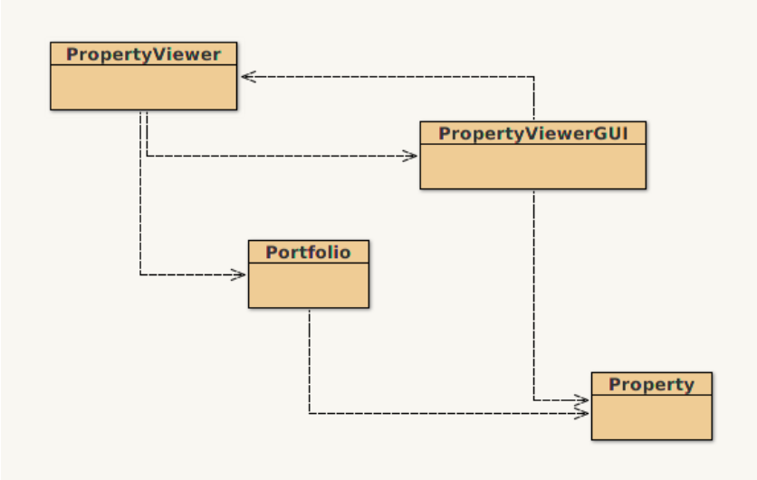

## 资料

-   [Asignment_1.pdf](/1v1/09-liujiahui/01-Coursework-1-Property-Viewer/Asignment_1.pdf)
-   [cw1-base.zip](/1v1/09-liujiahui/01-Coursework-1-Property-Viewer/cw1-base.zip)
-   [PPA-Term1-01.pdf](/1v1/09-liujiahui/kejian/PPA-Term1-01.pdf)
-   [PPA-Term1-02.pdf](/1v1/09-liujiahui/kejian/PPA-Term1-02.pdf)
-   [PPA-Term1-03.pdf](/1v1/09-liujiahui/kejian/PPA-Term1-03.pdf)
-   [PPA-Term1-04.pdf](/1v1/09-liujiahui/kejian/PPA-Term1-04.pdf)
-   [PPA-Term1-05.pdf](/1v1/09-liujiahui/kejian/PPA-Term1-05.pdf)
-   [PPA-Term1-05.pdf](/1v1/09-liujiahui/kejian/PPA-Term1-05.pdf)

## PPA01A

Class: Programming Practice & Applications

Created: October 22, 2022 6:48 PM

Type: Assignment

## Property Viewer 房产查看器

这项任务的目标是实现一个允许用户查看从电子表格加载的房产的应用程序。该应用程序已部分实现，但你需要完成一些方法的实现，并修复一个目前不能按预期工作的方法。

### 开始行动

- 当你打开它时，你会看到下面描述的类结构。
- 四个类中的三个已经完全实现，所以你不需要修改它们。有一个类，**PropertyViewer** ，还没有完成，你的工作是完成这个类的实现。

### 项目概述

下面是对现有类的快速概述：

- Property (财产)
    - 这个类代表了一个单一的房产。你应该看一下这个类的内部。
    - 这是你需要使用的方法，如 **getID (获取ID)**、**getLatitude (获取纬度)** 和 **toggleFavourite (切换最爱)**。

- Porfolio (投资组合)
    - 这代表了房产的一个集合
    - **Porfolio (投资组合)** 是通过指定磁盘上的电子表格来建立的，里面有一些房产的数据（默认情况下，这是一个名为 airbnb-london.csv 的文件 - 这是真实世界的数据，是一些实际的 AirBnB 房源）。
    - **Porfolio (投资组合)** 将自动加载它在该电子表格中发现的所有房产。如果你喜欢，可以随时向电子表格中添加更多的房产

- PropertyViewerGUI (房产查看器 GUI )
    - 这个类展示了应用程序的 GUI（图形用户界面）。就是说：它绘制了主窗口、按钮以及你在屏幕上看到的所有其他东西。
    - 该类做了两件额外的事情：
    - （1）如果用户点击了一个按钮，这个调用会被传递到相关的 **PropertyViewer** 方法上；
    - （2）**PropertyViewer 类**可以调用这个来显示界面中的一个 **Porperty (财产)** 或 **String (字符串)** 。
- Property Viewer
    - 这个类实现了房产查看器的逻辑。
    - 这就是你必须做的工作。
    - 这也是你为启动这个应用程序而实例化的类。
    - 这也是你为运行应用程序而实例化的类。

### 基础任务

为了完成这项任务，你必须完成以下任务：

- 当应用程序启动时，portfolio (投资组合) 中的第一个 porperty（索引0）应该被自动显示。(6分)
- 对于任何显示的地产，该地产的ID应该显示在靠近窗口的顶部。**GUI 类**有一个方法可以做到这一点。(10分)
- 当 **"Toggle Favourite"** 按钮被按下时，该属性的 **isFavourite 字段** 应该被更新。在 **Property 类**中有一个方法可以做到这一点。(15分)
- 窗口底部的栏应显示该地产是否已被用户标记为他们的最爱之一。(10分)
- 当按下 **"Next"** 按钮时，下一个地产项目应该被显示出来，并有正确的数据。此外，顶部的ID应该被正确更新，以及该地产是否是用户的最爱之一。如果在最后一个地产上按下 **"Next"** 按钮，应用程序应该返回到第一个地产。(12分)
- 当 **“Previous”** 按钮被按下时，上一个地产应该被显示出来，并有正确的数据。此外，顶部的ID应该被正确更新，以及该地产是否是用户的最爱之一。如果在第一个地产上按下 **“Previous”** 按钮，应用程序应该转到最后一个地产。(12分)
- 在 **PropertyViewer 类**中，有几个方法是没有记录的。提供适当的方法级别的注释。(5分)

### 挑战任务

这些任务只有在你完成了基本任务后才应完成。注意，挑战任务需要的知识可能远远超过我们在课程中迄今为止所涉及的知识。

- 实现一个名为 **getNumberOfPropertiesViewed** 的方法，返回自应用程序启动以来被查看的地产数量。返回类型应该是 **int** 。查看同一地产两次算作两次查看。(5分)
- 实现一个名为 **averagePropertyPrice** 的方法，返回到目前为止所查看的房产的平均价格。返回的类型应该是 **int** 。（10分）
    - 例如：先看房产 A（50英镑），再看房产 B（20 英镑），然后再看房产A算作第 3 次，平均价格应该是 (50+20+50) / 3 = 40。
- **”View Property on Map”** 按钮目前是坏的，因为它只在地图上显示布什庄园。修复这个功能，使其改为在地图上显示房产的位置。(5分)
- 在应用程序中添加一个新的 **”Statistics”** 按钮。点击后，应打开一个新窗口，显示挑战任务中两个新方法的统计信息。(10分)

### 提交和截止日期

- 你必须在英国时间 **10月28日（星期五）16:00（下午4点）**之前在提交以下内容：
    1. 你的 BlueJ 项目的一个 Jar 文件
        1. 你可以在BlueJ内部通过进入 Project，然后 "创建Jar文件..." 来创建一个Jar。
        2. 你不需要改变任何默认选项，因此你应该直接点击 "继续" 按钮。
- **Jar 文件必须包含你的源代码，即 *.java 文件，而且必须在 BlueJ 上运行。**
- 迟到的提交。如果你延迟提交，但在截止日期前 24 小时内提交，作品将被评分，并被扣除 10 分原始分。如果这一扣分使你的分数低于合格分数（40%），你的分数将被限制在 40%。

### 评分

应用程式根据四个类别进行评分：

1. 程序正确性 —— 应用程序符合所有的程序规范，即学生完成了所有的基本任务，包括遵循提交说明（例如，学生提交了他们BlueJ项目的Jar文件）。
2. 代码优雅 —— 应用程序的编写方式使代码可重复使用且高效（即内存使用和复杂性）。应用程序适当地使用循环和函数来减少代码的复杂性 和/或 重复代码。该应用程序没有硬编码的解决方案或设计不良的解决方案。设计不良的解决方案过于复杂，利用过多的内存或利用较慢的方法来解决问题。
3. 文献 —— 应用程序有足够的文献。好的文献/评论应该解释代码做了什么以及如何做的。评论也可以用来强调你的解决方案中的细微差别，例如，一段只在特定条件下工作的代码。
4. 可读性--应用程序易于理解，并使用良好的编程实践。

欢迎关注我公众号：AI悦创，有更多更好玩的等你发现！

::: details 公众号：AI悦创【二维码】

:::

::: info AI悦创·编程一对一

AI悦创·推出辅导班啦，包括「Python 语言辅导班、C++ 辅导班、java 辅导班、算法/数据结构辅导班、少儿编程、pygame 游戏开发」，全部都是一对一教学：一对一辅导 + 一对一答疑 + 布置作业 + 项目实践等。当然，还有线下线上摄影课程、Photoshop、Premiere 一对一教学、QQ、微信在线，随时响应！微信：Jiabcdefh

C++ 信息奥赛题解，长期更新！长期招收一对一中小学信息奥赛集训，莆田、厦门地区有机会线下上门，其他地区线上。微信：Jiabcdefh

方法一：[QQ](http://wpa.qq.com/msgrd?v=3&uin=1432803776&site=qq&menu=yes)

方法二：微信：Jiabcdefh

:::

