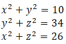
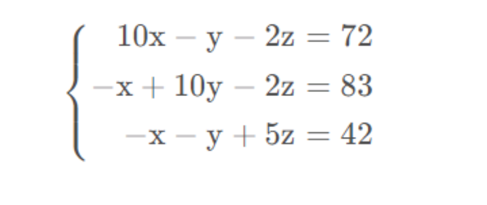

## 一、多元多次方程

### 1.1 定义

你好，我是悦创。

我们常见的方程组有一元一次方程组，比如 `x+3=5` 这种，很简单很好解。

二元一次方程组，即方程组中有两个未知数，未知数的最高次数为1。

二元二次方程组：方程组中有两个未知数，未知数的最高次数为 2。此类方程组均有公式解法或者成形的解法。

但是面临多元多次方程组，解法错综复杂，是数学家们研究的内容。为了更好的解决此类问题，我们可以用 Python 来实现。

## 1.2 例子

多元多次方程组例如下面这种，三元二次方程组：

::: center



:::

## 二、Python 求解工具包

Python 求解方程组的工具包较多。例如：

- numpy：`numpy.linalg.solve` 可以直接求解线性方程组，numpy 是 Python 非常常用的包，解的方程也较为初级。
- scipy：`from scipy.optimize import fsolve`，可以求解非线性方程组，使用较为方便，但是解集并不完备，可能漏掉一下解（后文会给个例子）scipy 可以用于数学、科学、工程领域的常用软件包,可以处理插值、积分、优化，相对较初级易用。
- sympy：此工具包功能相对强大，支持符号计算、高精度计算、解方程、微积分、组合数学、离散数学、几何学、概率与统计、物理学等方面的功能。GitHub 地址：[https://github.com/sympy/sympy](https://github.com/sympy/sympy)
- sage，不支持位运算，z3 约束求解器，等其他工具包，本文不详述，感兴趣的可以查找相应的内容。

本文详细讲述 scipy 以及 sympy 求解多次方程的方法。


## 三、scipy 方法

安装：

```cmd
python -m pip install scipy
```


### 3.1 使用 scipy 的 fsolve 求解

我只讲求解方程的部分。

用 fsolve 相对初级，也相对简单易操作，代码较为简单，只用将方程的表达式写出运行即可。fsolve 近似看作用最小二乘法求解。不够很强大，很多情况下解集不完备或者无法解出。

例如对于，首先要定义相应的函数：

```python
def solve_function(unsolved_value):
    x, y, z = unsolved_value[0], unsolved_value[1], unsolved_value[2]
    return [
        x ** 2 + y ** 2 - 10,
        y ** 2 + z ** 2 - 34,
        x ** 2 + z ** 2 - 26,
    ]
```

求解函数三个公式都为 0 时候的解，中括号内为初值 `[0, 0, 0]`

```python
solved = fsolve(solve_function, [0, 0, 0])
```

全部代码：

```python
from scipy.optimize import fsolve


def solve_function(unsolved_value):
    x, y, z = unsolved_value[0], unsolved_value[1], unsolved_value[2]
    return [
        x ** 2 + y ** 2 - 10,
        y ** 2 + z ** 2 - 34,
        x ** 2 + z ** 2 - 26,
    ]


solved = fsolve(solve_function, [0, 0, 0])
print(solved)

print("Program done!")

"""
运行结果：
[-1.  3.  5.]
Program done!
"""
```

看出运行结果来看，此结果并非完备解集。因为 x，y，z 都是可正可负。例如 1 或者 -1，3 或者 -3 ，5 或者 -5，但是此工具包只能解出一个解。

### 3.2 非完备解

显而易见，`x**2-9=0` 的解为 3 或者 `-3`

```python
def solve_function(unsolved_value):
    x = unsolved_value[0]
    return [
        x ** 2 - 9,
    ]


solved = fsolve(solve_function, [0])
```


### 3.3 非线性方程的解

最简单：sin(x)=0.5，则 x 可能为：π/6 或者 5π/6

```python
from scipy.optimize import fsolve
from math import sin, cos

def solve_function(unsoled_value):
    x = unsoled_value[0]
    return [
        sin(x) - 0.5
    ]


if __name__ == '__main__':
    solved = fsolve(solve_function, [3.14])
    print(solved)
    solved = fsolve(solve_function, [0])
    print(solved)
```

输出：

```python
[2.61799388]
[0.52359878]
```


## HW



```python
from scipy.optimize import fsolve


def solve_function(unsoled_value):
    x, y, z = unsoled_value
    return [
        10 * x - y - 2 * z - 72,
        - x + 10 * y - 2 * z - 83,
        - x - y + 5 * z - 42,
    ]


if __name__ == '__main__':
    solved = fsolve(solve_function, [0, 0, 0])
    print(solved)
# 输出
[11. 12. 13.]
```

欢迎关注我公众号：AI悦创，有更多更好玩的等你发现！

::: details 公众号：AI悦创【二维码】


:::

::: info AI悦创·编程一对一

AI悦创·推出辅导班啦，包括「Python 语言辅导班、C++ 辅导班、java 辅导班、算法/数据结构辅导班、少儿编程、pygame 游戏开发」，全部都是一对一教学：一对一辅导 + 一对一答疑 + 布置作业 + 项目实践等。当然，还有线下线上摄影课程、Photoshop、Premiere 一对一教学、QQ、微信在线，随时响应！微信：Jiabcdefh

C++ 信息奥赛题解，长期更新！长期招收一对一中小学信息奥赛集训，莆田、厦门地区有机会线下上门，其他地区线上。微信：Jiabcdefh

方法一：[QQ](http://wpa.qq.com/msgrd?v=3&uin=1432803776&site=qq&menu=yes)

方法二：微信：Jiabcdefh

:::


https://blog.csdn.net/weixin_36474809/article/details/104476870
