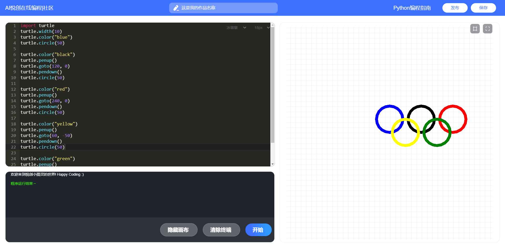
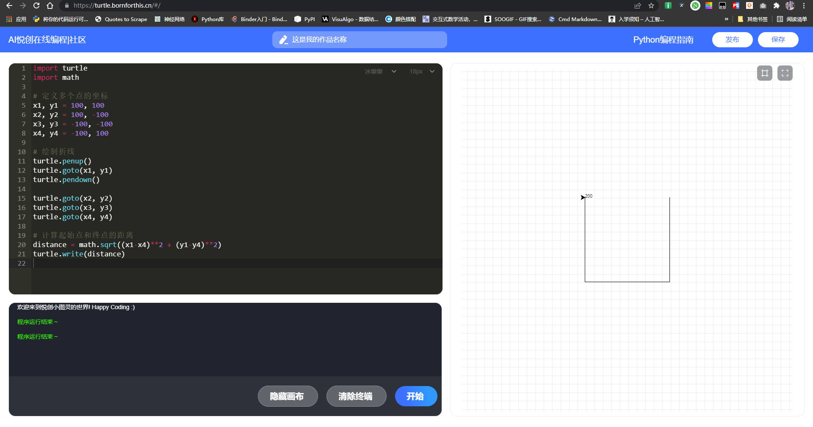

你好，我是悦创。

## 1. 画出奥运五环图，代码如下：
```python
import turtle
turtle.width(10)
turtle.color("blue")
turtle.circle(50)

turtle.color("black")
turtle.penup()
turtle.goto(120, 0)
turtle.pendown()
turtle.circle(50)

turtle.color("red")
turtle.penup()
turtle.goto(240, 0)
turtle.pendown()
turtle.circle(50)

turtle.color("yellow")
turtle.penup()
turtle.goto(60, -50)
turtle.pendown()
turtle.circle(50)

turtle.color("green")
turtle.penup()
turtle.goto(180, -50)
turtle.pendown()
turtle.circle(50)
```

执行结果如下图所示：

在线执行网站：[https://py.bornforthis.cn/#/](https://py.bornforthis.cn/#/)


## 2. 定义多点坐标_绘出折线_并计算起始点和终点距离

```python
import turtle
import math

# 定义多个点的坐标
x1, y1 = 100, 100
x2, y2 = 100, -100
x3, y3 = -100, -100
x4, y4 = -100, 100

# 绘制折线
turtle.penup()
turtle.goto(x1, y1)
turtle.pendown()

turtle.goto(x2, y2)
turtle.goto(x3, y3)
turtle.goto(x4, y4)

# 计算起始点和终点的距离
distance = math.sqrt((x1-x4)**2 + (y1-y4)**2)
turtle.write(distance)
```




欢迎关注我公众号：AI悦创，有更多更好玩的等你发现！

::: details 公众号：AI悦创【二维码】


:::

::: info AI悦创·编程一对一

AI悦创·推出辅导班啦，包括「Python 语言辅导班、C++ 辅导班、java 辅导班、算法/数据结构辅导班、少儿编程、pygame 游戏开发」，全部都是一对一教学：一对一辅导 + 一对一答疑 + 布置作业 + 项目实践等。当然，还有线下线上摄影课程、Photoshop、Premiere 一对一教学、QQ、微信在线，随时响应！微信：Jiabcdefh

C++ 信息奥赛题解，长期更新！长期招收一对一中小学信息奥赛集训，莆田、厦门地区有机会线下上门，其他地区线上。微信：Jiabcdefh

方法一：[QQ](http://wpa.qq.com/msgrd?v=3&uin=1432803776&site=qq&menu=yes)

方法二：微信：Jiabcdefh

:::


