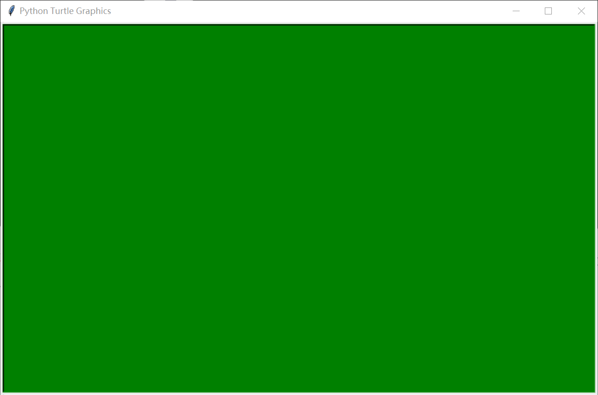
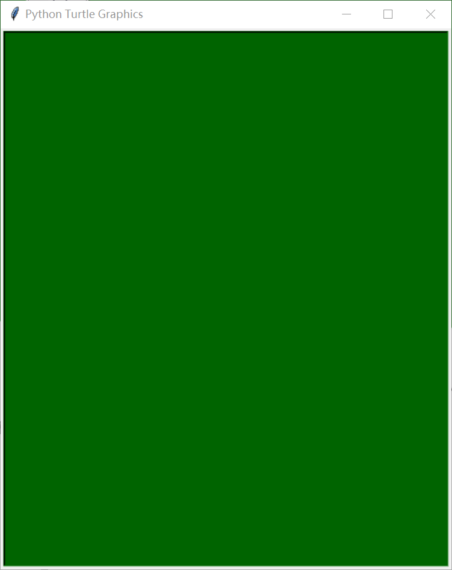

你好，我是悦创。

turtle 是 python 一个简单好用的绘图包，它可以通过设计坐标来实时控制绘图。安装很简单，一行命令：
```python
pip install turtle
```

这里只介绍如何设置画布背景颜色。它一般是在绘图的最开始进行设置的，可以使用 `screensize(width, height, bg)` 函数，其中的三个参数分别是画布的宽、高、背景颜色。宽高的单位是像素，如果用小数表示，则是以屏幕宽高的百分比来确定大小的。

但是如果只设置画布大小，是没法控制窗口的大小的，窗口大小需要使用 `setup(width, height, X, Y)` 函数来进行设置。前两个参数依旧是宽高，后边X和Y是设置窗口坐标的，默认是以窗口中心为坐标原点，X 轴水平向右，Y 轴垂直向上。窗口和画布的区别是：窗口可以控制显示窗口的大小，而画布是窗口内绘图区的大小，如果画布大小大于窗口，那么窗口上就会出现滚动条。背景颜色有两种表示方式，一种是常见的颜色，直接使用对应的英文描述即可，比如 "black"、“white”、“yellow”、“pink”、“blue”、"red"等等。比如我要一张宽和高均为屏幕 0.5 倍的窗口，背景颜色为绿色：

```python
import turtle as t                        # 导入turtle包
t.setup(0.5, 0.5)                         # 设置窗口大小
t.screensize(bg="green")                  # 设置背景颜色
t.done()                                  # 绘制完毕（一定加上这行才不会卡死）
```



但是，如果我想要设置非常见颜色为画布背景，该怎么办呢？这就要用到颜色的第二种表达方式——十六进制。十六进制的RGB颜色对照表可以点击[这里](http://www.360doc.com/content/16/0815/21/15780979_583463998.shtml) 查看。比如这里我想要一张宽500像素，高600像素的圣诞绿画布，代码及效果如下：

```python
import turtle as t                        # 导入turtle包
t.setup(500, 600)                         # 设置窗口大小
t.screensize(bg="#006400")                # 设置画布大小及背景颜色
t.done()                                  # 绘制完毕（一定加上这行才不会卡死）
```




欢迎关注我公众号：AI悦创，有更多更好玩的等你发现！

::: details 公众号：AI悦创【二维码】


:::

::: info AI悦创·编程一对一

AI悦创·推出辅导班啦，包括「Python 语言辅导班、C++ 辅导班、java 辅导班、算法/数据结构辅导班、少儿编程、pygame 游戏开发」，全部都是一对一教学：一对一辅导 + 一对一答疑 + 布置作业 + 项目实践等。当然，还有线下线上摄影课程、Photoshop、Premiere 一对一教学、QQ、微信在线，随时响应！微信：Jiabcdefh

C++ 信息奥赛题解，长期更新！长期招收一对一中小学信息奥赛集训，莆田、厦门地区有机会线下上门，其他地区线上。微信：Jiabcdefh

方法一：[QQ](http://wpa.qq.com/msgrd?v=3&uin=1432803776&site=qq&menu=yes)

方法二：微信：Jiabcdefh

:::


