你好，我是悦创。我一个朋友问到这样的抓包问题：

::: details

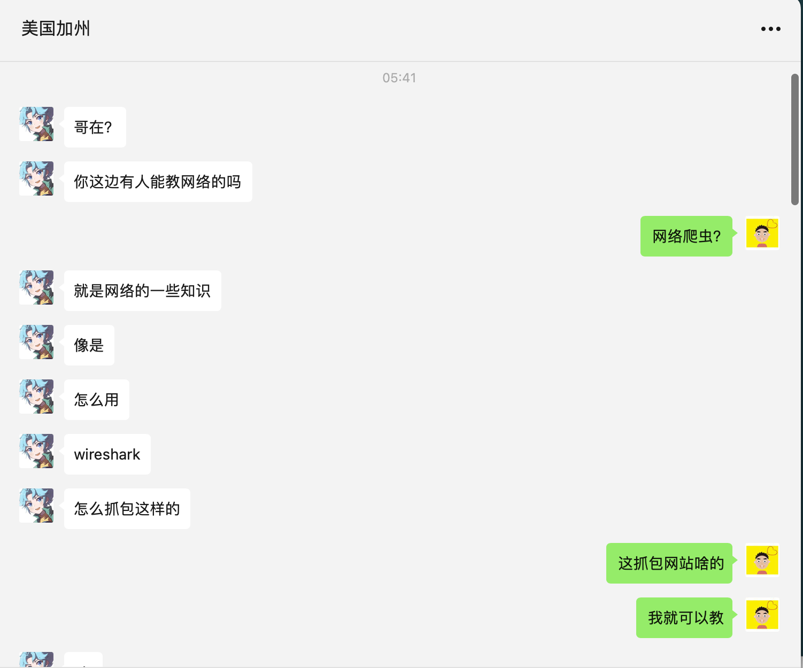

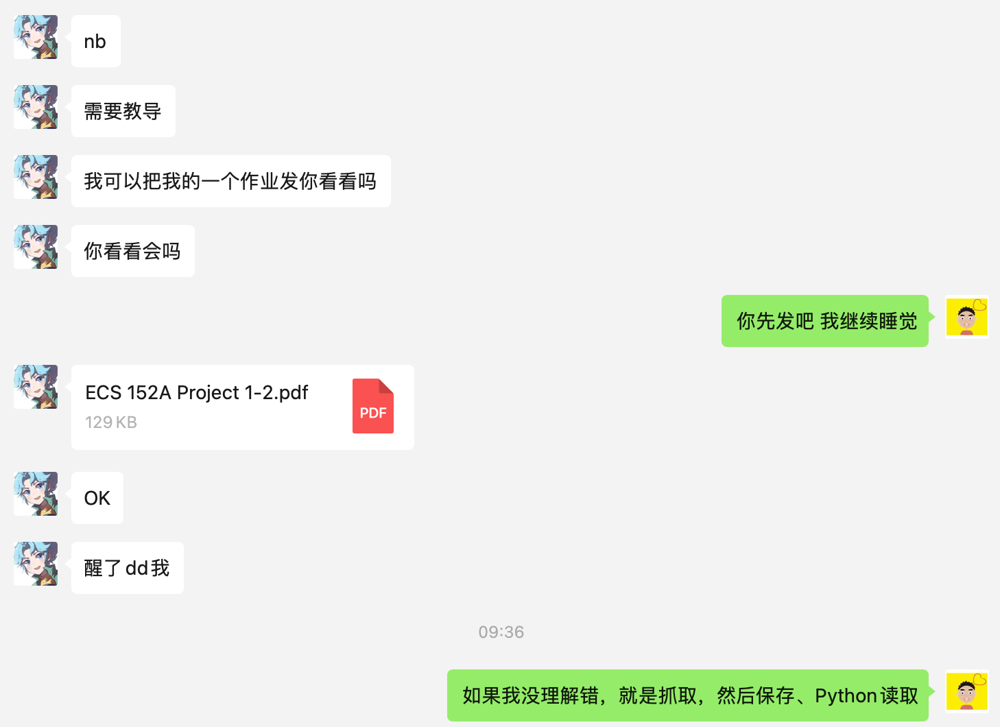

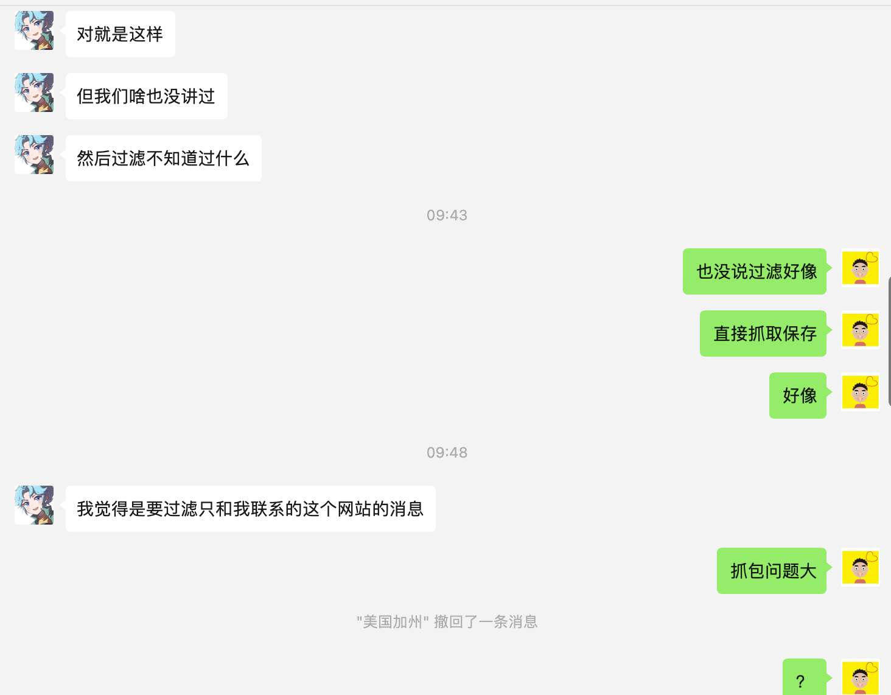

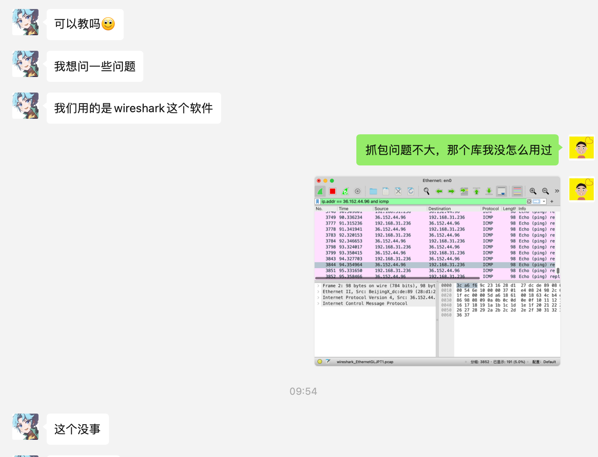

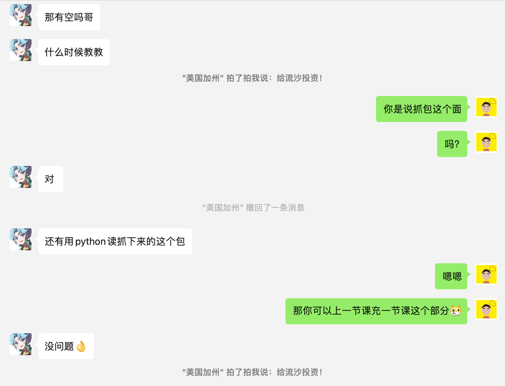

:::

Wireshark 是非常流行的网络封包分析软件，可以截取各种网络数据包，并显示数据包详细信息。常用于开发测试过程各种问题定位。本文主要内容包括：

 1、Wireshark 软件下载和安装以及 Wireshark 主界面介绍。

 2、WireShark 简单抓包示例。通过该例子学会怎么抓包以及如何简单查看分析数据包内容。

 3、Wireshark 过滤器使用。过滤器包含两种类型，一种是抓包过滤器，就是抓取前设置过滤规则。另外一种是显示过滤器，就是在数据包分析时进行过滤数据使用。通过过滤器可以筛选出想要分析的内容。包括按照协议过滤、端口和主机名过滤、数据包内容过滤。具体规则和实例可以查看正文。

## Wireshark 软件安装

 软件下载路径：[wireshark 官网](https://www.wireshark.org/)。按照系统版本选择下载，下载完成后，按照软件提示一路 Next 安装。

 说明：如果你是 Win10 系统，安装完成后，选择抓包但是不显示网卡，下载 win10pcap 兼容性安装包。下载路径：[win10pcap兼容性安装包](http://www.win10pcap.org/download/)

# **Wireshark 开始抓包示例**

  先介绍一个使用 wireshark 工具抓取 ping 命令操作的示例，让读者可以先上手操作感受一下抓包的具体过程。

### 1. 打开 wireshark 4.0.0，主界面如下：

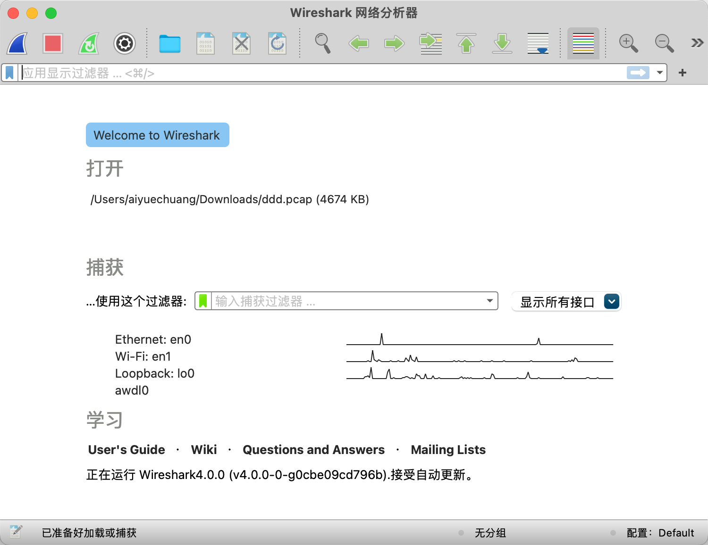

### 2. 选择菜单栏上 Capture -> Option，勾选 WLAN 网卡（这里需要根据各自电脑网卡使用情况选择，简单的办法可以看使用的 IP 对应的网卡）。点击 Start。启动抓包。

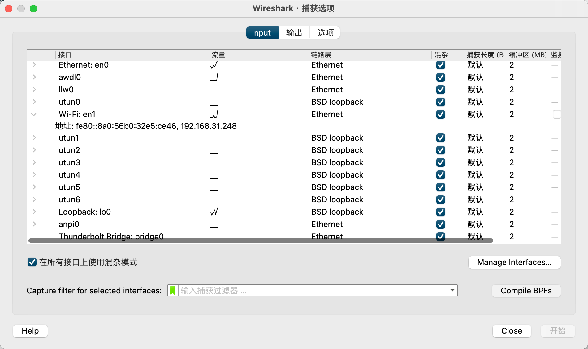

### 3. wireshark 启动后，wireshark 处于抓包状态中。

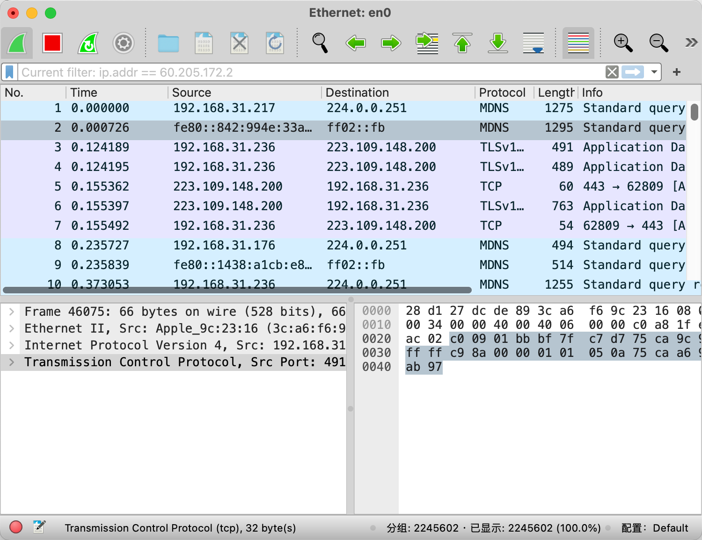

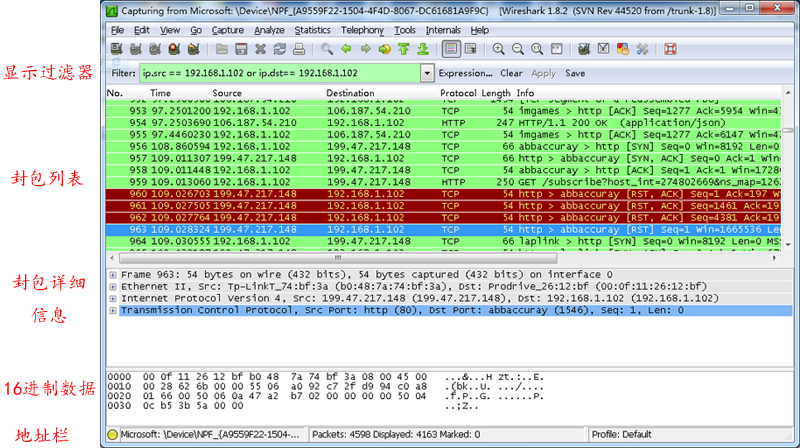

### 4. 执行需要抓包的操作，如在cmd 窗口下执行ping www.baidu.com。

### 5. 作完成后相关数据包就抓取到了。为避免其他无用的数据包影响分析，可以通过在过滤栏设置过滤条件进行数据包列表过滤，获取结果如下。

说明：ip.addr == 39.156.66.10 and icmp 表示只显示ICPM协议且源主机 IP 或者目的主机 IP 为 119.75.217.26 的数据包。说明：协议名称 icmp 要小写。

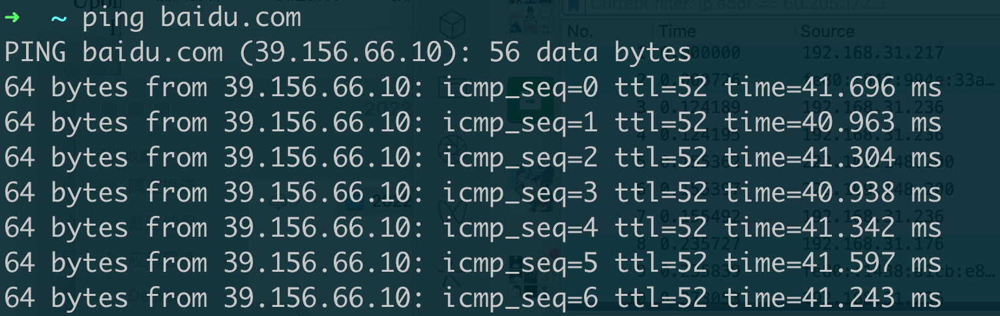

### 6. wireshark 抓包完成，就这么简单。关于 wireshark 显示过滤条件、抓包过滤条件、以及如何查看数据包中的详细内容在后面介绍。

## Wireshakr 抓包界面介绍

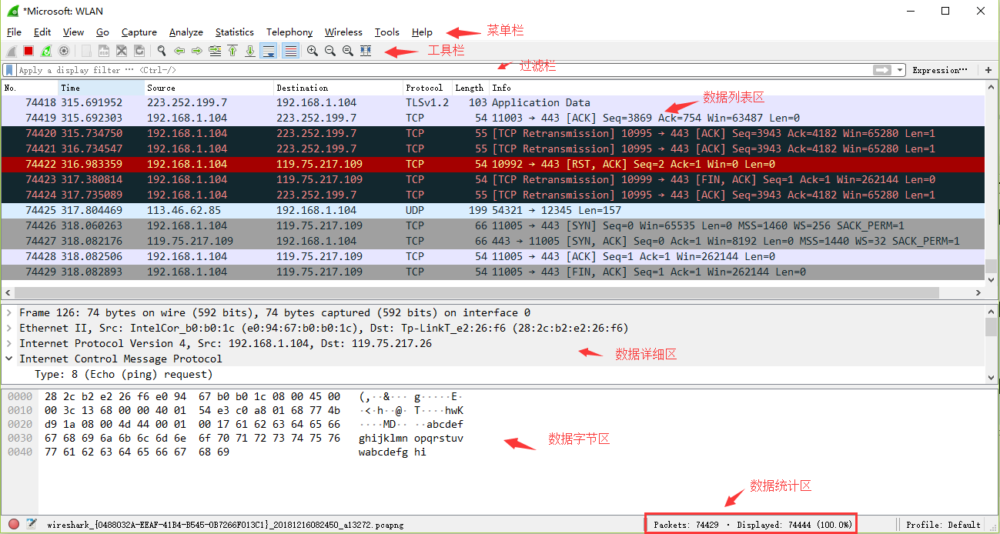

说明：数据包列表区中不同的协议使用了不同的颜色区分。协议颜色标识定位在菜单栏 View --> Coloring Rules。如下所示

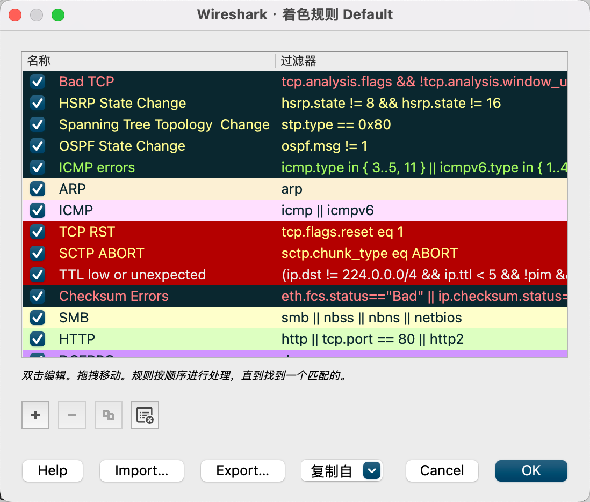

### WireShark 主要分为这几个界面

#### 1. Display Filter (显示过滤器)， 用于设置过滤条件进行数据包列表过滤。菜单路径：Analyze --> Display Filters。

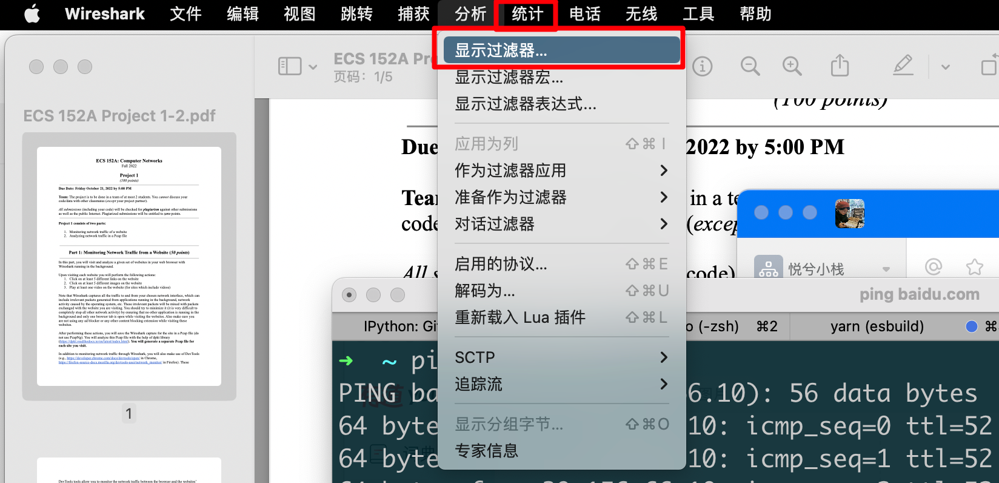

#### 2. Packet List Pane(数据包列表)， 显示捕获到的数据包，每个数据包包含编号，时间戳，源地址，目标地址，协议，长度，以及数据包信息。 不同协议的数据包使用了不同的颜色区分显示。

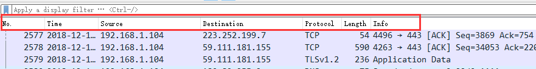

#### 3. Packet Details Pane(数据包详细信息), 在数据包列表中选择指定数据包，在数据包详细信息中会显示数据包的所有详细信息内容。数据包详细信息面板是最重要的，用来查看协议中的每一个字段。各行信息分别为

 （1）Frame:  物理层的数据帧概况

 （2）Ethernet II: 数据链路层以太网帧头部信息

 （3）Internet Protocol Version 4: 互联网层IP包头部信息

 （4）Transmission Control Protocol: 传输层T的数据段头部信息，此处是TCP

 （5）Hypertext Transfer Protocol: 应用层的信息，此处是HTTP协议

### TCP 包的具体内容

 从下图可以看到 wireshark 捕获到的 TCP 包中的每个字段。

#### 4. Dissector Pane(数据包字节区)。

## Wireshark 过滤器设置

初学者使用 wireshark 时，将会得到大量的冗余数据包列表，以至于很难找到自己需要抓取的数据包部分。wireshark 工具中自带了两种类型的过滤器，学会使用这两种过滤器会帮助我们在大量的数据中迅速找到我们需要的信息。

### （1）抓包过滤器

  捕获过滤器的菜单栏路径为 Capture --> Capture Filters。用于**在抓取数据包前设置。**

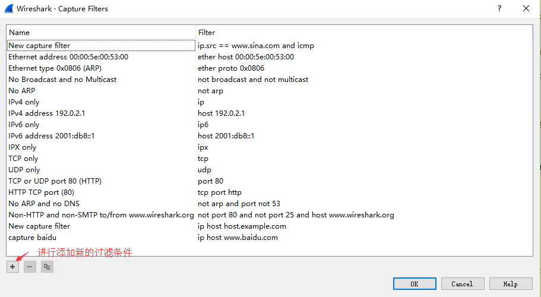

如何使用？可以在抓取数据包前设置如下。

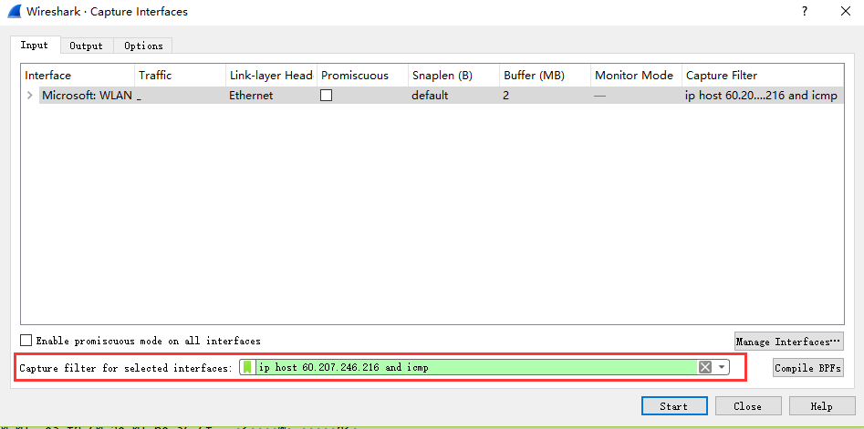

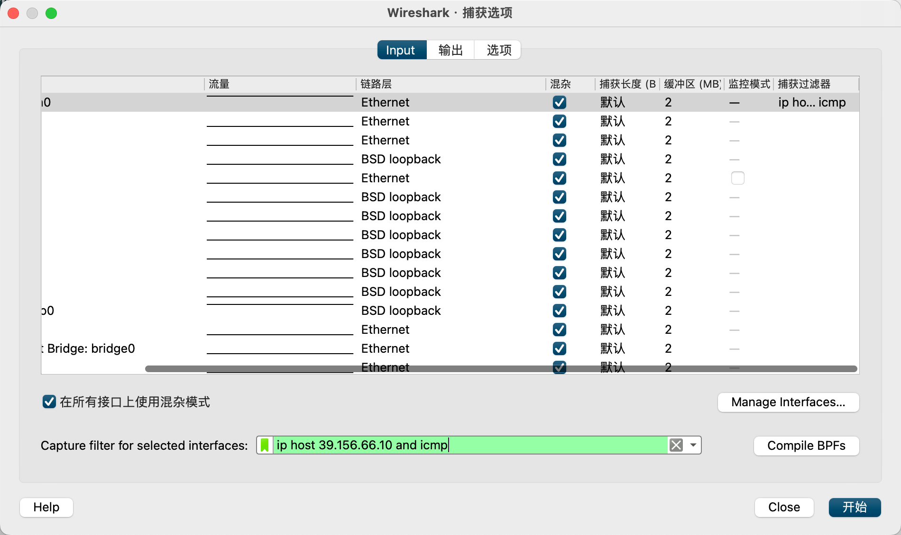

ip host 60.207.246.216 and icmp 表示只捕获主机IP为 60.207.246.216 的 ICMP 数据包。获取结果如下：

### （2）显示过滤器

显示过滤器是用于在抓取数据包后设置过滤条件进行过滤数据包。通常是在抓取数据包时设置条件相对宽泛或者没有设置导致抓取的数据包内容较多时使用显示过滤器设置条件过滤以方便分析。同样上述场景，在捕获时未设置抓包过滤规则直接通过网卡进行抓取所有数据包，如下

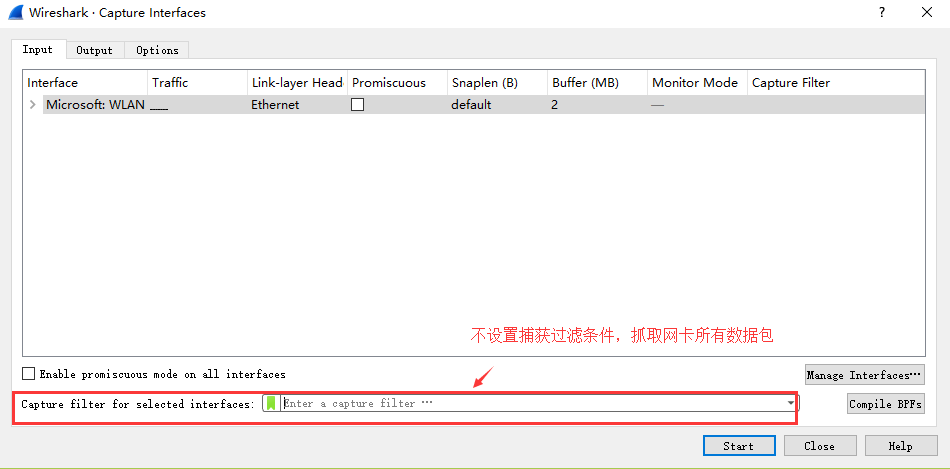

执行 `ping www.huawei.com`  获取的数据包列表如下：

观察上述获取的数据包列表，含有大量的无效数据。这时可以通过设置显示器过滤条件进行提取分析信息。`ip.addr == 211.162.2.183 and icmp`。并进行过滤。

上述介绍了抓包过滤器和显示过滤器的基本使用方法。**在组网不复杂或者流量不大情况下，使用显示器过滤器进行抓包后处理就可以满足我们使用。**下面介绍一下两者间的语法以及它们的区别。

## wireshark 过滤器表达式的规则

### 1. 抓包过滤器语法和实例

抓包过滤器类型 Type（host、net、port）、方向Dir（src、dst）、协议Proto（ether、ip、tcp、udp、http、icmp、ftp等）、逻辑运算符（&& 与、|| 或、！非）

#### （1）协议过滤

 比较简单，直接在抓包过滤框中直接输入协议名即可。

 tcp，只显示 TCP 协议的数据包列表

 http，只查看 HTTP 协议的数据包列表

 icmp，只显示 ICMP 协议的数据包列表

#### （2）IP过滤

 host 192.168.1.104

 src host 192.168.1.104

 dst host 192.168.1.104

#### （3）端口过滤

 port 80

 src port 80

 dst port 80

#### （4）逻辑运算符&& 与、|| 或、！非

src host 192.168.1.104 && dst port 80 抓取主机地址为192.168.1.80、目的端口为80的数据包

host 192.168.1.104 || host 192.168.1.102 抓取主机为192.168.1.104或者192.168.1.102的数据包

!broadcast 不抓取广播数据包

### 2. 显示过滤器语法和实例

#### （1）比较操作符

 比较操作符有== 等于、！= 不等于、> 大于、< 小于、>= 大于等于、<=小于等于。

#### （2）协议过滤

 比较简单，直接在 Filter 框中直接输入协议名即可。**注意：协议名称需要输入小写。**

 tcp，只显示 TCP 协议的数据包列表

 http，只查看 HTTP 协议的数据包列表

 icmp，只显示 ICMP 协议的数据包列表

#### （3） ip 过滤

-   `ip.src ==192.168.1.104` 显示源地址为 192.168.1.104 的数据包列表

-   `ip.dst==192.168.1.104` , 显示目标地址为 192.168.1.104 的数据包列表
-   `ip.addr == 192.168.1.104` 显示源 IP 地址或目标 IP 地址为 `192.168.1.104` 的数据包列表

#### （4）端口过滤

-   `tcp.port ==80`, 显示源主机或者目的主机端口为 80 的数据包列表。

-   `tcp.srcport == 80` , 只显示 TCP 协议的源主机端口为 80 的数据包列表。

-   `tcp.dstport == 80` ，只显示 TCP 协议的目的主机端口为 80 的数据包列表。

#### （5） Http 模式过滤

`http.request.method=="GET"` ,  只显示 HTTP GET 方法的。

#### （6）逻辑运算符为 and/or/not

 过滤多个条件组合时，使用 and/or。比如获取 IP 地址为 `192.168.1.104` 的 ICMP 数据包表达式为 `ip.addr == 192.168.1.104 and icmp` 

#### （7）按照数据包内容过滤。假设我要以 IMCP 层中的内容进行过滤，可以单击选中界面中的码流，在下方进行选中数据。如下

右键单击选中后出现如下界面

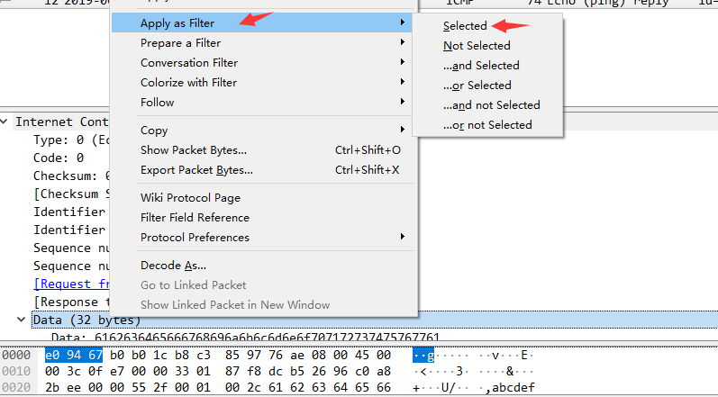

选中 Select 后在过滤器中显示如下：

后面条件表达式就需要自己填写。如下我想过滤出 data 数据包中包含"abcd"内容的数据流。**包含的关键词是 contains 后面跟上内容。**

看到这， 基本上对 wireshak 有了初步了解。

## Wireshark 抓包分析 TCP 三次握手

### （1）TCP 三次握手连接建立过程

-   Step1：客户端发送一个 SYN=1，ACK=0 标志的数据包给服务端，请求进行连接，这是第一次握手；

-   Step2：服务端收到请求并且允许连接的话，就会发送一个 SYN=1，ACK=1 标志的数据包给发送端，告诉它，可以通讯了，并且让客户端发送一个确认数据包，这是第二次握手；

-   Step3：服务端发送一个 SYN=0，ACK=1 的数据包给客户端端，告诉它连接已被确认，这就是第三次握手。TCP 连接建立，开始通讯。

### （2）wireshark 抓包获取访问指定服务端数据包

-   Step1：启动 wireshark 抓包，打开浏览器输入 www.huawei.com。

-   Step2：使用 `ping www.huawei.com`  获取 IP。

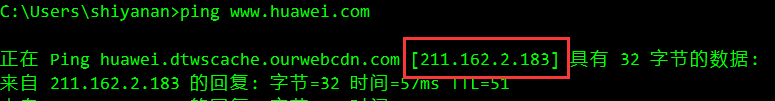

-   Step3：输入过滤条件获取待分析数据包列表 `ip.addr == 211.162.2.183`

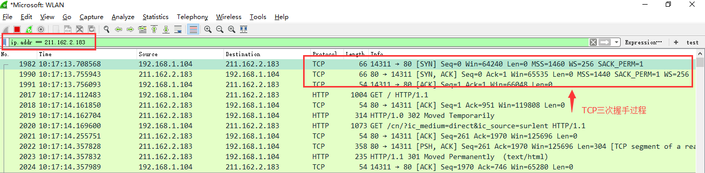

图中可以看到 wireshark 截获到了三次握手的三个数据包。第四个包才是HTTP的， 这说明HTTP的确是使用TCP建立连接的。

**第一次握手数据包**

客户端发送一个TCP，标志位为SYN，序列号为0， 代表客户端请求建立连接。 如下图。

数据包的关键属性如下：

 SYN ：标志位，表示请求建立连接

 Seq = 0 ：初始建立连接值为0，数据包的相对序列号从0开始，表示当前还没有发送数据

 Ack =0：初始建立连接值为0，已经收到包的数量，表示当前没有接收到数据

**第二次握手的数据包**

服务器发回确认包, 标志位为 SYN,ACK. 将确认序号(Acknowledgement Number)设置为客户的I S N加1以.即0+1=1, 如下图

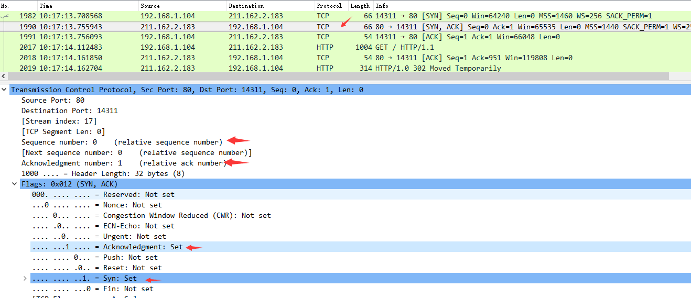

数据包的关键属性如下：

`[SYN + ACK]` : 标志位，同意建立连接，并回送 SYN+ACK

 Seq = 0 ：初始建立值为0，表示当前还没有发送数据

 Ack = 1：表示当前端成功接收的数据位数，虽然客户端没有发送任何有效数据，确认号还是被加1，因为包含SYN或FIN标志位。（并不会对有效数据的计数产生影响，因为含有SYN或FIN标志位的包并不携带有效数据）

**第三次握手的数据包**

 客户端再次发送确认包(ACK) SYN标志位为0,ACK标志位为1.并且把服务器发来ACK的序号字段+1,放在确定字段中发送给对方.并且在数据段放写ISN的+1, 如下图:

数据包的关键属性如下：

ACK ：标志位，表示已经收到记录

Seq = 1 ：表示当前已经发送1个数据

Ack = 1 : 表示当前端成功接收的数据位数，虽然服务端没有发送任何有效数据，确认号还是被加1，因为包含SYN或FIN标志位（并不会对有效数据的计数产生影响，因为含有 SYN 或 FIN 标志位的包并不携带有效数据)。

就这样通过了 TCP 三次握手，建立了连接。开始进行数据交互

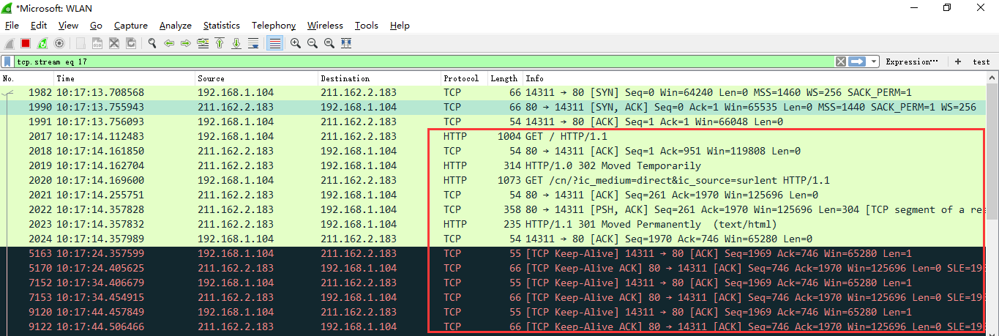

下面针对数据交互过程的数据包进行一些说明：

数据包的关键属性说明

Seq: 1

Ack: 1: 说明现在共收到1字节数据

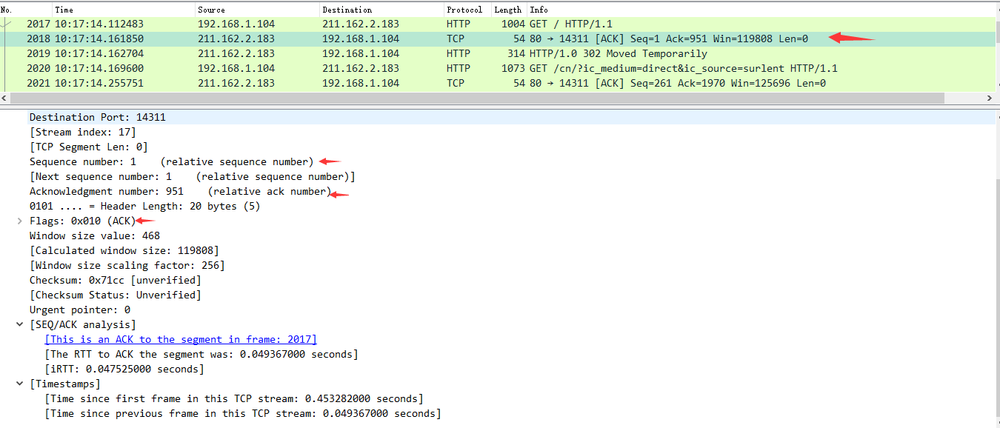

Seq: 1

Ack: 951: 说明现在服务端共收到951字节数据

在TCP层，有个FLAGS字段，这个字段有以下几个标识：SYN, FIN, ACK, PSH, RST, URG。如下

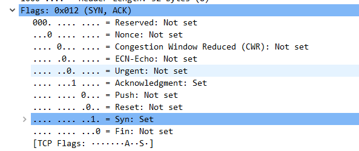

其中，对于我们日常的分析有用的就是前面的五个字段。它们的含义是：SYN表示建立连接，FIN表示关闭连接，ACK表示响应，PSH表示有DATA数据传输，RST表示连接重置。

## Wireshark 分析常用操作 

调整数据包列表中时间戳显示格式。调整方法为View -->Time Display Format --> Date and Time of Day。调整后格式如下：

欢迎关注我公众号：AI悦创，有更多更好玩的等你发现！

::: details 公众号：AI悦创【二维码】

:::

::: info AI悦创·编程一对一

AI悦创·推出辅导班啦，包括「Python 语言辅导班、C++ 辅导班、java 辅导班、算法/数据结构辅导班、少儿编程、pygame 游戏开发」，全部都是一对一教学：一对一辅导 + 一对一答疑 + 布置作业 + 项目实践等。当然，还有线下线上摄影课程、Photoshop、Premiere 一对一教学、QQ、微信在线，随时响应！微信：Jiabcdefh

C++ 信息奥赛题解，长期更新！长期招收一对一中小学信息奥赛集训，莆田、厦门地区有机会线下上门，其他地区线上。微信：Jiabcdefh

方法一：[QQ](http://wpa.qq.com/msgrd?v=3&uin=1432803776&site=qq&menu=yes)

方法二：微信：Jiabcdefh

:::

