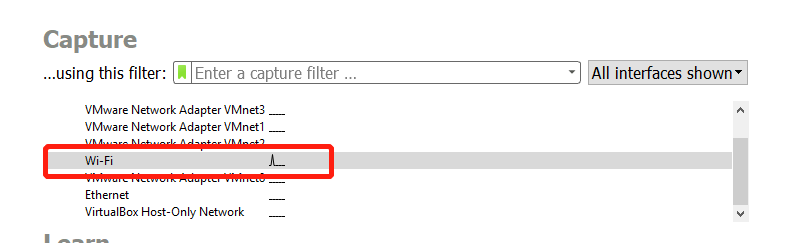
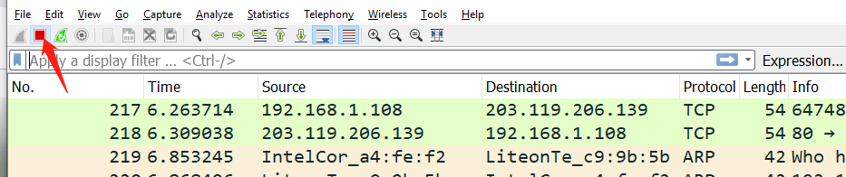
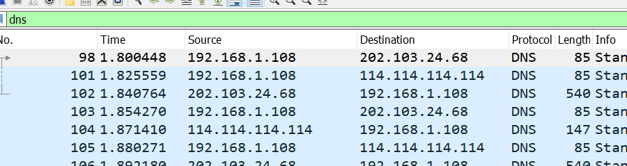
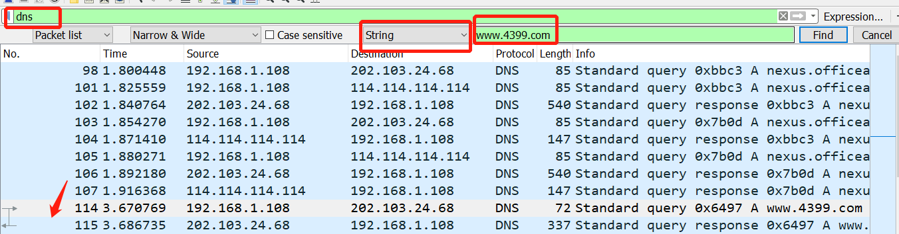
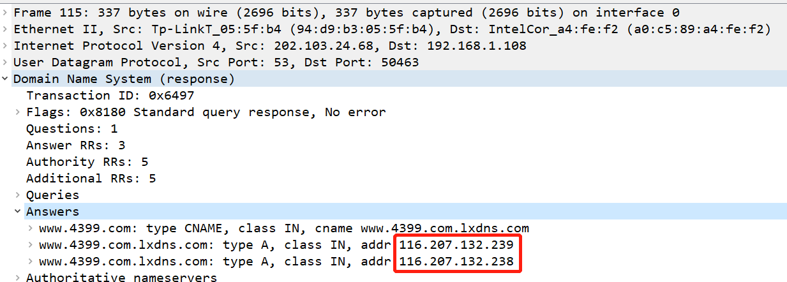
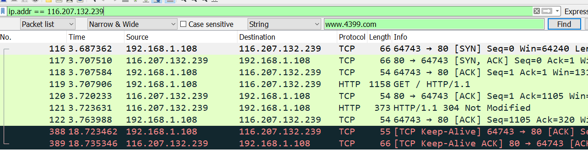
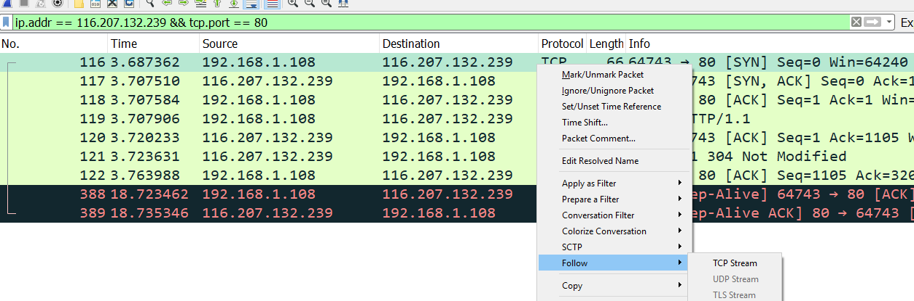
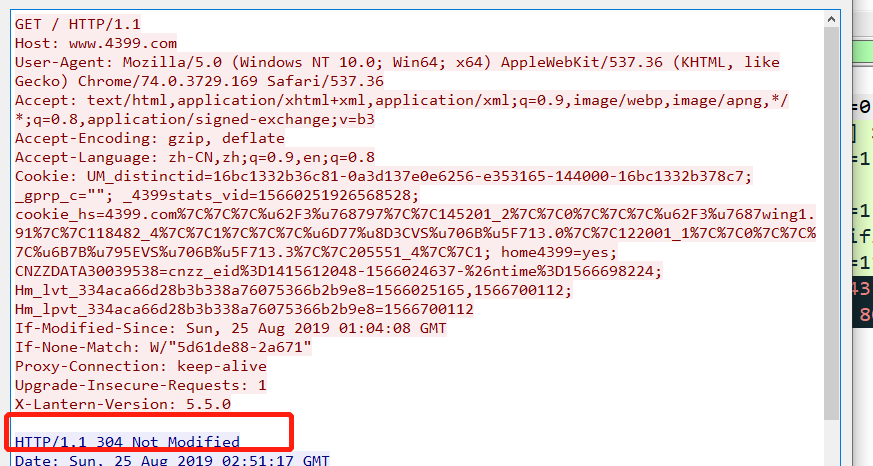

## 0x01 安装和打开 wireshark

-   双击安装包，所有的安装下一步即可。
-   打开安装包后选择所使用的网卡，找不到网卡的应该是网卡名有改变，仔细查看。

-   双击后，进入抓包模式。

## 0x02 访问网站

-   打开浏览器，访问目标网站，`www.4399.com`。

待访问完成后，关闭抓包。

## 0x03 分析过程

-   先查 DNS，在显示过滤器中输入 DNS，回车。

报文比较多，使用 ctrl+F 进行搜索，选择 string，输入 www.4399.com。

打开回包，查看 DNS 应答，找到对应IP地址。

由于做了 CDN，所以这里显示了两个地址，先用其中一个地址进行查找。在显示过滤器中输入 `ip.addr == 116.207.132.239`

这里直接找到了，如果没有流量就进行第二个地址的测试查找。接下来通过结合端口号来进行精确查找。在显示过滤器中输入 `ip.addr == 116.207.132.239 && tcp.port == 80`。

我这里没有变化是因为，访问这个服务器的流量只有这一种，在流量多的时候精确查找还是必须的，接下进行跟踪流查寻，查看报文的详细信息。

由于我这里之间已经访问过，所以 http 服务器提示没有任何改变。

欢迎关注我公众号：AI悦创，有更多更好玩的等你发现！

::: details 公众号：AI悦创【二维码】

:::

::: info AI悦创·编程一对一

AI悦创·推出辅导班啦，包括「Python 语言辅导班、C++ 辅导班、java 辅导班、算法/数据结构辅导班、少儿编程、pygame 游戏开发」，全部都是一对一教学：一对一辅导 + 一对一答疑 + 布置作业 + 项目实践等。当然，还有线下线上摄影课程、Photoshop、Premiere 一对一教学、QQ、微信在线，随时响应！微信：Jiabcdefh

C++ 信息奥赛题解，长期更新！长期招收一对一中小学信息奥赛集训，莆田、厦门地区有机会线下上门，其他地区线上。微信：Jiabcdefh

方法一：[QQ](http://wpa.qq.com/msgrd?v=3&uin=1432803776&site=qq&menu=yes)

方法二：微信：Jiabcdefh

:::

