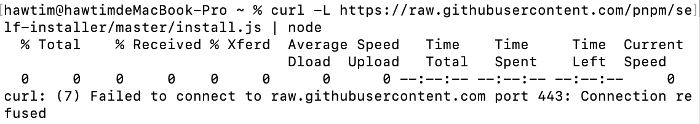
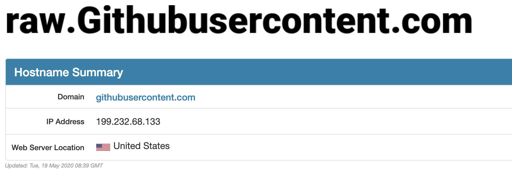

### 背景

你好，我是悦创。

笔者最近发现 github 的用户头像和自己文章中的图片显示不出来了。然后今天发现安装 homeBrew 和 nvm 出现了标题的报错信息。



以上是安装 pnpm 的报错信息，可以发现，脚本需要到 raw.githubusercontent.com 上拉取代码。

网上搜索了一下，发现是 github 的一些域名的 DNS 解析被污染，导致DNS 解析过程无法通过域名取得正确的 IP 地址。

### DNS 污染

[DNS 污染](https://zhuanlan.zhihu.com/p/101908711)，感兴趣的朋友可以去了解一下。

### 解决方案

打开 [https://www.ipaddress.com/](https://www.ipaddress.com/) 输入访问不了的域名



查询之后可以获得正确的 IP 地址

在本机的 host 文件中添加，建议使用 [switchhosts](https://github.com/oldj/SwitchHosts/releases) 方便 host 管理

```sh
199.232.68.133 raw.githubusercontent.com
199.232.68.133 user-images.githubusercontent.com
199.232.68.133 avatars2.githubusercontent.com
199.232.68.133 avatars1.githubusercontent.com
```

添加以上几条 host 配置，页面的图片展示就正常了，homebrew 也能装了，nvm 也行动灵活了。

欢迎关注我公众号：AI悦创，有更多更好玩的等你发现！

::: details 公众号：AI悦创【二维码】


:::

::: info AI悦创·编程一对一

AI悦创·推出辅导班啦，包括「Python 语言辅导班、C++ 辅导班、java 辅导班、算法/数据结构辅导班、少儿编程、pygame 游戏开发、Web、Linux」，全部都是一对一教学：一对一辅导 + 一对一答疑 + 布置作业 + 项目实践等。当然，还有线下线上摄影课程、Photoshop、Premiere 一对一教学、QQ、微信在线，随时响应！微信：Jiabcdefh

C++ 信息奥赛题解，长期更新！长期招收一对一中小学信息奥赛集训，莆田、厦门地区有机会线下上门，其他地区线上。微信：Jiabcdefh

方法一：[QQ](http://wpa.qq.com/msgrd?v=3&uin=1432803776&site=qq&menu=yes)

方法二：微信：Jiabcdefh

:::


