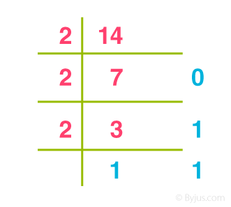
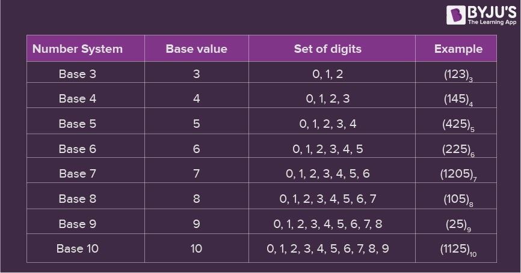

## Number System

The number system or the numeral system is the system of naming or representing numbers. We know that a number is a mathematical value that helps to count or measure objects and it helps in performing various mathematical calculations. There are different types of number systems in Maths like decimal number system, binary number system, octal number system, and hexadecimal number system. In this article, we are going to learn what is a number system in Maths? different types, conversion procedures with many number system examples in detail. Also, check [mathematics for grade 12](https://byjus.com/maths/what-is-mathematics/) here.

> 编号系统或数字系统是命名或表示数字的系统。我们知道数字是一种数学值，它有助于计数或测量物体，并有助于执行各种数学计算。数学中有不同类型的数字系统，如十进制数系统、二进制数系统、八进制数系统和十六进制数系统。在这篇文章中，我们将学习什么是数学中的数字系统?不同的类型，转换程序与许多数字系统的例子详细。另外，点击这里查看[12年级数学](https://byjus.com/maths/what-is-mathematics/)。

**Table of Contents:**

- [Definition](https://byjus.com/#what-is-number-system)
- [Types](https://byjus.com/#types-of-number-system)
- [Chart](https://byjus.com/#number-system-chart)
- [Conversions](https://byjus.com/#number-system-conversions)
- [Examples](https://byjus.com/#Examples)
- [Video](https://byjus.com/#number-system-video-lesson)
- [Questions](https://byjus.com/#number-system-questions)
- [Number System in Computers](https://byjus.com/#computer-numeral-system)
- [FAQs](https://byjus.com/#FAQs)

## What is Number System in Maths?

> 数学中的数字系统是什么?

A number system is defined as a system of writing to express numbers. It is the mathematical notation for representing numbers of a given set by using digits or other symbols in a consistent manner. It provides a unique representation of every number and represents the arithmetic and algebraic structure of the figures. It also allows us to operate arithmetic operations like addition, subtraction and division.

> 数字系统被定义为一种表示数字的书写系统。它是一种数学表示法，用数字或其他符号以一致的方式表示给定集合中的数字。它提供了每个数字的唯一表示，并表示数字的算术和代数结构。它还允许我们进行加法、减法和除法等算术运算。

The value of any digit in a number can be determined by:

> 数字中任何数字的值可以通过以下方法确定:

- The digit

> 数字

- Its position in the number

> 它在数字中的位置

- The base of the number system

> 基数:数字系统的基数

Before discussing the different types of number system examples, first, let us discuss what is a number?

> 在讨论不同类型的数制例子之前，首先让我们讨论一下什么是数字?

## What is a Number?

> 什么是数字?

A number is a mathematical value used for counting or measuring or labelling objects. Numbers are used to perform arithmetic calculations. Examples of numbers are natural numbers, whole numbers, rational and irrational numbers, etc. 0 is also a number that represents a null value. 

> 数字是用来计数、测量或标记物体的数学值。数字用于进行算术计算。数字的例子有自然数、整数、有理数和无理数等。0也是表示空值的数字。

A number has many other variations such as even and odd numbers, prime and composite numbers. Even and odd terms are used when a number is divisible by 2 or not, whereas prime and composite differentiate between the numbers that have only two factors and more than two factors, respectively.

> 一个数字有许多其他的变化，如偶数和奇数，质数和合数。当一个数能被2整除或不能被2整除时，使用偶项和奇数项，而质数和合数分别对只有两个因数和两个以上因数的数进行区分。

In a number system, these numbers are used as digits. 0 and 1 are the most common digits in the number system, that are used to represent binary numbers. On the other hand, 0 to 9 digits are also used for other number systems. Let us learn here the types of number systems.

>  在数字系统中，这些数字被用作数字。0 和 1 是数制中最常见的数字，用于表示二进制数。另一方面，0 到 9 位数字也用于其他数字系统。让我们在这里学习数字系统的类型。

## Types of Number System

> 编号系统的类型

There are various types of number systems in mathematics. The four most common number system types are:

> 数学中有各种类型的数系。四种最常见的数字系统类型是:

1. Decimal number system (Base- 10)

> 十进位数制(进位- 10)

2. Binary number system (Base- 2)

> 二进制数系统(进位- 2)

3. Octal number system (Base-8)

> 八进制数制(Base-8)

4. Hexadecimal number system (Base- 16)

> 十六进制数系统(以16为基数)

Now, let us discuss the different types of number systems with examples.

> 现在，让我们用例子来讨论不同类型的数字系统。

### Decimal Number System (Base 10 Number System)

The decimal number system has a base of 10 because it uses ten digits from 0 to 9. In the decimal number system, the positions successive to the left of the decimal point represent units, tens, hundreds, thousands and so on. This system is expressed in [decimal numbers](https://byjus.com/maths/decimals/). Every position shows a particular power of the base (10).

> 十进制系统以10为基数，因为它使用了从0到9的10位数字。在十进制数制中，小数点左边连续的位置表示单位，如十、百、千等。这个系统用[十进制](https://byjus.com/maths/decimals/)表示。每个位置都表示底数(10)的特定幂。

**Example of Decimal Number System:**

> 十进制数字系统示例:

The decimal number 1457 consists of the digit 7 in the units position, 5 in the tens place, 4 in the hundreds position, and 1 in the thousands place whose value can be written as: 

> 十进制数字1457由个位的数字7、十位的数字5、百位的数字4和千位的数字1组成，其值可以写成:

(1×$10^{3}$) + (4×$10^{2}$) + (5×$10^{1}$) + (7×$10^{0}$)

=(1×1000) + (4×100) + (5×10) + (7×1)

=1000 + 400 + 50 + 7

=1457

### Binary Number System (Base 2 Number System)

> 二进位数制(2进制)

The base 2 number system is also known as the [Binary number system](https://byjus.com/maths/binary-number-system/) wherein, only two binary digits exist, i.e., 0 and 1. Specifically, the usual base-2 is a radix of 2. The figures described under this system are known as binary numbers which are the combination of 0 and 1. For example, 110101 is a binary number.

> 2 进制的数字系统也被称为[二进制数系统](https://byjus.com/maths/binary-number-system/)，其中只有两个二进制数字存在，即 0 和 1。具体来说，通常以 2 为底的基数是 2。在这个系统下描述的数字被称为二进制数，它是 0 和 1 的组合。例如，110101 是一个二进制数。

We can convert any system into binary and vice versa.

> 我们可以把任何系统转换成二进制，反之亦然。

**Example**

Write (14)10 as a binary number.

> 把(14)10写成二进制数。

**Solution:**

::: center

Base 2 Number System Example

:::

**∴** $(14)_{10}$ = $1110_{2}$

### Octal Number System (Base 8 Number System)

> 八进制数制(8进制)

In the [octal number system](https://byjus.com/maths/octal-number-system/), the base is 8 and it uses numbers from 0 to 7 to represent numbers. Octal numbers are commonly used in computer applications. Converting an octal number to decimal is the same as decimal conversion and is explained below using an example.

> 在[八进制数系统](https://byjus.com/maths/octal-number-system/)中，基数是8，它使用从 0 到 7 的数字来表示数字。八进制数字在计算机应用中常用。将八进制数转换为十进制与十进制转换相同，下面将通过示例进行解释。

**Example: Convert $215_{8}$ into decimal.**

> 示例:将 $215_{8}$ 转换为十进制。

**Solution:**

$215_{8}$ = 2 × $8^{2}$ + 1 × $8^{1}$ + 5 × $8^{0}$

= 2 × 64 + 1 × 8 + 5 × 1

= 128 + 8 + 5

= 14110

### Hexadecimal Number System (Base 16 Number System)

> 16进制数制

In the hexadecimal system, numbers are written or represented with base 16. In the hex system, the numbers are first represented just like in the decimal system, i.e. from 0 to 9. Then, the numbers are represented using the alphabet from A to F. The below-given table shows the representation of numbers in the [hexadecimal number system](https://byjus.com/maths/hexadecimal-number-system/).

> 在十六进制系统中，数字以16为基数书写或表示。在十六进制中，数字首先像十进制一样表示，即从0到9。然后，这些数字用从A到f的字母表表示。下表显示了[十六进制数字系统](https://byjus.com/maths/hexadecimal-number-system/)中的数字表示。

| **Hexadecimal** | **0** | **1** | **2** | **3** | **4** | **5** | **6** | **7** | **8** | **9** | **A**  | **B**  | **C**  | **D**  | **E**  | **F**  |
| --------------- | ----- | ----- | ----- | ----- | ----- | ----- | ----- | ----- | ----- | ----- | ------ | ------ | ------ | ------ | ------ | ------ |
| **Decimal**     | **0** | **1** | **2** | **3** | **4** | **5** | **6** | **7** | **8** | **9** | **10** | **11** | **12** | **13** | **14** | **15** |

## Number System Chart

In the number system chart, the base values and the digits of different number systems can be found. Below is the chart of the numeral system.

> 在编号系统图表中，可以找到不同编号系统的基值和数字。下面是数字系统的图表。

::: center

Number System Chart

:::

## Number System Conversion

> 数字系统转换

Numbers can be represented in any of the number system categories like binary, decimal, hex, etc. Also, any number which is represented in any of the number system types can be easily converted to other. Check the detailed lesson on the [conversions of number systems](https://byjus.com/maths/number-system-conversion/) to learn how to convert numbers in decimal to binary and vice versa, hexadecimal to binary and vice versa, and octal to binary and vice versa using various examples.

> 数字可以用任何数字系统类别表示，如二进制、十进制、十六进制等。此外，任何一种数字系统类型所表示的任何数字都可以很容易地转换为其他数字。查看[数字系统的转换](https://byjus.com/maths/number-system-conversion/)的详细课程，学习如何使用各种示例将十进制数字转换为二进制，十六进制转换为二进制，反之亦然，八进制转换为二进制，反之亦然。

With the help of the different conversion procedures explained above, now let us discuss in brief about the conversion of one number system to the other number system by taking a random number.

> 借助上面解释的不同转换过程，现在让我们简单讨论一下如何通过取一个随机数将一个数字系统转换为另一个数字系统。

Assume the number 349. Thus, the number 349 in different number systems is as follows:

> 假设数字是349。因此，349在不同的数字系统中如下所示:

The number 349 in the binary number system is 101011101

> 二进制数系统中的数字349是101011101

The number 349 in the decimal number system is 349.

> 十进制中的数字349是349。

The number 349 in the octal number system is 535.

> 八进制数制中的数字349是535。

The number 349 in the hexadecimal number system is 15D

> 十六进制数字系统中的数字349是15D

## Number System Examples

> 数字系统的例子

**Example 1:**

> 示例1:

Convert $(1056)_{16}$ to an octal number.

> 将 $(1056)_{16}$ 转换为八进制数。

**Solution:**

Given, $(1056)_{16}$ is a hex number.

> 给定，$(1056)_{16}$ 是一个十六进制数。

First we need to convert the given hexadecimal number into decimal number

> 首先，我们需要将给定的十六进制数转换为十进制数

$(1056)_{16}$

= 1 × $16^{3}$ + 0 × $16^{2}$ + 5 × $16^{1}$ + 6 × 160

= 4096 + 0 + 80 + 6

= $(4182)_{10}$

Now we will convert this decimal number to the required octal number by repetitively dividing by 8.

> 现在我们将通过重复除以8将这个十进制数转换为所需的八进制数。

| 8    | 4182 | Remainder「剩余部分」 |
| ---- | ---- | --------------------- |
| 8    | 522  | 6                     |
| 8    | 65   | 2                     |
| 8    | 8    | 1                     |
| 8    | 1    | 0                     |
|      | 0    | 1                     |

Therefore, taking the value of the remainder from bottom to top, we get;

(4182)10 = (10126)8

Therefore, 

(1056)16 = (10126)8

**Example 2:**

Convert (1001001100)2 to a decimal number.

**Solution:**

(1001001100)2

= 1 × 29 + 0 × 28 + 0 × 27 + 1 × 26 + 0 × 25 + 0 × 24 + 1 × 23 + 1 × 22 + 0 × 21 + 0 × 20

= 512 + 64 + 8 + 4

= (588)10

**Example 3:**

Convert 101012 into an octal number.

**Solution:**

Given, 

 101012 is the binary number

We can write the given binary number as:

010 101

Now as we know, in the octal number system,

010 → 2

101 → 5

Therefore, the required octal number is (25)8

**Example 4:**

Convert hexadecimal 2C to decimal number.

**Solution:**

We need to convert 2C16 into binary numbers first.

2C → 00101100

Now convert 001011002 into a decimal number.

101100 = 1 × 25 + 0 × 24 + 1 × 23 + 1 × 22 + 0 × 21 + 0 × 20

= 32 + 8 + 4

= 44

欢迎关注我公众号：AI悦创，有更多更好玩的等你发现！

::: details 公众号：AI悦创【二维码】

:::

::: info AI悦创·编程一对一

AI悦创·推出辅导班啦，包括「Python 语言辅导班、C++ 辅导班、java 辅导班、算法/数据结构辅导班、少儿编程、pygame 游戏开发」，全部都是一对一教学：一对一辅导 + 一对一答疑 + 布置作业 + 项目实践等。当然，还有线下线上摄影课程、Photoshop、Premiere 一对一教学、QQ、微信在线，随时响应！微信：Jiabcdefh

C++ 信息奥赛题解，长期更新！长期招收一对一中小学信息奥赛集训，莆田、厦门地区有机会线下上门，其他地区线上。微信：Jiabcdefh

方法一：[QQ](http://wpa.qq.com/msgrd?v=3&uin=1432803776&site=qq&menu=yes)

方法二：微信：Jiabcdefh

:::

