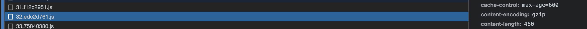
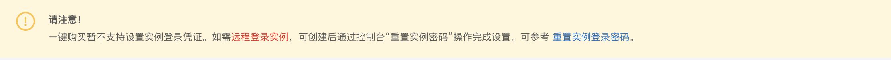
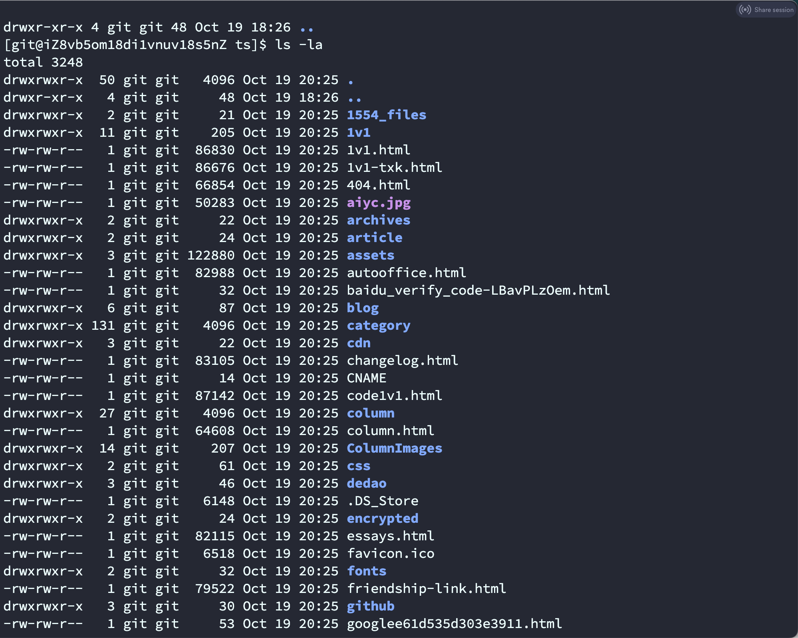
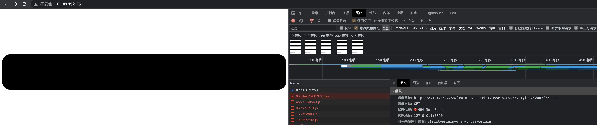

## 买服务器

因为个人的工作经历，选择了阿里云服务器，我们直接买个云服务器 ECS，所谓 ECS 服务器，直接引用官方的介绍：

>   云服务器ECS（Elastic Compute Service）是一种简单高效、处理能力可弹性伸缩的计算服务。帮助您构建更稳定、安全的应用，提升运维效率，降低 IT 成本，使您更专注于核心业务创新。

为了简单起见，[直接购买](https://www.aliyun.com/daily-act/ecs/activity_selection?userCode=gnw8t6tp)。

[直接一键购买](https://ecs-buy.aliyun.com/simple/#/simple)：


地域、镜像、网络类型等我直接选择了默认。

考虑到一开始也没有什么人访问，网站完全是静态的，即便买了，以后还可以升降配置，**实例规格**我选择了 `1 vCPU 1 GiB` 。

## 公网带宽

### 付费方式

在 **公网带宽** 这里，有两种付费方式，一种是按固定带宽，一种是按使用流量。

所谓按固定带宽，先付费后使用，如果用户选择 10M 带宽，阿里云就会划分 10M 独享带宽给用户，官方建议适用于业务场景对于网络带宽要求比较稳定的客户，也就是说你的页面流量比较稳定，选择固定带宽会更合适一些。

而所谓按使用流量，先使用后付费，根据具体使用的流量计费，每小时扣费，官方建议适用于业务场景对网络带宽需求变化较大的场景，如平时带宽使用较低但间歇性的出现网络访问高峰的场景。

### 带宽选择

如果你使用固定带宽模式，那么选择多少带宽是合适的呢，我们不妨大致的算一下：

所谓网络带宽是指在单位时间（一般指的是1秒钟）内能传输的数据量。 网络和高速公路类似，带宽越大，就类似高速公路的车道越多，其通行能力越强，简单的来说，带宽越大，网站的访问速度越快。

而 `1M` 带宽对应的下载峰值就是 `128KB/S`，这是因为云厂商提供的云服务器带宽的单位是 `bit`（比特），我们通常说的 `1M` 完整写法其实是 `1Mb/s`，注意这其中的 `b` 是小写的。而用户下载速度使用的单位是 `Byte`（字节），`1Byte`（字节）= `8bit`（比特），所以 `1Mb = 1/8MB = 0.125MB`，我们知道 `1MB = 1024KB`，所以 `1Mb = 0.125MB = 128KB`，当然你也可以这样换算：

>   1Mbit/s = 1024kbit/s = 1024/8(KByte/s) = 128(KByte/s)

总之带宽是下载速度的 8 倍，1M 带宽对应下载速度是 128KB/s，2M 对应 256KB/s，4M 对应 512KB/s，依此类推。

那我们的页面的资源大小是多少呢？我们可以在浏览器的 `NetWorks` 选项中查看页面的总资源大小，这里以我搭建的 [Bornforthis](https://bornforthis.cn/)为例，打开开发工具查看：


我们可以看到已传输的资源大小为 `443kB`，所选资源大小为 `852kB`，之所以会有差别，是因为服务器和浏览器传输的数据是可以被压缩的，就比如 gzip 压缩。

当客户端和服务端握手的时候，客户端会告诉服务端是否支持压缩，如果服务端开启了压缩，且客户端支持压缩，便会将压缩后的数据传输过去，客户端再进行解压操作，我们可以在 `headers` 的 `content-encoding` 中查看压缩方式： 



那这里实际传输的大小，就是 `443kB`，如果我们希望用户能够在 1s 之内就打开我们的网站，我们至少需要 `443 / 128 = 3.46` M 的带宽，当然这样算，非常的粗糙，用户的带宽、CDN 优化等等都没有考虑进去，所以就是这么随便一算，如果优化做的好，即便只有 1M 带宽，也可以带来不错的效果。

如果我们 4M 的固定带宽买 1 个月，这里给的价格是 155.60 元。

但如果我们使用按流量付费，如果 4M 每秒都跑满（每秒都有很多人访问），总共的流量为：`4 * 128KB/S * 86400 = 11059200KB = 42.1875GB` ，按照￥0.800/GB 的价格算，每天是大概是 33 元，一个月大概是 1000 元左右，这也就是为什么，如果你的流量比较稳定，会建议使用固定带宽。

那我们再算一个例子，如果我的网站每天有 1000 PV，假设他们打开了首页就撤了，大概产生的流量为 `1000 * 443KB = 0.42GB`，每天的费用为 3 毛钱，一个月大概是 9 元。

考虑刚开始也没有什么流量，这里我选择了按使用流量计费，并设置了最大网络带宽为 25M，之所以设置最大网络带宽，是考虑到突然爆发的流量产生较高的费用，我们指定容许的最大网络带宽进行一点限制。

## 1. 重置实例登陆密码

如果是一键购买，我们应该会看到这样一则提示：



在购买后，我们根据这个页面的 https://help.aliyun.com/document_detail/25439.html 的操作示例，重置一下密码，否则我们无法登陆服务器。

## 2. 配置安全组

我们知道，当我们使用 HTTP 协议访问网站的时候，默认监听的是 80 端口，但阿里云服务器默认关闭 80 端口，为了能支持 HTTP 访问，我们登陆云服务器 ECS 管理后台，选择安全组，再点击第一个安全组：


点击`手动添加`，添加 80 端口，添加完的效果如下：


## 3. 登陆实例

### 1. ssh 登陆

```ssh
# 语法：ssh root@<实例的固定公网IP或EIP>

# 示例：
ssh root@47.99.XX.XX

# 输入实例登录密码
# 如果出现 Welcome to Alibaba Cloud Elastic Compute Service ! 表示成功连接到实例。
```

登陆后如果我们一段时间没有操作，再操作的时候就会需要重新登陆，又要输入一次密码，为了能够自动登陆，我们需要：

```ssh
# 在本地起一个终端，获取本地公钥
cat ~/.ssh/id_rsa.pub

# 登陆服务器，将获取的公钥写入服务器的 authorized_keys
echo "这里修改为你的公钥内容" >> ~/.ssh/authorized_keys
```

这样我们再次登陆的时候就不需要输入密码了。注意，我们写入的是 `~` 目录里，这就意味着如果我们切换了用户，是需要再按照这个方式配置一遍的。

### 2. 控制台进入

我们登录[ECS管理控制台](https://ecs.console.aliyun.com/home#/)，可以看到我们的服务器实例，点击`远程连接`：


点击 `立即登陆`，跳转到 https://ecs-workbench.aliyun.com/，输入密码，即可登陆进去。

当然登陆进去的方式还有很多，可以点击[云服务器 ECS 文档](https://help.aliyun.com/document_detail/71529.html)查看更多方式。

## 4. 安装 Nginx

### Nginx 介绍

Nginx 是一款轻量级的网页服务器、反向代理服务器。相较于 Apache、lighttpd 具有占有内存少，稳定性高等优势。它最常的用途是提供反向代理服务。

### 安装和启用

```ssh
# 安装
yum install -y nginx

# 启用 Nginx
systemctl start nginx

# 设置为在系统启动时自动启动
systemctl enable nginx
```

效果是：


此时我们在浏览器中输入服务器的 IP，如果看到下面这样的页面提示，说明启用成功：


### 创建测试文件

我们创建一个用于测试的 `index.html` 文件，放在 `/home/www/website/` 目录下

```ssh
# 创建目录
mkdir -p /home/www/website

# 进入目录
cd /home/www/website

# 创建文件
touch index.html

# 写入内容
echo '<!doctype html><html><head><meta charset="utf-8"><title>Hello World!</title></head><body>Hello World!</body></html>' > index.html
```

### 修改配置文件

```ssh
# 进入配置文件目录
cd /etc/nginx

# 修改配置文件内容
vim nginx.conf
```

在 `location / {}` 中添加内容，使得访问首页的时候，会返回刚才创建的文件：

```ssh
server {
        listen       80 default_server;
        listen       [::]:80 default_server;
        server_name  _;
        root         /usr/share/nginx/html;

        # Load configuration files for the default server block.
        include /etc/nginx/default.d/*.conf;

    		# 这里是添加的内容
        location / {
          root /home/www/website/;
          index index.html;
        }

        error_page 404 /404.html;
            location = /40x.html {
        }

        error_page 500 502 503 504 /50x.html;
            location = /50x.html {
        }
    }
```

保存退出修改后，重新加载配置文件：

```ssh
# 重新加载配置文件
systemctl reload nginx
```

此时我们打开浏览器输入服务器，IP，就可以看到配置生效了：


至此，我们完成了 Nginx 的基本配置，接下来，我们将博客仓库代码上传到服务器上，再修改 Nginx 配置指向仓库中的代码即可。


## 5. 安装 Git

### 安装

```ssh
yum install git
```

### 创建 git 用户

这里我们思考一个问题，观察 Github Clone 时的 SSH 地址，这里以我的博客仓库地址为例：


为什么这个 SSH 地址是以 [git@github.com](mailto:git@github.com) 开头呢？

在 [《一份前端够用的 Linux 命令》](https://bornforthis.cn/blog/vuepress/02.html)中，我们讲到了 ssh 的语法为：

```ssh
ssh [USER@]HOSTNAME
```

我们可以发现，其实这里是以 git 用户的身份登陆了 github.com。

我们也效仿这种方式，创建一个 git 用户管理远程仓库。具体的操作在 [《一份前端够用的 Linux 命令》](https://bornforthis.cn/blog/vuepress/02.html)中也有讲过，这里简要写一下：

```ssh
# 添加一个名为 git 的用户
adduser git
# 设置 git 用户的密码
passwd git
# 提权
sudo visudo
# 在文件里写入
git ALL=(ALL:ALL) ALL
# 保存提出，然后切换到 git 用户
su git
```

### git 用户免登

如果我们现在使用 git 用户登陆服务器：

```ssh
ssh -v git@8.141.xxx.xxx
```

我们依然需要输入密码，为了免登录，我们需要再做一遍相同的操作：

```ssh
# 进入用户主目录
cd ~

# 创建 .ssh 目录
mkdir .ssh && cd .ssh

# 创建 authorized_keys 文件
touch authorized_keys

# 在本地起一个终端，获取本地公钥
cat ~/.ssh/id_rsa.pub

# 登陆服务器，将获取的公钥写入服务器的 authorized_keys
echo "这里修改为你的公钥内容" >> ~/.ssh/authorized_keys

# 给相关文件添加执行权限
chmod 600 ~/.ssh/authorized_keys
chmod 700 ~/.ssh
```

此时，我们再以 git 用户登入服务器，就可以直接登陆。

### 创建远程仓库

```java
# 进入代码仓库目录
cd /home/www/website

# 赋予 git 用户权限
sudo chown git:git /home/www/website

# 创建代码目录
mkdir ts.git

# 进入代码目录
cd ts.git

# 初始化
git init --bare .
```

至此，我们生成了一个远程仓库地址，它的 SSH 地址是：

```ssh
git@8.141.152.253:/home/www/website/ts.git
```

这里我们使用 `git init --bare` 初始化仓库，它与我们常使用的 `git init` 初始化的仓库不一样，你可以理解为它专门用来创建远程仓库，这种仓库只包括 git 版本控制相关的文件，不含项目源文件，所以我们需要借助一个 hooks，在有代码提交到该仓库的时候，将提交的代码迁移到其他目录，这里我们在 `ts.git` 同级目录下创建了一个 `ts` 文件夹，用于存放提交的源代码文件：

```ssh
# 进入 hooks 目录
cd hooks

# 创建并编辑 post-receive 文件
vim post-receive

# 这里是 post-receive 写入的内容

#!/bin/bash
git --work-tree=/home/www/website/ts checkout -f

# 赋予执行权限
chmod +x post-receive

# 退出目录到 ts.git 同级目录并创建文件
cd ../../ && mkdir ts
```

### push 代码到服务器

在 [《一篇带你用 VuePress + Github Pages 搭建博客》](https://bornforthis.cn/blog/vuepress/03.html)中，我们为了方便提交代码，写了一个 deploy.sh 的脚本：

```ssh
#!/usr/bin/env sh

# 确保脚本抛出遇到的错误
set -e

# 生成静态文件
yarn run docs:build

# 进入生成的文件夹
cd docs/.vuepress/dist

git init
git add -A
git commit -m 'deploy'

# 如果发布到 https://<USERNAME>.github.io/<REPO>
git push -f git@github.com:BornforthisHJB/BornforthisHJB.github.io.git master:gh-pages

cd -
```

现在修改脚本文件：

```ssh
git push -f git@8.141.152.253:/home/www/website/ts.git master
```

```ssh
#!/usr/bin/env sh

# 确保脚本抛出遇到的错误
set -e

# 生成静态文件
yarn run docs:build

# 进入生成的文件夹
cd docs/.vuepress/dist

git init
git add -A
git commit -m 'deploy'

# 如果发布到 https://<USERNAME>.github.io/<REPO>
git push -f git push -f git@8.141.152.253:/home/www/website/ts.git master

cd -
```

执行脚本

```ssh
sh deploy.sh
```

执行完毕后，我们可以在 ts 文件夹里查看到提交的代码：



## 6. 修改 Nginx 配置

现在代码已经上传上去了，我们需要修改 Nginx 的配置，让用户访问首页的时候能指向到 index.html 文件。

```sh
# 修改配置文件
cd /etc/nginx

# 拿到权限
sudo chown git:git nginx.conf

# 编辑配置文件
vim nginx.conf

# 这里是修改的内容
location / {
	alias /home/www/website/ts/;
	index index.html;
}

# 重新加载 nginx 配置文件
sudo systemctl reload nginx
```

此时，我们在浏览器中输入服务器的 IP 地址，发现已经可以访问到我们的页面，但就是样式错乱了，我们查看一下请求，会发现请求的地址都是 `learn-typescript` 开头：




`learn-typescript` 是我们设置的 `baseurl`，我们可以修改 baseurl，或者我们直接再加一个 nginx 配置：「我个人 bronforthis 没有设置，直接是 base: / 所以可以不用设置」

```sh
location ^~ /learn-typescript/ {
  alias /home/www/website/ts/;
}
```

修改完不要忘记执行这句，配置才会生效：

```sh
sudo systemctl reload nginx
```

## 7. 配置域名

```sh
# 修改配置文件
cd /etc/nginx

# 拿到权限
sudo chown git:git nginx.conf

# 编辑配置文件
vim nginx.conf

# 这里是修改的内容
server {
        listen       80 default_server;
        listen       [::]:80 default_server;
        server_name  www.aiyc.top aiyc.top _;
        root         /usr/share/nginx/html;

# 重新加载 nginx 配置文件
sudo systemctl reload nginx
```

## 8. 添加 SSL

```sh
# Settings for a TLS enabled server.
#
    server {
        listen       443 ssl http2 default_server;
        listen       [::]:443 ssl http2 default_server;
        server_name  _ www.aiyc.top aiyc.top;
        root         /usr/share/nginx/html;

        ssl_certificate "/etc/pki/nginx/server.crt";
        ssl_certificate_key "/etc/pki/nginx/private/server.key";
        ssl_session_cache shared:SSL:1m;
        ssl_session_timeout  10m;
        ssl_ciphers PROFILE=SYSTEM;
        ssl_prefer_server_ciphers on;

        # Load configuration files for the default server block.
        include /etc/nginx/default.d/*.conf;

        location / {
        }

        error_page 404 /404.html;
            location = /40x.html {
        }

        error_page 500 502 503 504 /50x.html;
            location = /50x.html {
        }
    }

}
```


欢迎关注我公众号：AI悦创，有更多更好玩的等你发现！

::: details 公众号：AI悦创【二维码】


:::

::: info AI悦创·编程一对一

AI悦创·推出辅导班啦，包括「Python 语言辅导班、C++ 辅导班、java 辅导班、算法/数据结构辅导班、少儿编程、pygame 游戏开发」，全部都是一对一教学：一对一辅导 + 一对一答疑 + 布置作业 + 项目实践等。当然，还有线下线上摄影课程、Photoshop、Premiere 一对一教学、QQ、微信在线，随时响应！微信：Jiabcdefh

C++ 信息奥赛题解，长期更新！长期招收一对一中小学信息奥赛集训，莆田、厦门地区有机会线下上门，其他地区线上。微信：Jiabcdefh

方法一：[QQ](http://wpa.qq.com/msgrd?v=3&uin=1432803776&site=qq&menu=yes)

方法二：微信：Jiabcdefh

:::


