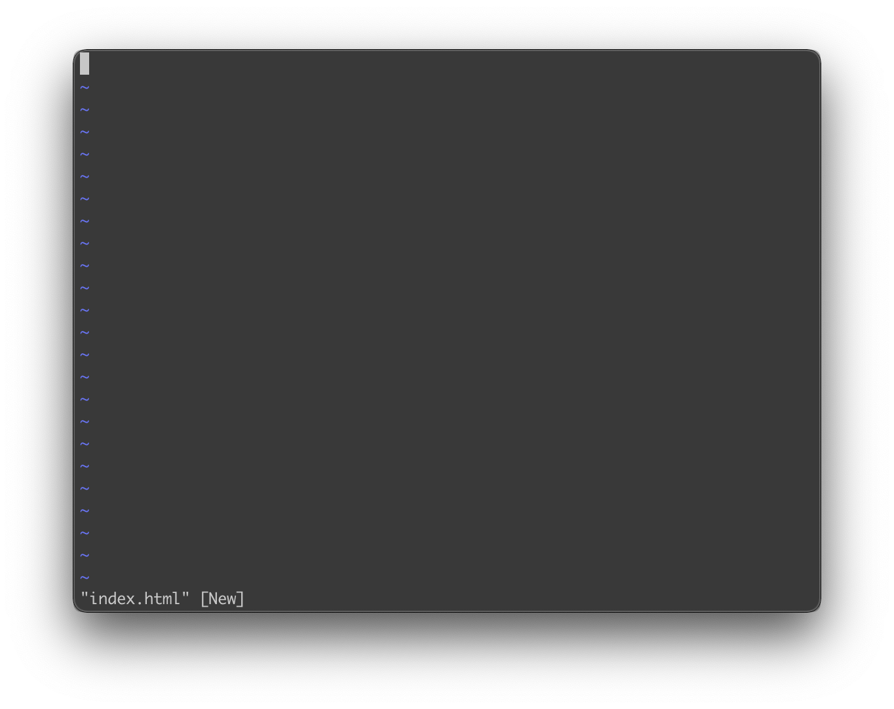
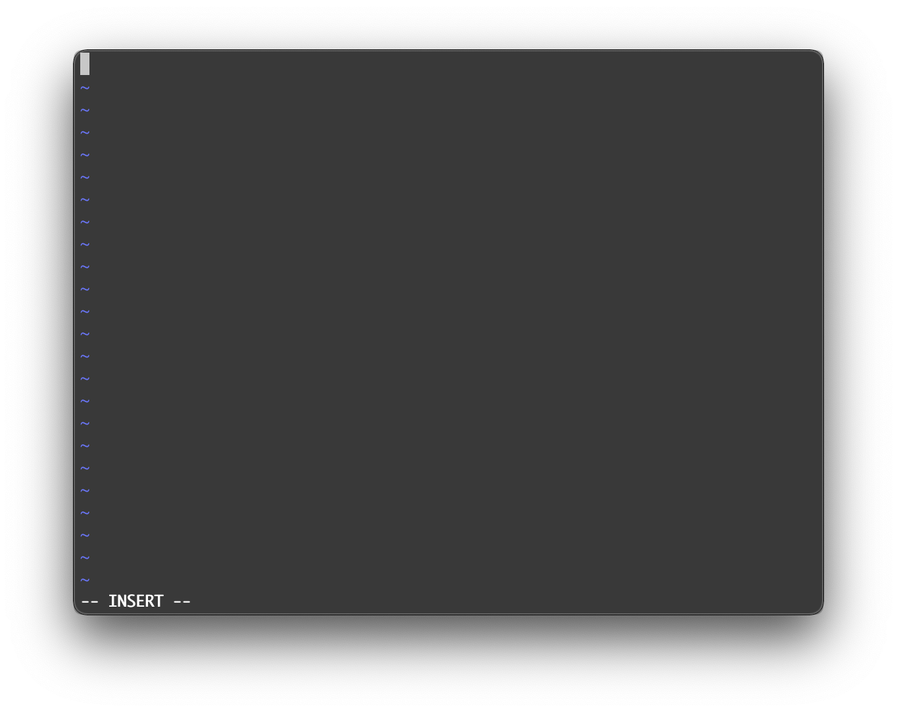
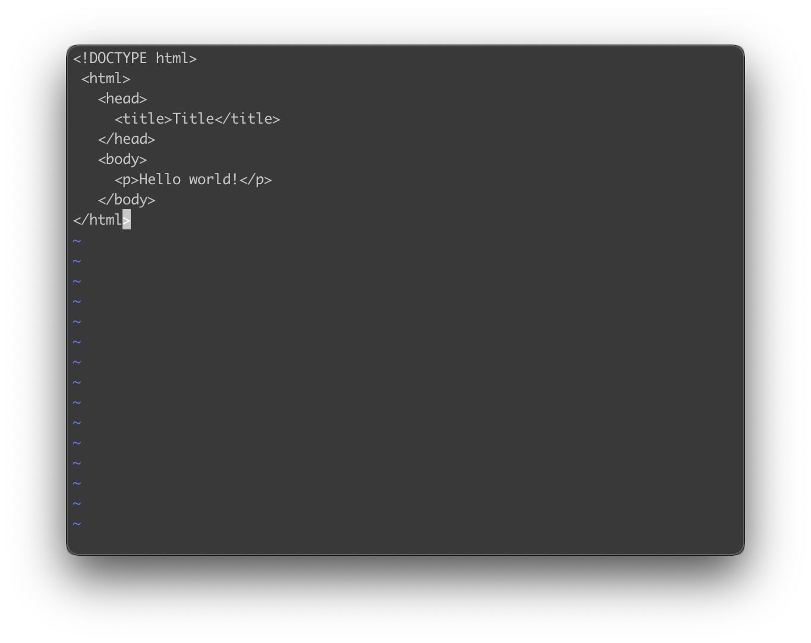
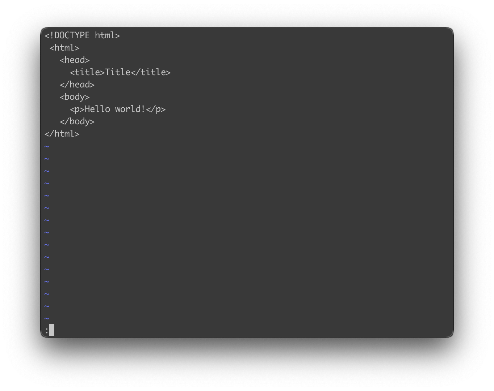

## 前言

在翻译完 TypeScript 官方文档后，我用 VuePress 搭建博客，又实现了 GitHub 和 Gitee Pages 的自动部署，但我最终还是决定自己建站，而在建站的过程中，必不可少会用到 Linux 命令，所以此篇写一份基本够用的 Linux 命令，会涵盖博客搭建系列文章用到的各种命令，方便查询和学习使用。

## 0. Owner、Group、Others、Root

Linux 系统是一种多用户系统，它将文件访问者身份分为三种：

### 文件所有者（Owner）

当创建一个用户的时候，Linux 会为该用户创建一个主目录，路径为 `/home/<username>`，我们可以使用 `cd ~`，快捷进入主目录。如果你想放一个私密文件，就可以放在自己的主目录里，然后设置只能自己查看。

### 群组（Group）

每个用户都有一个用户组，方便多人操作的时候，为一群人分配权限。当创建用户的时候，会自动创建一个与它同名的用户组。

如果一个用户同时属于多个组，用户需要在用户组之间切换，才能具有其他用户组的权限。

### 其他人（Others）

既不是文件所有者又不是文件所属群组成员的用户，就是其他人。

### 超级用户（Root）

Root 用户是一类特殊的用户，该用户可以访问所有文件。

## 1. adduser 添加用户 和 passwd 更改密码

```ssh
# 添加一个名为 git 的用户
adduser git
# 设置 git 用户的密码
passwd git
```

但是由于创建的用户权限较低，有的时候我们需要为用户提权，此时我们可以这样做：

```ssh
# 会打开 sudoers 配置文件
sudo visudo
```

注意同样是编辑 `sudoers` 配置文件，使用这个命令会比使用 `sudo vim /etc/ sudoers` 更安全， 除了对语法有校验，并且还会在多用户编辑的时候锁住文件。

打开 `sudoers` 配置文件后，我们添加这样一行配置：

```ssh
# Allow git to run any commands anywhere
git ALL=(ALL:ALL) ALL 
```

简单解释下这句话 `git ALL=(ALL:ALL) ALL `：

-   git 表示规则应用的用户名
-   第一个 `ALL` 表示规则应用于所有 hosts
-   第二个 `ALL` 表示规则应用于所有 users
-   第三个 `ALL` 表示规则应用于所有 groups
-   第四个 `ALL` 表示规则应用于所有 commands

我们保存退出后，`git` 用户就会获得 root 权限。

## 2. ls 列出文件和目录

1.   `ls` 列出文件和目录

```ssh
[root@iZ2ze learn-typescript.git]# ls
branches  config  description  HEAD  hooks  index  info  objects  refs
```

2.   `ls -la` 由 `-a` 显示所有文件和目录（包括隐藏）和 `-l` 显示详细列表组成：

```ssh
[root@iZ2ze learn-typescript.git]# ls -la
总用量 20
drwxrwxr-x  7 git git  132 12月 15 12:33 .
drwx------  3 git git  127 12月 15 14:51 ..
drwxrwxr-x  2 git git    6 12月 15 12:21 branches
-rw-rw-r--  1 git git   66 12月 15 12:21 config
-rw-rw-r--  1 git git   73 12月 15 12:21 description
-rw-rw-r--  1 git git   23 12月 15 12:21 HEAD
drwxrwxr-x  2 git git 4096 12月 15 13:10 hooks
-rw-rw-r--  1 git git  217 12月 15 12:33 index
drwxrwxr-x  2 git git   21 12月 15 12:21 info
drwxrwxr-x 10 git git   90 12月 15 12:33 objects
drwxrwxr-x  4 git git   31 12月 15 12:21 refs
```

每一行都有 7 列，我们以 `branches` 为例讲解每列的含义：

| drwxrwxr-x         | 2                      | git    | git    | 6                  | 12月 15 12:21 | branches |
| ------------------ | ---------------------- | ------ | ------ | ------------------ | ------------- | -------- |
| 文件类型和权限信息 | 链接数或者一级子目录数 | 所有者 | 所属组 | 文件大小，单位字节 | 最后修改时间  | 文件名   |

重点看第 1 列的内容，以 `drwxrwxr-x` 为例，这里一共 10 位，第 1 位表示文件类型，其中 `-` 表示普通文件，`d` 表示目录文件。

第 2 到第 4 位，表示所有者权限，其中 `r` 表示读权限，`w` 表示写权限，`x` 表示可执行权限， `-`表示无权限，第 2 到 5 位为 `rwx`，表示所有者可读可写可执行。

第 5 到第 7 位，表示组用户权限，这里也是 `rwx`。

第 8 到第 10 位，表示其他用户权限，这里是 `r-x`，表示有可读可执行权限，无写入权限。

这里再额外补充一点：

像 `root` 用户创建文件夹的默认权限为 `rwxr-xr-x`:

```ssh
[root@iZ2ze www]# mkdir test
[root@iZ2ze www]# ls -l

drwxr-xr-x  2 root root  6 12月 17 23:53 test
```

而创建文件的默认权限是 `rw-r--r--`，注意创建文件默认会去掉 `x` 权限：

```ssh
[root@iZ2ze www]# touch index.html
[root@iZ2ze www]# ls -l

-rw-r--r--  1 root root  0 12月 17 23:54 index.html
```

这就是为什么我们有的时候需要在创建文件后，又加上执行权限。

## 3. chown 更改文件属主，也可以同时更改文件属组

**chown (change owner)** 语法：

```ssh
# -R：递归更改文件属组
chown [–R] 属主名 文件名
chown [-R] 属主名：属组名 文件名
```

将 `index.html` 的所有者更改为 `git`：

```ssh
[root@iZ2ze www]# chown git index.html
[root@iZ2ze www]# ls -

-rw-r--r-- 1 git  root  0 12月 17 23:54 index.html
```

将 `index.html` 的所有者和群组都改为 `git`：

```ssh
[root@iZ2ze www]# chown git:git index.html
[root@iZ2ze www]# ls -l

-rw-r--r-- 1 git  git   0 12月 17 23:54 index.html
```

## 4. chmod 更改文件权限

权限除了用 `r` `w` `x` 这种方式表示，也可以用数字表示，数组与字母的对应关系为：

-   r:4
-   w:2
-   x:1

之所有如此对应关系，主要还是为了方便推导，比如我们希望一个文件可读可写，那我们可以方便的设置权限为 6（4 + 2），同样，如果我们知道一个权限为 3，我们也可以推导出权限为可写可执行，因为只有 2 + 1 才可能等于 3。

我们看下 **chmod （change mode）** 的具体语法：

```ssh
# -R：递归更改文件属组
chmod [-R] xyz 文件或目录
```

其中 xyz 分别表示 Owner、Group、Others 的权限，如果我们这样设置一个文件的权限：

```ssh
chmod 750 index.html
```

我们可以得知，Owner 的权限为 7，为可读可写可执行，Group 的权限为 5，为可读可执行，Others 的权限为 0，表示不可读写不可执行。对应字母为：`rwxr-x---`。

除了这种数字的方式，还有一种使用符号类型改变权限的方式：

在这种方式里，我们将三种身份 `Owner`、`Group`、`Others`，分别简写为 `u（User）`、`g`、`o`，用 `a` 表示所有身份，再使用 `+` `-` `=` 表示加入、去除、设定一个权限，`r` `w` `x` 则继续表示读，写，执行权限，举个例子：

```ssh
chmod u+x,g-x,o-x index.html
```

意思就是 `Owner` 加上执行权限，`Group` 和 `Others` 去除执行权限。

当然我们也可以直接设定权限

```ssh
chmod u=rwx,g=rx,o=r index.html
```

此时文件的权限就相当于 `-rwxr-xr--`。

此外，我们还可以省略不写 `ugoa` 这类身份内容，直接写：

```ssh
chmod +x index.html
```

此时相当于使用了 `a`，会给所有身份添加执行权限。

## 5. su 切换身份

```ssh
# 切换为 git 用户
su git
```

## 6. whoami 显示用户名

```ssh
# whoami 
root
```

## 7. pwd 显示当前目录

```ssh
[git@iZ2ze www]$ pwd
/home/www
```

## 9. cd 切换工作目录

```
# 进入 /home/www/
cd /home/www

# 进入自己的主目录
cd ~

# 进入当前目录的上上两层 :
cd ../..
```

## 10. mkdir 创建目录

1.  `mkdir` 创建目录：

```
mkdir new_folder
```

2.   `mkdir -p` 递归创建目录：

```
mkdir -p one/two/three
```

## 11. touch 创建文件

用于修改文件或者目录的时间属性，当文件不存在，系统会创建空白文件

```ssh
touch new_file
```

## 12. echo 打印输出

echo 是 Shell 命令，用于打印输出：

```ssh
# 显示转义字符
echo "\"test content\""
```

创建或覆盖文件内容为 "test content"：

```ssh
echo "test content" > index.html
```

如果是想追加内容，就用 `>>` ：

```ssh
[root@iZ2ze www]# echo "test content" > index.html
[root@iZ2ze www]# cat index.html
test content
[root@iZ2ze www]# echo "test content" >> index.html
[root@iZ2ze www]# cat index.html
test content
test content
```

## 13. cat 连接文件并打印输出

查看文件内容：

```ssh
cat ~/.ssh/id_rsa.pub
```

清空 index.html 内容：

```ssh
cat /dev/null > index.html
```

把 index.html 的内容写入 second.html：

```ssh
cat index.html > second.html
```

把 index.html 的内容追加写入 second.html：

```ssh
cat index.html >> second.html
```

把 index.html 和 second.html 追加写入 third.html：

```ssh
cat index.html second.html >> third.html
```

## 14. cp 复制文件或目录

将目录 website/ 下的所有文件复制到新目录 static 下：

```ssh
# -r：若给出的源文件是一个目录文件，此时将复制该目录下所有的子目录和文件。
cp –r website/ static
```

## 15. mv 移动并重命名

文件改名：

```ssh
mv index.html index2.html
```

隐藏文件：

```ssh
# 文件名上加上 .
mv index.html .index.html
```

移动文件：

```ssh
# 仅仅移动
mv  /home/www/index.html   /home/static/
# 移动又重命名
mv /home/www/index.html   /home/static/index2.html
```

批量移动：

```ssh
mv  /home/www/website/*  /home/www/static
```

### 16. rm 删除一个文件或者目录

```ssh
# 系统会询问
rm file

# -f 表示直接删除
# -r 表示目录下的所有文件删除

# 删除当前目录下的所有文件及目录
rm -r  * 

# 跑路
rm -rf /*
```

## 17. vi/vim

Linux 内建 vi 文书编辑器，Vim 是从 vi 发展出来的一个文本编辑器。

基本上 vi/vim 共分为三种模式，分别是**命令模式（Command mode）**，**输入模式（Insert mode**）和**底线命令模式（Last line mode）**。我们边操作边介绍这三种模式：
​
我们执行 `vim index.html`，如果没有该文件，则会创建文件：

```ssh
vim index.html
```

此时界面为：



此时是**命令模式**，在命令模式下，输入的任何字符都会被视为命令，接下来几个常用的命令：

-   i 切换到输入模式。
-   x 删除当前光标所在处的字符。
-   : 切换到底线命令模式。

我们按下 `i`，便会进入**输入模式**：



输入模式下，左下角有 `-- INSERT --` 标志：

此时我们可以进行各种输入，当输入完毕后，按下 ESC 回到命令模式：




此时左下角的 INSERT已经消失不见了，如果我们要保存退出，我们先输入 `:` ，进入**底线命令模式**：




在底线命令模式中，常见的命令有：

-   w 保存文件
-   q 退出程序

我们输入 `wq`，表示保存并退出，此时我们就会发现并创建了一个 HTML 文件。

## 18. ssh 远程连接工具

注意 ssh 监听是 22 端口。

其基本语法为：

```ssh
ssh [OPTIONS] [-p PORT] [USER@]HOSTNAME [COMMAND]
```

监听端口示例：

```ssh
ssh -p 300 git@8.8.8.8
```

打开调试模式：

```ssh
# -v 冗详模式，打印关于运行情况的调试信息
ssh -v git@8.8.8.8
```

## 系列文章

系列文章目录地址：[https://github.com/BornforthisHJB/BornforthisHJB.github.io](https://github.com/BornforthisHJB/BornforthisHJB.github.io)

如果有错误或者不严谨的地方，请务必给予指正，十分感谢。如果喜欢或者 有所启发，欢迎 star，对作者也是一种鼓励。

欢迎关注我公众号：AI悦创，有更多更好玩的等你发现！

::: details 公众号：AI悦创【二维码】


:::

::: info AI悦创·编程一对一

AI悦创·推出辅导班啦，包括「Python 语言辅导班、C++ 辅导班、java 辅导班、算法/数据结构辅导班、少儿编程、pygame 游戏开发」，全部都是一对一教学：一对一辅导 + 一对一答疑 + 布置作业 + 项目实践等。当然，还有线下线上摄影课程、Photoshop、Premiere 一对一教学、QQ、微信在线，随时响应！微信：Jiabcdefh

C++ 信息奥赛题解，长期更新！长期招收一对一中小学信息奥赛集训，莆田、厦门地区有机会线下上门，其他地区线上。微信：Jiabcdefh

方法一：[QQ](http://wpa.qq.com/msgrd?v=3&uin=1432803776&site=qq&menu=yes)

方法二：微信：Jiabcdefh

:::


