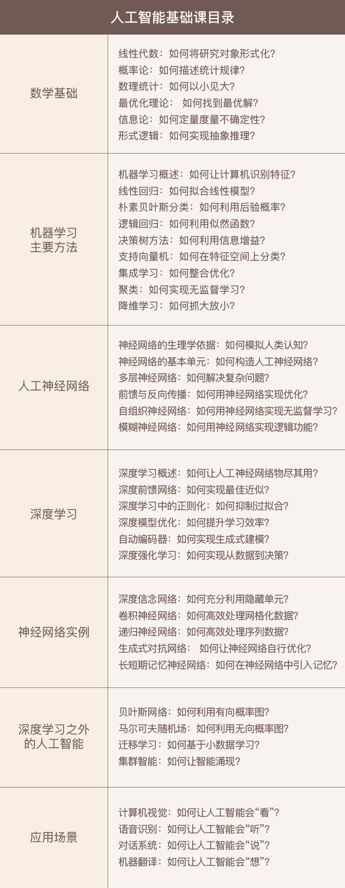

## 你将获得

-   6 大人工智能必备数学基础；
-   15 个机器学习、深度学习核心知识点；
-   11 个人工神经网络概念及实例；
-   4 大人工智能应用场景。

## 课程介绍

当下，人工智能成了新时代的必修课，每个人都需要一些 AI 知识来升级自己，才能与时代同行。

人工智能的重要性已无需赘述，但作为一个跨学科产物，它包含的内容浩如烟海，各种复杂的模型和算法更是让人望而生畏。对于大多数的新手来说，如何入手人工智能其实都是一头雾水，比如到底需要哪些数学基础、是否要有工程经验、对于深度学习框架应该关注什么等等。

那学习人工智能该从哪里开始呢？人工智能的学习路径又是怎样的？

在“人工智能基础课”专栏里，王天一教授将结合自己的积累与思考，和你分享他对人工智能的理解，用通俗易懂的语言从零开始教你掌握人工智能的基础知识，梳理出人工智能学习路径，为今后深耕人工智能相关领域打下坚实的基础。

专栏围绕人工智能基础的 7 大核心主题，分 7 个模块进行讲解：

-   学习人工智能需要哪些必备的数学基础？
-   机器学习有哪些学习方法？
-   为什么人工神经网络如此流行？
-   关于深度学习至少要掌握哪些内容？
-   深度学习框架下的神经网络实例有哪些？
-   深度学习之外的人工智能还有哪些重要研究？
-   最经典的人工智能应用场景是怎样的？

## 课程目录

## 适合人群

希望梳理人工智能学习脉络的 AI 入门者；希望系统学习人工智能基础知识的非 AI 领域技术人员；具有 AI 工程经验，希望进一步掌握核心理论的 AI 从业者；希望深刻理解人工智能内涵、对人工智能有浓厚兴趣的人。

欢迎关注我公众号：AI悦创，有更多更好玩的等你发现！

::: details 公众号：AI悦创【二维码】

:::

::: info AI悦创·编程一对一

AI悦创·推出辅导班啦，包括「Python 语言辅导班、C++ 辅导班、java 辅导班、算法/数据结构辅导班、少儿编程、pygame 游戏开发」，全部都是一对一教学：一对一辅导 + 一对一答疑 + 布置作业 + 项目实践等。当然，还有线下线上摄影课程、Photoshop、Premiere 一对一教学、QQ、微信在线，随时响应！微信：Jiabcdefh

C++ 信息奥赛题解，长期更新！长期招收一对一中小学信息奥赛集训，莆田、厦门地区有机会线下上门，其他地区线上。微信：Jiabcdefh

方法一：[QQ](http://wpa.qq.com/msgrd?v=3&uin=1432803776&site=qq&menu=yes)

方法二：微信：Jiabcdefh

:::

