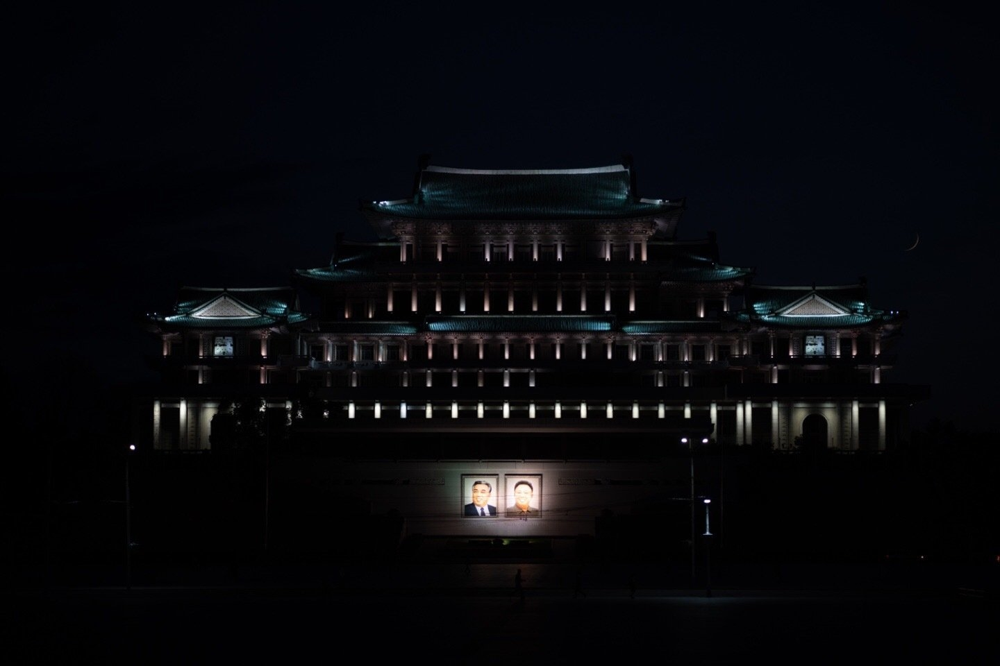
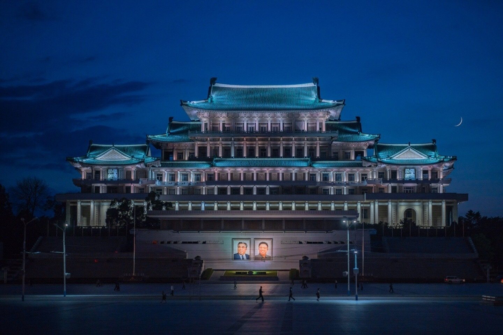
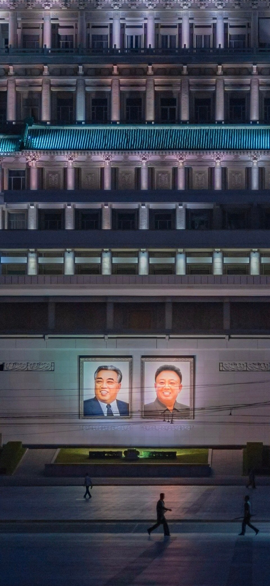
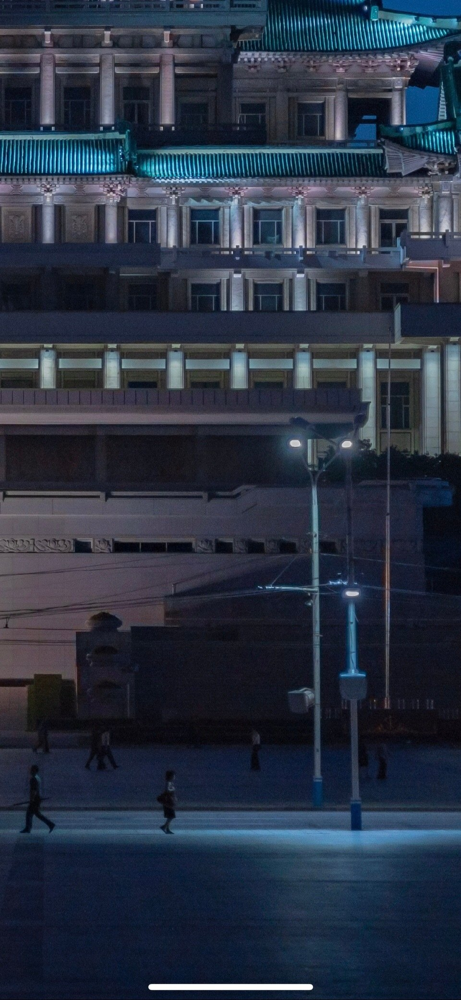
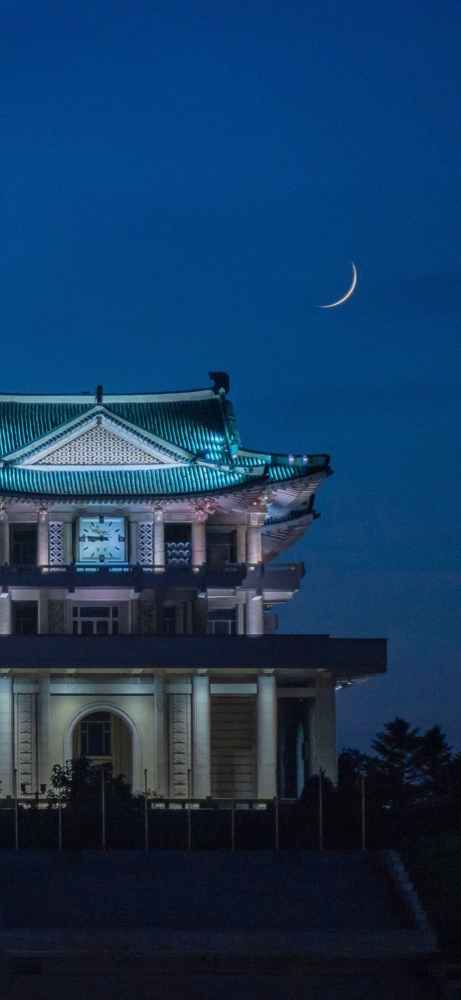

我的学生普遍后期不好，甚至完全不会用 Lightroom 这类基本图像处理软件。但数码后期非常难教，几乎每一张的处理思路都会不同，而软件常规使用又需要每个人自己去熟悉。我猜很多人也都会遇到这样的问题，甚至觉得相机不如手机好用。我放一张图片的前后处理比较简单示意一下缺失后期对摄影的影响。 

这张图片拍摄于平壤，使用的是 Sony A7m3，镜头是 Leica90/F2AA，光圈全开，快门速度 1/125 秒，ISO320，RAW 格式，手持拍摄。拍摄时考虑保留将军像细节同时兼顾画右的下弦月，同时保证手持稳定性，设定了最大光圈和较高的快门速度。拍摄后直观看会觉得暗部损失太多细节，但 Sony 宣称相机拥有很高的宽容度，实际测试也确实很好，所以暗部就放在后期解决。 

两张例图的第一张是 RAW 格式未经处理直接导出的结果，第二张是只使用 Lightroom 调节后的输出结果。成果令人满意，暗部高光均有很好的细节，锐度与噪点控制也非常好。 在这样的拍摄环境下，手机很难获得高质量的图片。而使惯手机的朋友会追求所见即所得的结果，即使用相机也可能会选择高 ISO 加低速快门尽量一次获得整个建筑的清晰图像，这样就会让高光溢出，将军像和下弦月又是很重要的构成元素，必须保留。这样大的光比不依赖后期是不行的。 所谓熟悉相机，就是要清楚它的极限能力，不能完全依赖自己的视觉去决定拍摄参数。 在 Lightroom 里能够影响画面明暗的选项很多，可不仅仅是亮度滑块。这张图片修改了多达十余项参数，公布这些参数没有意义，我只是希望大家了解，前后期是摄影不可分割的整体，忽略后期的朋友是学不好摄影的。 

附图第一张是直接拍摄后的结果，第二张是后期处理后的结果，其余四张是局部放大，可以看到恢复的细节。

> 需要自由职业摄影师的，加我微信：Jiabcdefh
