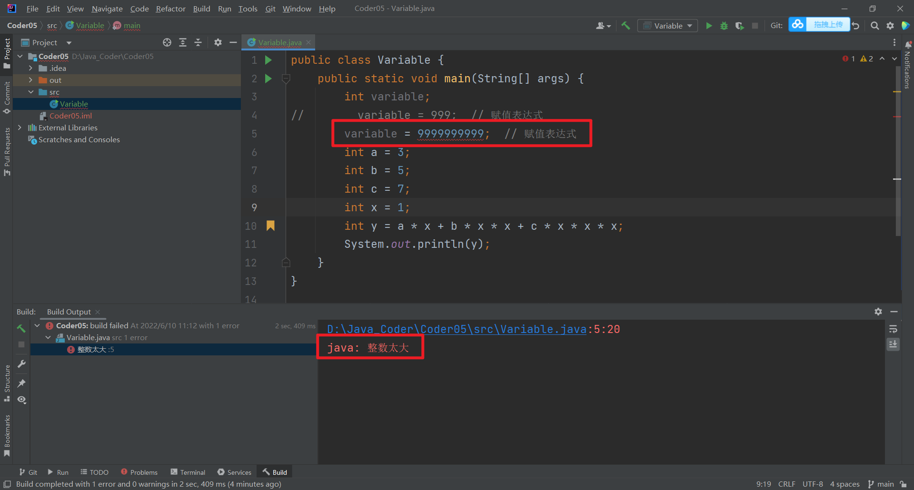

# 1. 目录
- Java 代码三级跳——表达式，语句和代码块
- Java 是区分大小写的
- 字面值不简单
- int x = 5; int y = x + 1; 包含多少语法点？

# 2. 解析上节课的代码
```java
public class Variable {
    public static void main(String[] args) {
        int variable;
        variable = 999;
        int a = 3;
        int b = 5;
        int c = 7;
        int x = 1;
        int y = a * x + b * x * x + c * x * x * x;
        System.out.println(y);
    }
}
```

- `int variable`：在不加分号的情况下，是表达式；
- 如果 `int variable;` ：紧跟一个分号，那就叫一个语句。也就是说，这个表达式已经结束了，这是一个语句；
- `variable = 999;`：赋值表达式；
- `int a`：其实就是个表达式，创建一个 a 变量。紧接着 `a=3` 它又是一个赋值表达式，最后用分号组成语句；
- **多说一句，其实一个语句可以没有表达式，直接一个分号 ；就是一个语句。**
- **一个代码块也可以没有任何语句。【0到多个】**
# 3. Java 代码三级跳——表达式，语句和代码块

- **表达式（expression）**：Java 中最基本的一个运算。比如一个加法运算表达式。**1+2** 是一个表达式，**a+b** 也是。
- **语句（statement）**：类似于平时说话时的一句话，由表达式组成，以 **;** 结束。 **1+2; 1+2+3; a+b;  int a = 3; y = a + 9; System.out.println(y)** 都是语句。
- **代码块**：一对大括号括起来的就是一个代码块。

# 4. Java 是区分大小写的

- 关键字和标示符都是区分大小写的 
- 类名必须与文件名一致，包括大小写要求 
- 使用变量时，名字必须和声明变量时的标示符大小写一致 
- 方法名也区分大小写。main 和 Main 是两个名字 
- 类型也区分大小写。int 是数据类型，Int 则不是 
- `System.out.println`可以被 Java 认识，`SYSTEM.Out.Println`就不可以


# 5. 字面值不简单

- 整数的字面值类型默认是 int ；
- 十六进制字面值和八进制的字面值 ；（暂时不讲）
- 超过 int 的范围会怎么样？**需要使用取值范围更大的类型；**
```java
public class Variable {
    public static void main(String[] args) {
        int variable;
        variable = 9999999999;
    }
}
```



# 6. int x = 5; int y = x + 1; 包含多少语法点？

## 6.1 intx=5;

- 关键字（int）；
- 标示符（int、x）；
- 运算符（=）；
- 字面值（5）；
- 数据类型，Java 中的数据都有类型，数据类型有其取值范围；
- 变量的创建和赋值；
## 6.2 int y=x+1;

- 变量的使用，标示符区分大小写
- 加法运算符
- 表达式，语句和代码块

欢迎关注我公众号：AI悦创，有更多更好玩的等你发现！

::: details 公众号：AI悦创【二维码】


:::

::: info AI悦创·编程一对一

AI悦创·推出辅导班啦，包括「Python 语言辅导班、C++ 辅导班、java 辅导班、算法/数据结构辅导班、少儿编程、pygame 游戏开发」，全部都是一对一教学：一对一辅导 + 一对一答疑 + 布置作业 + 项目实践等。当然，还有线下线上摄影课程、Photoshop、Premiere 一对一教学、QQ、微信在线，随时响应！微信：Jiabcdefh

C++ 信息奥赛题解，长期更新！长期招收一对一中小学信息奥赛集训，莆田、厦门地区有机会线下上门，其他地区线上。微信：Jiabcdefh

方法一：[QQ](http://wpa.qq.com/msgrd?v=3&uin=1432803776&site=qq&menu=yes)

方法二：微信：Jiabcdefh

:::


