## 1. 决策树算法概述

你好，我是悦创。

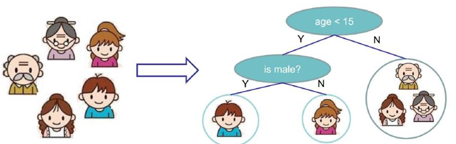

家里有五口人，爷爷奶奶、两个孩子、一个母亲。

我们要做个分类，在分类中，我们要做个判断：谁爱玩电脑游戏。

谁爱玩电脑游戏肯定是数据当中这些特征所决定的吧，假如当前数据中有两个特征：年龄、性别。这两个特征都会对结果产生影响。上图是我们现在构建出决策树的模型。

从数据栏当中，回落到第一个判断的键当中。

从上往下走，通过对年龄的判断，年龄是不是小于 15 岁，如果年龄小于 15岁，他是潜在有玩游戏的可能性的。那就让他往左边走：

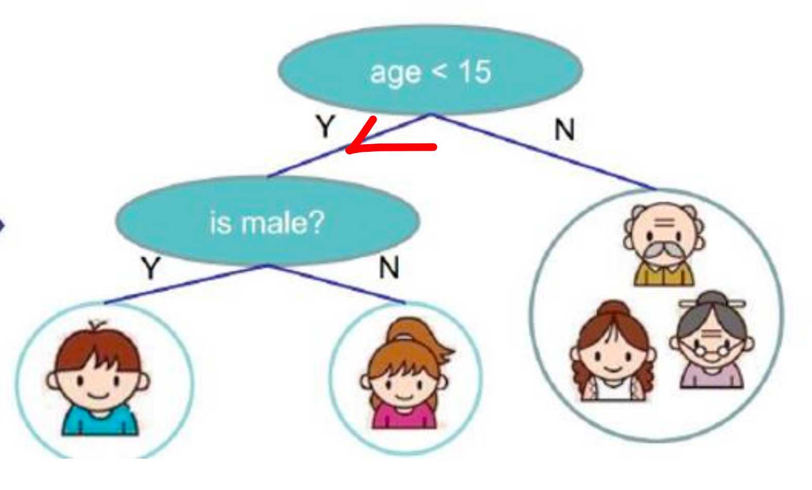

如果不是小于 15岁的，我们就把他排除在外了，认为他是不喜欢玩电脑游戏的。

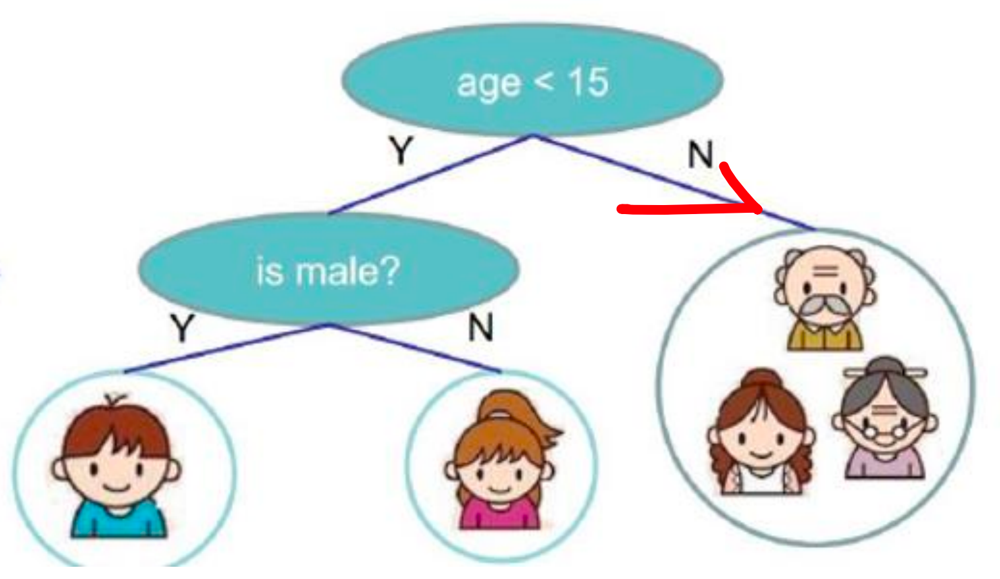

所以，我们第一步通过这个年龄的判断，有些喜欢玩有些不喜欢玩。那现在，不喜欢玩的，相当于到这里就截止了。

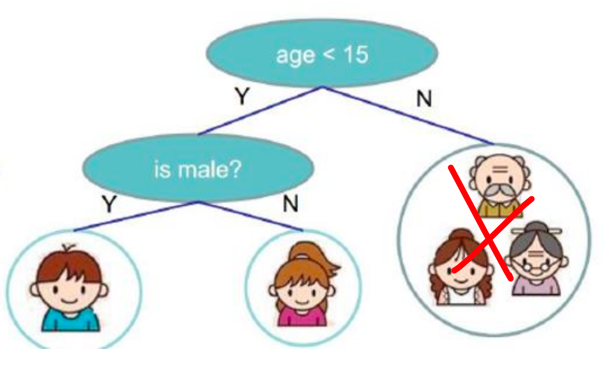

那左边我们继续，我们不光对他的年龄做了一个判断，接下来我们对他的性别再做了一次判断。如果，是一个男孩的话，他是喜欢玩游戏的。如果她是女孩是不喜欢玩游戏的。

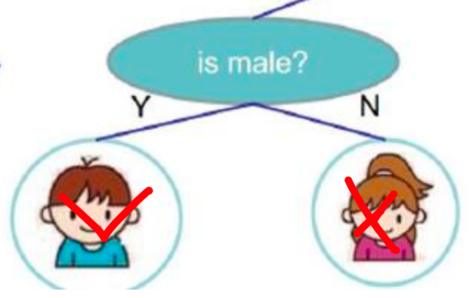

上面所描述的就是决策，解决问题的基本流程。看起来是不是比较简单呢？

那大家想一下：当大家看到上面的决策树的时候，大家能不能想到什么问题呢？或者说这里有没有一些东西，值得我们思考一下。

回想一下，左边是样本，右边是我们的判断树，我们先判断了年龄，看是不是小于 15、又判断了性别，是男孩还是女孩。那此时大家肯定会问一个问题：我能不能先判断性别，再判断年龄。在这个项目中好像也是的，也是可以的。

反正这个小男孩，是男性且必须小于 15 岁。——那先判断哪一个应该都可以吧，应该没有什么区别吧。

**但是，** 在决策树中，不是这样的。决策树把前后顺序把控的特别严格。一旦你把前后顺序改变，最后的结果，一定会发生一些变化的。

### 1.1 树模型

-   决策树：从根节点开始一步步走到叶子节点（决策）

-   所有的数据最终都会落到叶子节点，既可以做分类也可以做回归

那我们来想想，为什么把年龄放在第一个，性别放在下一个呢？你说，我们要做一个分类任务。然后这个分类任务要分两次去做。所以，我们都希望在第一次做的时候，尽可能都做对了。第二次做的时候，再做一个微调，再做一个细致一些的划分。 **「第一次过滤的时候，过滤大部分的数据，第二次过滤的时候过滤一些细致性的东西」**

所以说，在决策树当中，也是遵循这个点。

我们把起始的特征，叫做：根节点。这个区分比较强的，把它放在最前面。「它可以进行大致的判断」

那下面，老二来了。它虽然没有根节点强，但也能起到划分的作用。「细化」——那你说老大和老二能替换吗？一个首发阵容、一个替补整容。能替换么？

先上场哪个，肯定先上首发是不。不能上替补吧～

所以说，我们先放哪个节点，就是哪个比较厉害的，把结果分的比较厉害。接下来再上替补，进行细致的划分。

**那你会问：凭什么 age 是首发，sex 是替补？**

我给你讲的决策树的模型，就是为了解决这一的问题。

决策树可以做分类回归。

### 1.2 树组成

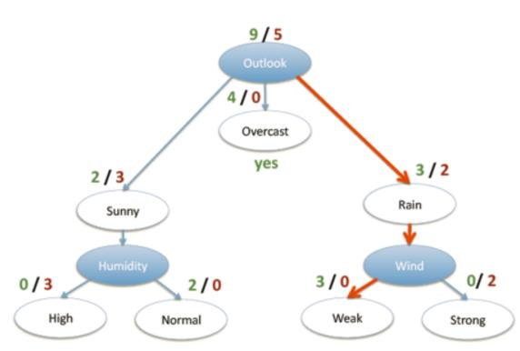

-   根节点：第一个选择点

-   非叶子节点与**分支**：中间过程

-   叶子节点：最终的决策结果

### 1.3 决策树的训练与测试

-   训练阶段：从给定的训练集构造出来一棵树（从跟节点开始选择特征，如何进行特征切分）「核心」

-   测试阶段：根据构造出来的树模型从上到下去走一遍就好了「有数据，得到结果」

-   一旦构造好了决策树，那么分类或者预测任务就很简单了，只需要走一遍就可以了，那么难点就在于如何构造出来一颗树，这就没那么容易了，需要考虑的问题还有很多的！「也就是比如上面的例子，为什么是小于 15岁，18岁可不可以？19岁呢？」也就是这些数据才是最难的。

## 2. 熵的作用

那接下来我们来说决策树中最核心的一点：怎样选特征！（我为什么选择年龄作为根节点？为什么选择 15岁呢？）这个就是我们现在的问题，这个问题很重要。

### 2.1 如何切分特征（选择节点）

-   问题：根节点的选择该用哪个特征呢？接下来呢？如何切分呢？

-   想象一下：我们的目标应该是根节点就像一个老大似的能更好的切分数据（分类的效果更好），根节点下面的节点自然就是二当家了。

-   目标：通过一种衡量标准，来计算通过不同特征进行分支选择后的分类情况，找出来最好的那个当成根节点，以此类推。

比如你数据集中有十个特征：年龄、性别、xxxxxxx

那用哪个呀？——肯定选择分类效果最强的特征。当做大当家。

大当家好了之后，来二当家。以此类推。。。。。。

**那我，怎么选择出大当家呢？**

需要一种判断方法，找到一个标准！以数据说话。

### 2.2 衡量标准-熵

-   熵：熵是表示随机变量不确定性的度量（解释：说白了就是物体内部的混乱程度，比如杂货市场里面什么都有那肯定混乱呀，专卖店里面只卖一个牌子的那就稳定多啦）

>   按我的来说就是：**混乱程度** ，你现在到了义乌小杂货市场。这不是有两元店、十元店、卖包、卖鞋的都有。那你说你到两元店里面，里面一百多个商品。你买某一个商品的可能性——高还是低呢？
>
>   里面一百多个商品，你就偏偏买扑克牌，那你选中扑克牌的可能性是高还是低？——显然是比较低的吧。——**为什么？**
>
>   因为，它里面可选的东西太多了。杂七杂八的杂货市场，啥都有。你买其中的随便一个东西，概率都很低的。
>
>   那你说：杂货市场，混不混乱。显然是混乱的。——你到两元店里面，买啥都不确定。越混乱的地方，不确定的度量就高呀～此时，你的墒值就 **大** 。
>
>    **那什么时候墒值小呢？**
>
>   你想在要买手机，到了苹果专卖店，说：我想买部华为手机，人家是不是得打你呀。——你到苹果专卖店，是不是只能买到苹果手机，那你说你有什么不确定性呢？你已经非常确定了，你只能买苹果手机。所以说，此时的不确定性度量非常小。那墒值就小吧。

上面就简单的跟你说墒值什么时候大，什么时候小。

那熵值什么时候大、什么时候小，跟我们决策树有什么关系？

举个例子：

我现在有两个类别：

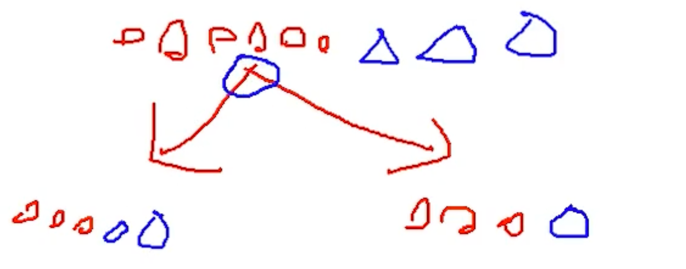

那从上面的结果来看，分不分的开？——显然是分不开的。那比如现在 100 个类别，那左边的混进去 100 个类别，那左边的熵值就比较的大。那我再画另外一种：

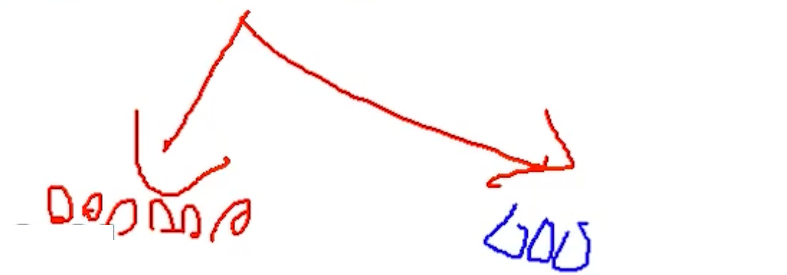

那现在上面为 A 方案，下面为 B 方案，你说哪个方案好？——肯定 B 方案好吧，B 方案后，为的左子树和右子树都是比较纯的吧。都是自己家人，圆圈都放一起了。数据也比较纯了。

这就是我们分类的一个标准，咱们要找到一个衡量标准，也就是分类效果的好坏。怎么评估呢？看分类完，经过一次决策完之后，咱们熵值的大小。

接下来，我们来看公式。

-   公式：$H(X) = - \sum pi * log_2pi, i = 1, 2, ..., n$

### pi 概率值

取到红色的概率：75%；

取到蓝色的概率：25%；

经过决策之后的，概率值。

### 对数 logpi

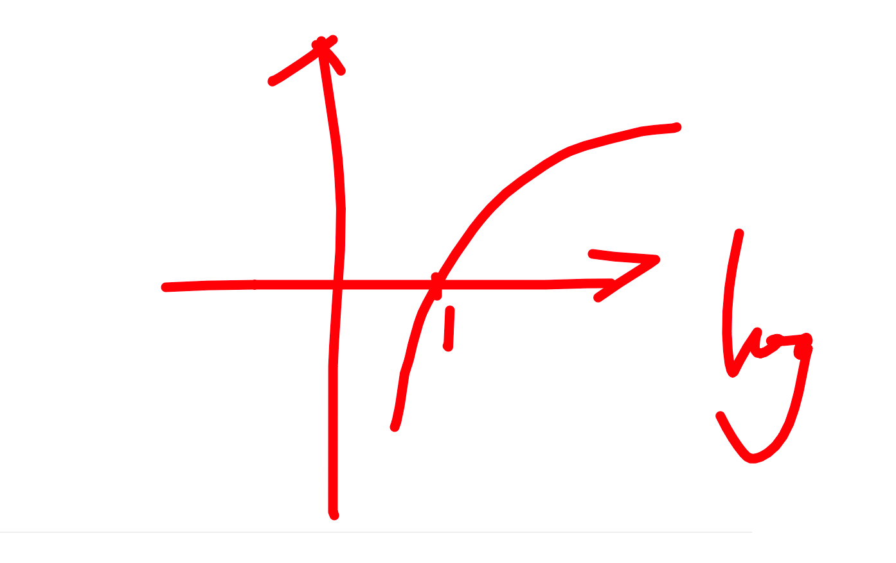

概率的取值范围呢：0<=pi<=1，对数函数在 0～1 之间都是负数，所以在前面公式我添加了一个负号。整个对数函数等于向上反转了。

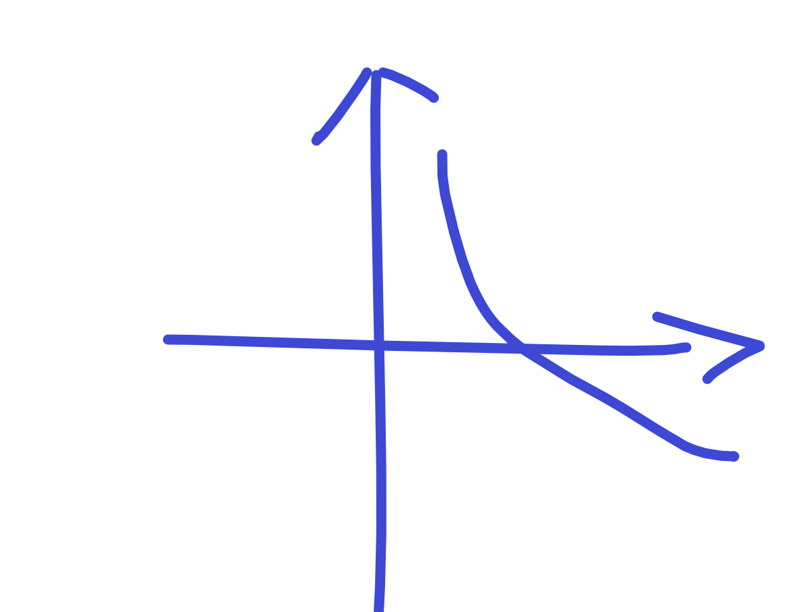

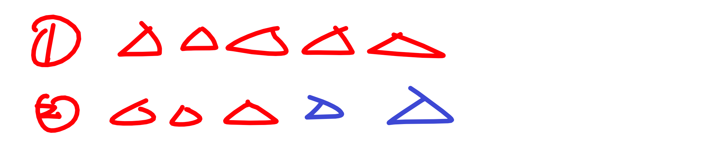

现在有 1、2 分类结果，那现在对于我们的 1 类来说，是不是取到的概率是 100% 呢。

对于 2 类来说，取到红色：60%，取到蓝色 40%。——那你想一下，你希望概率大好还是概率小好呢？

概率越高，从上图可知，纯度越高。所以说，当我们计算得到的概率值接近 1 的时候，才是我们想要的。这样你就发现，概率越高，熵值越小「看图就知道」概率值越低的时候，得到的熵值就越大。

$\sum pi$ = 对于每一个类别都进行计算并相加在一起，这就是我们熵值最终的结果了。

### 一个例子

A 集合 [1, 1, 1, 1, 1, 1, 1, 1, 2, 2]

B 集合 [1, 2, 3, 4, 5, 6, 7, 8, 9, 10]

$H(B) = -(\frac{1}{10}*log_2\frac{1}{10})$  一共有 10个。

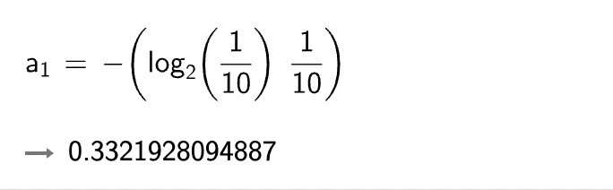

$H(B) = -(\frac{1}{10}*log_2 * \frac{1}{10})$

=> $(-(\frac{1}{10}*log_2\frac{1}{10})) + (-(\frac{1}{10}*log_2\frac{1}{10})) + (-(\frac{1}{10}*log_2\frac{1}{10})) + (-(\frac{1}{10}*log_2\frac{1}{10})) + (-(\frac{1}{10}*log_2\frac{1}{10})) + (-(\frac{1}{10}*log_2\frac{1}{10})) + (-(\frac{1}{10}*log_2\frac{1}{10})) + (-(\frac{1}{10}*log_2\frac{1}{10})) + (-(\frac{1}{10}*log_2\frac{1}{10})) + (-(\frac{1}{10}*log_2\frac{1}{10}))$

= 0.3321928094887 * 10

= 3.321928094887

$H(A1) = -(\frac{4}{5}*log_2\frac{4}{5}) * 8 = 2.0603398072791$

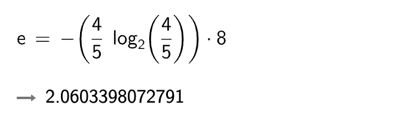

$H(A2) = -(\frac{1}{5} * log_2\frac{1}{5}) * 2 = 0.9287712379549$

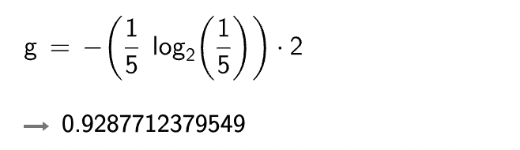

r = H(A1) + H(A2) 

显然 A 集合的熵值要低，因为 A 里面只有两种类别，相对稳定一些。而。B 中类别太多了，熵值就会大很多。（在分类任务中我们希望通过节点分支后数据类别的熵值大还是小呢？）

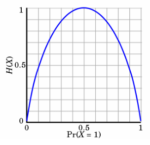

-   熵：不确定性越大，得到的熵值也就越大
    -   当 p=0 或 p=1 时，H(p)=0 ,随机变量完全没有不确定性
    -   当 p=0.5 时，H(p)=1 ,此时随机变量的不确定性最大

**如何决策一个节点的选择呢？**

**信息增益：** 表示特征 X 使得类Y的不确定性减少的程度。（分类后的专一性，希望分类后的结果是同类在一起）

「数据混在一起的时候熵值，数据分类后，比如分类了左右节点。那我既可以算左边的熵值，也可以算右边的熵值。是不是可以左右加在一起，小于原本的熵值，那是不是进步了。不管进步多少，进步了就行。『信息增益也就是使用熵值作为衡量标准。』

## 3. 决策树构造实例

### 3.1 数据&需求

| ID「序号」 | outlook「$X_1$」天气 | temperature「$X_2$」天气怎么样 | humidity「$X_3$」湿度 | windy「$X_4$」有无风 | play「$Y$」有没有去打球 |
| ---------- | -------------------- | ------------------------------ | --------------------- | -------------------- | ----------------------- |
| 1          | sunny                | hot                            | high                  | FALSE                | no                      |
| 2          | sunny                | hot                            | high                  | TRUE                 | no                      |
| 3          | overcast             | hot                            | high                  | FALSE                | yes                     |
| 4          | rainy                | mild                           | high                  | FALSE                | yes                     |
| 5          | rainy                | cool                           | normal                | FALSE                | yes                     |
| 6          | rainy                | cool                           | normal                | TRUE                 | no                      |
| 7          | overcast             | cool                           | normal                | TRUE                 | yes                     |
| 8          | sunny                | mild                           | high                  | FALSE                | no                      |
| 9          | sunny                | cool                           | normal                | FALSE                | yes                     |
| 10         | rainy                | mild                           | normal                | FALSE                | yes                     |
| 11         | sunny                | mild                           | normal                | TRUE                 | yes                     |
| 12         | overcast             | mild                           | high                  | TRUE                 | yes                     |
| 13         | overcast             | hot                            | normal                | FALSE                | yes                     |
| 14         | rainy                | mild                           | high                  | TRUE                 | no                      |

-   数据：14 天打球情况
-   特征：4 种环境变化
-   目标：构造决策树

 ### 3.2 步骤

-   划分方式：4种

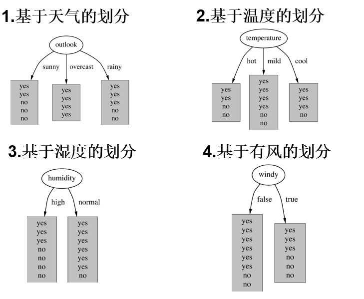

-   问题：谁当根节点呢？
-   依据：信息增益「哪个信息增益大，也就是哪个熵值下降大，我们就把哪个当作根节点」=分类完-之前熵值

### 3.2 原始数据熵值

在确定根节点之前，我们把原始数据的熵值计算出来。历史的熵值肯定是看 play，也就是结果。

-   no: 5
-   yes: 9

在历史数据中（14天）有 9 天打球，5 天不打球，所以此时的熵应为：

$$\huge-\frac{9}{14}*log_2\frac{9}{14}-\frac{5}{14}*log_2\frac{5}{14}=0.940$$

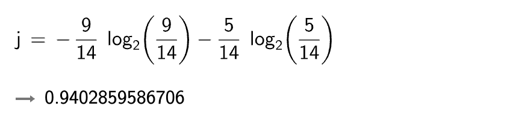

-   4 个特征逐一分析，先从 outlook 特征开始：

Outlook = sunny 时，熵值为 0.971

Outlook = overcast 时，熵值为 0

Outlook = rainy 时，熵值为 0.971

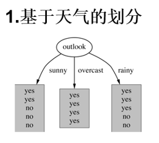

算完结果之后，我们可以直接加么？显然是不行的。为什么？因为它们三个「sunny、overcast、rainy」是不一样的吧。

我们需要做一个加权：`概率「权值」*熵值`

-   根据数据统计，outlook 取值分别为 sunny,overcast,rainy 的概率分别为：5/14, 4/14, 5/14
-   熵值计算：5/14 * 0.971 + 4/14 * 0 + 5/14 * 0.971 = 0.693
    -   （gain(temperature)=0.029 gain(humidity)=0.152 gain(windy)=0.048）
-   信息增益：系统的熵值从原始的 0.940 下降到了 0.693，增益为 0.247
-   同样的方式可以计算出其他特征的信息增益，那么我们选择最大的那个就可以啦，相当于是遍历了一遍特征，找出来了大当家，然后再其余的中继续通过信息增益找二当家！

## 4. 信息增益率与 gini 系数

-   ID3：信息增益（有什么问题呢？）

-   C4.5：信息增益率（解决 ID3 问题，考虑自身熵）

-   CART：使用 GINI 系数来当做衡量标准
-   GINI系数：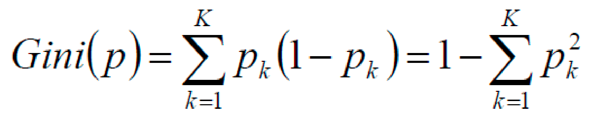

你可以理解成版本迭代即可。

我们来看看现有的解决方法的所存在的问题：

欢迎关注我公众号：AI悦创，有更多更好玩的等你发现！

::: details 公众号：AI悦创【二维码】

:::

::: info AI悦创·编程一对一

AI悦创·推出辅导班啦，包括「Python 语言辅导班、C++ 辅导班、java 辅导班、算法/数据结构辅导班、少儿编程、pygame 游戏开发」，全部都是一对一教学：一对一辅导 + 一对一答疑 + 布置作业 + 项目实践等。当然，还有线下线上摄影课程、Photoshop、Premiere 一对一教学、QQ、微信在线，随时响应！微信：Jiabcdefh

C++ 信息奥赛题解，长期更新！长期招收一对一中小学信息奥赛集训，莆田、厦门地区有机会线下上门，其他地区线上。微信：Jiabcdefh

方法一：[QQ](http://wpa.qq.com/msgrd?v=3&uin=1432803776&site=qq&menu=yes)

方法二：微信：Jiabcdefh

:::

