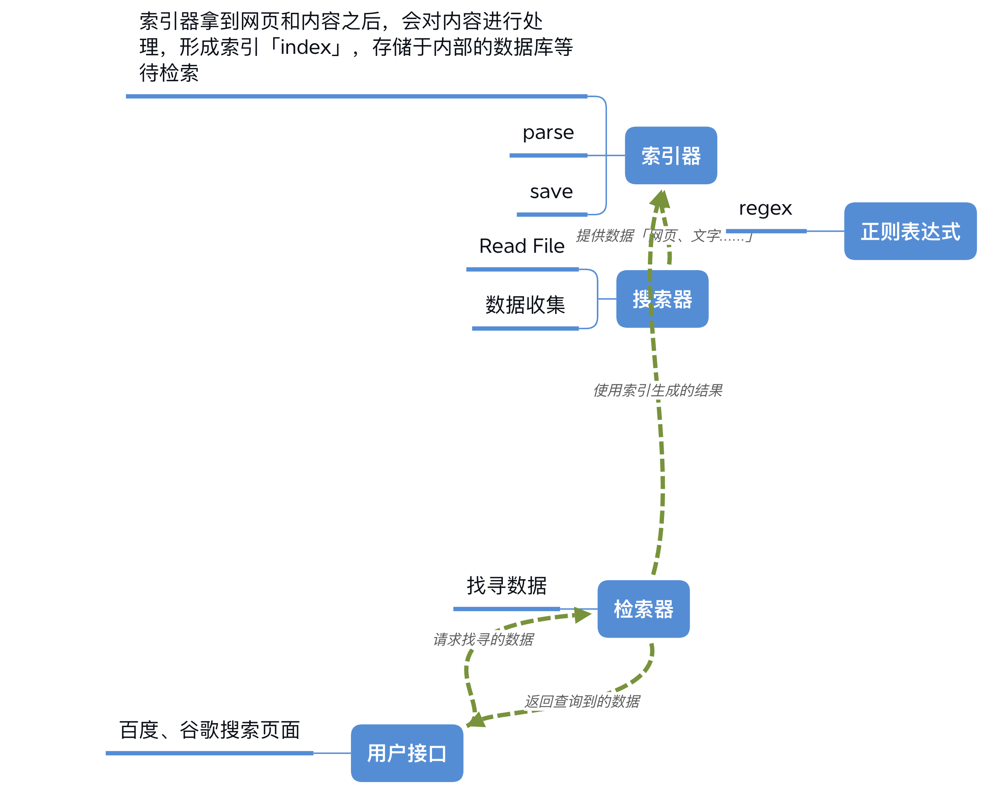

你好，我是悦创。这节课，我们来实现一个 Python 的搜索引擎（search engine）。

承接上文，今天这节课的主要目的是，带你模拟敏捷开发过程中的迭代开发流程，巩固面向对象的程序设计思想。

我们将从最简单最直接的搜索做起，一步步优化，这其中，我不会涉及到过多的超纲算法，但不可避免会介绍一些现代搜索引擎中的基础概念，例如语料（corpus）、倒序索引（inverted index）等。

如果你对这方面本身有些了解，自然可以轻松理解；即使你之前完全没接触过搜索引擎，也不用过分担心，我会力求简洁清晰，降低学习难度。同时，我希望你把更多的精力放在面向对象的建模思路上。

## “高大上”的搜索引擎

引擎一词尤如其名，听起来非常酷炫。搜索引擎，则是新世纪初期互联网发展最重要的入口之一，依托搜索引擎，中国和美国分别诞生了百度、谷歌等巨型公司。

搜索引擎极大地方便了互联网生活，也成为上网必不可少的刚需工具。依托搜索引擎发展起来的互联网广告，则成了硅谷和中国巨头的核心商业模式；而搜索本身，也在持续进步着， Facebook 和微信也一直有意向在自家社交产品架设搜索平台。

关于搜索引擎的价值我不必多说了，今天我们主要来看一下搜索引擎的核心构成。

听 Google 的朋友说，他们入职培训的时候，有一门课程叫做 The life of a query，内容是讲用户在浏览器中键入一串文字，按下回车后发生了什么。今天我也按照这个思路，来简单介绍下。

我们知道，**一个搜索引擎由搜索器、索引器、检索器和用户接口四个部分组成。**

搜索器，通俗来讲就是我们常提到的爬虫（scrawler），它能在互联网上大量爬取各类网站的内容，送给索引器。索引器拿到网页和内容后，会对内容进行处理，形成索引（index），存储于内部的数据库等待检索。

最后的用户接口很好理解，是指网页和 App 前端界面，例如百度和谷歌的搜索页面。用户通过用户接口，向搜索引擎发出询问（query），询问解析后送达检索器；检索器高效检索后，再将结果返回给用户。

欢迎关注我公众号：AI悦创，有更多更好玩的等你发现！

::: details 公众号：AI悦创【二维码】

:::

::: info AI悦创·编程一对一

AI悦创·推出辅导班啦，包括「Python 语言辅导班、C++ 辅导班、java 辅导班、算法/数据结构辅导班、少儿编程、pygame 游戏开发」，全部都是一对一教学：一对一辅导 + 一对一答疑 + 布置作业 + 项目实践等。当然，还有线下线上摄影课程、Photoshop、Premiere 一对一教学、QQ、微信在线，随时响应！微信：Jiabcdefh

C++ 信息奥赛题解，长期更新！长期招收一对一中小学信息奥赛集训，莆田、厦门地区有机会线下上门，其他地区线上。微信：Jiabcdefh

方法一：[QQ](http://wpa.qq.com/msgrd?v=3&uin=1432803776&site=qq&menu=yes)

方法二：微信：Jiabcdefh

:::

